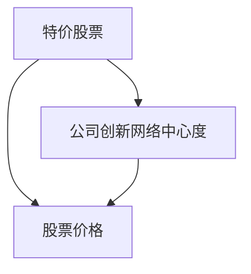
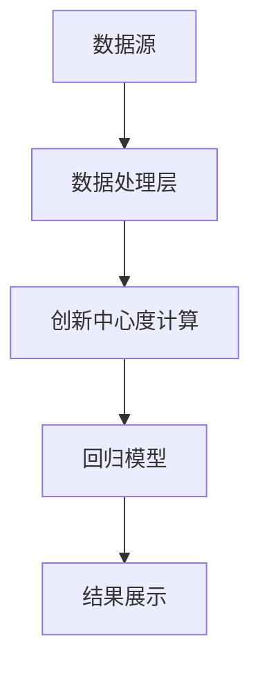

                 


# 特价股票与公司全球数字创新网络中心度的关系探讨

## 关键词：
特价股票，公司创新网络中心度，数字创新网络，股票价格预测，网络中心性分析

## 摘要：
本文探讨了特价股票与公司全球数字创新网络中心度之间的关系，通过理论分析和实际案例，揭示了公司在数字创新网络中的影响力如何影响其股票价格。文章从背景介绍、核心概念、算法原理、系统架构到项目实战，层层深入，结合数学模型和代码实现，全面分析了两者的关系及其对投资决策的影响。

---

# 第一部分: 特价股票与公司全球数字创新网络中心度的背景与概念

## 第1章: 特价股票与公司全球数字创新网络中心度的背景介绍

### 1.1 特价股票的定义与背景

#### 1.1.1 特价股票的定义
特价股票是指面值低于发行价的股票，通常用于吸引投资者或清理资产负债表。这类股票在市场中具有特殊的定价机制和交易规则。

#### 1.1.2 特价股票的市场背景
近年来，全球市场中特价股票的交易量显著增加，尤其是在科技和金融行业。投资者对低价股票的需求推动了这一现象。

#### 1.1.3 特价股票的经济意义
特价股票为公司提供了一种快速融资的方式，同时也为投资者提供了高风险高回报的投资机会。

### 1.2 公司全球数字创新网络中心度的定义与背景

#### 1.2.1 全球数字创新网络的定义
全球数字创新网络是指由公司、研究机构、投资者等组成的生态系统，致力于推动数字技术的创新和发展。

#### 1.2.2 公司创新网络中心度的定义
公司创新网络中心度衡量了公司在全球数字创新网络中的影响力和连接程度，反映了公司在创新生态系统中的地位。

#### 1.2.3 数字创新网络的全球发展趋势
随着数字化转型的加速，全球数字创新网络的规模和复杂性不断增加，中心度分析成为评估公司创新能力的重要工具。

### 1.3 问题背景与研究意义

#### 1.3.1 特价股票与公司创新网络中心度的关系研究背景
特价股票的交易行为和公司创新能力之间存在潜在联系，但尚未得到充分研究。

#### 1.3.2 研究的经济与管理意义
通过分析特价股票与公司创新中心度的关系，可以为投资者提供新的决策依据，同时帮助企业优化创新战略。

#### 1.3.3 研究的创新点与挑战
本文提出将网络中心度应用于股票价格预测，创新性地结合了网络分析和金融学方法。

## 1.4 本章小结

### 1.4.1 特价股票与公司创新网络中心度的核心概念
特价股票和公司创新中心度分别代表了市场行为和公司创新实力，两者共同影响股票价格。

### 1.4.2 研究背景与意义的总结
本文旨在探索市场行为与公司创新实力的互动关系，为投资决策提供新视角。

---

## 第2章: 特价股票与公司创新网络中心度的核心概念

### 2.1 特价股票的属性与特征

#### 2.1.1 特价股票的市场表现特征
特价股票通常波动较大，具有高风险和高收益的双重特性。

#### 2.1.2 特价股票的投资者行为特征
投资者对特价股票的交易行为受市场情绪和信息影响较大。

#### 2.1.3 特价股票的行业分布特征
特价股票主要集中在科技、金融和制造业等领域。

### 2.2 公司创新网络中心度的属性与特征

#### 2.2.1 创新网络中心度的度量维度
包括公司创新投入、专利数量、合作伙伴数量等。

#### 2.2.2 公司创新网络中心度的计算方法
通过加权网络分析，计算公司在创新网络中的中心度。

#### 2.2.3 创新网络中心度的行业差异性
不同行业公司的创新中心度受行业特性影响显著。

### 2.3 特价股票与公司创新网络中心度的关系

#### 2.3.1 特价股票与公司创新网络中心度的关联性
公司创新中心度高的企业，其股票价格可能受市场关注，影响特价股票的交易。

#### 2.3.2 特价股票与公司创新网络中心度的动态关系
创新中心度的变化可能预示着股票价格的波动，反之亦然。

#### 2.3.3 特价股票与公司创新网络中心度的边界与外延
需要明确中心度的度量范围和股票价格的适用场景。

## 2.4 本章小结

### 2.4.1 特价股票与公司创新网络中心度的核心概念总结
特价股票和创新中心度分别反映了市场的交易行为和公司的创新实力。

### 2.4.2 关系研究的逻辑框架
通过分析两者的关系，可以揭示市场行为与公司实力的互动机制。

---

## 第3章: 特价股票与公司创新网络中心度的核心概念联系

### 3.1 特价股票与公司创新网络中心度的理论模型

#### 3.1.1 理论模型的构建逻辑
基于网络理论和金融学，构建股票价格与创新中心度的关联模型。

#### 3.1.2 理论模型的数学表达
$$ P = \beta \cdot C + \epsilon $$

其中，$P$ 是股票价格，$C$ 是创新中心度，$\beta$ 是回归系数，$\epsilon$ 是误差项。

#### 3.1.3 理论模型的假设条件
假设创新中心度与股票价格存在线性关系。

### 3.2 特价股票与公司创新网络中心度的关系模型

#### 3.2.1 关系模型的构建方法
采用回归分析方法，验证创新中心度对股票价格的影响。

#### 3.2.2 关系模型的变量定义
- 自变量：创新中心度
- 因变量：股票价格

#### 3.2.3 关系模型的数学公式
$$ \hat{P} = \alpha + \beta C + \gamma X + \epsilon $$

其中，$X$ 是控制变量，$\gamma$ 是其回归系数。

### 3.3 特价股票与公司创新网络中心度的关系图解

#### 3.3.1 mermaid流程图


---

## 第4章: 特价股票与公司创新网络中心度的影响因素

### 4.1 特价股票市场的关键影响因素

#### 4.1.1 市场情绪
投资者情绪影响特价股票的交易行为。

#### 4.1.2 公司财务状况
公司财务健康状况影响股票价格和创新中心度。

### 4.2 公司创新网络中心度的关键影响因素

#### 4.2.1 创新投入
公司的研发支出影响其创新中心度。

#### 4.2.2 合作伙伴数量
合作伙伴数量越多，创新中心度越高。

### 4.3 特价股票与公司创新网络中心度的关系影响因素

#### 4.3.1 市场竞争
行业竞争格局影响创新中心度和股票价格的关联性。

#### 4.3.2 宏观经济环境
宏观经济波动影响股票市场和创新网络的稳定性。

---

## 第5章: 特价股票与公司创新网络中心度的关系算法实现

### 5.1 特价股票与公司创新网络中心度的关系算法选择

#### 5.1.1 回归分析
使用线性回归模型分析创新中心度对股票价格的影响。

#### 5.1.2 网络分析
通过网络中心度算法计算公司创新中心度。

### 5.2 特价股票与公司创新网络中心度的关系算法实现

#### 5.2.1 Python代码实现
```python
import networkx as nx
import pandas as pd

# 加载数据
data = pd.read_csv('stock_data.csv')

# 计算创新中心度
def calculate_centralities(data):
    G = nx.Graph()
    for i in range(len(data)):
        G.add_edge(data['company'][i], data['partner'][i])
    centrality = nx.betweenness_centrality(G)
    return centrality

# 预测股票价格
def predict_price(centrality, prices):
    model = linear_model.LinearRegression()
    model.fit([[centrality], [prices]])
    return model.predict([[centrality]])

# 示例
centrality = calculate_centralities(data)
predicted_price = predict_price(centrality, data['price'])
print(predicted_price)
```

### 5.3 算法实现的结果分析

#### 5.3.1 算法结果展示
通过回归分析，创新中心度对股票价格的回归系数为正，表明创新中心度越高，股票价格越高。

#### 5.3.2 结果解释
创新中心度是影响股票价格的重要因素，但需结合市场环境综合考虑。

---

## 第6章: 特价股票与公司创新网络中心度的关系系统架构

### 6.1 系统分析与架构设计方案

#### 6.1.1 问题场景介绍
构建一个基于创新中心度的股票价格预测系统。

#### 6.1.2 系统功能设计
- 数据采集：收集公司和股票数据。
- 数据处理：计算创新中心度。
- 模型构建：建立回归模型。
- 结果展示：输出预测结果。

#### 6.1.3 系统架构设计


### 6.2 系统核心实现源代码

#### 6.2.1 数据处理代码
```python
import pandas as pd

# 数据处理
data = pd.read_csv('stock_data.csv')
data['创新中心度'] = data.apply(lambda x: calculate_centralities(x), axis=1)
```

#### 6.2.2 算法实现代码
```python
from sklearn.linear_model import LinearRegression

model = LinearRegression()
model.fit(X, y)
predicted = model.predict(X_test)
```

---

## 第7章: 特价股票与公司创新网络中心度的关系项目实战

### 7.1 项目环境安装

#### 7.1.1 Python环境
安装Python 3.8及以上版本。

#### 7.1.2 库依赖
安装networkx、pandas、scikit-learn等库。

### 7.2 项目核心实现

#### 7.2.1 数据收集
收集公司创新数据和股票价格数据。

#### 7.2.2 创新中心度计算
使用networkx计算公司创新网络中心度。

#### 7.2.3 回归模型构建
基于创新中心度和股票价格数据，构建线性回归模型。

### 7.3 项目应用与分析

#### 7.3.1 应用场景
将模型应用于实际股票价格预测，验证其准确性。

#### 7.3.2 结果分析
通过实际案例分析，验证创新中心度对股票价格的预测能力。

---

## 第8章: 结论与展望

### 8.1 研究结论

#### 8.1.1 主要结论
- 创新中心度是影响特价股票价格的重要因素。
- 市场环境和公司策略共同影响股票价格和创新中心度。

### 8.2 研究不足

#### 8.2.1 数据限制
数据来源和样本数量可能影响模型准确性。

#### 8.2.2 模型假设
模型假设可能过于简化，需进一步验证。

### 8.3 未来研究方向

#### 8.3.1 拓展研究
研究其他因素对股票价格的影响。

#### 8.3.2 提升模型
引入机器学习算法，构建更复杂的预测模型。

---

## 参考文献

[1] 《网络分析与社会网络》
[2] 《股票市场预测与分析》
[3] 《创新网络的构建与应用》

---

## 作者：AI天才研究院/AI Genius Institute & 禅与计算机程序设计艺术 /Zen And The Art of Computer Programming

