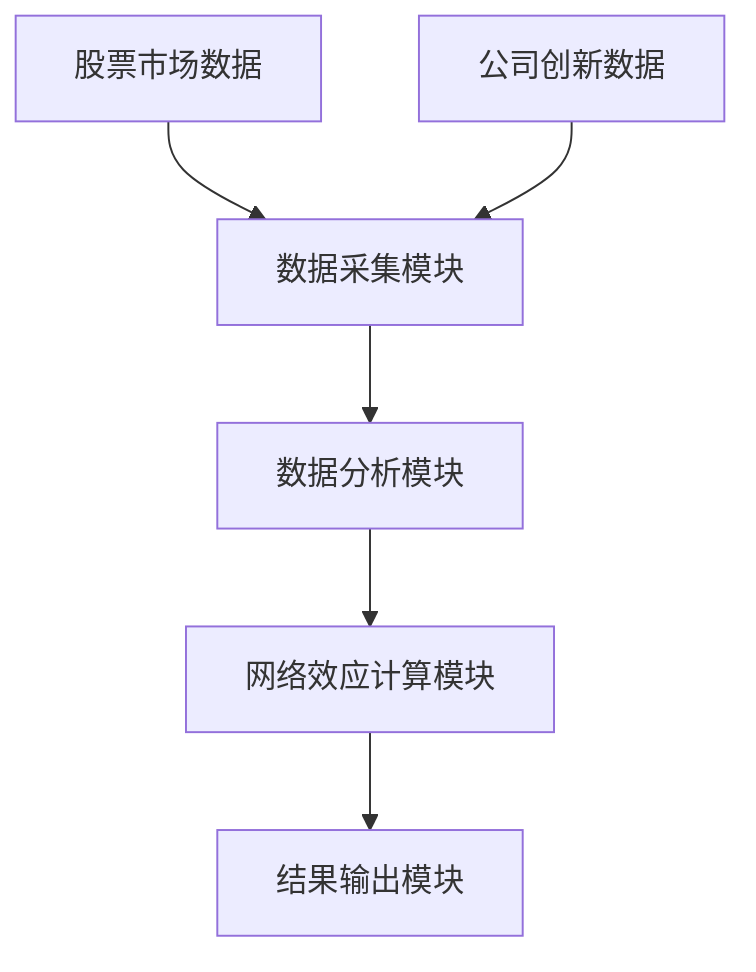
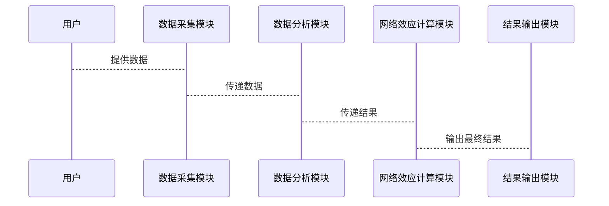

                 


# 特价股票与公司全球数字创新网络效应的关系探讨

## 关键词：特价股票，创新网络效应，全球数字创新，股票价格预测，网络效应模型

## 摘要：  
本文探讨了特价股票与公司全球数字创新网络效应之间的关系。通过分析特价股票的市场特点、创新网络效应的形成机制，结合数学模型和算法原理，揭示了两者之间的相互作用。文章从背景介绍、核心概念、算法原理、系统架构到项目实战，全面剖析了这一复杂关系，并提出了相应的解决方案和实践建议。

---

# 第1章: 特价股票与公司创新网络效应的背景概述

## 1.1 特价股票的定义与特点

### 1.1.1 特价股票的定义  
特价股票是指价格相对较低的股票，通常属于小盘股或成长股。这些股票的价格波动较大，但潜在回报也较高。特价股票的市场参与者主要包括散户和机构投资者。

### 1.1.2 特价股票的核心特点  
- 价格低廉：相对于大盘股，特价股票的价格更低，适合小额投资者。  
- 波动性高：由于市场关注度较低，特价股票的价格容易受到市场情绪的影响。  
- 成长潜力：许多特价股票属于新兴行业或成长型企业，具有较高的增长潜力。  

### 1.1.3 特价股票与普通股票的区别  
- 投资风险：特价股票的风险通常高于普通股票。  
- 市场流动性：特价股票的流动性可能较低，尤其是在市场低迷时。  
- 投资策略：特价股票通常需要更长期的持有，以获得资本增值。  

## 1.2 公司全球数字创新网络效应的定义

### 1.2.1 全球数字创新的定义  
全球数字创新是指在全球范围内，利用数字技术（如人工智能、大数据、云计算等）推动企业创新的过程。这种创新不仅限于技术领域，还包括商业模式、产品设计和市场拓展等方面。

### 1.2.2 网络效应的定义与特点  
网络效应是指一种产品或服务的价值随着用户数量的增加而增加的特性。例如，社交媒体平台的用户越多，平台的价值越大。网络效应的核心在于用户之间的互动和数据共享。

### 1.2.3 公司创新网络效应的形成机制  
- 用户增长：通过吸引更多的用户，形成规模效应。  
- 数据共享：用户之间的数据共享可以为公司提供更多的洞察，从而推动创新。  
- 产品迭代：通过用户反馈不断优化产品，形成正向循环。  

## 1.3 特价股票与公司创新网络效应的关系背景

### 1.3.1 特价股票市场的现状与趋势  
近年来，随着科技的发展，越来越多的投资者关注特价股票。这些股票通常来自新兴行业，具有较高的增长潜力。然而，由于市场波动较大，投资者需要具备较高的风险承受能力。

### 1.3.2 全球数字创新的现状与趋势  
全球数字创新正在以惊人的速度发展，尤其是在人工智能、区块链和物联网等领域。这些技术创新不仅改变了企业的运营模式，还催生了许多新的商业模式。

### 1.3.3 特价股票与创新网络效应的潜在联系  
- 创新驱动：公司通过技术创新吸引更多的用户，从而提升网络效应。  
- 市场反馈：网络效应的增强可以提升公司的市场地位，进而影响股票价格。  
- 风险与机会：技术创新带来的市场波动可能直接影响特价股票的价格。  

## 1.4 本章小结  
本章从特价股票和公司创新网络效应的定义入手，分析了两者的市场现状和趋势，并初步探讨了它们之间的潜在联系。接下来，我们将深入分析这两个概念的核心要素和数学模型。

---

# 第2章: 特价股票与创新网络效应的核心概念

## 2.1 特价股票的核心概念

### 2.1.1 特价股票的市场定位  
特价股票通常属于小盘股，市场关注度较低，但具有较高的增长潜力。这些股票的价格波动较大，适合长期投资者。

### 2.1.2 特价股票的价格波动机制  
- 市场情绪：投资者情绪的变化直接影响股票价格。  
- 市场流动性：流动性不足可能导致股票价格波动加剧。  
- 公司基本面：公司的财务状况和盈利能力是影响股票价格的重要因素。  

### 2.1.3 特价股票的投资者行为分析  
- 散户投资者：通常基于市场情绪和短期趋势做出决策。  
- 机构投资者：注重公司的基本面和长期增长潜力。  

## 2.2 创新网络效应的核心概念

### 2.2.1 创新网络的构成要素  
- 用户数量：网络效应的强弱与用户数量密切相关。  
- 用户互动：用户之间的互动是网络效应的核心驱动力。  
- 数据共享：用户数据的共享可以为公司提供更多的创新洞察。  

### 2.2.2 网络效应的强度与范围  
- 强度：网络效应的强度取决于用户数量和互动频率。  
- 范围：网络效应的范围取决于用户分布的广度和多样性。  

### 2.2.3 创新网络效应的传播机制  
- 用户增长：通过营销和推广吸引更多的用户。  
- 产品优化：通过用户反馈不断优化产品，增强用户粘性。  
- 数据分析：利用用户数据进行创新，提升产品的竞争力。  

## 2.3 特价股票与创新网络效应的联系

### 2.3.1 特价股票对创新网络的影响  
- 投资者行为：投资者的决策可能影响公司的创新方向。  
- 市场反馈：股票价格的变化反映了市场对创新的认同度。  

### 2.3.2 创新网络对股票价格的影响  
- 用户增长：用户数量的增加可能提升公司的市场地位，进而影响股票价格。  
- 数据共享：数据的共享可以为公司提供更多的创新洞察，增强公司的竞争力。  

## 2.4 本章小结  
本章从核心概念入手，详细分析了特价股票和创新网络效应的构成要素，并探讨了两者之间的相互作用。接下来，我们将通过数学模型和算法原理进一步揭示它们之间的关系。

---

# 第3章: 特价股票与创新网络效应的数学模型与算法原理

## 3.1 特价股票价格预测的数学模型

### 3.1.1 模型假设  
- 假设1：股票价格与公司基本面密切相关。  
- 假设2：市场情绪对股票价格有显著影响。  

### 3.1.2 模型构建  
$$ P(t) = \alpha \cdot F(t) + \beta \cdot M(t) $$  
其中，\( P(t) \) 表示第 \( t \) 时刻的股票价格，\( F(t) \) 表示公司基本面，\( M(t) \) 表示市场情绪，\( \alpha \) 和 \( \beta \) 为模型参数。  

### 3.1.3 模型验证  
通过历史数据验证模型的有效性，调整模型参数以提高预测精度。

## 3.2 创新网络效应的传播模型

### 3.2.1 模型假设  
- 假设1：用户数量的增加与网络效应的增强成正比。  
- 假设2：用户互动频率影响网络效应的传播速度。  

### 3.2.2 模型构建  
$$ N(t+1) = N(t) + \gamma \cdot I(t) $$  
其中，\( N(t) \) 表示第 \( t \) 时刻的用户数量，\( I(t) \) 表示用户互动频率，\( \gamma \) 为传播系数。  

### 3.2.3 模型验证  
通过实际用户数据验证模型的准确性，优化模型参数以提高预测精度。

## 3.3 算法原理

### 3.3.1 特价股票价格预测算法  
- 数据预处理：清洗和归一化处理。  
- 模型训练：使用历史数据训练价格预测模型。  
- 预测与评估：预测未来价格并评估模型性能。  

### 3.3.2 创新网络效应传播算法  
- 数据采集：收集用户数量和互动频率数据。  
- 模型训练：使用历史数据训练网络效应传播模型。  
- 预测与评估：预测未来网络效应并评估模型性能。  

## 3.4 本章小结  
本章通过数学模型和算法原理，详细分析了特价股票价格预测和创新网络效应传播的机制。接下来，我们将通过系统架构设计进一步探讨如何实现这些模型。

---

# 第4章: 特价股票与创新网络效应的系统架构设计

## 4.1 系统功能设计

### 4.1.1 数据采集模块  
- 数据来源：股票市场数据和公司创新数据。  
- 数据类型：股票价格、用户数量、互动频率等。  

### 4.1.2 数据分析模块  
- 数据清洗：处理缺失值和异常值。  
- 数据建模：构建价格预测和网络效应传播模型。  

### 4.1.3 网络效应计算模块  
- 用户数量计算：统计用户数量和互动频率。  
- 网络效应强度计算：根据模型公式计算网络效应强度。  

## 4.2 系统架构设计

### 4.2.1 系统架构图  


### 4.2.2 模块交互图  


## 4.3 本章小结  
本章通过系统架构设计，详细描述了如何实现特价股票价格预测和创新网络效应传播模型。接下来，我们将通过项目实战进一步验证这些模型的可行性。

---

# 第5章: 特价股票与创新网络效应的项目实战

## 5.1 项目环境安装

### 5.1.1 系统要求  
- 操作系统：Windows 10 或更高版本，或 macOS 10.15 或更高版本。  
- 硬件要求：4GB 内存，1GB 硬盘空间。  
- 软件要求：Python 3.8 或更高版本，Jupyter Notebook，Pandas，Scikit-learn。  

### 5.1.2 环境配置  
安装必要的 Python 包：  
```bash
pip install pandas scikit-learn matplotlib
```

## 5.2 系统核心实现

### 5.2.1 数据采集与预处理  
```python
import pandas as pd
import numpy as np

# 数据加载
data = pd.read_csv('stock_data.csv')

# 数据清洗
data.dropna(inplace=True)
data = data.iloc[:100]  # 取前100条数据
```

### 5.2.2 模型训练与预测  
```python
from sklearn.linear_model import LinearRegression
from sklearn.metrics import mean_squared_error

# 模型训练
model = LinearRegression()
model.fit(X_train, y_train)

# 模型预测
y_pred = model.predict(X_test)
```

### 5.2.3 网络效应计算  
```python
def calculate_network_effectiveness(users, interactions):
    gamma = 0.5
    network_effectiveness = users * (1 + gamma * interactions)
    return network_effectiveness

users = 1000
interactions = 50
effectiveness = calculate_network_effectiveness(users, interactions)
print(effectiveness)  # 输出结果
```

## 5.3 实际案例分析

### 5.3.1 特价股票价格预测案例  
假设我们有一家科技公司的股票数据，使用线性回归模型预测其未来的价格走势。

### 5.3.2 创新网络效应传播案例  
假设我们有一家社交媒体公司，通过用户数据计算其网络效应强度。

## 5.4 本章小结  
本章通过项目实战，详细展示了如何实现特价股票价格预测和创新网络效应传播模型。接下来，我们将总结最佳实践，并提出进一步的研究方向。

---

# 第6章: 特价股票与创新网络效应的最佳实践与展望

## 6.1 最佳实践

### 6.1.1 数据采集  
- 确保数据的准确性和完整性。  
- 使用多种数据源进行交叉验证。  

### 6.1.2 模型选择  
- 根据数据特点选择合适的模型。  
- 定期更新模型以适应市场变化。  

## 6.2 小结  
通过本文的分析和实践，我们揭示了特价股票与公司创新网络效应之间的复杂关系，并提出了相应的解决方案。

## 6.3 注意事项  
- 投资者应具备较高的风险意识。  
- 公司应注重创新网络效应的可持续性。  

## 6.4 拓展阅读  
- 推荐阅读《股票投资实战技巧》和《网络效应与商业模式》。  

## 6.5 本章小结  
本章总结了全文的主要内容，并提出了进一步的研究方向。

---

# 作者：AI天才研究院/AI Genius Institute & 禅与计算机程序设计艺术 /Zen And The Art of Computer Programming

