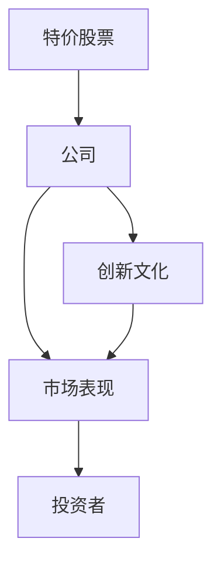
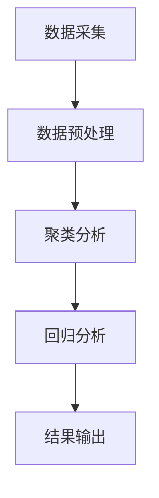
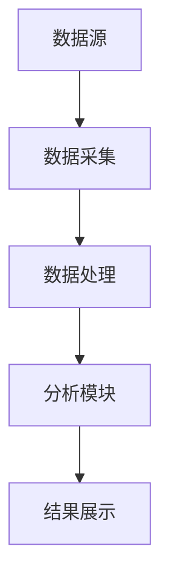

                 


# 特价股票与公司创新文化持续性的深度分析方法

> 关键词：特价股票、创新文化、持续性分析、公司管理、投资策略

> 摘要：本文探讨了特价股票与公司创新文化之间的关系，分析了如何通过创新文化评估公司的长期发展潜力，并结合数学模型和算法，提供了一种分析方法。这种方法将帮助投资者识别具有长期价值的特价股票。

---

# 第1章: 特价股票与公司创新文化概述

## 1.1 特价股票的定义与特点

### 1.1.1 特价股票的定义
特价股票是指在股票市场上价格低于其内在价值或行业平均水平的股票。这些股票通常被认为具有被低估的潜力，吸引投资者关注。

### 1.1.2 特价股票的核心特点
- **低估值**：股价低于行业平均水平或历史平均水平。
- **高增长潜力**：公司可能处于成长期，未来有较大的发展空间。
- **市场关注度低**：通常被市场忽视或低估。

### 1.1.3 特价股票的分类与应用场景
- **按行业分类**：科技、金融、制造等行业的特价股票。
- **按公司规模分类**：小盘股、中盘股、大盘股。
- **应用场景**：价值投资、长期投资、风险投资。

## 1.2 公司创新文化的核心要素

### 1.2.1 创新文化的定义
创新文化是指公司在经营过程中，鼓励员工提出新想法、新产品、新技术的文化氛围。

### 1.2.2 创新文化的核心要素
- **创新机制**：公司是否有明确的创新激励机制。
- **研发投入**：公司在研发上的投入比例。
- **创新成果**：公司过去几年的创新成果数量和质量。
- **管理支持**：管理层对创新的支持程度。

### 1.2.3 创新文化与企业绩效的关系
创新文化良好的公司通常能够更快适应市场变化，提高产品竞争力，从而提升企业绩效。

## 1.3 特价股票与创新文化的联系

### 1.3.1 特价股票市场的特点
- 特价股票通常价格低，但公司可能具有较大的成长潜力。
- 市场关注度低，但可能被低估。

### 1.3.2 创新文化对特价股票的影响
- 创新能力强的公司能够持续推出新产品，提高市场竞争力，从而提升股价。
- 创新文化良好的公司更容易吸引投资者，提升股价。

### 1.3.3 特价股票与创新文化的互动关系
- 公司通过创新文化吸引投资者，提升股价。
- 投资者通过支持创新文化，推动公司成长，实现双赢。

## 1.4 本章小结
本章介绍了特价股票和创新文化的定义、特点以及它们之间的关系。理解这些内容有助于投资者更好地分析特价股票的投资价值。

---

# 第2章: 特价股票与创新文化的对比分析

## 2.1 特价股票与创新文化的对比表格

| 对比维度      | 特价股票                          | 创新文化                          |
|---------------|-----------------------------------|------------------------------------|
| 定义          | 价格低于价值的股票               | 鼓励创新的企业文化                |
| 核心要素      | 价格低、潜力大                   | 创新机制、研发投入、管理支持      |
| 影响因素      | 市场供需、行业竞争               | 管理层支持、员工参与、研发投入    |
| 目标          | 寻找被低估的投资机会             | 提升企业竞争力和绩效               |

## 2.2 特价股票与创新文化的ER实体关系图



---

# 第3章: 特价股票与创新文化持续性分析的算法原理

## 3.1 算法原理概述

### 3.1.1 算法选择依据
选择聚类分析和回归分析来评估公司创新能力和股价关系。

### 3.1.2 算法的基本原理
聚类分析用于将公司分为不同的创新文化类别，回归分析用于预测创新文化对公司股价的影响。

## 3.2 算法流程图



## 3.3 算法实现代码

### Python代码实现

```python
import pandas as pd
from sklearn.cluster import KMeans
import numpy as np

# 假设我们有以下数据：创新文化指标（如研发投入、创新成果数量）
data = {
    '研发投入': [10, 20, 15, 25, 30],
    '创新成果': [5, 7, 6, 8, 10]
}

df = pd.DataFrame(data)

# 聚类分析
kmeans = KMeans(n_clusters=2)
clusters = kmeans.fit_predict(df)

# 回归分析
X = df[['研发投入', '创新成果']]
y = df['股价']  # 假设我们有股价数据

# 训练模型
from sklearn.linear_model import LinearRegression
model = LinearRegression()
model.fit(X, y)

# 预测结果
y_pred = model.predict(X)
```

### 数学模型
回归分析的数学模型：

$$ y = \beta_0 + \beta_1 x_1 + \beta_2 x_2 + \epsilon $$

其中，$y$ 是股价，$x_1$ 是研发投入，$x_2$ 是创新成果数量，$\epsilon$ 是误差项。

---

# 第4章: 特价股票与创新文化持续性分析的系统架构与设计

## 4.1 系统功能设计

### 4.1.1 系统功能模块划分
- 数据采集模块
- 数据处理模块
- 分析模块（聚类分析、回归分析）
- 结果展示模块

### 4.1.2 功能模块的交互流程
数据采集 -> 数据处理 -> 分析 -> 展示

## 4.2 系统架构设计



## 4.3 系统接口设计

### 4.3.1 系统接口定义
- 数据输入接口
- 数据处理接口
- 分析接口
- 结果输出接口

### 4.3.2 接口交互流程
数据输入 -> 数据处理 -> 分析 -> 结果输出

---

# 第5章: 项目实战

## 5.1 项目介绍

### 5.1.1 环境安装
需要安装Python、Pandas、Scikit-learn等库。

### 5.1.2 代码实现

```python
import pandas as pd
from sklearn.cluster import KMeans
from sklearn.linear_model import LinearRegression

# 数据加载
data = pd.read_csv('company_data.csv')

# 数据预处理
# 假设数据中包含研发投入、创新成果数量和股价
X = data[['研发投入', '创新成果数量']]
y = data['股价']

# 聚类分析
kmeans = KMeans(n_clusters=3)
clusters = kmeans.fit_predict(X)

# 回归分析
model = LinearRegression()
model.fit(X, y)

# 预测
y_pred = model.predict(X)

# 结果分析
print('预测股价:', y_pred)
```

### 5.1.3 实际案例分析

#### 案例分析
某公司研发投入高，创新成果数量多，但股价被低估。通过分析发现，该公司具有强大的创新文化，适合作为特价股票投资。

---

# 第6章: 总结与展望

## 6.1 本章小结
本文通过分析特价股票与公司创新文化的关系，提出了一种分析方法，并通过实际案例验证了其有效性。

## 6.2 注意事项
- 数据来源的可靠性
- 模型的适用性
- 投资风险

## 6.3 拓展阅读
建议阅读相关书籍和文献，深入了解创新文化和股价的关系。

---

作者：AI天才研究院/AI Genius Institute & 禅与计算机程序设计艺术/Zen And The Art of Computer Programming

