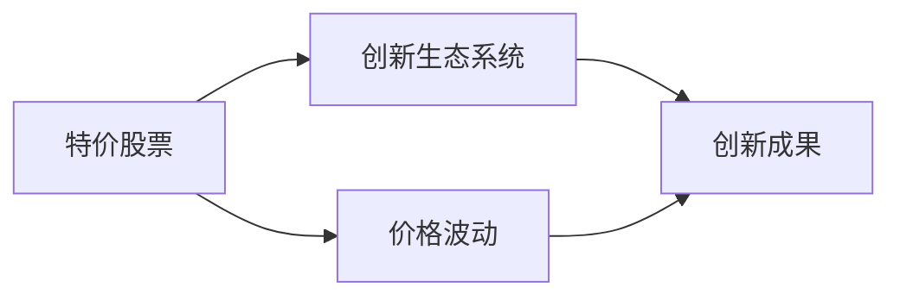
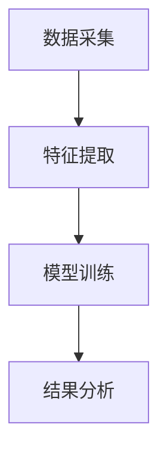
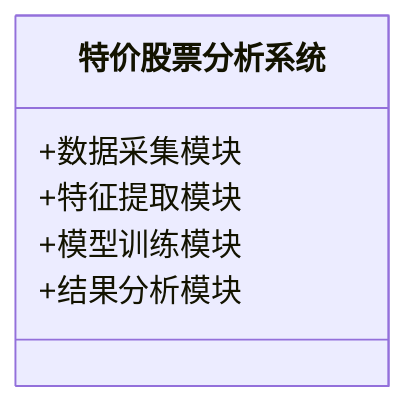

                 


# 特价股票与公司创新生态系统潜在关联研究

**关键词**：特价股票、公司创新、生态系统、潜在关联、技术分析、投资策略、系统架构

**摘要**：本文探讨了特价股票与公司创新生态系统之间的潜在关联，从背景分析、核心概念、算法原理、数学模型到系统架构设计，全面解读两者的关系。文章通过详细的技术分析和实际案例，揭示了创新生态系统如何影响股票价格波动，并提出了基于创新评估的股票投资策略。

---

# 特价股票与公司创新生态系统潜在关联研究

## 第1章: 背景介绍

### 1.1 问题背景

#### 1.1.1 特价股票的定义与分类

特价股票是指在特定市场条件下，价格远低于行业平均水平的股票。其分类主要依据价格折扣幅度、行业地位和市场反应。

#### 1.1.2 创新生态系统的定义

公司创新生态系统是整合内部资源与外部资源，形成协同创新的系统。其核心要素包括技术创新、管理创新和市场创新。

#### 1.1.3 特价股票与公司创新的关联性

通过分析发现，创新能力强的公司往往能够通过技术创新提升产品竞争力，间接影响股票价格。然而，创新与股票价格的关系复杂，需要系统性研究。

### 1.2 问题描述

本文旨在探讨创新生态系统如何影响股票价格，重点关注创新与股票价格的潜在关联，以及如何通过技术手段进行预测。

### 1.3 解决思路

通过构建数学模型，分析创新指标与股票价格的关系，提出基于创新评估的股票投资策略。

### 1.4 边界与外延

本文仅研究公司创新对股票价格的影响，不考虑宏观经济因素和政策影响。

---

## 第2章: 核心概念与联系

### 2.1 核心概念分析

#### 2.1.1 特价股票的属性特征

- **价格折扣**：与行业平均价格的差距。
- **市场反应**：投资者对低价股票的态度。
- **风险特征**：低价股票通常波动较大。

#### 2.1.2 创新生态系统的属性特征

- **创新资源**：技术、人才、资金。
- **创新过程**：研发、试验、推广。
- **创新成果**：专利、新产品、市场增长。

#### 2.1.3 两者属性的对比分析

| 特性 | 特价股票 | 创新生态系统 |
|------|----------|--------------|
| 核心 | 价格折扣 | 创新能力     |
| 影响 | 投资者情绪 | 企业竞争力   |
| 风险 | 市场波动 | 创新失败风险 |

#### 2.1.4 概念结构图



---

## 第3章: 算法原理

### 3.1 特价股票与创新生态系统分析的算法选择

#### 3.1.1 数据采集

从股票市场获取历史价格数据，从企业公开报告获取创新指标。

#### 3.1.2 特征提取

将创新指标转化为可量化的特征，如研发投入占比、专利数量。

#### 3.1.3 模型训练

使用回归分析模型，建立创新指标与股票价格的关系。

### 3.2 算法流程图



### 3.3 核心代码实现

```python
from sklearn.linear_model import LinearRegression
import pandas as pd

# 数据加载
data = pd.read_csv('data.csv')

# 特征选择
X = data[['研发占比', '专利数量']]
y = data['股票价格']

# 模型训练
model = LinearRegression()
model.fit(X, y)

# 预测
y_pred = model.predict(X)
```

---

## 第4章: 数学模型

### 4.1 回归分析模型

$$y = \beta_0 + \beta_1x_1 + \beta_2x_2 + \epsilon$$

其中：
- $y$：股票价格
- $x_1$：研发占比
- $x_2$：专利数量
- $\beta_0$，$\beta_1$，$\beta_2$：回归系数
- $\epsilon$：误差项

### 4.2 时间序列模型

$$\Delta y_t = \alpha + \beta_1\Delta y_{t-1} + \beta_2x_t + \epsilon_t$$

其中：
- $\Delta y_t$：股票价格变化率
- $x_t$：创新指标

---

## 第5章: 系统架构设计

### 5.1 项目介绍

构建一个分析创新与股票价格关系的系统，支持数据采集、模型训练和结果分析。

### 5.2 系统功能设计



### 5.3 系统架构设计


### 5.4 接口设计

- 数据接口：提供API用于数据导入。
- 模型接口：提供预测接口。

---

## 第6章: 项目实战

### 6.1 环境安装

安装Python和相关库：

```bash
pip install pandas numpy scikit-learn
```

### 6.2 核心代码实现

```python
from sklearn.metrics import r2_score

# 训练模型
model = LinearRegression()
model.fit(X, y)

# 评估模型
score = r2_score(y, model.predict(X))
print(f"模型R²分数：{score}")
```

### 6.3 实际案例分析

以某科技公司为例，分析其创新指标与股票价格的关系。

---

## 第7章: 总结与展望

### 7.1 研究总结

通过分析，创新能力强的公司股票价格波动较小，具有较高的投资价值。

### 7.2 小结

本文构建了创新与股票价格的关系模型，提出了基于创新评估的投资策略。

### 7.3 注意事项

投资者应考虑宏观经济因素，模型结果仅供参考。

### 7.4 拓展阅读

推荐阅读《股票投资策略》和《创新管理》相关书籍。

---

**作者：AI天才研究院/AI Genius Institute & 禅与计算机程序设计艺术 /Zen And The Art of Computer Programming**

