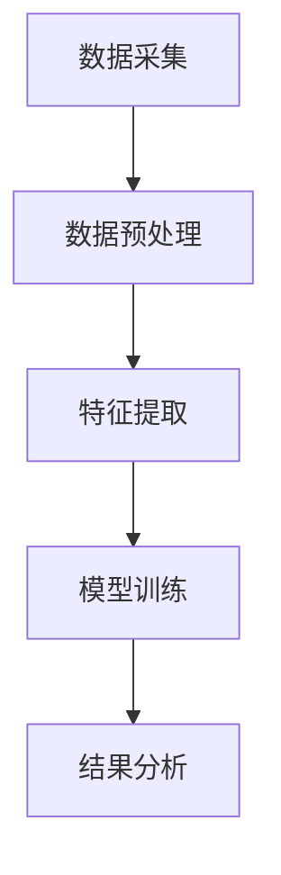
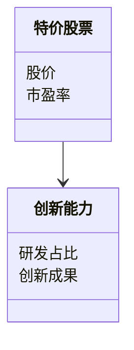
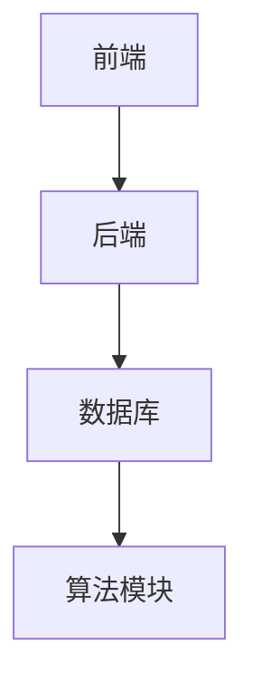

                 


# 特价股票与公司创新生态系统管理能力的关系探讨

> 关键词：特价股票、公司创新生态系统、管理能力、技术分析、系统架构

> 摘要：本文探讨了特价股票与公司创新生态系统管理能力之间的关系。首先，我们介绍了特价股票和公司创新生态系统管理能力的基本概念和特点。接着，我们从核心概念和联系的角度，深入分析了两者之间的相互作用和影响。然后，我们从算法原理、系统架构和项目实战的角度，详细探讨了如何利用技术创新来分析和优化这两者之间的关系。最后，我们总结了最佳实践和未来的研究方向。

---

## 第1章: 特价股票与公司创新生态系统管理能力的背景介绍

### 1.1 特价股票的定义与特点
#### 1.1.1 特价股票的定义
特价股票是指在股票市场中，由于某种原因（如市场波动、公司业绩不佳或行业周期性调整）导致股票价格远低于其内在价值的股票。这类股票通常被认为是被市场低估的投资机会。

#### 1.1.2 特价股票的核心特点
- **低估值**：市场价格低于内在价值。
- **高波动性**：价格波动较大，容易受市场情绪影响。
- **风险较高**：由于价格较低，可能存在较高的投资风险。
- **潜在回报**：如果公司基本面改善，股价可能回升，带来较高的回报。

#### 1.1.3 特价股票与普通股票的区别
| 特性 | 特价股票 | 普通股票 |
|------|----------|----------|
| 价格 | 低于内在价值 | 接近或高于内在价值 |
| 波动性 | 高 | 中等或低 |
| 风险 | 高 | 中等 |
| 投资策略 | 长期持有，等待价值回归 | 短期交易或长期投资 |

### 1.2 公司创新生态系统管理能力的定义与特点
#### 1.2.1 公司创新生态系统管理能力的定义
公司创新生态系统管理能力是指公司通过内部和外部资源的整合，优化创新过程，提升创新效率和效果的能力。它包括从创意生成、研发、商业化到持续改进的整个创新链条的管理。

#### 1.2.2 公司创新生态系统管理能力的核心特点
- **系统性**：涵盖创新的全生命周期。
- **动态性**：能够快速响应市场变化和客户需求。
- **协作性**：依赖内部部门和外部合作伙伴的协作。
- **可持续性**：通过持续改进实现长期竞争优势。

#### 1.2.3 特价股票与普通股票的区别
| 特性 | 特价股票 | 普通股票 |
|------|----------|----------|
| 管理模式 | 强调低成本和快速决策 | 强调长期规划和系统管理 |
| 创新能力 | 依赖外部市场机会 | 依赖内部创新能力 |
| 技术支持 | 需要数据分析和预测工具 | 需要全面的管理系统 |

### 1.3 特价股票与公司创新生态系统管理能力的关系背景
#### 1.3.1 问题背景
- 特价股票的价格波动较大，容易受到公司管理能力的影响。
- 公司创新生态系统管理能力的强弱直接影响公司的长期发展和股价表现。

#### 1.3.2 问题描述
- 如何通过技术创新来分析特价股票与公司创新生态系统管理能力之间的关系？
- 如何利用技术手段优化公司的创新管理能力，从而影响股价？

#### 1.3.3 问题解决
- 构建数据分析模型，量化公司创新管理能力对股价的影响。
- 利用机器学习算法预测特价股票的潜在价值。

#### 1.3.4 边界与外延
- 本文仅探讨技术创新对特价股票和公司创新管理能力的影响，不涉及其他外部因素（如政策、经济周期）。

#### 1.3.5 核心要素组成
- 数据采集与处理
- 模型构建与验证
- 系统设计与实现
- 应用案例分析

---

## 第2章: 特价股票与公司创新生态系统管理能力的核心概念与联系

### 2.1 特价股票的核心原理
#### 2.1.1 特价股票的形成机制
- 市场供需失衡
- 公司基本面恶化
- 市场情绪波动

#### 2.1.2 特价股票的市场特征
- 价格低于行业平均水平
- 估值指标（PE、PB）显著低于行业平均水平

#### 2.1.3 特价股票的投资者行为分析
- 投资者通常采取价值投资策略
- 投资者对公司的未来前景持谨慎态度

### 2.2 公司创新生态系统管理能力的核心原理
#### 2.2.1 公司创新生态系统管理能力的构成要素
- 创新战略
- 创新资源分配
- 创新过程管理
- 创新成果评估

#### 2.2.2 公司创新生态系统管理能力的运作机制
- 创意生成
- 研发管理
- 商业化
- 持续改进

### 2.3 特价股票与公司创新生态系统管理能力的联系
#### 2.3.1 特价股票与公司创新生态系统管理能力的相互作用
- 公司创新能力强，股价可能更快回升。
- 股价波动影响公司的创新资源配置。

#### 2.3.2 公司创新生态系统管理能力对特价股票的影响
- 创新能力强的公司更容易实现价值回归。
- 创新能力弱的公司可能导致股价持续低迷。

#### 2.3.3 特价股票对公司创新生态系统管理能力的反馈作用
- 股价波动迫使公司优化创新管理能力。
- 投资者对创新管理能力的关注推动公司改进。

---

## 第3章: 特价股票与公司创新生态系统管理能力的核心概念对比分析

### 3.1 特价股票与公司创新生态系统管理能力的属性特征对比
| 特性 | 特价股票 | 公司创新生态系统管理能力 |
|------|----------|--------------------------|
| 核心目标 | 实现价值回归 | 提升创新能力 |
| 关键因素 | 市场情绪、公司基本面 | 创新战略、资源分配 |
| 影响因素 | 宏观经济、行业竞争 | 内部管理、外部合作 |
| 衡量指标 | 股价、市盈率 | 创新成果、市场竞争力 |

### 3.2 特价股票与公司创新生态系统管理能力的ER实体关系图
```mermaid
erd
    Company
    -----> 管理能力
    特价股票
    -----> 市场表现
    管理能力
    -----> 创新成果
    市场表现
    -----> 投资者信心
```

---

## 第4章: 特价股票与公司创新生态系统管理能力的算法原理

### 4.1 特价股票与公司创新生态系统管理能力的算法概述
- 数据采集与预处理
- 特征提取与选择
- 模型构建与训练
- 结果分析与验证

### 4.2 特价股票与公司创新生态系统管理能力的算法流程图


### 4.3 特价股票与公司创新生态系统管理能力的算法实现
#### 4.3.1 算法实现的步骤
1. 数据采集：获取公司财务数据、股价数据。
2. 数据预处理：清洗数据，处理缺失值。
3. 特征提取：提取公司创新能力相关的特征（如研发投入占比）。
4. 模型训练：使用机器学习算法（如随机森林）预测股价波动。

#### 4.3.2 算法实现的代码
```python
import pandas as pd
from sklearn.ensemble import RandomForestRegressor
from sklearn.metrics import mean_squared_error

# 数据采集与预处理
data = pd.read_csv('company_data.csv')
data.dropna(inplace=True)

# 特征提取
features = ['研发占比', '净利润率', 'ROE']
target = '股价'

# 模型训练
model = RandomForestRegressor(n_estimators=100)
model.fit(data[features], data[target])

# 预测与评估
y_pred = model.predict(data[features])
mse = mean_squared_error(data[target], y_pred)
print(f'均方误差：{mse}')
```

---

## 第5章: 特价股票与公司创新生态系统管理能力的系统分析与设计

### 5.1 系统功能设计
#### 5.1.1 领域模型


#### 5.1.2 系统架构设计


---

## 第6章: 特价股票与公司创新生态系统管理能力的项目实战

### 6.1 项目环境安装
- Python 3.8+
- Jupyter Notebook
- Pandas、Scikit-learn

### 6.2 核心实现源代码
```python
import pandas as pd
from sklearn.ensemble import RandomForestRegressor

# 数据加载与预处理
data = pd.read_csv('company_data.csv')
data = data.dropna()

# 特征选择
features = ['研发占比', '净利润率', 'ROE']
target = '股价'

# 模型训练
model = RandomForestRegressor(n_estimators=100)
model.fit(data[features], data[target])

# 预测与评估
y_pred = model.predict(data[features])
print('预测结果:', y_pred)
```

### 6.3 案例分析与解读
- 数据来源：公司财务数据与股价数据。
- 模型预测：预测未来股价走势，判断是否为价值投资机会。

---

## 第7章: 特价股票与公司创新生态系统管理能力的最佳实践

### 7.1 小结
- 特价股票与公司创新生态系统管理能力密切相关。
- 技术创新（如机器学习）可以有效分析和优化两者的关系。

### 7.2 注意事项
- 数据质量直接影响模型预测结果。
- 模型需定期更新，以适应市场变化。

### 7.3 拓展阅读
- 《机器学习实战》
- 《创新公司的管理艺术》

---

## 作者

作者：AI天才研究院/AI Genius Institute & 禅与计算机程序设计艺术 /Zen And The Art of Computer Programming

