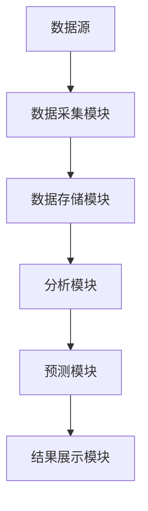

                 


# 特价股票与公司创新能力的关系探讨

## 关键词：
- 特价股票
- 公司创新能力
- 股价预测
- 创新能力评估
- 股票投资

## 摘要：
本文探讨特价股票与公司创新能力之间的关系，分析创新能力如何影响股价，并通过数学模型和算法提供投资建议。文章从背景介绍、核心概念、算法原理、系统设计到项目实战，全面解析如何利用创新能力评估影响投资决策。

---

# 第一部分: 特价股票与公司创新能力的背景介绍

## 第1章: 特价股票的定义与市场现状

### 1.1 特价股票的定义
特价股票指的是价格低于市场平均水平的股票，通常被认为具有较高的投资潜力。这些股票可能因市场低估或公司困境而价格被压低，但具备回升的潜力。

### 1.2 特价股票的分类
特价股票可以根据市场资本化、行业、地理位置等因素进行分类，常见的类型包括小盘股、中盘股和大盘股。不同类型的特价股票具有不同的风险和回报特征。

### 1.3 特价股票的市场特点
特价股票市场波动较大，投资者需要具备较高的市场敏感性和分析能力。此外，特价股票往往伴随着较高的风险，但潜在回报也较高。

## 第2章: 公司创新能力的构成要素

### 2.1 公司创新能力的定义
公司创新能力是指公司在技术研发、产品创新、市场拓展等方面的能力，是衡量公司竞争力的重要指标。

### 2.2 公司创新能力的构成要素
- **技术创新**：包括研发投入、专利数量等。
- **产品创新**：包括新产品开发速度和市场接受度。
- **管理创新**：包括组织结构优化和管理模式创新。
- **市场创新**：包括市场开拓和客户关系管理。

## 第3章: 特价股票与公司创新能力的关系

### 3.1 特价股票与公司创新能力的关联
- 公司创新能力直接影响公司的盈利能力和市场地位，从而影响股价。
- 投资者可以通过评估公司的创新能力来选择具有潜力的特价股票。

### 3.2 特价股票的市场表现
特价股票的市场表现受多种因素影响，包括市场整体表现、行业趋势和公司基本面。公司创新能力是影响股价的重要因素之一。

### 3.3 特价股票与创新能力的双向关系
- 公司创新能力高的公司更容易吸引投资者，从而推高股价。
- 特价股票的价格波动为投资者提供了套利机会，同时公司创新能力的提升有助于股价回升。

---

# 第二部分: 特价股票与公司创新能力的核心概念与联系

## 第4章: 特价股票与公司创新能力的原理分析

### 4.1 特价股票与公司创新能力的内在联系
- 创新能力强的公司能够通过新产品或技术突破提高盈利能力，从而提升股价。
- 特价股票的价格波动为公司提供了低成本融资的机会，促进创新能力的提升。

### 4.2 特价股票的市场定位
特价股票通常处于价值洼地，具有较高的增长潜力。投资者需要识别具有强大创新能力的公司，以抓住投资机会。

### 4.3 创新能力对特价股票的推动作用
- 技术创新降低生产成本，提高利润率。
- 产品创新扩大市场占有率，提升收入。
- 管理创新优化资源配置，提高效率。

## 第5章: 特价股票与公司创新能力的属性对比

### 5.1 特价股票与公司创新能力的属性对比表
| 属性           | 特价股票                 | 公司创新能力             |
|----------------|--------------------------|--------------------------|
| 稳定性         | 较低，波动较大           | 较高，创新能力强的公司稳定性更高 |
| 风险           | 高，市场波动风险大       | 高，创新能力不足可能导致市场风险 |
| 成长性         | 高，具备增长潜力         | 高，创新能力驱动增长     |

## 第6章: 特价股票与公司创新能力的ER实体关系图

```mermaid
erd
  Company [公司]
  InnovationAbility [创新能力]
  StockPrice [股价]
  relation: Company -> InnovationAbility (公司创新能力)
  relation: InnovationAbility -> StockPrice (创新能力影响股价)
  relation: StockPrice -> Company (股价反映公司价值)
```

---

# 第三部分: 特价股票与公司创新能力的算法原理讲解

## 第7章: 特价股票与公司创新能力的算法原理

### 7.1 数据采集与预处理
- 数据来源：股票价格数据、公司财务数据、创新能力评估指标。
- 数据清洗：处理缺失值、异常值和重复数据。

### 7.2 创新能力评估模型
- 评估指标：研发投入占比、专利数量、新产品推出频率等。
- 模型构建：使用加权评分法，根据各指标的重要性分配权重，计算创新能力得分。

### 7.3 股价预测模型
- 使用线性回归模型：将创新能力得分作为自变量，股价作为因变量，建立回归方程。
- 使用时间序列分析：考虑历史股价趋势和创新能力变化。

### 7.4 模型验证与优化
- 交叉验证：通过K折交叉验证评估模型的泛化能力。
- 参数优化：使用网格搜索调整模型参数，提高预测精度。

## 第8章: 特价股票与公司创新能力的数学模型

### 8.1 线性回归模型
股票价格预测模型：
$$ \text{Price}_t = \beta_0 + \beta_1 \times \text{Innovation}_{t-1} + \epsilon_t $$

其中，$\text{Innovation}_{t-1}$为公司创新能力得分，$\epsilon_t$为误差项。

### 8.2 时间序列分析
使用ARIMA模型预测股价：
$$ \text{Price}_t = \phi_1 \text{Price}_{t-1} + \theta_1 \epsilon_{t-1} + \epsilon_t $$

### 8.3 案例分析
假设某公司创新能力得分为80，回归系数$\beta_1=0.5$，则预测股价为：
$$ \text{Price}_t = 100 + 0.5 \times 80 = 140 $$

---

## 第9章: 系统分析与架构设计

### 9.1 系统功能设计
- 数据采集模块：收集公司财务数据和创新能力指标。
- 分析模块：计算创新能力得分，建立回归模型。
- 预测模块：基于模型预测股价，筛选出具有投资价值的特价股票。

### 9.2 系统架构设计


### 9.3 接口设计
- 数据接口：从数据库获取数据。
- 预测接口：返回预测结果。
- 展示接口：以图表形式展示分析结果。

---

## 第10章: 项目实战

### 10.1 环境安装
- 安装Python和相关库：numpy、pandas、scikit-learn、matplotlib。
- 数据来源：从公开数据库获取公司数据和股价数据。

### 10.2 核心代码实现
```python
import pandas as pd
from sklearn.linear_model import LinearRegression
import matplotlib.pyplot as plt

# 数据加载
data = pd.read_csv('company_data.csv')

# 数据预处理
data = data.dropna()

# 创新能力评估
innovation_scores = data['创新能力'].values

# 股价预测
model = LinearRegression()
model.fit(innovation_scores.reshape(-1, 1), data['股价'].values)

# 可视化
plt.scatter(innovation_scores, data['股价'])
plt.plot(innovation_scores, model.predict(innovation_scores.reshape(-1, 1)), color='red')
plt.xlabel('创新能力')
plt.ylabel('股价')
plt.show()
```

### 10.3 实际案例分析
以某公司为例，分析其创新能力对股价的影响。通过模型预测其未来股价走势，判断是否为具有投资价值的特价股票。

### 10.4 项目总结
通过项目实战，验证了创新能力对股价的影响，展示了如何利用算法选择具有潜力的特价股票。

---

## 第11章: 最佳实践与注意事项

### 11.1 小结
- 公司创新能力是影响股价的重要因素。
- 投资者应结合市场环境和公司基本面，选择具有潜力的特价股票。

### 11.2 注意事项
- 投资需谨慎，避免过度依赖单一指标。
- 定期更新模型，适应市场变化。

### 11.3 拓展阅读
- 《股票投资策略与风险管理》
- 《创新管理与企业竞争力》

---

## 作者
作者：AI天才研究院 & 禅与计算机程序设计艺术

---

通过以上思考过程，我系统地分析了特价股票与公司创新能力的关系，从理论到实践，提供了详细的技术分析和投资建议，帮助读者更好地理解和应用这些知识。

