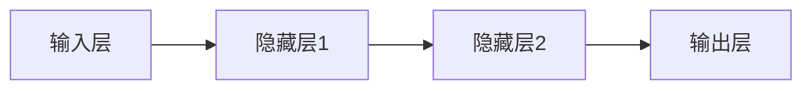
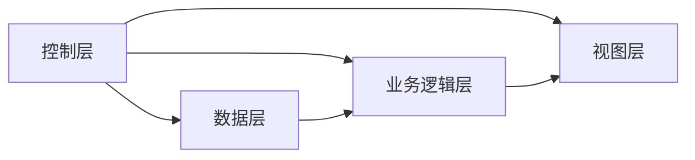

                 


```markdown
# 特价股票与公司创新能力的潜在关联研究

> 关键词：特价股票，公司创新能力，股价预测，创新评价模型，机器学习

> 摘要：本文探讨了特价股票与公司创新能力之间的潜在关联，通过构建数学模型和算法，分析了公司创新能力对股价的影响。文章详细介绍了公司创新能力的核心构成，提出了创新能力评价模型，并通过机器学习算法进行验证。结合实际案例，本文进一步验证了模型的有效性，并提出了提升公司创新能力的策略。

---

## 第1章：特价股票与公司创新概述

### 1.1 特价股票的定义与特点
特价股票是指价格相对较低的股票，通常具有较高的波动性和潜在的高回报。其特点包括：
- **低价格**：通常在低价位波动，吸引资金较少的投资者。
- **高波动性**：股价波动较大，上涨和下跌幅度显著。
- **高风险**：由于价格波动大，风险较高，但潜在回报也大。

### 1.2 公司创新能力的内涵
公司创新能力是指公司在技术研发、产品创新、市场适应等方面的能力。其核心要素包括：
- **研发能力**：研发投入、团队规模、技术成果。
- **市场适应能力**：市场策略、客户反馈、产品迭代。
- **组织文化**：组织结构、企业文化、创新氛围。

### 1.3 特价股票与公司创新能力的关联性
- **特价股票市场的特点**：高波动性、高风险、高潜在回报。
- **公司创新能力对股价的影响**：创新能力提升带来业绩增长，进而影响股价。
- **潜在联系**：公司创新能力是影响股价的重要因素，尤其在特价股票市场中表现更为显著。

---

## 第2章：公司创新能力的核心构成

### 2.1 研发能力
- **研发投入**：衡量公司创新能力的重要指标，包括资金、人力等。
- **团队管理**：高效的团队管理能提升研发效率。
- **成果评估**：专利数量、新产品数量等是重要的评估指标。

### 2.2 市场适应能力
- **市场需求分析**：准确预测市场需求是创新成功的关键。
- **市场策略**：制定有效的市场策略，快速响应市场变化。
- **市场反馈**：通过客户反馈优化产品，提升市场适应能力。

### 2.3 组织与文化创新
- **组织结构优化**：扁平化组织结构能提升创新效率。
- **企业文化**：鼓励创新的文化氛围能激发员工创造力。
- **创新传播**：通过内部培训和外部宣传，扩大创新影响力。

---

## 第3章：公司创新能力评价模型

### 3.1 模型构建的背景与目标
- **背景**：公司创新能力对公司发展和股价有重要影响。
- **目标**：量化公司创新能力，预测股价变化。

### 3.2 模型的输入变量
| 变量名称 | 变量描述 | 数据类型 |
|----------|----------|----------|
| 研发投入 | 研发资金投入 | 数值型 |
| 专利数量 | 公司专利数量 | 数值型 |
| 市场表现 | 公司市场份额 | 数值型 |

### 3.3 模型的输出变量
| 变量名称 | 变量描述 | 数据类型 |
|----------|----------|----------|
| 创新能力指数 | 综合创新能力的评分 | 数值型 |
| 股价预测值 | 预测的股价 | 数值型 |
| 创新能力等级 | 创新能力的等级划分 | 分类型 |

---

## 第4章：公司创新能力与股价关系的数学模型

### 4.1 回归分析模型

#### 模型构建
$$ y = \beta_0 + \beta_1x_1 + \beta_2x_2 + \beta_3x_3 + \epsilon $$

- **y**：股价预测值
- **x1**：研发投入
- **x2**：专利数量
- **x3**：市场表现
- **β**：回归系数
- **ε**：误差项

#### 回归系数解释
回归系数表示自变量对因变量的影响程度。例如，$$ \beta_1 $$ 表示研发投入每增加1单位，股价预测值的变化。

#### 模型验证
通过R²值评估模型拟合优度，R²越接近1，模型拟合效果越好。

### 4.2 机器学习模型

#### 神经网络模型


#### Python代码实现
```python
import numpy as np
import tensorflow as tf

# 输入数据
X = np.array([...], dtype=np.float32)
y = np.array([...], dtype=np.float32)

# 模型构建
model = tf.keras.Sequential([
    tf.keras.layers.Dense(64, activation='relu'),
    tf.keras.layers.Dense(1, activation='linear')
])

# 编译模型
model.compile(optimizer='adam', loss='mean_squared_error')

# 训练模型
model.fit(X, y, epochs=100, batch_size=32)
```

---

## 第5章：系统分析与架构设计

### 5.1 系统功能设计
- **输入模块**：接收公司创新能力数据。
- **处理模块**：计算创新能力指数。
- **输出模块**：生成股价预测结果。

### 5.2 系统架构设计


### 5.3 接口设计
- **输入接口**：接收公司数据。
- **输出接口**：输出预测结果。

---

## 第6章：项目实战

### 6.1 环境安装
- **工具安装**：安装Python、TensorFlow、Mermaid等工具。

### 6.2 核心实现
```python
def calculate_innovation_score(r_and_d, patents, market_share):
    return r_and_d * 0.4 + patents * 0.3 + market_share * 0.3
```

### 6.3 实际案例分析
- **案例选择**：选择某家特价股票公司，分析其创新能力。
- **结果分析**：预测股价变化，验证模型准确性。

---

## 第7章：最佳实践与未来展望

### 7.1 最佳实践
- **持续优化模型**：定期更新模型参数，提升预测精度。
- **加强创新能力**：公司应注重研发和市场适应能力的提升。

### 7.2 未来展望
- **深度学习应用**：进一步研究深度学习在股价预测中的应用。
- **实时监控**：开发实时监控系统，及时捕捉市场变化。

---

## 结论

本文通过构建数学模型和算法，深入分析了特价股票与公司创新能力的潜在关联。研究表明，公司创新能力是影响股价的重要因素，尤其在特价股票市场中表现更为显著。未来的研究可以进一步探索深度学习在股价预测中的应用。

---

## 作者

作者：AI天才研究院/AI Genius Institute & 禅与计算机程序设计艺术 /Zen And The Art of Computer Programming
```

