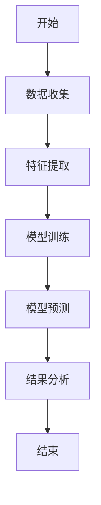
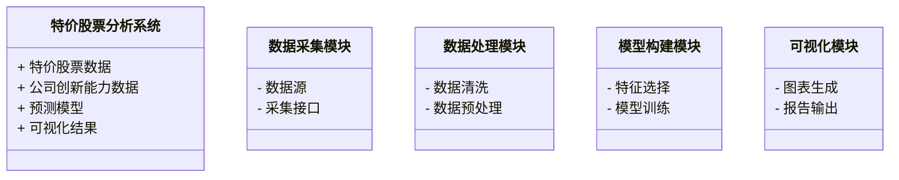
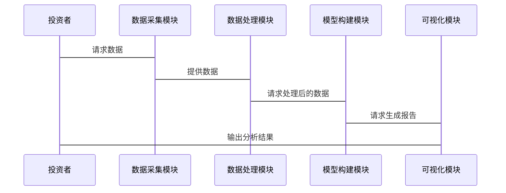

                 


# 特价股票与公司创新能力的潜在联系

> 关键词：特价股票、公司创新能力、股票价格波动、公司创新指标、投资分析

> 摘要：本文探讨了特价股票与公司创新能力之间的潜在联系，分析了两者的核心概念、内在联系和算法原理，通过实际案例展示了如何利用这些联系进行投资决策。

---

## 目录大纲：

1. **特价股票与公司创新能力的背景介绍**  
   - 1.1 特价股票的定义与特征  
   - 1.2 公司创新能力的定义与构成  
   - 1.3 特价股票与公司创新能力的联系

2. **特价股票与公司创新能力的核心概念与联系**  
   - 2.1 特价股票与公司创新能力的共同属性  
   - 2.2 特价股票与公司创新能力的差异与互补

3. **特价股票与公司创新能力的算法原理**  
   - 3.1 特价股票与公司创新能力的预测模型  
   - 3.2 公司创新指标的量化方法  
   - 3.3 基于机器学习的股票价格预测

4. **特价股票与公司创新能力的数学模型与公式**  
   - 4.1 特价股票与公司创新能力的数学模型  
   - 4.2 相关公式与实例分析

5. **特价股票与公司创新能力的系统分析与架构设计**  
   - 5.1 系统功能设计  
   - 5.2 系统架构设计  
   - 5.3 系统接口与交互设计

6. **特价股票与公司创新能力的项目实战**  
   - 6.1 项目背景与目标  
   - 6.2 系统实现与代码分析  
   - 6.3 案例分析与结果解读

7. **总结与展望**  
   - 7.1 研究总结  
   - 7.2 未来展望

---

## 1. 特价股票与公司创新能力的背景介绍

### 1.1 特价股票的定义与特征

#### 1.1.1 特价股票的定义
特价股票通常指价格低于某个特定值（如5元）的股票。这类股票可能因市场波动、公司业绩不佳或市场情绪影响而价格较低。

#### 1.1.2 特价股票的市场特征
- 价格波动大
- 投资风险高
- 可能存在市场低估的机会

#### 1.1.3 特价股票的投资价值
- 可能因市场反弹而上涨
- 适合长期投资者
- 需要谨慎评估公司基本面

### 1.2 公司创新能力的定义与构成

#### 1.2.1 公司创新能力的定义
公司创新能力指公司在技术研发、产品创新、管理创新等方面的能力，反映了公司在市场中的竞争力和成长潜力。

#### 1.2.2 公司创新能力的构成要素
- 技术研发能力
- 产品创新能力
- 管理创新能力
- 市场适应能力

#### 1.2.3 公司创新能力的评估指标
- 研发投入比例
- 专利数量
- 新产品发布频率
- 创新奖项获得情况

### 1.3 特价股票与公司创新能力的联系

#### 1.3.1 联系的背景与问题描述
特价股票公司创新能力的研究旨在揭示公司创新能力如何影响股价波动，帮助投资者识别潜在投资机会。

#### 1.3.2 联系的核心要素与边界
- 股价波动受公司创新的影响
- 创新能力强的公司可能在低价时更具投资价值

#### 1.3.3 联系的潜在价值与意义
- 为投资者提供新的分析维度
- 帮助识别被市场低估的创新公司

---

## 2. 特价股票与公司创新能力的核心概念与联系

### 2.1 特价股票与公司创新能力的共同属性

#### 2.1.1 共同属性的对比分析
| 属性         | 特价股票               | 公司创新能力           |
|--------------|-----------------------|-----------------------|
| 性质         | 股票价格低             | 创新能力强             |
| 变化因素     | 市场供需、情绪影响       | 技术研发、管理创新     |
| 影响因素     | 市场波动、公司基本面     | 创新成果、市场反应     |

#### 2.1.2 属性特征的表格对比
| 特性         | 特价股票               | 公司创新能力           |
|--------------|-----------------------|-----------------------|
| 表现形式     | 价格低于特定值         | 创新成果显著           |
| 时间因素     | 短期波动                | 中长期积累            |
| 影响主体     | 投资者、市场情绪         | 公司内部、外部环境     |

#### 2.1.3 ER实体关系图架构（使用 Mermaid 流程图）

```mermaid
erd
actor 投资者
actor 市场
actor 公司
database 特价股票信息
database 公司创新能力数据

investor -> 特价股票信息: 查询低价股票
investor -> 公司创新能力数据: 评估公司创新
market -> 特价股票信息: 影响股票价格
company -> 公司创新能力数据: 提供创新数据
```

### 2.2 特价股票与公司创新能力的差异与互补

#### 2.2.1 差异分析
- 特价股票关注价格，公司创新关注能力
- 特价股票受市场情绪影响，公司创新受内部管理影响

#### 2.2.2 互补性探讨
- 创新能力强的公司可能成为特价股票的好选择
- 特价股票的公司可能通过创新提升股价

#### 2.2.3 综合影响分析
- 综合考虑股价和创新能力，识别潜在投资机会

---

## 3. 特价股票与公司创新能力的算法原理

### 3.1 特价股票与公司创新能力的预测模型

#### 3.1.1 预测模型的构建
- 使用机器学习方法，如线性回归或神经网络
- 输入变量：公司创新指标、股价历史数据
- 输出变量：未来股价预测

#### 3.1.2 算法流程图（使用 Mermaid）



#### 3.1.3 代码实现

```python
import pandas as pd
from sklearn.linear_model import LinearRegression

# 数据收集与处理
data = pd.read_csv('stock_data.csv')
features = data[['研发费用率', '专利数量', '新产品数量']]
target = data['未来股价']

# 模型训练
model = LinearRegression()
model.fit(features, target)

# 预测股价
predicted_price = model.predict(features)
```

### 3.2 公司创新指标的量化方法

#### 3.2.1 创新指标的量化
- 研发投入比例：研发费用/营业收入
- 专利数量：每年申请的专利数量
- 新产品数量：每年推出的新产品数量

#### 3.2.2 量化模型
$$ 创新能力指数 = \alpha \times 研发投入 + \beta \times 专利数量 + \gamma \times 新产品数量 $$

### 3.3 基于机器学习的股票价格预测

#### 3.3.1 神经网络模型
使用多层感知机（MLP）进行股价预测：

```python
import numpy as np
from tensorflow.keras import layers

model = tf.keras.Sequential()
model.add(layers.Dense(64, activation='relu', input_dim=3))
model.add(layers.Dense(1, activation='linear'))
model.compile(optimizer='adam', loss='mean_squared_error')
model.fit(X_train, y_train, epochs=100, batch_size=32)
```

---

## 4. 特价股票与公司创新能力的数学模型与公式

### 4.1 特价股票与公司创新能力的数学模型

#### 4.1.1 股价波动模型
$$ 股价波动 = \beta \times 创新能力 + \epsilon $$

其中，$\beta$ 是回归系数，$\epsilon$ 是误差项。

#### 4.1.2 创新能力与股价的关系
$$ \text{创新能力提升} \Rightarrow \text{股价上涨} $$

### 4.2 相关公式与实例分析

#### 4.2.1 CAPM 模型
$$ R_i = R_f + \beta_i (R_m - R_f) $$

其中，$R_i$ 是个股收益率，$R_f$ 是无风险利率，$\beta_i$ 是个股的贝塔系数，$R_m$ 是市场平均收益率。

---

## 5. 特价股票与公司创新能力的系统分析与架构设计

### 5.1 系统功能设计

#### 5.1.1 功能模块
- 数据采集模块：收集公司创新能力数据和股票价格数据
- 数据处理模块：清洗和预处理数据
- 模型构建模块：建立预测模型
- 可视化模块：展示分析结果

#### 5.1.2 领域模型（使用 Mermaid 类图）



### 5.2 系统架构设计

#### 5.2.1 系统架构图（使用 Mermaid）

```mermaid
container 技术架构 {
    组件 数据采集模块
    组件 数据处理模块
    组件 模型构建模块
    组件 可视化模块
}
```

### 5.3 系统接口与交互设计

#### 5.3.1 接口设计
- 数据接口：提供API用于数据采集和处理
- 模型接口：提供API用于模型预测和结果输出

#### 5.3.2 交互设计（使用 Mermaid 序列图）



---

## 6. 特价股票与公司创新能力的项目实战

### 6.1 项目背景与目标

#### 6.1.1 项目背景
识别具有强大创新能力的特价股票，帮助投资者发现潜在投资机会。

#### 6.1.2 项目目标
构建一个分析系统，评估公司创新能力，并预测股价波动。

### 6.2 系统实现与代码分析

#### 6.2.1 环境配置
- Python 3.8+
- 数据处理库：Pandas、NumPy
- 机器学习库：Scikit-learn、TensorFlow

#### 6.2.2 核心代码实现

```python
import pandas as pd
from sklearn.linear_model import LinearRegression

# 数据加载
data = pd.read_csv('company_innovation.csv')

# 特征选择
features = data[['研发费用率', '专利数量', '新产品数量']]
target = data['股价']

# 模型训练
model = LinearRegression()
model.fit(features, target)

# 预测股价
predicted_prices = model.predict(features)
```

### 6.3 案例分析与结果解读

#### 6.3.1 案例分析
分析一家公司过去的数据，评估其创新能力，并预测其股价走势。

#### 6.3.2 结果解读
- 预测股价与实际股价对比
- 创新能力对股价的影响分析

---

## 7. 总结与展望

### 7.1 研究总结
本文探讨了特价股票与公司创新能力的潜在联系，构建了分析模型，并通过实际案例展示了其应用价值。

### 7.2 未来展望
未来研究可以结合更多因素，如宏观经济指标，进一步优化预测模型。

---

## 作者：AI天才研究院/AI Genius Institute & 禅与计算机程序设计艺术 /Zen And The Art of Computer Programming

