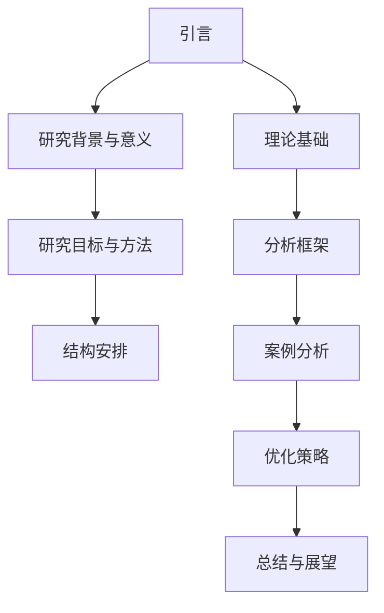
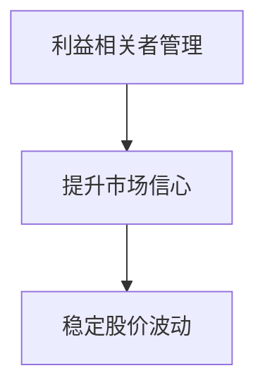

                 

# 特价股票与公司利益相关者管理的关联性研究

> 关键词：特价股票、利益相关者管理、股价波动、公司治理、风险管理

> 摘要：本文探讨了特价股票与公司利益相关者管理之间的关联性。通过分析特价股票的市场特征、利益相关者管理的核心原则，构建了两者之间的互动模型。文章结合实际案例，深入剖析了利益相关者管理对股价波动的影响机制，并提出了优化管理策略。研究发现，利益相关者管理能够有效稳定股价波动，提升公司价值。

---

## 第一部分：引言

### 1.1 研究背景与意义

#### 1.1.1 特价股票的定义与特点  
特价股票是指价格低于市场平均水平的股票，通常具有较高的波动性和不确定性。其特点包括：  
- 价格低廉，吸引价值投资者；  
- 波动性较大，风险较高；  
- 受市场情绪影响显著。  

#### 1.1.2 利益相关者管理的定义与重要性  
利益相关者管理是指公司对其股东、债权人、员工、客户等利益相关者的需求和期望进行识别、评估和满足的过程。其重要性体现在：  
- 提升公司治理效率；  
- 优化资源配置；  
- 增强利益相关者的信任与支持。  

#### 1.1.3 研究特价股票与利益相关者管理关联性的必要性  
特价股票的波动性可能对公司利益相关者产生重大影响，而利益相关者管理则能够帮助公司应对股价波动带来的挑战。研究这种关联性，有助于公司制定更有效的治理策略，实现长期稳健发展。

---

### 1.2 研究目标与方法

#### 1.2.1 研究目标的设定  
本文旨在研究特价股票与公司利益相关者管理之间的互动关系，探讨利益相关者管理如何影响股价波动，以及股价波动如何反作用于利益相关者管理。

#### 1.2.2 研究方法的选择与应用  
本文采用定性与定量相结合的方法，包括：  
- 文献研究法：分析相关理论与研究成果；  
- 案例分析法：选取典型公司进行实证分析；  
- 数学建模法：构建利益相关者管理与股价波动的互动模型。  

---

### 1.3 本书结构安排

#### 1.3.1 各章节内容概述  
- 第二部分：特价股票与利益相关者管理的理论基础；  
- 第三部分：特价股票与利益相关者管理的分析框架；  
- 第四部分：案例分析与实证研究；  
- 第五部分：利益相关者管理的优化策略；  
- 第六部分：总结与展望。  

#### 1.3.2 逻辑框架图  

---

## 第二部分：特价股票与利益相关者管理的理论基础

### 2.1 特价股票的理论分析

#### 2.1.1 特价股票的定义与分类  
- **定义**：特价股票是指价格低于市场平均水平的股票，通常具有较高的波动性和不确定性。  
- **分类**：根据波动原因，可分为基本面驱动型和市场情绪驱动型。  

#### 2.1.2 特价股票的市场特征与波动规律  
- **市场特征**：价格低廉、波动性大、交易量低。  
- **波动规律**：受市场情绪、公司基本面、外部环境等因素影响。  

#### 2.1.3 特价股票与公司治理的关系  
- 特价股票的波动可能反映出公司治理问题，如管理不善或信息披露不足。  

---

### 2.2 利益相关者管理的理论框架

#### 2.2.1 利益相关者的定义与分类  
- **定义**：利益相关者是指与公司存在直接或间接关系的个人或组织，包括股东、债权人、员工、客户等。  
- **分类**：按重要性可分为核心利益相关者和次要利益相关者。  

#### 2.2.2 利益相关者管理的核心原则与方法  
- **核心原则**：透明化、公平性、长期性。  
- **管理方法**：沟通管理、风险管理、价值共创。  

#### 2.2.3 利益相关者管理与公司价值的关系  
- 利益相关者管理能够增强利益相关者的信任与支持，进而提升公司价值。  

---

### 2.3 特价股票与利益相关者管理的理论联系

#### 2.3.1 特价股票波动对利益相关者的影响  
- 股价波动可能引发利益相关者对公司治理的质疑，影响公司声誉。  

#### 2.3.2 利益相关者管理对股价波动的反作用  
- 有效的利益相关者管理能够稳定股价波动，增强市场信心。  

#### 2.3.3 理论模型构建与分析  
- **模型构建**：构建利益相关者管理与股价波动的互动模型。  
- **模型分析**：通过数学方法分析两者之间的关系。  

---

## 第三部分：特价股票与利益相关者管理的分析框架

### 3.1 特价股票波动的分析模型

#### 3.1.1 特价股票波动的影响因素分析  
- **因素**：市场情绪、公司基本面、宏观经济环境。  

#### 3.1.2 基于利益相关者的股价波动预测模型  
- **模型**：$$P = \alpha + \beta_1S + \beta_2G + \epsilon$$  
  其中，$S$ 表示利益相关者的影响，$G$ 表示公司治理因素，$\epsilon$ 为误差项。  

#### 3.1.3 模型的数学表达与公式推导  
- 通过回归分析方法，推导模型参数，验证利益相关者的影响程度。  

---

### 3.2 利益相关者管理的影响机制

#### 3.2.1 利益相关者管理对股价波动的路径分析  
- **路径**：利益相关者管理 → 提升市场信心 → 稳定股价波动。  

#### 3.2.2 利益相关者管理的优化策略与实施路径  
- **策略**：优化沟通机制、加强风险管理、提升公司治理能力。  

#### 3.2.3 影响机制的流程图与分析  

---

## 第四部分：案例分析与实证研究

### 4.1 特价股票与利益相关者管理的典型案例

#### 4.1.1 案例背景与选择标准  
- **案例背景**：选择一家具有代表性的公司，分析其特价股票波动与利益相关者管理的关系。  
- **选择标准**：股价波动显著、利益相关者管理经验丰富。  

#### 4.1.2 案例分析：某公司特价股票波动与利益相关者管理的互动关系  
- **分析结果**：利益相关者管理的有效性显著影响股价波动的稳定性。  

#### 4.1.3 案例启示与经验总结  
- 有效的利益相关者管理能够显著降低股价波动风险。  

---

## 第五部分：利益相关者管理的优化策略

### 5.1 利益相关者管理的核心要素

#### 5.1.1 利益相关者识别与分类  
- **方法**：通过问卷调查、数据分析等方式识别利益相关者。  

#### 5.1.2 利益相关者需求与期望的分析  
- **分析方法**：定性分析与定量分析结合。  

---

### 5.2 利益相关者管理的优化机制

#### 5.2.1 利益相关者沟通管理  
- **沟通策略**：定期发布公司公告、召开投资者会议。  

#### 5.2.2 利益相关者风险管理  
- **风险管理策略**：制定应急预案，降低潜在风险。  

#### 5.2.3 利益相关者价值共创  
- **价值共创机制**：通过合作创新，实现利益相关者共赢。  

---

## 第六部分：总结与展望

### 6.1 研究总结

#### 6.1.1 核心研究结论  
- 利益相关者管理能够有效稳定股价波动，提升公司价值。  

#### 6.1.2 研究局限性  
- 数据获取难度较大，部分假设可能具有局限性。  

### 6.2 未来研究方向

#### 6.2.1 研究深化  
- 探讨更多利益相关者管理策略对股价波动的影响。  

#### 6.2.2 应用拓展  
- 将研究成果应用于更多类型的公司与市场环境。  

---

## 附录

### 附录A：数据来源与分析工具  
- 数据来源：某公司股价数据、利益相关者管理实践案例。  
- 分析工具：Python、Excel、SPSS。  

### 附录B：参考文献  
- 列举相关文献，确保引用的准确性和规范性。  

---

作者：AI天才研究院/AI Genius Institute & 禅与计算机程序设计艺术 /Zen And The Art of Computer Programming

