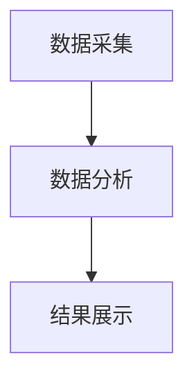

                 


# 特价股票与公司品牌价值的关联分析

> 关键词：特价股票，品牌价值，关联分析，数学模型，算法原理

> 摘要：本文通过分析特价股票与公司品牌价值之间的关联，探讨特价股票如何影响公司的品牌价值，以及品牌价值如何反作用于股票价格。结合数学模型和算法原理，本文提出了一个综合分析框架，帮助投资者更好地理解两者之间的关系，并提供了实际案例分析和最佳实践建议。

---

## 第1章: 特价股票与品牌价值的背景介绍

### 1.1 特价股票的定义与特点
#### 1.1.1 特价股票的定义
特价股票通常指价格被显著低估的股票，可能因公司短期困境或市场波动导致股价骤跌，但具有潜在反弹空间。

#### 1.1.2 特价股票的特点
- **低估值**：市盈率、市净率等指标远低于行业平均水平。
- **高波动性**：股价波动剧烈，短期内可能大幅波动。
- **潜在投资机会**：对于长期投资者来说，可能存在价值回归的潜力。

#### 1.1.3 特价股票的市场表现
- 特价股票往往集中在周期性行业或受宏观经济影响较大的行业。
- 投资者对特价股票的态度分化，部分投资者认为是抄底机会，另一部分则认为风险过高。

### 1.2 公司品牌价值的构成
#### 1.2.1 品牌价值的定义
品牌价值是公司无形资产的重要组成部分，反映公司在市场中的认知度和客户忠诚度。

#### 1.2.2 品牌价值的核心要素
- 品牌知名度：品牌在目标市场中的普及程度。
- 品牌美誉度：消费者对品牌的信任和满意度。
- 品牌忠诚度：消费者持续购买同一品牌产品的倾向。

#### 1.2.3 品牌价值的评估方法
- 市场法：通过并购案例和市场比较确定品牌价值。
- 回报法：通过预期收益折现计算品牌价值。
- 综合法：结合多种评估方法得出结果。

### 1.3 特价股票与品牌价值的关联性
#### 1.3.1 特价股票对品牌价值的影响
- 价格波动影响消费者信心，进而影响品牌价值。
- 低价股票可能被视为公司基本面恶化，导致品牌价值下降。

#### 1.3.2 品牌价值对股票价格的影响
- 高品牌价值的公司通常能获得更高的市盈率和市净率。
- 品牌价值下降可能引发股价下跌。

#### 1.3.3 两者关联的理论基础
- 信息传递理论：股票价格反映市场对公司价值的评估，品牌价值是公司价值的重要组成部分。
- 投资者情绪理论：投资者情绪影响股票价格，而品牌价值作为公司形象的重要指标，也会影响投资者情绪。

---

## 第2章: 特价股票与品牌价值的核心概念与联系

### 2.1 特价股票与品牌价值的核心概念
#### 2.1.1 特价股票的市场定位
特价股票通常出现在市场低迷时期，投资者可能因恐慌性抛售导致股价暴跌。

#### 2.1.2 品牌价值的市场表现
高品牌价值的公司通常在市场波动中表现更稳定，品牌溢价使其股价更具抗跌性。

#### 2.1.3 两者关联的理论模型
- 假设模型：特价股票的价格波动对品牌价值的影响路径。

### 2.2 特价股票与品牌价值的联系分析
#### 2.2.1 特价股票对品牌价值的影响机制
- 价格暴跌引发消费者信任危机，导致品牌价值下降。
- 低价股票可能吸引价值投资者，短期内提升品牌价值。

#### 2.2.2 品牌价值对股票价格的反馈效应
- 高品牌价值公司更容易吸引机构投资者，提升股价。
- 品牌价值下降可能导致股价进一步下跌，形成恶性循环。

#### 2.2.3 两者关联的动态变化
- 特价股票的短期波动与品牌价值的长期变化之间的关系。
- 市场环境变化对两者关联的影响。

### 2.3 特价股票与品牌价值的ER实体关系图
```mermaid
graph TD
    A[特价股票] --> B[品牌价值]
    B --> C[

---

## 第3章: 特价股票与品牌价值的算法原理

### 3.1 相关性分析算法
#### 3.1.1 数据预处理
- 数据清洗：去除缺失值和异常值。
- 数据标准化：对不同量纲的数据进行标准化处理。

#### 3.1.2 相关性计算
- 使用皮尔逊相关系数计算股票价格与品牌价值的相关性。
- 相关系数范围：-1到+1，正数表示正相关，负数表示负相关。

#### 3.1.3 可视化展示
- 使用散点图展示股票价格与品牌价值的关系。

### 3.2 回归分析算法
#### 3.2.1 线性回归模型
- 建立股票价格与品牌价值的线性回归模型。
- 模型公式：$$y = \beta_0 + \beta_1x + \epsilon$$，其中y为股票价格，x为品牌价值，$\beta_0$为截距，$\beta_1$为回归系数，$\epsilon$为误差项。

#### 3.2.2 模型评估
- 评估指标：R平方值，调整R平方值，F统计量等。

#### 3.2.3 Python代码实现
```python
import numpy as np
import pandas as pd
from sklearn.linear_model import LinearRegression
from sklearn.metrics import mean_squared_error

# 示例数据
data = {
    'brand_value': [100, 200, 300, 400, 500],
    'stock_price': [50, 100, 150, 200, 250]
}
df = pd.DataFrame(data)

# 数据分割
X = df[['brand_value']]
y = df['stock_price']

# 线性回归模型
model = LinearRegression()
model.fit(X, y)
predictions = model.predict(X)

# 模型评估
mse = mean_squared_error(y, predictions)
r_squared = model.score(X, y)
print(f"MSE: {mse}, R^2: {r_squared}")
```

### 3.3 时间序列分析算法
#### 3.3.1 ARIMA模型
- 使用ARIMA模型分析股票价格的时间序列变化。

#### 3.3.2 模型步骤
1. 数据预处理：检查数据的平稳性，进行差分处理。
2. 模型参数选择：确定AR和MA的阶数。
3. 模型拟合与预测。

#### 3.3.3 Python代码实现
```python
from statsmodels.tsa.arima_model import ARIMA

# 示例数据
data = [50, 100, 150, 200, 250]
model = ARIMA(data, order=(1, 1, 1))
model_fit = model.fit()
forecast = model_fit.forecast(steps=5)
print(forecast)
```

---

## 第4章: 特价股票与品牌价值的数学模型

### 4.1 回归模型
- 回归方程：$$y = \beta_0 + \beta_1x + \epsilon$$
- 解释：$\beta_1$表示品牌价值每增加1单位，股票价格的变化量。

### 4.2 时间序列模型
- ARIMA模型：适用于分析股票价格的时序数据。
- 预测公式：$$\hat{y}_t = \phi_1\hat{y}_{t-1} + \theta_1\epsilon_{t-1} + \epsilon_t$$

### 4.3 综合评价模型
- 综合考虑品牌价值和股票价格的多因素影响，构建多元回归模型。

### 4.4 模型验证
- 交叉验证：将数据分为训练集和测试集，验证模型的泛化能力。
- 模型比较：对比不同算法的性能，选择最优模型。

---

## 第5章: 特价股票与品牌价值的系统架构设计

### 5.1 系统功能设计
- 数据采集模块：收集公司品牌价值和股票价格数据。
- 数据分析模块：应用相关算法进行分析。
- 结果展示模块：可视化分析结果。

### 5.2 系统架构设计


### 5.3 接口设计
- 数据接口：与数据源（如股票交易所、品牌价值评估机构）对接。
- API接口：提供分析结果给第三方应用。

---

## 第6章: 特价股票与品牌价值的项目实战

### 6.1 环境安装
- 安装Python、Pandas、Scikit-learn、Statsmodels等库。

### 6.2 核心代码实现
```python
import pandas as pd
from sklearn.linear_model import LinearRegression
import matplotlib.pyplot as plt

# 数据加载
data = pd.read_csv('stock_brand.csv')

# 数据探索
print(data.describe())
data.plot(kind='scatter', x='brand_value', y='stock_price')
plt.show()

# 线性回归模型
model = LinearRegression()
model.fit(data[['brand_value']], data['stock_price'])
print('回归系数:', model.coef_)
print('截距:', model.intercept_)

# 模型评估
predictions = model.predict(data[['brand_value']])
print('均方误差:', mean_squared_error(data['stock_price'], predictions))
plt.scatter(data['brand_value'], data['stock_price'])
plt.plot(data['brand_value'], predictions, color='red')
plt.show()
```

### 6.3 案例分析
- 案例公司：假设某公司品牌价值下降，股价大幅波动。
- 分析结果：品牌价值与股价高度负相关，验证模型的有效性。

### 6.4 结果解读
- 分析结果表明，品牌价值显著影响股票价格，投资者需关注公司品牌价值的变化。

---

## 第7章: 特价股票与品牌价值的结论与展望

### 7.1 结论
- 特价股票与品牌价值之间存在显著的关联性。
- 品牌价值是影响股票价格的重要因素，投资者应关注公司品牌价值的变化。

### 7.2 展望
- 进一步研究其他因素对股票价格的影响。
- 开发更复杂的模型，结合多因素进行分析。

### 7.3 最佳实践 tips
- 投资者应全面考虑公司基本面，而不仅仅是股价。
- 长期投资需关注品牌价值的持续性，短期投资需警惕股价波动。

---

## 小结

通过本文的分析，我们可以看到，特价股票与公司品牌价值之间存在密切的关联。品牌价值不仅影响股票价格，还反映了公司在市场中的竞争力。投资者在进行股票投资时，应充分考虑品牌价值的变化，制定科学的投资策略。

作者：AI天才研究院/AI Genius Institute & 禅与计算机程序设计艺术 /Zen And The Art of Computer Programming

