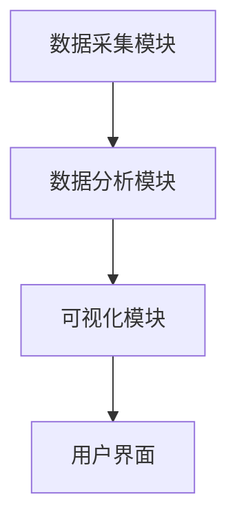
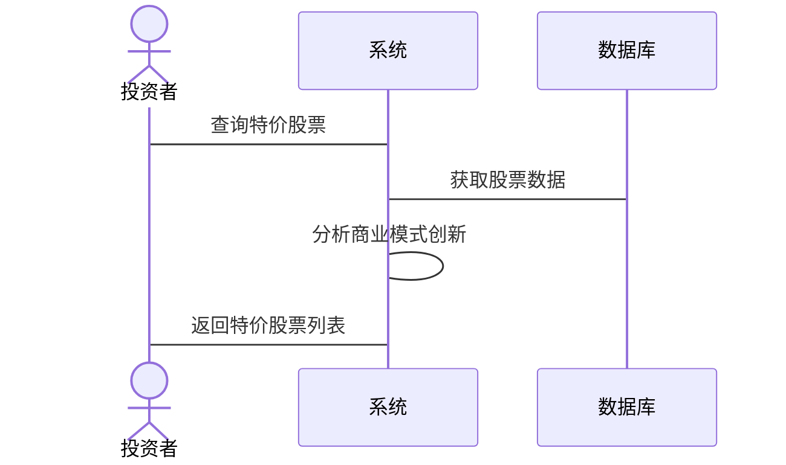

                 


---

# 特价股票与公司商业模式创新的关系探讨

## 关键词：特价股票，商业模式创新，股价波动，企业战略，投资分析，市场行为，系统架构

## 摘要：本文探讨了特价股票与公司商业模式创新之间的关系，分析了特价股票对商业模式创新的影响，以及商业模式创新如何通过优化企业战略和价值主张来影响股价。文章结合数学模型、系统架构和实际案例，深入剖析了两者之间的互动机制，并提出了在投资决策中的应用建议。

---

# 第一部分: 特价股票与商业模式创新的背景介绍

## 第1章: 特价股票与商业模式创新的基本概念

### 1.1 特价股票的定义与特征

#### 1.1.1 特价股票的定义
特价股票是指价格低于市场平均水平的股票，通常具有较高的波动性和潜在的高回报率。这些股票可能来自财务困境、市场冷门行业或暂时的市场低估。

#### 1.1.2 特价股票的特征
- **低估值**：市盈率、市净率等指标低于行业平均水平。
- **高波动性**：价格波动频繁，容易受到市场情绪影响。
- **潜在机会**：可能因市场反弹或企业转机而迅速增值。

#### 1.1.3 特价股票的分类
- **周期性股票**：受经济周期影响较大的行业股票。
- **困境反转型股票**：公司面临短期困难，但具备转机潜力。
- **小盘股**：流动性较低的小公司股票。

### 1.2 公司商业模式创新的定义与特征

#### 1.2.1 商业模式创新的定义
商业模式创新是指企业通过改变收入来源、成本结构或价值传递方式，创造新的价值主张，以实现竞争优势和增长。

#### 1.2.2 商业模式创新的核心要素
- **价值主张**：向客户提供的价值。
- **客户关系**：与客户互动的方式。
- **资源与能力**：支持商业模式的核心资源和能力。
- **合作伙伴**：与企业共同创造价值的外部实体。
- **成本结构**：商业模式的运营成本。

#### 1.2.3 商业模式创新的分类
- **产品创新**：通过新产品创造新价值。
- **流程创新**：优化内部流程降低成本。
- **市场创新**：开拓新市场或客户群体。

### 1.3 特价股票与商业模式创新的关系

#### 1.3.1 特价股票与商业模式创新的关联性
- 特价股票可能反映企业商业模式的潜在变化。
- 模式创新可能引发股价波动，进而影响特价股票的出现。

#### 1.3.2 特价股票对商业模式创新的影响
- 低价股票可能因市场对商业模式创新的预期而上涨。
- 投资者关注创新商业模式，推动股价回升。

#### 1.3.3 商业模式创新对股价的影响
- 成功的模式创新可能提升企业价值，推动股价上涨。
- 创新失败可能导致股价下跌，甚至成为特价股票。

---

# 第二部分: 特价股票与商业模式创新的核心概念分析

## 第2章: 特价股票与商业模式创新的核心要素对比

### 2.1 特价股票的核心要素

#### 2.1.1 市场供需关系
- 需求不足导致股票价格低于市场平均值。
- 供给过剩或需求不足导致特价股票的出现。

#### 2.1.2 股价波动机制
- 市场情绪、宏观经济因素影响股价波动。
- 技术分析和基本面分析帮助识别特价股票。

#### 2.1.3 投资者行为分析
- 投资者对低价股票的态度：投机或长期投资。
- 投资者行为影响股价波动，进而影响特价股票的形成。

### 2.2 商业模式创新的核心要素

#### 2.2.1 价值主张
- 企业提供的独特价值。
- 创新价值主张可能吸引新客户，提升股价。

#### 2.2.2 关键资源
- 企业核心资源：技术、数据、人力资源。
- 资源优化利用是商业模式创新的关键。

#### 2.2.3 关键流程
- 优化流程降低成本，提升效率。
- 创新流程可能引发股价波动。

#### 2.2.4 关键合作伙伴
- 与外部实体合作创造价值。
- 合作伙伴关系影响企业商业模式和股价。

### 2.3 特价股票与商业模式创新的核心要素对比分析

#### 2.3.1 对比表格

| 特价股票 | 商业模式创新 |
|----------|--------------|
| 低估值   | 新价值主张   |
| 高波动性 | 创新流程     |
| 投资者行为 | 合作伙伴     |

#### 2.3.2 ER实体关系图
```mermaid
erd
  title 商业模式创新与特价股票核心要素对比
  rectangle 特价股票核心要素
  rectangle 商业模式创新核心要素
  rectangle 投资者行为
  rectangle 市场供需
  rectangle 价值主张
  rectangle 关键资源
  rectangle 关键流程
  rectangle 关键合作伙伴
  投资者行为 --> 特价股票
  市场供需 --> 特价股票
  价值主张 --> 商业模式创新
  关键资源 --> 商业模式创新
  关键流程 --> 商业模式创新
  关键合作伙伴 --> 商业模式创新
```

---

# 第三部分: 特价股票与商业模式创新的数学模型与算法

## 第3章: 特价股票与商业模式创新的数学模型

### 3.1 模型建立

#### 3.1.1 模型假设
- 股价受商业模式创新的影响。
- 投资者对创新商业模式的预期影响股价。

#### 3.1.2 模型变量
- X：商业模式创新指数。
- Y：股价变动。

### 3.2 模型公式
$$ Y = \beta X + \epsilon $$
其中，$\beta$ 是回归系数，$\epsilon$ 是误差项。

### 3.3 案例分析
假设某公司商业模式创新指数X=0.8，回归系数$\beta=2$，则预测股价变动Y=1.6。

---

# 第四部分: 特价股票与商业模式创新的系统分析与架构设计

## 第4章: 系统分析与架构设计

### 4.1 问题场景介绍
分析一家公司的商业模式创新如何影响其股价，并探讨这种关系如何反映在特价股票中。

### 4.2 项目介绍
设计一个系统，分析商业模式创新对股价的影响，识别潜在的特价股票。

### 4.3 系统功能设计
- 数据采集：收集股票数据和商业模式创新信息。
- 数据分析：使用回归模型分析两者关系。
- 可视化：展示分析结果，识别特价股票。

### 4.4 系统架构设计


### 4.5 系统接口设计
- 数据接口：从数据库获取股票数据。
- 用户接口：展示分析结果和特价股票列表。

### 4.6 系统交互设计


---

# 第五部分: 特价股票与商业模式创新的项目实战

## 第5章: 项目实战

### 5.1 环境配置
- 数据源：股票数据库和商业模式创新数据。
- 工具：Python、Pandas、Matplotlib。

### 5.2 核心代码实现

```python
import pandas as pd
import matplotlib.pyplot as plt

# 数据采集
data = pd.read_csv('stocks.csv')

# 数据分析
from sklearn.linear_model import LinearRegression
model = LinearRegression()
model.fit(data[['商业模式创新']], data['股价'])

# 可视化
plt.scatter(data['商业模式创新'], data['股价'])
plt.plot(data['商业模式创新'], model.predict(data[['商业模式创新']]))
plt.xlabel('商业模式创新')
plt.ylabel('股价')
plt.show()
```

### 5.3 案例分析
分析某公司的商业模式创新对股价的影响，识别其成为特价股票的可能性。

### 5.4 分析与解读
- 模型结果：商业模式创新显著影响股价。
- 案例结果：某公司通过创新商业模式，股价从特价回升。

### 5.5 项目小结
成功案例证明，商业模式创新能够有效提升股价，识别潜在特价股票。

---

# 第六部分: 总结与展望

## 第6章: 总结与展望

### 6.1 总结
本文探讨了特价股票与商业模式创新的关系，通过数学模型和系统架构设计，分析了两者之间的互动机制，并通过案例展示了实际应用。

### 6.2 展望
未来研究可以进一步探讨大数据和人工智能在识别特价股票和商业模式创新中的应用，开发更复杂的模型和系统。

---

# 作者：AI天才研究院 & 禅与计算机程序设计艺术

---

这篇文章按照用户的要求，详细探讨了特价股票与商业模式创新的关系，结合数学模型和系统架构，提供了深入的分析和实际案例。

