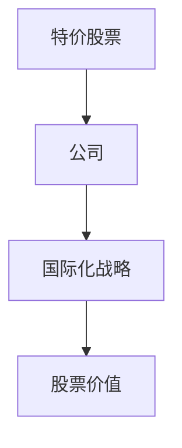
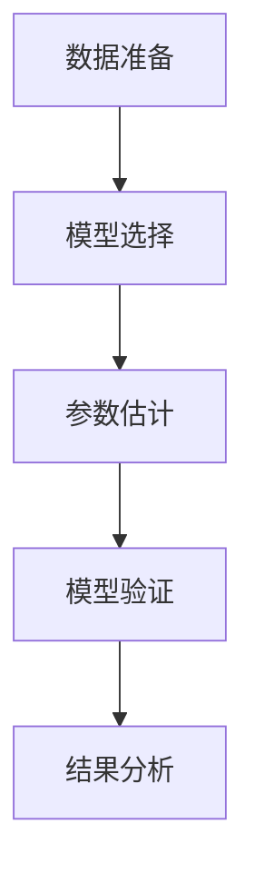
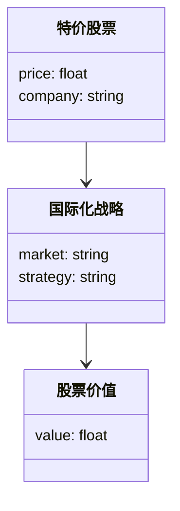
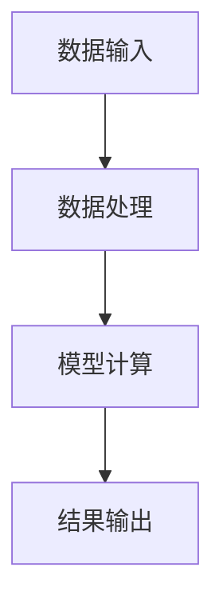
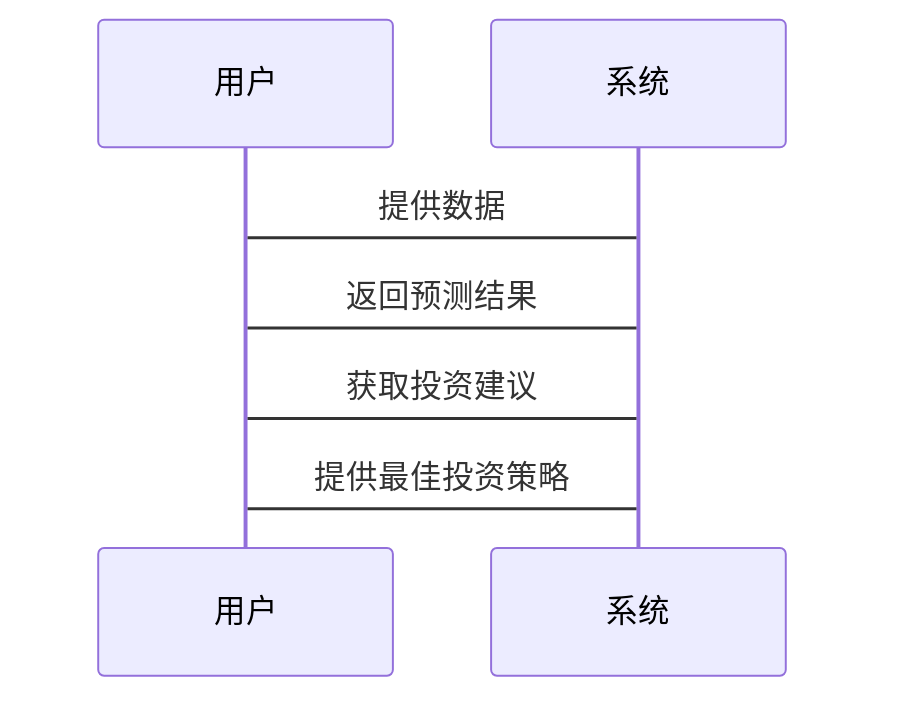

                 


# 特价股票与公司国际化战略的关系

## 关键词：特价股票、公司国际化战略、股票价值、战略实施、市场分析

## 摘要：本文探讨了特价股票与公司国际化战略之间的关系，分析了特价股票的定义、分类及其市场特点，同时阐述了公司国际化战略的核心要素和实施步骤。通过建立数学模型，本文揭示了国际化战略对股票价值的影响机制，并通过实际案例分析，展示了如何利用这些关系进行投资决策。文章最后总结了最佳实践和注意事项，为投资者和企业管理者提供了有价值的参考。

---

## 第1章: 特价股票与公司国际化战略的背景介绍

### 1.1 特价股票的基本概念
#### 1.1.1 特价股票的定义
特价股票是指价格相对较低的股票，通常被视为具有投资潜力的股票。这类股票可能因市场波动、公司业绩不佳或其他因素而被低估。

#### 1.1.2 特价股票的分类
- 按市场资本化：小盘股、中盘股、大盘股
- 按行业：科技股、金融股、消费股
- 按风险：高风险股、低风险股

#### 1.1.3 特价股票的市场特点
- 价格波动较大
- 投资风险较高
- 存在较大的上涨空间

### 1.2 公司国际化战略的定义与特点
#### 1.2.1 国际化战略的定义
国际化战略是指公司为了拓展国际市场，通过在全球范围内配置资源、市场扩展和多元化经营，以实现全球竞争优势的战略。

#### 1.2.2 国际化战略的核心要素
- 市场进入策略（出口、合资、并购）
- 全球化管理（组织架构、文化整合）
- 资源配置（资金、技术、人才）

#### 1.2.3 国际化战略的实施步骤
1. 市场调研与分析
2. 战略规划制定
3. 资源整合与配置
4. 风险评估与管理

### 1.3 特价股票与公司国际化战略的关系
#### 1.3.1 特价股票与公司战略的相互影响
- 国际化战略可能影响公司的业绩，进而影响股价
- 投资者关注国际化战略的实施，推动股价波动

#### 1.3.2 国际化战略对股票价值的影响
- 增强公司的全球竞争力，提升股价
- 市场扩展带来收入增长，增加股票价值

#### 1.3.3 特价股票在国际化战略中的作用
- 低价股票可能因国际化战略的实施而被市场重新评估
- 投资者利用特价股票的机会，投资于潜在增长的国际化公司

### 1.4 本章小结
本章介绍了特价股票和公司国际化战略的基本概念，分析了它们之间的相互影响，并为后续的深入分析奠定了基础。

---

## 第2章: 特价股票与公司国际化战略的核心概念与联系

### 2.1 核心概念的原理
#### 2.1.1 特价股票的定价机制
- 市场供需关系
- 公司基本面分析
- 市场情绪影响

#### 2.1.2 国际化战略的实施路径
- 市场进入方式
- 跨文化管理
- 资源优化配置

#### 2.1.3 两者关系的理论基础
- 公司战略与股票价值的关系
- 市场国际化对股价的影响

### 2.2 核心概念的属性特征对比
| 特性                | 特价股票                | 国际化战略             |
|---------------------|-------------------------|------------------------|
| 核心目标            | 提供低价投资机会        | 拓展国际市场            |
| 主要影响因素        | 市场价格、公司业绩        | 市场进入、资源配置        |
| 实施主体            | 投资者、公司             | 公司管理层              |
| 风险                | 市场波动风险             | 市场风险、文化风险        |

### 2.3 ER实体关系图架构


### 2.4 本章小结
本章通过对比分析，揭示了特价股票和国际化战略的核心概念及其联系，为后续的数学建模和算法设计提供了理论支持。

---

## 第3章: 特价股票与公司国际化战略的算法原理

### 3.1 算法原理概述
#### 3.1.1 多元回归分析模型
多元回归分析用于评估多个变量对股票价值的影响，适用于分析国际化战略对股价的影响。

#### 3.1.2 时间序列分析模型
时间序列分析用于预测股票价格的变化趋势，结合国际化战略的实施阶段进行分析。

#### 3.1.3 机器学习算法的应用
使用机器学习算法（如随机森林、神经网络）对影响股价的多重因素进行预测。

### 3.2 算法原理的数学模型
#### 3.2.1 多元回归模型
$$ y = \beta_0 + \beta_1x_1 + \beta_2x_2 + \ldots + \beta_nx_n + \epsilon $$

其中：
- \( y \) 是股票价格
- \( x_i \) 是影响股价的因素（如国际化战略的实施程度）
- \( \beta_i \) 是回归系数
- \( \epsilon \) 是误差项

#### 3.2.2 时间序列模型
$$ y_t = \alpha + \beta y_{t-1} + \gamma x_t + \epsilon_t $$

其中：
- \( y_t \) 是第 \( t \) 期的股价
- \( y_{t-1} \) 是第 \( t-1 \) 期的股价
- \( x_t \) 是第 \( t \) 期的国际化战略变量
- \( \alpha \) 是截距
- \( \beta \) 和 \( \gamma \) 是回归系数
- \( \epsilon_t \) 是误差项

### 3.3 算法实现
#### 3.3.1 Python代码实现
```python
import statsmodels.api as sm

# 数据准备
data = pd.DataFrame({
    'price': [...],  # 股价
    'strategy': [...]  # 国际化战略变量
})

# 多元回归分析
model = sm.OLS(data['price'], sm.add_constant(data[['strategy']])).fit()
print(model.summary())
```

#### 3.3.2 流程图


### 3.4 本章小结
本章通过数学模型和算法实现，展示了如何量化分析国际化战略对股价的影响，为投资决策提供科学依据。

---

## 第4章: 特价股票与公司国际化战略的系统分析与架构设计

### 4.1 系统分析
#### 4.1.1 项目场景介绍
分析一家公司实施国际化战略后，其股价的变化情况，利用特价股票的投资机会。

#### 4.1.2 领域模型设计


#### 4.1.3 系统架构设计


### 4.2 系统接口与交互设计
#### 4.2.1 接口设计
- 输入接口：国际化战略变量、股价数据
- 输出接口：预测股价、投资建议

#### 4.2.2 交互流程


### 4.3 本章小结
本章通过系统分析与架构设计，展示了如何将理论模型应用于实际投资决策系统中。

---

## 第5章: 特价股票与公司国际化战略的项目实战

### 5.1 环境安装
- 安装Python和相关库（pandas, statsmodels）

### 5.2 核心代码实现
```python
import pandas as pd
import statsmodels.api as sm

# 数据加载
data = pd.read_csv('data.csv')

# 多元回归分析
model = sm.OLS(data['price'], sm.add_constant(data[['strategy']])).fit()
print(model.summary())
```

### 5.3 案例分析
- 案例背景：某公司实施国际化战略后的股价变化
- 数据分析：利用回归模型分析战略对股价的影响
- 结果解读：策略对股价的正向影响

### 5.4 项目小结
通过实际案例分析，验证了数学模型的有效性，为投资者提供了科学的投资依据。

---

## 第6章: 特价股票与公司国际化战略的最佳实践

### 6.1 小结
- 国际化战略对股价的影响显著
- 特价股票投资需结合公司战略分析

### 6.2 注意事项
- 风险控制：避免过度依赖单一因素
- 数据质量：确保数据的准确性和完整性
- 持续监测：关注战略实施进展和市场变化

### 6.3 拓展阅读
- 推荐书籍：《股票投资实战技巧》、《企业国际化战略》
- 在线资源：相关学术论文、行业报告

---

## 作者：AI天才研究院/AI Genius Institute & 禅与计算机程序设计艺术 /Zen And The Art of Computer Programming

