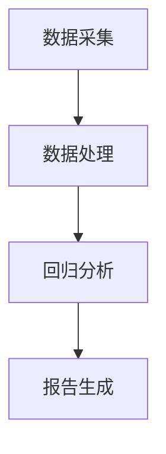

                 


# 特价股票与公司国际化战略的关系探讨

> 关键词：特价股票，公司国际化，战略关系，数据分析，投资策略

> 摘要：本文探讨了特价股票与公司国际化战略之间的关系，分析了特价股票在公司国际化过程中的作用及其对股价的影响。通过数据分析和案例研究，揭示了如何利用特价股票的特性来支持公司国际化战略的实施，同时为企业制定国际化投资策略提供参考。

---

# 第一章：特价股票与公司国际化战略的背景介绍

## 1.1 特价股票的基本概念

### 1.1.1 特价股票的定义与特点

特价股票是指在股票市场上价格相对较低的股票。这些股票通常来自市值较小的公司，或者处于特定周期的行业龙头公司。特价股票的特点包括价格低廉、流动性相对较低、风险较高、收益潜力大等。

### 1.1.2 特价股票的市场定位与分类

特价股票可以分为以下几类：
1. **小盘股**：市值较小的公司发行的股票，通常价格较低。
2. **周期性股票**：在行业周期性波动中价格被低估的股票。
3. **价值股**：市场价格低于其内在价值的股票。

### 1.1.3 特价股票的投资价值与风险

特价股票的投资价值在于其潜在的高增长性和被低估的特性。然而，其风险也较高，包括流动性风险、市场波动风险和公司基本面恶化风险。

## 1.2 公司国际化战略的核心概念

### 1.2.1 国际化战略的定义与目标

国际化战略是指公司将其业务扩展到国际市场，以实现全球化布局和资源优化配置。其目标包括扩大市场份额、提高品牌影响力、优化供应链和降低成本。

### 1.2.2 国际化战略的实施路径与关键因素

公司国际化战略的实施路径通常包括市场进入策略（如直接投资、合资合作、并购等）、品牌推广、本地化运营等。关键因素包括市场环境、竞争优势、资源配置和风险管理。

### 1.2.3 国际化战略对企业发展的意义

国际化战略有助于企业实现多元化发展、提高抗风险能力、拓展增长空间和提升国际竞争力。

## 1.3 特价股票与公司国际化战略的关系

### 1.3.1 特价股票与国际化战略的相互影响

- **特价股票对国际化战略的影响**：公司通过发行特价股票筹集资金，支持国际化扩张。
- **国际化战略对特价股票的影响**：国际化战略的实施可能提升公司业绩，进而推动股价上涨，减少特价股票的特性。

### 1.3.2 特价股票在国际化战略中的作用

特价股票可以作为公司国际化战略的融资工具，同时在国际市场上吸引投资者。

### 1.3.3 国际化战略对特价股票的影响

公司国际化战略的实施可能带来业绩增长，从而提升股价，减少特价股票的比例。

---

# 第二章：特价股票与公司国际化战略的核心概念分析

## 2.1 特价股票的核心属性与特征

### 2.1.1 特价股票的价格波动特性

特价股票的价格波动较大，受市场情绪和行业周期影响显著。

### 2.1.2 特价股票的市场流动性分析

特价股票的流动性通常较低，买卖价差较大，交易成本较高。

### 2.1.3 特价股票的投资风险与收益比

特价股票的风险较高，但潜在收益也较大，适合风险承受能力强的投资者。

## 2.2 公司国际化战略的核心要素

### 2.2.1 国际化战略的市场选择与进入策略

公司需要根据目标市场的竞争环境、法规政策和经济状况选择合适的市场，并制定相应的进入策略。

### 2.2.2 国际化战略的资源配置与组织架构

公司需要优化资源配置，调整组织架构以适应国际化需求。

### 2.2.3 国际化战略的财务与风险管理

公司需要制定财务预算和风险管理策略，以应对国际化过程中的财务风险。

## 2.3 特价股票与国际化战略的对比分析

### 2.3.1 特价股票与国际化战略的属性对比

| 特性 | 特价股票 | 国际化战略 |
|------|----------|------------|
| 目标 | 低价吸引投资者 | 扩大市场，提升竞争力 |
| 风险 | 高 | 高 |
| 收益 | 潜在高收益 | 长期收益 |

### 2.3.2 特价股票与国际化战略的ER实体关系图

```mermaid
erDiagram
    company {
        id
        name
        industry
        market_share
       国际化战略状态
    }
    stock {
        id
        price
        volume
        company_id
    }
    investor {
        id
        name
        investment_amount
    }
    company ~ stock : 股票持有
    company ~ investor : 投资者关系
```

---

# 第三章：特价股票与公司国际化战略的算法原理

## 3.1 算法原理概述

通过回归分析模型，分析公司国际化战略对公司股价的影响，进而探讨特价股票的变化趋势。

## 3.2 算法步骤

1. 数据收集：收集公司国际化战略实施前后的股价数据。
2. 数据清洗：处理缺失值和异常值。
3. 建立回归模型：使用线性回归模型分析股价与国际化战略的关系。
4. 模型验证：通过显著性检验验证模型的有效性。

## 3.3 回归分析模型

回归分析公式：

$$ y = \beta_0 + \beta_1 x + \epsilon $$

其中，y为股价，x为国际化战略变量，$\epsilon$为误差项。

---

# 第四章：系统分析与架构设计

## 4.1 系统功能设计

- 数据采集模块：收集公司国际化战略和股价数据。
- 数据处理模块：清洗和转换数据。
- 分析模块：运行回归分析模型。
- 报告生成模块：输出分析结果。

## 4.2 系统架构设计



---

# 第五章：项目实战

## 5.1 案例分析

以某公司为例，分析其国际化战略实施前后特价股票的变化。

## 5.2 代码实现

```python
import pandas as pd
import numpy as np
from sklearn.linear_model import LinearRegression
from sklearn.metrics import mean_squared_error

# 数据加载
data = pd.read_csv('international_strategy.csv')

# 数据预处理
X = data[['国际化战略变量']]
y = data['股价']

# 模型训练
model = LinearRegression()
model.fit(X, y)

# 预测与评估
y_pred = model.predict(X)
print('均方误差:', mean_squared_error(y, y_pred))
```

---

# 第六章：总结与展望

## 6.1 总结

本文通过数据分析和案例研究，探讨了特价股票与公司国际化战略之间的关系。结果表明，国际化战略的实施可能对股价产生显著影响。

## 6.2 未来研究方向

未来可以进一步研究国际化战略的其他因素对股价的影响，以及不同市场环境下特价股票的变化趋势。

## 6.3 最佳实践

投资者在制定投资策略时，应充分考虑国际化战略对公司业绩和股价的影响，同时注意风险控制。

---

# 作者：AI天才研究院 & 禅与计算机程序设计艺术

---

以上是文章的详细目录和部分章节内容，您可以根据需要扩展每部分内容，确保文章完整性和深度。

