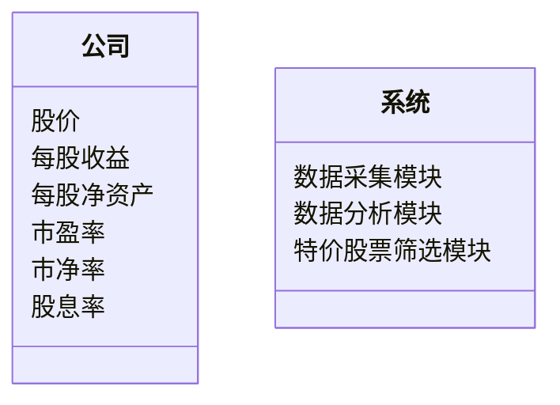

                 


# 特价股票与公司基本面分析的结合

> 关键词：特价股票，公司基本面，投资策略，股票筛选，财务分析

> 摘要：本文将探讨如何将特价股票与公司基本面分析相结合，以帮助投资者做出更明智的投资决策。通过分析公司的财务状况和市场价值，我们可以识别出那些被市场低估的股票，从而捕捉潜在的投资机会。

---

# 第一部分: 背景介绍

## 第1章: 特价股票概述

### 1.1 特价股票的定义与特点
#### 1.1.1 特价股票的定义
特价股票是指市场价格显著低于其内在价值的股票。这些股票通常被视为被市场低估，具有较大的增值潜力。

#### 1.1.2 特价股票的特点
- **低估值**：市场价格低于公司的净资产价值或未来盈利能力的合理估值。
- **高波动性**：价格波动较大，可能因市场情绪或短期因素被低估。
- **潜在回报高**：一旦市场重新评估其价值，股价可能迅速上涨。

#### 1.1.3 特价股票的分类
- **周期性股票**：受经济周期影响较大的行业（如制造业、能源）。
- **成长型股票**：未来盈利增长潜力大，但当前估值被低估。
- **价值型股票**：低市盈率、低市净率，通常为传统行业公司。

### 1.2 特价股票的形成原因
#### 1.2.1 市场周期性波动
经济周期波动导致市场情绪变化，某些优质股票可能因市场恐慌被错杀。

#### 1.2.2 市场情绪影响
投资者情绪过度悲观时，优质股票可能被抛售，导致价格低于内在价值。

#### 1.2.3 公司基本面变化
公司内部问题（如管理不善、诉讼纠纷）可能导致股价被低估。

### 1.3 特价股票的投资价值
#### 1.3.1 特价股票的投资机会
- 低价买入，高价卖出。
- 潜在的高回报率。

#### 1.3.2 特价股票的风险分析
- 市场波动风险：股价可能继续下跌。
- 基本面恶化风险：公司问题可能进一步加剧。

#### 1.3.3 特价股票的长期投资价值
长期来看，基本面良好的特价股票可能因市场重新评估而上涨。

---

## 第2章: 公司基本面分析基础

### 2.1 公司基本面分析的定义
公司基本面分析是通过对公司财务状况、盈利能力、成长能力和行业地位等多方面进行研究，评估其内在价值的过程。

### 2.2 公司基本面分析的核心指标
#### 2.2.1 财务指标分析
- **市盈率（P/E）**：股价与每股收益的比率，衡量股票价格是否合理。
- **市净率（P/B）**：股价与每股净资产的比率，反映股价相对于资产价值的高低。
- **股息率**：每股股息与股价的比率，衡量分红收益。

#### 2.2.2 盈利能力分析
- **净利润率**：净利润与收入的比率，反映公司盈利能力。
- **毛利率**：毛利与收入的比率，衡量产品或服务的盈利能力。

#### 2.2.3 偿债能力分析
- **资产负债率**：负债与资产的比率，反映公司财务杠杆和风险。
- **流动比率**：流动资产与流动负债的比率，衡量公司短期偿债能力。

### 2.3 公司基本面分析的方法
#### 2.3.1 财务报表分析
分析资产负债表、利润表和现金流量表，评估公司财务健康状况。

#### 2.3.2 行业分析
研究行业发展趋势、竞争格局和市场容量，判断公司所处的行业环境。

#### 2.3.3 竞争分析
评估公司在行业中的竞争优势，如成本优势、品牌影响力等。

---

## 第3章: 特价股票与公司基本面分析的结合

### 3.1 特价股票与公司基本面的关系
#### 3.1.1 特价股票的内在价值
公司基本面决定其内在价值，而市场价格围绕内在价值波动。

#### 3.1.2 特价股票的筛选标准
- **低市盈率**：P/E低于行业平均水平。
- **低市净率**：P/B低于行业平均水平。
- **高股息率**：股息率高于行业平均水平。

#### 3.1.3 特价股票的长期投资策略
选择基本面良好且价格被低估的股票进行长期投资，耐心等待市场重新评估。

---

# 第二部分: 核心概念与联系

## 第4章: 特价股票与公司基本面分析的核心概念

### 4.1 特价股票的核心概念
- **内在价值**：公司未来现金流的现值。
- **市场价值**：当前市场价格。

### 4.2 公司基本面分析的核心概念
- **财务健康状况**：通过财务报表分析公司盈利能力、偿债能力和成长能力。
- **行业地位**：公司在行业中的竞争力和市场份额。

### 4.3 特价股票与公司基本面分析的联系
#### 4.3.1 股价与内在价值的关系
- 当股价低于内在价值时，股票具有投资价值。
- 当股价高于内在价值时，股票被高估，需谨慎投资。

#### 4.3.2 市场情绪与基本面的关系
- 市场情绪过度悲观可能导致股价低于内在价值。
- 市场情绪乐观可能导致股价高于内在价值。

---

# 第三部分: 算法原理讲解

## 第5章: 特价股票筛选算法

### 5.1 算法概述
通过筛选低市盈率、低市净率和高股息率的股票，识别出具有投资价值的特价股票。

### 5.2 算法流程
1. 数据收集：获取目标行业的公司股价、财务数据。
2. 数据预处理：清洗数据，处理缺失值和异常值。
3. 特征提取：计算市盈率、市净率和股息率等指标。
4. 模型训练：使用回归模型预测股票的内在价值。
5. 特价股票筛选：对比市场价格与预测的内在价值，找出被低估的股票。

### 5.3 算法实现
#### 5.3.1 数据预处理
```python
import pandas as pd
import numpy as np

# 示例数据
data = {'公司': ['A', 'B', 'C'],
         '股价': [10, 20, 15],
         '每股收益': [2, 3, 2.5],
         '每股净资产': [5, 10, 7]}
df = pd.DataFrame(data)
```

#### 5.3.2 特征提取
```python
df['市盈率'] = df['股价'] / df['每股收益']
df['市净率'] = df['股价'] / df['每股净资产']
df['股息率'] = (df['每股收益'] * 0.5) / df['股价']  # 假设股息率为净利润的一半
```

#### 5.3.3 模型训练
使用线性回归模型预测内在价值：
$$ \text{内在价值} = \beta_0 + \beta_1 \times \text{市盈率} + \beta_2 \times \text{市净率} $$

#### 5.3.4 特价股票筛选
$$ \text{投资价值} = \text{内在价值} - \text{股价} $$
当投资价值为正时，股票具有投资价值。

---

# 第四部分: 系统分析与架构设计

## 第6章: 特价股票筛选系统

### 6.1 项目介绍
开发一个基于基本面分析的特价股票筛选系统，帮助投资者快速识别具有投资价值的股票。

### 6.2 系统功能设计
#### 6.2.1 领域模型


#### 6.2.2 系统架构


---

# 第五部分: 项目实战

## 第7章: 系统实现与案例分析

### 7.1 环境安装
安装Python和相关库：
```bash
pip install pandas numpy matplotlib
```

### 7.2 核心代码实现
#### 7.2.1 数据预处理
```python
import pandas as pd
import numpy as np

# 读取数据
data = pd.read_csv('stock_data.csv')

# 删除缺失值
data = data.dropna()

# 填充异常值
data['股价'].replace([np.inf, -np.inf], np.nan, inplace=True)
data = data.dropna()
```

#### 7.2.2 模型训练
```python
from sklearn.linear_model import LinearRegression

# 训练模型
model = LinearRegression()
model.fit(X, y)
```

#### 7.2.3 特价股票筛选
```python
# 预测内在价值
predicted_value = model.predict(X_test)

# 计算投资价值
investment_value = predicted_value - y_test

# 筛选投资价值为正的股票
selected_stocks = investment_value[investment_value > 0].index
```

### 7.3 案例分析
以具体行业为例，分析如何通过系统筛选出具有投资价值的特价股票，并解读结果。

---

# 第六部分: 最佳实践与小结

## 第8章: 投资策略与注意事项

### 8.1 投资策略
- **价值投资**：选择基本面良好且价格被低估的股票长期持有。
- **分散投资**：避免过度集中，降低投资风险。

### 8.2 注意事项
- **市场风险**：股价可能继续下跌，需做好风险控制。
- **信息滞后**：数据可能存在滞后，需及时更新。
- **行业选择**：不同行业的股票具有不同的风险和收益特征。

### 8.3 拓展阅读
建议进一步阅读投资学经典书籍，如《投资学原理》和《股票投资实战》。

---

# 作者：AI天才研究院/AI Genius Institute & 禅与计算机程序设计艺术 /Zen And The Art of Computer Programming

