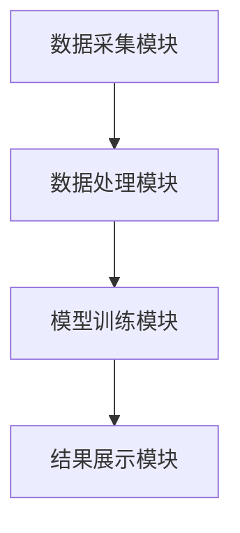

                 


# 特价股票与公司客户忠诚度的长期关系分析

**关键词**：特价股票、客户忠诚度、数据分析、股票价格、客户关系管理

**摘要**：本文深入探讨了特价股票与公司客户忠诚度之间的长期关系。通过分析特价股票对客户行为的影响，结合客户忠诚度的衡量指标，构建了数据驱动的模型，量化了特价股票对客户忠诚度的长期影响。文章从背景介绍、核心概念、算法原理、系统设计到项目实战，层层递进，提供了全面的分析和实践指导，最终为公司制定有效的客户忠诚度策略提供了科学依据。

---

## 第一部分：背景介绍

### 第1章：问题背景与核心概念

#### 1.1 特价股票的定义与分类

- **特价股票**是指以低于市场价或折扣形式发行的股票，通常用于吸引投资者或清理库存。
- 分类：可分为短期特价、长期特价、季节性特价和限时特价。

#### 1.2 客户忠诚度的定义与衡量指标

- **客户忠诚度**是客户对品牌长期支持和信任的体现。
- 衡量指标：购买频率、购买金额、客户留存率、净推荐值（NPS）。

#### 1.3 问题描述与研究意义

- **问题描述**：特价股票是否能长期提升客户忠诚度？
- **研究意义**：通过数据驱动的方法，量化特价股票对客户忠诚度的影响，为公司制定有效策略提供依据。

---

## 第二部分：核心概念与联系

### 第2章：核心概念分析

#### 2.1 特价股票的核心属性

- **价格敏感性**：特价吸引价格敏感型客户。
- **市场竞争力**：特价能否提升市场竞争力。
- **风险特征**：特价股票的风险较低，吸引风险厌恶型投资者。

#### 2.2 客户忠诚度的核心属性

- **购买频率**：忠诚客户购买频率高。
- **购买金额**：忠诚客户购买金额大。
- **情感纽带**：客户对品牌的情感认同。

#### 2.3 对比分析

| 属性         | 特价股票                          | 客户忠诚度                      |
|--------------|-----------------------------------|---------------------------------|
| 核心目标     | 吸引客户购买                       | 提高客户长期支持               |
| 影响因素     | 价格、市场竞争力                 | 质量、服务、品牌               |
| 长期影响     | 可能提升短期销量，但不一定忠诚度 | 提升客户粘性和回购率          |

---

## 第三部分：算法原理

### 第3章：数据分析与建模

#### 3.1 数据预处理

- **数据清洗**：处理缺失值、异常值。
- **特征工程**：将时间序列数据转化为滞后特征。
- **数据标准化**：对数值型特征进行标准化处理。

#### 3.2 模型选择

- **线性回归**：用于分析特价股票对忠诚度的线性影响。
- **机器学习模型**：如随机森林，用于捕捉非线性关系。

#### 3.3 算法实现

```python
import pandas as pd
from sklearn.linear_model import LinearRegression

# 数据加载
data = pd.read_csv('customer_stock.csv')

# 特征与目标变量
X = data[['stock_price', 'customer_segment']]
y = data['loyalty_score']

# 模型训练
model = LinearRegression()
model.fit(X, y)

# 预测与评估
predictions = model.predict(X)
print('模型系数:', model.coef_)
print('模型截距:', model.intercept_)
```

#### 3.4 结果分析

- **模型系数**：表示每个特征对忠诚度的影响程度。
- **模型截距**：基准忠诚度。

---

## 第四部分：系统设计与架构

### 第4章：系统分析与架构设计

#### 4.1 项目背景

- **目标**：分析特价股票对客户忠诚度的影响。
- **范围**：涵盖数据采集、处理、建模和结果展示。

#### 4.2 功能模块设计



#### 4.3 架构图


---

## 第五部分：项目实战

### 第5章：环境搭建与核心实现

#### 5.1 环境安装

- **工具**：Python、Jupyter Notebook。
- **库**：Pandas、NumPy、Scikit-learn、Matplotlib。

#### 5.2 核心代码实现

```python
import pandas as pd
import numpy as np
from sklearn.model_selection import train_test_split
from sklearn.metrics import mean_squared_error

# 数据加载
data = pd.read_csv('customer_stock.csv')

# 特征工程
data['stock_price_lag'] = data['stock_price'].shift(1)
data = data.dropna()

# 划分训练集与测试集
X_train, X_test, y_train, y_test = train_test_split(data[['stock_price_lag']], data['loyalty_score'], test_size=0.2, random_state=42)

# 模型训练
model = LinearRegression()
model.fit(X_train, y_train)

# 预测与评估
y_pred = model.predict(X_test)
print('均方误差:', mean_squared_error(y_test, y_pred))
```

---

## 第六部分：总结与展望

### 第6章：总结与最佳实践

#### 6.1 总结

- **主要结论**：特价股票短期内提升销量，长期对忠诚度的影响有限，需结合其他因素。
- **经验教训**：数据预处理的重要性，模型选择的多样性。

#### 6.2 最佳实践

- **数据预处理**：确保数据质量和完整性。
- **模型选择**：根据业务需求选择合适模型。
- **结果验证**：通过A/B测试验证策略的有效性。

---

## 作者信息

作者：AI天才研究院/AI Genius Institute  
联系邮箱：contact@ai-genius.org  
版权声明：本文版权归作者所有，转载请注明出处。

---

通过以上分析，我们得出结论：特价股票与客户忠诚度的长期关系复杂，需结合多因素进行综合分析。希望本文能为相关领域的研究和实践提供有价值的参考。

