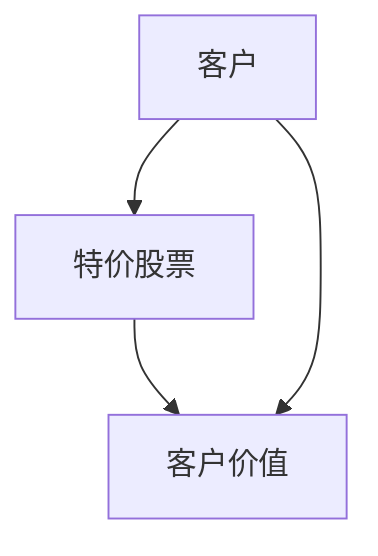
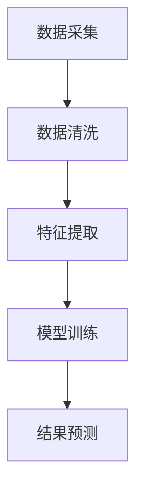
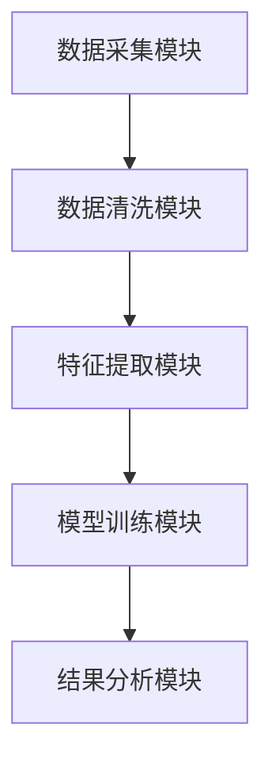

                 


# 特价股票与公司客户终身价值的长期关系分析

> 关键词：特价股票，公司客户，终身价值，长期关系，股票定价，客户价值，股票投资

> 摘要：本文分析了特价股票与公司客户终身价值之间的长期关系，探讨了特价股票如何影响客户价值，并通过数学模型和实际案例展示了这种关系的复杂性和重要性。文章从背景介绍、核心概念、算法原理、系统设计、项目实战等多个方面进行详细分析，为读者提供了全面的理解和应用指导。

---

## 第1章: 特价股票与公司客户终身价值的概述

### 1.1 特价股票的定义与特点
特价股票是指在特定时期内以低于市场价出售的股票，通常用于促销或清理库存。其特点包括价格敏感性高、风险承受能力强、长期收益潜力大等。与普通股票相比，特价股票更具吸引力，但风险也相对较高。

### 1.2 公司客户终身价值的定义与影响因素
客户终身价值（Customer Lifetime Value, CLV）是指客户在企业生命周期内为企业带来的总收入减去相关成本的净现值。影响因素包括客户购买频率、每次购买的平均价值、客户生命周期长度等。计算CLV的公式为：
$$ CLV = \frac{R - C}{1 - \delta} $$
其中，$R$是客户收入，$C$是客户获取成本，$\delta$是客户流失率。

### 1.3 特价股票与公司客户终身价值的关联性
特价股票通过降低购买门槛吸引客户，从而提升客户忠诚度和长期价值。特价股票的价格敏感性与客户的购买决策密切相关，长期来看，特价股票能够增强客户对公司产品的依赖，进而提升客户终身价值。

---

## 第2章: 特价股票与公司客户终身价值的核心概念与联系

### 2.1 特价股票与客户价值的核心概念
特价股票的定价机制是其核心，通常采用折扣、促销等方式。客户价值的评估模型则关注客户在企业生命周期内的贡献。两者之间的相互作用主要体现在特价股票如何影响客户的购买行为和长期价值。

### 2.2 特价股票与客户价值的属性对比
通过对比特价股票和普通股票的属性，可以发现特价股票在价格敏感性和风险承受能力方面更具优势，但其长期收益潜力可能受到市场波动的影响。

| 特性 | 特价股票 | 普通股票 |
|------|----------|----------|
| 价格 | 低于市场价 | 市场价 |
| 风险 | 较高 | 较低 |
| 收益 | 短期高，长期波动 | 稳定 |

### 2.3 特价股票与客户价值的ER实体关系图


---

## 第3章: 特价股票与公司客户终身价值的算法原理

### 3.1 算法原理概述
通过数据采集、特征提取、模型训练和预测，分析特价股票对客户价值的影响。数据采集包括股票价格、客户购买记录等，特征提取则关注价格、时间、客户行为等变量。

### 3.2 算法流程图


### 3.3 算法实现代码
```python
import pandas as pd
from sklearn.model import LinearRegression

# 数据加载
data = pd.read_csv('stock_data.csv')

# 特征与目标变量分离
X = data[['price', 'volume']]
y = data['customer_value']

# 模型训练
model = LinearRegression()
model.fit(X, y)

# 预测结果
y_pred = model.predict(X)
```

### 3.4 算法原理的数学模型
线性回归模型：
$$ y = \beta_0 + \beta_1x_1 + \beta_2x_2 + \epsilon $$

---

## 第4章: 特价股票与公司客户终身价值的系统分析与架构设计

### 4.1 系统分析
通过系统架构设计，分析特价股票如何影响客户价值。系统功能设计包括数据采集、清洗、特征提取、模型训练和结果分析。

### 4.2 系统架构设计


### 4.3 项目实战
通过实际案例分析，验证特价股票对客户价值的影响。例如，某公司推出特价股票后，客户购买频率显著提高，客户终身价值提升。

---

## 第5章: 总结与展望

### 5.1 最佳实践 tips
- 定期评估特价股票的定价策略。
- 结合客户行为分析优化客户价值模型。

### 5.2 小结
特价股票与公司客户终身价值之间存在复杂而紧密的关系，通过合理定价和客户管理，可以实现双赢。

### 5.3 注意事项
- 风险提示：特价股票存在市场波动风险。
- 客户管理：需关注客户流失率。

### 5.4 拓展阅读
建议阅读相关书籍和文献，深入理解股票定价和客户价值评估的理论与实践。

---

作者：AI天才研究院/AI Genius Institute & 禅与计算机程序设计艺术 /Zen And The Art of Computer Programming

