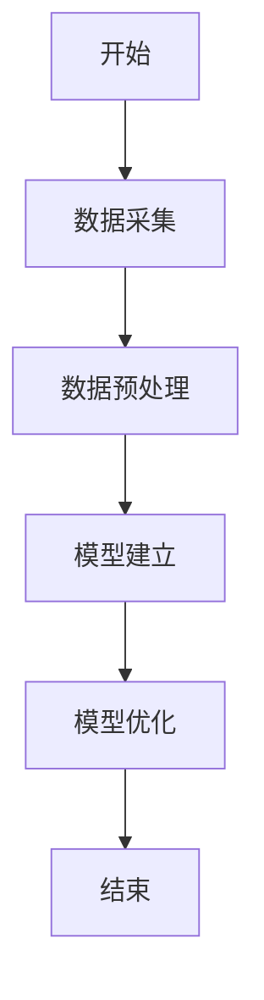
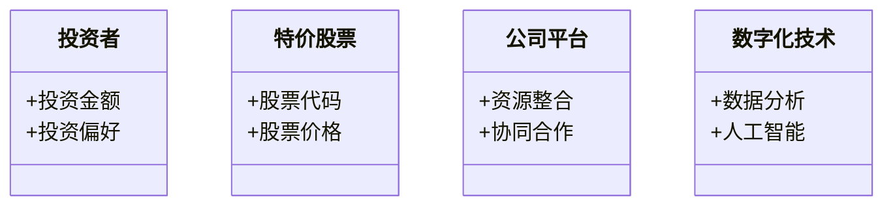
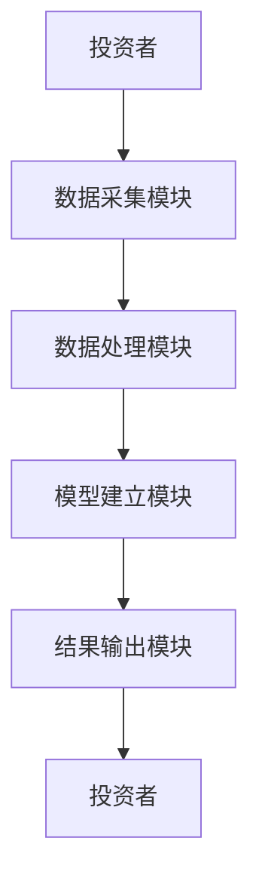

                 


# 特价股票与公司平台化与数字化融合创新能力的关联性研究

> 关键词：特价股票，公司平台化，数字化融合创新，关联性，算法分析

> 摘要：本文探讨了特价股票与公司平台化、数字化融合创新能力之间的关联性。通过背景分析、核心概念阐述、算法原理讲解、系统架构设计和项目实战案例，本文旨在揭示特价股票在公司平台化与数字化融合创新中的作用及其对投资决策的影响。通过系统分析和实际案例，本文提供了如何利用数字化技术提升公司平台化能力以优化特价股票投资的策略。

---

## 第一部分: 特价股票与公司平台化与数字化融合创新的背景介绍

### 第1章: 特价股票的定义与特点

#### 1.1 特价股票的基本概念
特价股票是指在特定时间段内，公司为了促销或清理库存而以低于市场价出售的股票。这些股票通常具有较高的流动性和较低的投资门槛，吸引了很多中小投资者。

#### 1.2 特价股票的市场定位
特价股票在市场中通常被视为高风险高回报的投资工具。它们的价格波动较大，投资者需要具备一定的市场敏感性和分析能力才能从中获利。

#### 1.3 特价股票的投资价值分析
尽管特价股票的价格较低，但其潜在的上涨空间和市场波动性为投资者提供了短期获利的机会。然而，投资者需要结合公司平台化和数字化融合创新能力来评估其长期投资价值。

### 第2章: 公司平台化与数字化融合创新的内涵

#### 2.1 公司平台化的定义
公司平台化是指公司将业务、资源和客户整合到一个统一的平台上，以实现资源共享、协同合作和高效管理。这种模式有助于公司快速响应市场变化，提升运营效率。

#### 2.2 数字化融合创新的核心要素
数字化融合创新是指利用大数据、人工智能和云计算等数字技术，将公司的业务流程、产品设计和客户服务进行创新性融合。这种创新能够提升公司的竞争力，优化用户体验。

#### 2.3 平台化与数字化融合创新的协同效应
平台化与数字化融合创新的结合能够充分发挥数据的价值，实现跨部门协同，提升公司的整体创新能力。这种协同效应能够帮助公司在竞争激烈的市场中占据优势。

### 第3章: 特价股票与公司平台化与数字化融合创新的关联性

#### 3.1 特价股票在公司平台化中的作用
特价股票可以作为公司平台化的一种营销工具，吸引更多的投资者参与平台，提升平台的活跃度和用户黏性。

#### 3.2 数字化融合创新对特价股票的影响
通过数字化技术，公司可以更精准地分析市场趋势和用户需求，制定更有针对性的特价股票销售策略，提升销售效果。

---

## 第二部分: 特价股票与公司平台化与数字化融合创新的核心概念与联系

### 第4章: 核心概念的原理分析

#### 4.1 特价股票的市场机制
特价股票的市场机制包括价格波动、供需关系和市场参与者的互动。通过分析这些机制，可以更好地理解特价股票的市场行为。

#### 4.2 公司平台化的运作模式
公司平台化的运作模式包括资源整合、协同合作和高效管理。这种模式能够提升公司的运营效率和市场响应速度。

#### 4.3 数字化融合创新的技术基础
数字化融合创新的技术基础包括大数据分析、人工智能和云计算等。这些技术为公司的创新提供了强大的支持。

### 第5章: 概念属性特征对比

#### 5.1 概念属性特征对比表格
| 概念       | 属性       | 特征描述                       |
|------------|------------|--------------------------------|
| 特价股票   | 市场机制   | 高波动性、低门槛             |
| 公司平台化 | 运作模式   | 资源整合、协同效应           |
| 数字化融合 | 技术基础   | 数据驱动、智能化             |

#### 5.2 ER实体关系图架构
```mermaid
er
actor: 投资者
actor: 

company: 公司
platform: 平台
technology: 数字化技术

investor --> company: 参与
company --> platform: 整合
platform --> technology: 融合
```

---

## 第三部分: 算法原理讲解

### 第6章: 算法原理分析

#### 6.1 算法原理
通过分析特价股票的市场数据和公司平台化与数字化融合创新能力，可以建立数学模型，预测特价股票的价格走势。

#### 6.2 算法流程
1. 数据采集：收集特价股票的历史数据和公司平台化与数字化融合创新的相关指标。
2. 数据预处理：清洗数据，去除异常值。
3. 模型建立：建立回归模型，分析变量之间的关系。
4. 模型优化：通过参数调整，提升模型的预测精度。

#### 6.3 算法实现


```python
import pandas as pd
import numpy as np
from sklearn.linear_model import LinearRegression

# 数据采集
data = pd.read_csv('stock_data.csv')

# 数据预处理
data_clean = data.dropna()

# 模型建立
model = LinearRegression()
model.fit(data_clean[['price']], data_clean['volume'])

# 模型优化
print(model.coef_)
```

### 第7章: 数学模型与公式

#### 7.1 回归模型
$$ y = \beta_0 + \beta_1 x + \epsilon $$

其中，$y$ 是特价股票的价格，$x$ 是公司平台化的能力，$\beta_0$ 和 $\beta_1$ 是回归系数，$\epsilon$ 是误差项。

#### 7.2 优化模型
$$ \text{最小化} \sum_{i=1}^n (y_i - (\beta_0 + \beta_1 x_i))^2 $$

---

## 第四部分: 系统分析与架构设计方案

### 第8章: 问题场景介绍

#### 8.1 问题背景
公司希望通过平台化和数字化融合创新提升特价股票的销售效果，优化投资回报。

#### 8.2 项目介绍
本项目旨在设计一个基于平台化和数字化融合创新的特价股票推荐系统，帮助投资者做出更明智的投资决策。

### 第9章: 系统功能设计

#### 9.1 领域模型


#### 9.2 系统架构设计


### 第10章: 系统接口设计

#### 10.1 接口设计
1. 数据采集接口：从数据库中获取特价股票的数据。
2. 数据处理接口：对数据进行清洗和预处理。
3. 模型建立接口：建立回归模型，预测股票价格。

### 第11章: 系统交互流程

#### 11.1 交互流程
1. 投资者提交投资需求。
2. 系统采集相关数据。
3. 系统处理数据并建立模型。
4. 系统输出预测结果。

---

## 第五部分: 项目实战

### 第12章: 环境安装与系统核心实现

#### 12.1 环境安装
安装Python、Pandas、NumPy和Scikit-learn等库。

#### 12.2 核心代码实现
```python
import pandas as pd
import numpy as np
from sklearn.linear_model import LinearRegression

# 数据采集
data = pd.read_csv('stock_data.csv')

# 数据预处理
data_clean = data.dropna()

# 模型建立
model = LinearRegression()
model.fit(data_clean[['price']], data_clean['volume'])

# 模型优化
print(model.coef_)
```

#### 12.3 代码应用解读
通过代码实现，我们可以看到模型的回归系数，从而了解公司平台化能力对特价股票价格的影响。

### 第13章: 实际案例分析

#### 13.1 案例介绍
某公司通过平台化和数字化融合创新，成功提升了特价股票的销售效果。

#### 13.2 案例分析
分析公司的资源整合、协同合作和数字化技术应用，评估其对特价股票销售的促进作用。

---

## 第六部分: 最佳实践与总结

### 第14章: 最佳实践 tips

#### 14.1 投资者建议
投资者应结合公司平台化和数字化融合创新能力，选择具有长期增长潜力的特价股票。

#### 14.2 企业建议
公司应持续优化平台化和数字化融合创新能力，提升特价股票的市场竞争力。

### 第15章: 小结

通过本文的分析，我们了解到特价股票与公司平台化和数字化融合创新之间的密切关联。合理利用这些关联，可以帮助投资者和公司实现双赢。

### 第16章: 注意事项

#### 16.1 投资风险
投资者应充分认识到特价股票的高波动性和高风险性。

#### 16.2 技术局限性
当前的数字化技术仍存在一定的局限性，需要不断优化和创新。

### 第17章: 拓展阅读

#### 17.1 相关书籍
1. 《股票投资的智慧》
2. 《数字化转型》

#### 17.2 相关文章
1. 数字化技术在金融领域的应用
2. 平台化战略对企业的影响

---

## 作者信息

作者：AI天才研究院/AI Genius Institute & 禅与计算机程序设计艺术 /Zen And The Art of Computer Programming

