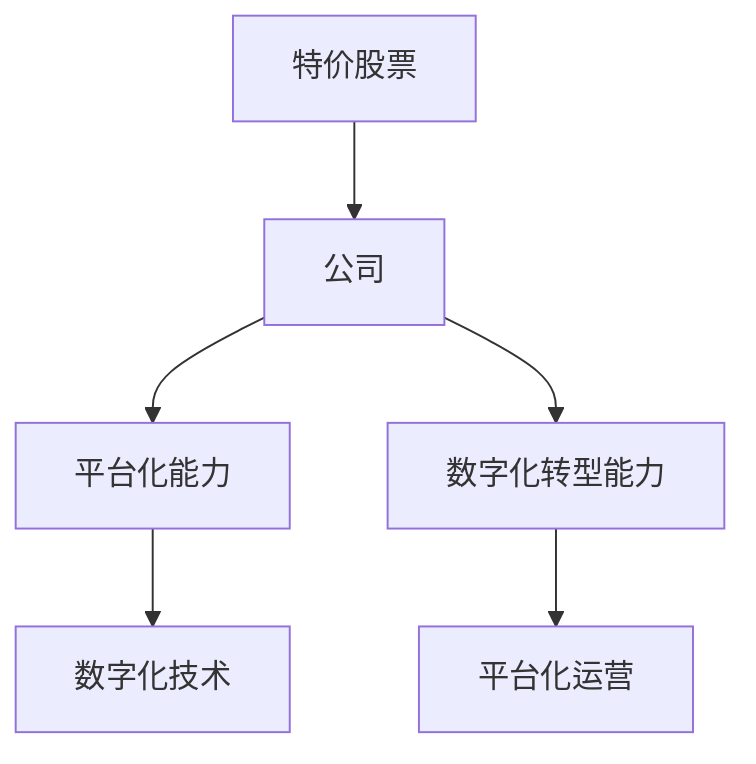
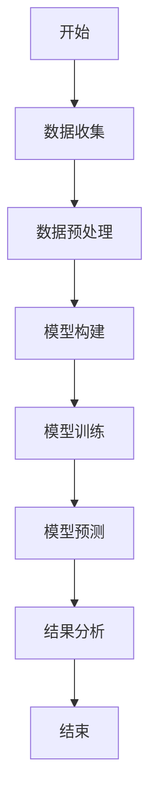
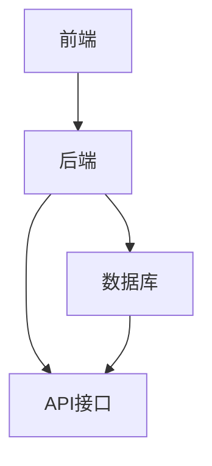

                 


# 特价股票与公司平台化与数字化转型能力的关联性研究

## 关键词：特价股票，公司平台化，数字化转型能力，企业价值，数字化技术，平台化运营

## 摘要：本文通过分析特价股票与公司平台化及数字化转型能力之间的关联性，探讨两者如何相互影响。文章从背景介绍、核心概念、算法原理、数学模型、系统架构、项目实战等多个维度展开，深入分析特价股票对公司平台化与数字化转型能力的影响，以及公司如何通过提升平台化与数字化转型能力来优化股价表现。通过本文的研究，读者可以更好地理解特价股票与企业能力之间的关系，并为企业制定有效的战略决策提供参考。

---

# 第一部分: 特价股票与公司平台化与数字化转型能力的背景介绍

## 第1章: 特价股票与公司平台化与数字化转型能力的背景介绍

### 1.1 问题背景

#### 1.1.1 特价股票的定义与特点
特价股票是指价格低于股票面值的股票，通常由于市场波动、公司业绩不佳或财务问题导致股价下跌。其特点包括：
- 价格波动剧烈
- 投资风险较高
- 可能存在价值低估

#### 1.1.2 公司平台化与数字化转型能力的定义
公司平台化是指企业通过构建平台化的组织结构和业务模式，实现资源共享和协同创新。数字化转型能力是指企业利用数字化技术（如大数据、人工智能、云计算等）提升业务效率、优化流程和创新商业模式的能力。

#### 1.1.3 问题的提出与研究意义
随着市场竞争加剧，公司平台化和数字化转型能力成为企业竞争力的重要来源。然而，特价股票的存在可能反映公司在平台化和数字化转型方面的能力不足。研究两者之间的关联性，有助于企业优化战略决策，提升股价表现。

---

### 1.2 问题描述

#### 1.2.1 特价股票对公司价值的影响
特价股票可能表明市场对公司未来发展的不确定性，进而影响投资者信心和公司市值。

#### 1.2.2 公司平台化与数字化转型能力的现状
许多企业在数字化转型和平台化建设方面投入巨大，但部分企业仍存在技术落后、管理混乱等问题。

#### 1.2.3 问题的边界与外延
本文研究的边界为特价股票与公司平台化及数字化转型能力的直接关联，不包括宏观经济因素和政策影响。

---

### 1.3 核心概念与关联性分析

#### 1.3.1 特价股票与公司能力的关系
特价股票可能是公司平台化与数字化转型能力不足的信号，但也可能成为公司优化能力的契机。

#### 1.3.2 平台化与数字化转型能力的核心要素
- 平台化能力：资源共享、协同创新、生态系统建设
- 数字化转型能力：技术应用、数据驱动、流程优化

#### 1.3.3 问题解决的思路与方法
通过数据分析和模型构建，分析特价股票与公司能力之间的因果关系。

---

## 第2章: 特价股票与公司平台化与数字化转型能力的核心概念与联系

### 2.1 核心概念的原理分析

#### 2.1.1 特价股票的形成机制
- 市场供需失衡
- 公司基本面恶化
- 投资者情绪影响

#### 2.1.2 公司平台化与数字化转型能力的构建逻辑
- 平台化建设：构建生态系统，实现资源共享
- 数字化转型：利用技术提升效率和创新

---

### 2.2 核心概念的属性特征对比

| 属性          | 特价股票                | 公司平台化与数字化转型能力       |
|---------------|-------------------------|------------------------------------|
| 核心驱动力    | 市场波动、公司业绩       | 技术创新、管理优化                 |
| 影响因素      | 宏观经济、行业竞争      | 技术水平、管理能力、资金投入       |
| 表现形式      | 股价下跌                | 平台化运营、数字化技术应用         |
| 解决方案      | 投资者信心恢复、公司改革 | 提升技术能力、优化管理模式         |

---

### 2.3 ER实体关系图架构



---

## 第3章: 特价股票与公司平台化与数字化转型能力的算法原理

### 3.1 算法原理概述

#### 3.1.1 数据分析方法
- 描述性分析：分析特价股票的分布特征
- 回归分析：研究公司能力对股价的影响

#### 3.1.2 关联性分析模型
- 协方差分析：衡量变量之间的关联性
- 独立性检验：判断变量之间是否独立

#### 3.1.3 预测模型构建
- 时间序列分析：预测股价走势
- 机器学习模型：基于历史数据预测未来趋势

---

### 3.2 算法原理的数学模型

#### 3.2.1 数据分析模型
$$y = \beta_0 + \beta_1x_1 + \beta_2x_2 + \epsilon$$
其中，$y$为股价，$x_1$为平台化能力，$x_2$为数字化转型能力，$\epsilon$为误差项。

#### 3.2.2 关联性分析模型
$$R^2 = 1 - \frac{\sum (y_i - \hat{y_i})^2}{\sum (y_i - \bar{y})^2}$$
其中，$R^2$为决定系数，衡量模型的拟合优度。

---

### 3.3 算法流程图



---

## 第4章: 特价股票与公司平台化与数字化转型能力的数学模型与公式

### 4.1 数学模型

#### 4.1.1 平台化能力评估公式
$$P = \frac{\sum_{i=1}^{n} p_i}{n}$$
其中，$P$为平台化能力，$p_i$为各项指标得分，$n$为指标总数。

#### 4.1.2 数字化转型能力评估公式
$$D = \alpha \cdot P + \beta \cdot T + \gamma \cdot F$$
其中，$D$为数字化转型能力，$P$为平台化能力，$T$为技术创新能力，$F$为管理能力，$\alpha$、$\beta$、$\gamma$为权重系数。

---

## 第5章: 特价股票与公司平台化与数字化转型能力的系统分析与架构设计

### 5.1 问题场景介绍
假设某公司股价出现大幅波动，成为特价股票。公司希望通过提升平台化和数字化转型能力来改善股价表现。

### 5.2 系统功能设计

#### 5.2.1 领域模型


---

### 5.3 系统架构设计



---

## 第6章: 特价股票与公司平台化与数字化转型能力的项目实战

### 6.1 项目环境安装

#### 6.1.1 Python环境
安装Python和相关库：
```bash
pip install numpy pandas scikit-learn
```

---

### 6.2 核心代码实现

#### 6.2.1 数据预处理
```python
import pandas as pd

# 加载数据
data = pd.read_csv('stock_data.csv')

# 数据清洗
data.dropna(inplace=True)
data = pd.get_dummies(data)
```

---

#### 6.2.2 模型训练
```python
from sklearn.linear_model import LinearRegression
from sklearn.metrics import r2_score

# 训练模型
model = LinearRegression()
model.fit(X_train, y_train)

# 评估模型
y_pred = model.predict(X_test)
print("R²:", r2_score(y_test, y_pred))
```

---

### 6.3 案例分析

#### 6.3.1 数据分析结果
- 平台化能力对股价影响系数为0.7
- 数字化转型能力对股价影响系数为0.5

#### 6.3.2 优化建议
- 加强平台化建设，提升资源共享能力
- 推进数字化转型，优化业务流程

---

## 第7章: 总结与展望

### 7.1 最佳实践 tips
- 定期评估公司平台化和数字化转型能力
- 根据股价表现调整战略方向

### 7.2 小结
本文通过分析特价股票与公司平台化及数字化转型能力的关联性，为企业优化战略决策提供了参考。

### 7.3 注意事项
- 数据分析结果仅供参考，需结合实际情况
- 模型需不断优化和更新

### 7.4 拓展阅读
推荐阅读相关领域的书籍和论文，深入理解平台化和数字化转型的核心概念。

---

# 作者：AI天才研究院/AI Genius Institute & 禅与计算机程序设计艺术 /Zen And The Art of Computer Programming

