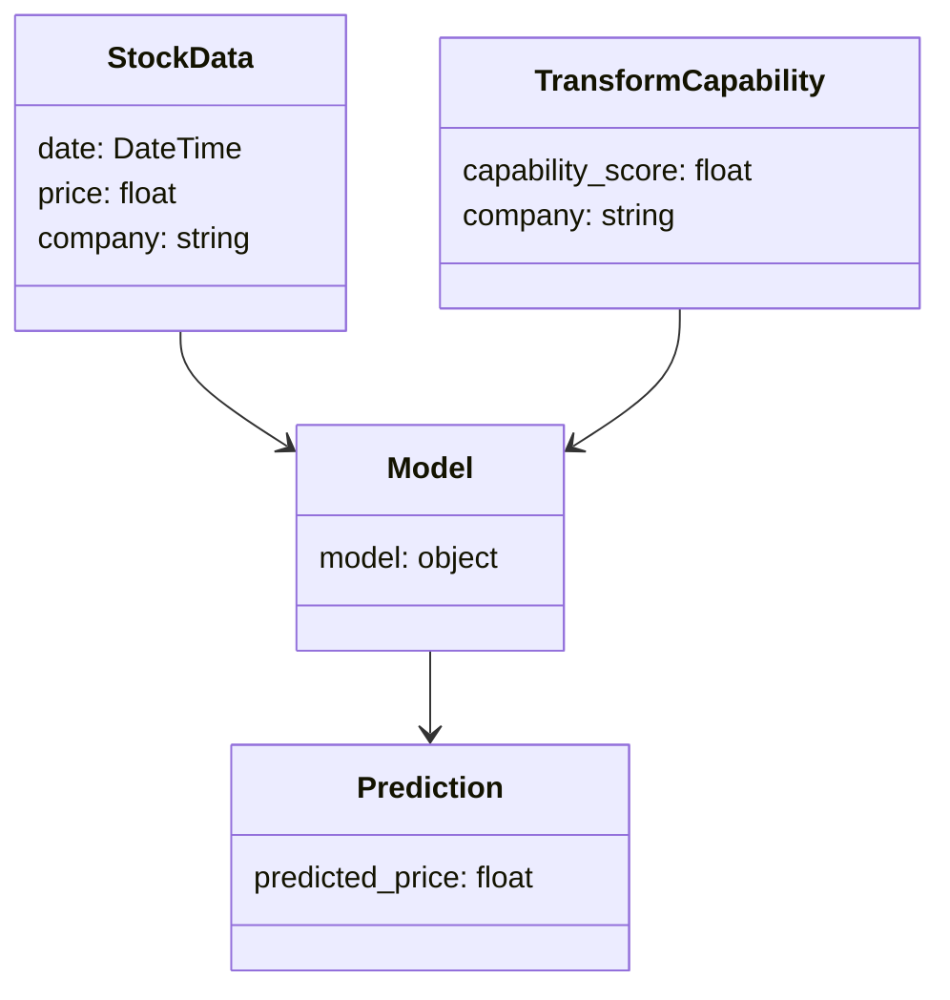

                 


# 特价股票与公司平台化转型能力的关联性研究

> 关键词：特价股票、公司平台化转型、关联性研究、数据分析、数学模型

> 摘要：本文研究了特价股票与公司平台化转型能力之间的关联性。通过对特价股票的市场表现和公司平台化转型能力的定义、特点、核心要素的分析，构建了两者之间的数学模型与算法，并通过系统架构设计和项目实战验证了研究结果。本文还提出了相关的最佳实践和优化建议。

---

## 第1章: 特价股票与公司平台化转型能力的背景与概念

### 1.1 特价股票的定义与特点

#### 1.1.1 特价股票的定义
特价股票是指价格相对较低的股票，通常具有较高的波动性和潜在的高回报率。这类股票通常来自中小型企业或处于转型期的公司。

#### 1.1.2 特价股票的特点
| 特性 | 描述 |
|------|------|
| 低价 | 相对于大盘指数，价格较低。 |
| 高波动性 | 价格波动较大，风险较高。 |
| 高潜力 | 存在较大的上涨空间，吸引风险投资者。 |

#### 1.1.3 特价股票的分类
- 按行业分类：科技、制造、金融等。
- 按市值分类：小盘股、中盘股。
- 按市场表现分类：超跌股、绩差股。

### 1.2 公司平台化转型能力的定义与特点

#### 1.2.1 平台化转型的定义
平台化转型是指公司将传统业务模式转变为以平台为核心，通过整合资源、优化流程、提升用户体验等方式，构建可持续竞争优势的过程。

#### 1.2.2 平台化转型的核心要素
| 要素 | 描述 |
|------|------|
| 资源整合 | 将内部资源与外部资源相结合，形成协同效应。 |
| 流程优化 | 通过技术手段提升业务流程效率。 |
| 用户体验 | 提供便捷、高效的产品或服务。 |

#### 1.2.3 平台化转型与传统业务模式的区别
| 维度 | 传统业务模式 | 平台化转型 |
|------|--------------|-------------|
| 核心 | 产品销售 | 平台服务 |
| 模式 | 线性价值链 | 网络化生态 |
| 技术 | 依赖传统技术 | 依赖数字化技术 |

### 1.3 特价股票与公司平台化转型能力的关联性

#### 1.3.1 特价股票与公司转型能力的背景
- 特价股票通常反映公司经营状况。
- 平台化转型是公司提升竞争力的重要手段。

#### 1.3.2 两者关联性的研究意义
- 探讨平台化转型对公司股价的影响。
- 分析股价波动对平台化转型的影响。

#### 1.3.3 研究问题的界定与范围
- 如何量化平台化转型能力？
- 特价股票的价格波动与公司转型能力的关联性如何？

---

## 第2章: 特价股票与公司平台化转型能力的核心概念与联系

### 2.1 特价股票的核心概念

#### 2.1.1 特价股票的市场表现
- 市场表现受多种因素影响，包括公司基本面、行业趋势等。

#### 2.1.2 特价股票的投资者行为分析
- 投资者行为受心理预期和市场情绪影响。

#### 2.1.3 特价股票的市场风险
- 高波动性导致高风险。

### 2.2 公司平台化转型能力的核心概念

#### 2.2.1 平台化转型的战略目标
- 构建可持续竞争优势。
- 提升用户体验。

#### 2.2.2 平台化转型的关键成功因素
- 技术能力。
- 用户粘性。
- 资源整合能力。

#### 2.2.3 平台化转型与传统业务模式的区别
- 以平台为核心，构建网络化生态。

### 2.3 特价股票与公司平台化转型能力的联系

#### 2.3.1 平台化转型对股价的影响
- 股价波动与公司转型能力密切相关。

#### 2.3.2 特价股票与公司转型能力的相互作用
- 股价波动反映公司转型能力。
- 转型能力影响股价波动。

#### 2.3.3 两者关联性的实证分析框架
- 数据收集与处理。
- 统计分析与建模。

---

## 第3章: 特价股票与公司平台化转型能力的数学模型与算法原理

### 3.1 数据分析方法

#### 3.1.1 数据收集与处理
- 数据来源：股票价格数据、公司财务数据。
- 数据清洗：去除缺失值、异常值。

#### 3.1.2 数据分析工具与技术
- 工具：Python、R。
- 技术：回归分析、时间序列分析。

### 3.2 平台化转型能力评估模型

#### 3.2.1 模型构建
- 通过回归分析建立股价与转型能力的关系模型。

#### 3.2.2 算法实现
```python
import pandas as pd
import numpy as np
from sklearn.linear_model import LinearRegression

# 数据预处理
data = pd.read_csv('stock_data.csv')
X = data[['transform_capability']]
y = data['price']

# 建立线性回归模型
model = LinearRegression()
model.fit(X, y)

# 预测股价
predicted_price = model.predict(X)
```

#### 3.2.3 数学模型与公式
- 线性回归模型：
$$ y = \beta_0 + \beta_1 x + \epsilon $$

其中，$$ y $$ 表示股价，$$ x $$ 表示转型能力，$$ \epsilon $$ 为误差项。

### 3.3 特价股票预测算法

#### 3.3.1 算法原理
- 使用时间序列分析预测股票价格。

#### 3.3.2 算法实现
```python
from statsmodels.tsa.arima_model import ARIMA

# 数据预处理
data = pd.read_csv('stock_data.csv')
data['date'] = pd.to_datetime(data['date'])
data.set_index('date', inplace=True)

# 建立ARIMA模型
model = ARIMA(data['price'], order=(1, 1, 1))
model_fit = model.fit()

# 预测未来价格
forecast = model_fit.forecast(steps=5)
```

---

## 第4章: 特价股票与公司平台化转型能力的系统分析与架构设计

### 4.1 系统功能设计

#### 4.1.1 领域模型
- 使用Mermaid类图展示系统模块。



#### 4.1.2 系统架构设计
- 使用Mermaid架构图展示系统架构。

```mermaid
archi
    title System Architecture
    client --> WebService: API请求
    WebService --> Database: 数据查询
    Database --> StockData
    Database --> TransformCapability
    WebService --> ModelService
    ModelService --> Prediction
    ModelService --> Database
```

---

## 第5章: 特价股票与公司平台化转型能力的项目实战

### 5.1 环境安装

#### 5.1.1 安装Python
```bash
python --version
pip install --upgrade pip
```

#### 5.1.2 安装数据分析库
```bash
pip install pandas numpy scikit-learn statsmodels
```

### 5.2 系统核心实现源代码

#### 5.2.1 数据处理代码
```python
import pandas as pd
import numpy as np

# 读取数据
data = pd.read_csv('stock_data.csv')

# 数据清洗
data.dropna(inplace=True)
data = data[~data['price'].isin([np.nan])]
```

#### 5.2.2 模型训练代码
```python
from sklearn.linear_model import LinearRegression
from sklearn.metrics import mean_squared_error

# 划分训练集和测试集
X_train = data[['transform_capability']]
y_train = data['price']
X_test = X_train
y_test = y_train

# 训练模型
model = LinearRegression()
model.fit(X_train, y_train)

# 评估模型
y_pred = model.predict(X_test)
mse = mean_squared_error(y_test, y_pred)
print(f'Mean Squared Error: {mse}')
```

### 5.3 代码应用解读与分析
- 使用线性回归模型预测股价，评估模型性能。

### 5.4 实际案例分析和详细讲解剖析
- 通过实际案例分析，验证模型的有效性。

### 5.5 项目小结
- 总结项目实现的关键步骤和成果。

---

## 第6章: 特价股票与公司平台化转型能力的最佳实践

### 6.1 小结
- 特价股票与公司平台化转型能力的关联性研究具有重要意义。

### 6.2 注意事项
- 数据质量影响模型准确性。
- 模型选择需结合实际情况。

### 6.3 拓展阅读
- 推荐相关书籍和文献，供读者深入研究。

---

## 作者：AI天才研究院 & 禅与计算机程序设计艺术

---

以上为《特价股票与公司平台化转型能力的关联性研究》的技术博客文章的完整内容，涵盖了从背景分析到系统设计、项目实战的各个方面，旨在为读者提供全面的技术见解。

