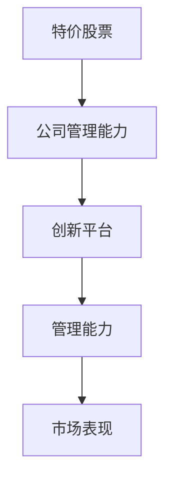
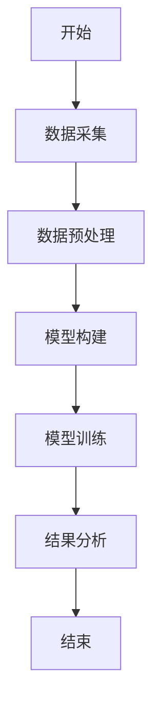
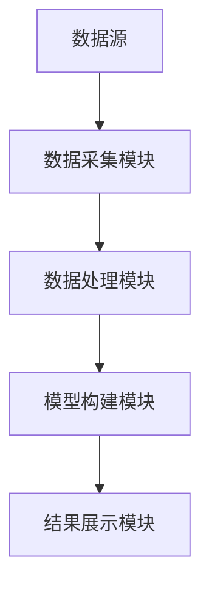
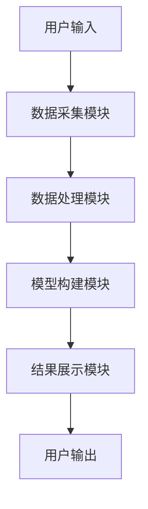

                 


# 特价股票与公司开放创新平台管理能力的关系探讨

> 关键词：特价股票、公司管理能力、开放创新平台、算法模型、系统架构

> 摘要：本文探讨了特价股票与公司开放创新平台管理能力之间的关系，通过分析特价股票的市场行为和公司管理能力的核心要素，结合算法模型和系统架构，深入解析了两者之间的相互影响和协同作用。文章从背景介绍、核心概念、算法原理、数学模型、系统分析、项目实战等多方面展开，为读者提供全面而深入的分析。

---

## 第一章: 特价股票与公司开放创新平台管理能力的背景介绍

### 1.1 特价股票的基本概念
#### 1.1.1 特价股票的定义与特点
特价股票通常指的是价格低于市场平均值的股票，具有高波动性和高风险的特性。这类股票可能来自业绩不佳的公司或市场周期性低谷期间。

#### 1.1.2 特价股票的分类与市场表现
特价股票可以分为价值型股票和成长型股票。价值型股票通常被低估，而成长型股票则具有较高的增长潜力。市场表现受多种因素影响，如宏观经济环境和公司基本面。

#### 1.1.3 特价股票的投资者行为分析
投资者在特价股票上的行为往往受市场情绪驱动，可能存在过度交易和非理性决策的情况。

### 1.2 公司开放创新平台管理能力的核心要素
#### 1.2.1 开放创新平台的定义与作用
开放创新平台是公司整合外部资源和知识的桥梁，有助于提升公司的创新能力和竞争力。

#### 1.2.2 管理能力的构成要素
包括战略管理、组织协调、风险管理等方面，是公司有效运作开放创新平台的关键。

#### 1.2.3 开放创新平台与公司管理能力的相互关系
开放创新平台的成功依赖于公司的管理能力，而平台的运作又能反过来提升公司的管理能力。

### 1.3 特价股票与公司开放创新平台管理能力的关系背景
#### 1.3.1 问题背景与研究意义
分析特价股票对公司开放创新平台管理能力的影响，有助于理解公司如何在市场波动中保持稳定。

#### 1.3.2 研究目标与研究范围
探讨特价股票波动对平台管理能力的影响，明确研究边界和范围。

#### 1.3.3 研究方法与研究框架
采用定性与定量相结合的方法，构建分析框架。

---

## 第二章: 特价股票与公司开放创新平台管理能力的核心概念

### 2.1 特价股票的属性特征分析
#### 2.1.1 特价股票的价格波动特征
价格波动剧烈，受市场情绪和外部环境影响较大。

#### 2.1.2 特价股票的市场风险特征
高风险意味着高回报，但也可能带来重大损失。

#### 2.1.3 特价股票的投资者行为特征
投资者行为受情绪驱动，存在非理性交易。

### 2.2 公司开放创新平台管理能力的属性特征
#### 2.2.1 创新能力的评估维度
包括创新成果的数量、质量和速度。

#### 2.2.2 管理能力的构成要素
包括战略规划、组织协调、资源配置等。

#### 2.2.3 平台开放性的表现形式
通过合作、共享资源等方式实现开放。

### 2.3 特价股票与公司开放创新平台管理能力的对比分析
#### 2.3.1 核心概念对比表
| 特价股票 | 公司管理能力 |
|----------|---------------|
| 价格波动 | 战略规划       |
| 投资者行为 | 组织协调       |
| 市场风险 | 资源配置       |

#### 2.3.2 实体关系图（Mermaid）


---

## 第三章: 特价股票与公司开放创新平台管理能力的算法原理

### 3.1 算法原理概述
#### 3.1.1 算法目标与输入
目标是分析特价股票波动对公司管理能力的影响，输入包括历史数据和公司信息。

#### 3.1.2 算法步骤与流程
1. 数据采集：获取特价股票和公司管理能力的相关数据。
2. 数据预处理：清洗和转换数据。
3. 模型构建：建立关联模型。
4. 模型训练：使用历史数据进行训练。
5. 结果分析：评估模型性能。

#### 3.1.3 算法的数学模型
模型公式：
$$ \text{影响度} = \alpha \times \text{股价波动} + \beta \times \text{管理能力} $$

### 3.2 算法实现与代码示例
#### 3.2.1 算法流程图（Mermaid）


#### 3.2.2 Python代码示例
```python
import pandas as pd
from sklearn.linear_model import LinearRegression

# 数据加载
data = pd.read_csv('data.csv')

# 特征和目标
X = data[['股价波动', '管理能力']]
y = data['影响度']

# 模型训练
model = LinearRegression()
model.fit(X, y)

# 模型预测
predictions = model.predict(X)
print('预测结果:', predictions)
```

---

## 第四章: 特价股票与公司开放创新平台管理能力的数学模型

### 4.1 数学模型的构建与推导
#### 4.1.1 模型假设
假设股价波动与管理能力呈线性关系。

#### 4.1.2 模型公式
$$ y = \beta_0 + \beta_1 x_1 + \beta_2 x_2 + \epsilon $$

其中，\( y \) 是影响度，\( x_1 \) 是股价波动，\( x_2 \) 是管理能力。

#### 4.1.3 模型的解释
系数 \( \beta_1 \) 和 \( \beta_2 \) 表示各自变量对影响度的贡献程度。

### 4.2 模型的应用与验证
#### 4.2.1 案例分析
分析某公司的股价波动和管理能力，预测其影响度。

#### 4.2.2 模型的优缺点
优点：简单易懂，计算高效；缺点：假设过于简化，可能忽略复杂因素。

---

## 第五章: 特价股票与公司开放创新平台管理能力的系统分析

### 5.1 系统分析与架构设计
#### 5.1.1 问题场景介绍
探讨系统如何处理特价股票波动和公司管理能力的关系。

#### 5.1.2 系统功能设计
包括数据采集、模型构建、结果展示等功能。

#### 5.1.3 系统架构图（Mermaid）


### 5.2 接口设计与交互流程
#### 5.2.1 系统接口设计
定义数据输入和输出接口。

#### 5.2.2 交互流程图（Mermaid）


---

## 第六章: 特价股票与公司开放创新平台管理能力的项目实战

### 6.1 项目环境与工具安装
#### 6.1.1 环境要求
安装Python、Pandas、Scikit-learn等工具。

### 6.2 核心代码实现
#### 6.2.1 数据预处理
处理缺失值和异常值。

#### 6.2.2 模型实现
使用线性回归模型进行训练。

### 6.3 案例分析与结果解读
分析某公司的数据，解释模型结果。

### 6.4 项目总结与经验分享
总结项目实施过程中的经验和教训。

---

## 第七章: 结论与建议

### 7.1 研究结论
总结特价股票与公司管理能力之间的关系。

### 7.2 最佳实践 tips
提供在实际操作中的建议和注意事项。

### 7.3 拓展阅读
推荐相关书籍和资源。

---

## 作者

作者：AI天才研究院/AI Genius Institute & 禅与计算机程序设计艺术 /Zen And The Art of Computer Programming

---

通过以上结构，我们可以全面分析特价股票与公司开放创新平台管理能力之间的关系，为读者提供深入的技术见解和实践指导。

