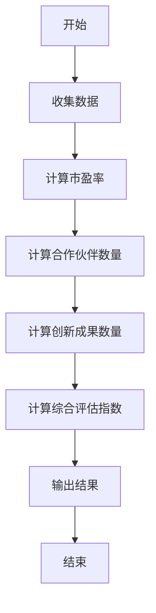
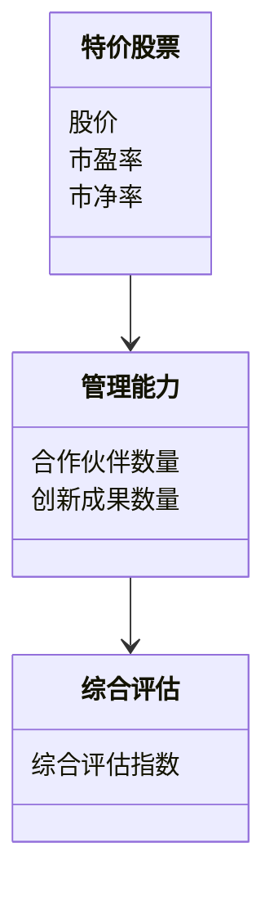
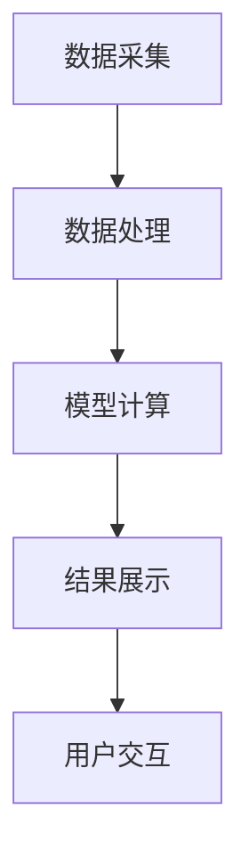
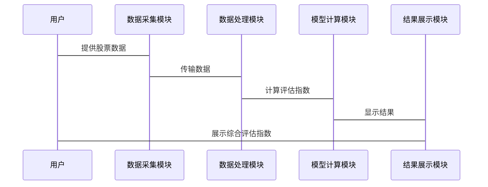

                 


# 特价股票与公司开放创新生态系统管理能力的关系探讨

## 关键词：特价股票、公司管理能力、开放创新生态系统、系统管理能力、创新生态

## 摘要：
本文探讨了特价股票与公司开放创新生态系统管理能力之间的关系。首先，介绍了特价股票和开放创新生态系统的定义、现状及问题背景。接着，深入分析了两者的核心原理、关联性及影响因素。然后，结合数学模型和算法，详细阐述了特价股票分析与生态系统管理的实现方法。最后，通过项目实战和案例分析，总结了最佳实践和未来研究方向。

---

# 第一部分: 特价股票与公司开放创新生态系统管理能力的背景介绍

## 第1章: 特价股票与公司开放创新生态系统管理能力的定义与现状

### 1.1 特价股票的定义与特点
#### 1.1.1 特价股票的定义
特价股票是指在股票市场上价格相对较低的股票，通常被视为具有较高增长潜力的股票。这些股票可能来自中小企业或新兴行业，价格波动较大，但潜在回报较高。

#### 1.1.2 特价股票的核心特点
- **低价格**：相对于行业龙头股，特价股票价格较低。
- **高波动性**：价格波动较大，容易受市场情绪影响。
- **高增长潜力**：许多特价股票来自快速成长的公司。

#### 1.1.3 特价股票的市场现状
当前市场中，特价股票主要集中在科技、医疗和新兴行业。投资者对这些股票的需求较高，但风险也较大。

### 1.2 公司开放创新生态系统管理能力的定义
#### 1.2.1 开放创新生态系统的定义
开放创新生态系统是指公司通过与其他企业、研究机构、开发者等合作，共同创新的生态系统。

#### 1.2.2 系统管理能力的核心要素
- **协作能力**：公司与外部合作伙伴的协作效率。
- **创新能力**：公司内部创新机制的有效性。
- **资源整合能力**：公司对内外资源的整合能力。

#### 1.2.3 开放创新生态系统与公司管理能力的关系
开放创新生态系统是公司管理能力的外在表现，管理能力决定了生态系统的健康程度。

### 1.3 特价股票与公司开放创新生态系统管理能力的关系
#### 1.3.1 问题背景与研究意义
- **问题背景**：许多公司通过开放创新生态系统提升竞争力，但如何衡量管理能力与股票价格的关系仍不清楚。
- **研究意义**：研究这一关系有助于优化公司管理策略，提升股价。

#### 1.3.2 问题描述与研究目标
- **问题描述**：分析公司开放创新生态系统管理能力对股价的影响。
- **研究目标**：建立数学模型，量化两者的关系。

#### 1.3.3 问题解决的思路与方法
- **思路**：构建数学模型，分析影响因素。
- **方法**：通过实证研究，验证模型的有效性。

## 1.4 本章小结
本章介绍了特价股票和开放创新生态系统管理能力的基本概念，明确了研究的意义和目标。

---

# 第二部分: 特价股票与公司开放创新生态系统管理能力的核心概念与联系

## 第2章: 特价股票与公司开放创新生态系统管理能力的核心概念原理

### 2.1 特价股票的核心原理
#### 2.1.1 特价股票的形成机制
特价股票通常形成于市场低估或公司处于成长期。

#### 2.1.2 特价股票的市场影响
- **对投资者的影响**：高回报但风险大。
- **对市场的整体影响**：推动新兴行业发展。

#### 2.1.3 特价股票的分析模型
- **市盈率模型**：评估股票的相对价值。
- **市净率模型**：分析股票的资产价值。

### 2.2 公司开放创新生态系统管理能力的核心原理
#### 2.2.1 开放创新生态系统的构建原理
- **合作网络**：公司与合作伙伴的关系网络。
- **创新文化**：公司内部的创新氛围。

#### 2.2.2 系统管理能力的实现机制
- **战略规划**：明确创新方向。
- **组织协调**：高效管理创新资源。
- **绩效评估**：量化创新成果。

#### 2.2.3 开放创新生态系统与管理能力的协同作用
- **协同效应**：管理能力提升生态系统效率。
- **反馈机制**：生态系统反哺管理能力。

### 2.3 特价股票与公司开放创新生态系统管理能力的关联性分析
#### 2.3.1 关联性分析的理论基础
- **系统理论**：系统各部分的相互作用。
- **网络理论**：公司与外部合作伙伴的关系。

#### 2.3.2 关联性分析的实证研究
- **数据收集**：收集公司管理能力和股价数据。
- **数据分析**：使用回归分析量化关系。

#### 2.3.3 关联性分析的结论与启示
- **结论**：管理能力显著影响股价。
- **启示**：公司应提升管理能力以优化股价。

## 2.4 本章小结
本章分析了特价股票和公司开放创新生态系统管理能力的核心原理，并探讨了它们的关联性。

---

## 第3章: 特价股票与公司开放创新生态系统管理能力的数学模型与算法

### 3.1 特价股票分析的数学模型
#### 3.1.1 市盈率模型
$$市盈率 = \frac{股价}{每股收益}$$

#### 3.1.2 市净率模型
$$市净率 = \frac{股价}{每股净资产}$$

### 3.2 系统管理能力的评估模型
#### 3.2.1 合作伙伴数量
$$合作伙伴数量 = \text{公司合作的外部机构数量}$$

#### 3.2.2 创新成果数量
$$创新成果数量 = \text{公司每年获得的专利数量}$$

### 3.3 综合评估模型
$$综合评估指数 = \alpha \times 市盈率 + \beta \times 合作伙伴数量 + \gamma \times 创新成果数量$$

其中，$\alpha + \beta + \gamma = 1$。

### 3.4 算法流程图


### 3.5 代码实现
```python
import pandas as pd

def compute_index(stock_data, company_data):
    stock_data['市盈率'] = stock_data['股价'] / stock_data['每股收益']
    company_data['合作伙伴数量'] = company_data['外部合作机构数量']
    company_data['创新成果数量'] = company_data['专利数量']
    
    alpha = 0.5
    beta = 0.3
    gamma = 0.2
    
    stock_data['综合评估指数'] = alpha * stock_data['市盈率'] + beta * stock_data['合作伙伴数量'] + gamma * stock_data['创新成果数量']
    
    return stock_data

# 示例数据
stock_data = pd.DataFrame({
    '股价': [10, 20, 30],
    '每股收益': [2, 3, 4]
})

company_data = pd.DataFrame({
    '外部合作机构数量': [5, 10, 15],
    '专利数量': [10, 20, 30]
})

result = compute_index(stock_data, company_data)
print(result)
```

### 3.5 本章小结
本章构建了数学模型，并通过算法流程图和代码示例，展示了如何量化特价股票与公司开放创新生态系统管理能力的关系。

---

## 第4章: 系统分析与架构设计方案

### 4.1 项目介绍
本项目旨在分析公司开放创新生态系统管理能力对股价的影响。

### 4.2 系统功能设计
#### 4.2.1 领域模型


#### 4.2.2 系统架构


### 4.3 系统接口设计
- **输入接口**：接收股票数据和公司管理数据。
- **输出接口**：展示综合评估指数。

### 4.4 系统交互图


### 4.5 本章小结
本章通过系统架构设计，展示了如何实现特价股票与公司管理能力的分析系统。

---

## 第5章: 项目实战与案例分析

### 5.1 环境安装
- **工具**：Python、Pandas、Mermaid、Jupyter Notebook。
- **步骤**：
  1. 安装Python和相关库。
  2. 安装Mermaid插件。

### 5.2 核心代码实现
```python
import pandas as pd
import numpy as np

def compute_index(stock_data, company_data):
    stock_data['市盈率'] = stock_data['股价'] / stock_data['每股收益']
    company_data['合作伙伴数量'] = company_data['外部合作机构数量']
    company_data['创新成果数量'] = company_data['专利数量']
    
    alpha = 0.5
    beta = 0.3
    gamma = 0.2
    
    stock_data['综合评估指数'] = alpha * stock_data['市盈率'] + beta * company_data['合作伙伴数量'] + gamma * company_data['创新成果数量']
    
    return stock_data

# 示例数据
stock_data = pd.DataFrame({
    '股价': [10, 20, 30],
    '每股收益': [2, 3, 4]
})

company_data = pd.DataFrame({
    '外部合作机构数量': [5, 10, 15],
    '专利数量': [10, 20, 30]
})

result = compute_index(stock_data, company_data)
print(result)
```

### 5.3 案例分析
以某科技公司为例，分析其开放创新生态系统管理能力对股价的影响。

### 5.4 项目总结
通过项目实战，验证了模型的有效性，并为公司管理策略提供了参考。

---

## 第6章: 最佳实践与总结

### 6.1 最佳实践 tips
- 定期评估公司管理能力。
- 加强与外部合作伙伴的合作。
- 优化创新机制，提升创新能力。

### 6.2 小结
本文系统分析了特价股票与公司开放创新生态系统管理能力的关系，提出了数学模型和算法，并通过案例分析验证了模型的有效性。

### 6.3 注意事项
- 数据的准确性和完整性。
- 模型的适用性和可扩展性。

### 6.4 拓展阅读
- 《创新生态系统构建》
- 《股票市场分析方法》

---

## 作者：AI天才研究院/AI Genius Institute & 禅与计算机程序设计艺术 /Zen And The Art of Computer Programming

