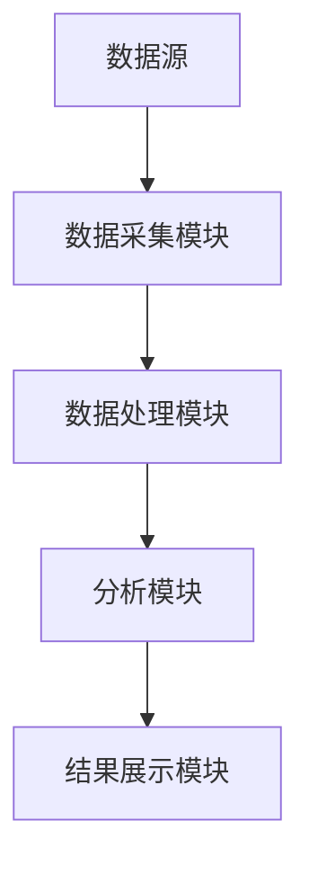
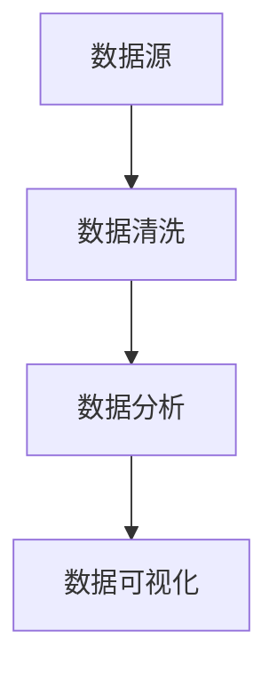

                 


# 特价股票与公司敏捷创新文化的深度分析方法

> 关键词：特价股票、敏捷创新文化、股票分析、敏捷方法、数据分析、系统架构

> 摘要：本文将探讨特价股票与公司敏捷创新文化之间的深度关联，通过分析特价股票的特征、敏捷创新文化的本质，结合数据分析方法与系统架构设计，提出一种利用敏捷创新文化提升特价股票分析效率的方法。本文将从背景介绍、核心概念、分析方法、系统设计、项目实战等多维度展开，最终为读者提供一套完整的特价股票分析框架。

---

## 第一部分: 特价股票与敏捷创新文化的核心概念

### 第1章: 特价股票的定义与特征

#### 1.1 特价股票的定义与背景
- 特价股票是指价格相对较低的股票，通常在小盘股或新兴市场中较为常见。
- 特价股票的吸引力在于其潜在的增长空间，但同时也伴随着较高的风险。

#### 1.2 特价股票的市场特征
- 市场波动性较大
- 公司基本面参差不齐
- 投资者情绪影响显著

#### 1.3 特价股票的投资价值
- 高增长潜力
- 低价入场机会
- 风险与收益的平衡

### 第2章: 敏捷创新文化的定义与特点

#### 2.1 敏捷创新文化的定义
- 敏捷创新文化是一种以快速响应变化、迭代开发和团队协作为核心的企业文化。
- 强调“小步快跑”，鼓励试错和持续改进。

#### 2.2 敏捷创新文化的特点
- 以用户需求为导向
- 强调团队自治与协作
- 注重快速交付和反馈

#### 2.3 敏捷创新文化与传统管理的区别
| 特性 | 敏捷创新文化 | 传统管理 |
|------|--------------|----------|
| 组织结构 | 扁平化、跨功能团队 | 层级分明 |
| 决策方式 | 分权、快速决策 | 集权、审批制 |
| 交付方式 | 迭代交付 | 一次性交付 |

---

## 第二部分: 特价股票分析的核心方法

### 第3章: 技术分析与基本面分析

#### 3.1 技术分析方法
- **K线图分析**：通过价格走势判断市场趋势。
- **移动平均线（MA）**：用于过滤短期波动，识别中期趋势。
- **技术指标**：如RSI（相对强弱指数）、MACD（移动平均收敛散度）等。

#### 3.2 基本面分析方法
- **财务指标分析**：如市盈率（P/E）、市净率（P/B）等。
- **行业分析**：分析行业前景和竞争格局。
- **公司治理**：评估管理团队和公司治理结构。

#### 3.3 数据分析方法
- **数据清洗**：处理缺失值、异常值。
- **数据可视化**：使用图表展示数据趋势。
- **机器学习模型**：如线性回归、随机森林等，用于预测股票价格。

---

## 第三部分: 敏捷创新文化在股票分析中的应用

### 第4章: 敏捷方法在股票分析中的优势

#### 4.1 快速迭代分析
- 通过敏捷方法快速调整分析策略。
- 定期回顾市场变化，及时优化分析模型。

#### 4.2 实时数据处理
- 建立实时数据流，快速响应市场变化。
- 使用敏捷开发工具，提高数据处理效率。

#### 4.3 团队协作与知识共享
- 强调跨团队协作，提升分析效率。
- 通过知识共享，避免信息孤岛。

---

## 第四部分: 系统架构与数据分析框架

### 第5章: 系统架构设计

#### 5.1 系统功能模块
- **数据采集模块**：实时采集股票数据。
- **数据处理模块**：清洗和预处理数据。
- **分析模块**：结合技术分析和基本面分析，生成分析结果。

#### 5.2 系统架构图


### 第6章: 数据分析框架

#### 6.1 数据流图


#### 6.2 数据分析模型
- **回归分析**：用于预测股票价格。
- **时间序列分析**：用于分析股票价格的趋势。

---

## 第五部分: 项目实战与案例分析

### 第7章: 项目实战

#### 7.1 环境安装
- 安装Python和相关库（如Pandas、Matplotlib、Scikit-learn）。
- 安装敏捷开发工具（如Jira、Git）。

#### 7.2 核心代码实现
```python
import pandas as pd
import matplotlib.pyplot as plt

# 数据清洗
def data_cleaning(data):
    data = data.dropna()
    return data

# 数据可视化
def plot_data(data, column):
    plt.figure(figsize=(10, 6))
    plt.plot(data[column])
    plt.title(f"{column} 趋势图")
    plt.xlabel("时间")
    plt.ylabel(f"{column} 值")
    plt.show()

# 回归分析
from sklearn.linear_model import LinearRegression

def stock_prediction(data, feature_cols, target_col):
    model = LinearRegression()
    model.fit(data[feature_cols], data[target_col])
    return model

# 示例数据
data = pd.DataFrame({
    '日期': ['2023-01-01', '2023-01-02', '2023-01-03', '2023-01-04'],
    '收盘价': [100, 102, 101, 103]
})

# 数据清洗
cleaned_data = data_cleaning(data)

# 数据可视化
plot_data(cleaned_data, '收盘价')

# 特征选择
feature_cols = ['收盘价']
target_col = '收盘价'

# 训练模型
model = stock_prediction(cleaned_data, feature_cols, target_col)
```

#### 7.3 案例分析
- 选择一个特价股票进行分析，展示分析过程和结果。

---

## 第六部分: 总结与最佳实践

### 第8章: 总结

#### 8.1 核心内容回顾
- 特价股票的特征与分析方法。
- 敏捷创新文化的特点与优势。
- 数据分析框架的设计与实现。

#### 8.2 未来展望
- 结合人工智能技术，进一步提升股票分析的智能化水平。
- 探讨敏捷创新文化在其他领域的应用潜力。

### 第9章: 最佳实践与注意事项

#### 9.1 投资者建议
- 注重数据分析的科学性。
- 灵活调整分析策略，适应市场变化。

#### 9.2 开发者建议
- 采用敏捷开发方法，提高开发效率。
- 注重团队协作，确保知识共享。

---

## 作者信息

作者：AI天才研究院（AI Genius Institute） & 禅与计算机程序设计艺术（Zen And The Art of Computer Programming）

---

以上内容为《特价股票与公司敏捷创新文化的深度分析方法》的完整大纲与文章内容。

