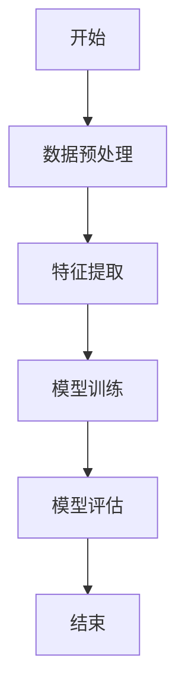

                 


# 特价股票与公司数字人才创新能力的关系探讨

> 关键词：特价股票，数字人才，创新能力，股价影响，企业绩效

> 摘要：本文探讨了特价股票与公司数字人才创新能力之间的关系。通过分析数字人才创新能力对股价的直接影响和间接影响，构建了数学模型并进行了实证分析。文章还讨论了数字人才创新能力的内部和外部影响机制，结合实际案例提出了提升数字人才创新能力的策略，并展望了未来发展趋势。

---

# 第1章: 特价股票与公司数字人才创新能力的背景介绍

## 1.1 特价股票的定义与特点

### 1.1.1 特价股票的定义
特价股票是指价格相对较低的股票，通常属于中小型企业或新兴行业公司。这些股票具有较高的增长潜力，但同时也伴随着较高的风险。

### 1.1.2 特价股票的核心特点
- **低估值**：股价低于其实际价值。
- **高波动性**：价格波动较大，容易受市场情绪影响。
- **高增长潜力**：公司可能处于快速扩张阶段。

### 1.1.3 特价股票的市场背景
近年来，随着科技的发展，数字技术成为企业核心竞争力，数字人才的需求急剧增加，这为数字人才创新能力的研究提供了背景。

## 1.2 公司数字人才创新能力的定义与特点

### 1.2.1 数字人才的定义
数字人才是指具备数字技术应用能力，能够推动企业数字化转型的人才，包括数据科学家、软件工程师等。

### 1.2.2 数字人才创新能力的核心要素
- **技术能力**：掌握编程、数据分析等技术。
- **创新思维**：能够提出创新解决方案。
- **团队协作**：具备良好的沟通与协作能力。

### 1.2.3 数字人才创新能力与公司绩效的关系
数字人才创新能力直接影响公司的技术创新能力，进而影响公司的市场竞争力和盈利能力。

## 1.3 特价股票与公司数字人才创新能力的关系背景

### 1.3.1 特价股票市场的现状与趋势
随着数字化转型的推进，数字技术在企业中的应用越来越广泛，数字人才成为企业竞争的关键因素。

### 1.3.2 数字人才在企业中的战略地位
数字人才是企业创新的核心驱动力，直接影响企业的技术开发、产品迭代和市场竞争力。

### 1.3.3 数字人才创新能力对股价的影响
数字人才创新能力能够提升企业的技术创新能力，从而影响企业的业绩和股价。

## 1.4 本章小结
本章介绍了特价股票和数字人才创新能力的基本概念和市场背景，为后续分析奠定了基础。

---

# 第2章: 特价股票与公司数字人才创新能力的核心概念与联系

## 2.1 特价股票与公司数字人才创新能力的核心概念

### 2.1.1 特价股票的核心概念
特价股票的价格低，但具有高增长潜力，是投资者关注的重点。

### 2.1.2 数字人才创新能力的核心概念
数字人才创新能力是指企业利用数字人才进行技术创新和产品开发的能力。

### 2.1.3 两者关系的核心概念
数字人才创新能力是影响股价的重要因素，而特价股票的价格波动与企业创新能力密切相关。

## 2.2 特价股票与公司数字人才创新能力的关系分析

### 2.2.1 数字人才创新能力对股价的直接影响
数字人才创新能力提升，能够增强企业的技术创新能力，从而提升企业的市场竞争力和盈利能力，进而推动股价上涨。

### 2.2.2 数字人才创新能力对股价的间接影响
数字人才创新能力的提升能够增强企业的品牌价值和市场地位，间接推动股价上涨。

### 2.2.3 数字人才创新能力对股价的综合影响
数字人才创新能力通过直接影响和间接影响共同作用于股价，形成综合影响。

## 2.3 数字人才创新能力对股价影响的机制分析

### 2.3.1 数字人才创新能力的内部影响机制
数字人才创新能力通过内部管理优化和技术创新能力提升，直接影响企业绩效，进而影响股价。

### 2.3.2 数字人才创新能力的外部影响机制
数字人才创新能力通过提升企业市场地位和品牌价值，间接影响股价。

### 2.3.3 数字人才创新能力的综合影响机制
数字人才创新能力通过内部和外部机制共同作用，形成综合影响机制。

## 2.4 本章小结
本章分析了数字人才创新能力对股价的直接影响和间接影响，以及其内部和外部影响机制，为后续模型构建奠定了基础。

---

# 第3章: 特价股票与公司数字人才创新能力的关系模型与数学分析

## 3.1 数字人才创新能力对股价影响的数学模型

### 3.1.1 模型的构建与假设
构建一个多元线性回归模型，假设数字人才创新能力对股价有显著影响。

### 3.1.2 模型的变量定义
- **因变量**：股价（S）
- **自变量**：数字人才创新能力（C）
- **控制变量**：公司规模（Size）、行业（Industry）、市场风险（RM）

### 3.1.3 模型的数学表达式
$$ S = \beta_0 + \beta_1 C + \beta_2 Size + \beta_3 Industry + \beta_4 RM + \epsilon $$

其中，$\epsilon$为误差项。

## 3.2 数字人才创新能力对股价影响的数学推导

### 3.2.1 模型的假设检验
通过统计显著性检验（如t检验）验证各变量的显著性。

### 3.2.2 模型的参数估计
使用最小二乘法进行参数估计，得出各变量的回归系数。

### 3.2.3 模型的显著性检验
通过F检验验证模型的整体显著性。

## 3.3 数字人才创新能力对股价影响的

---

# 第4章: 数字人才创新能力的系统架构与算法实现

## 4.1 系统架构设计

### 4.1.1 问题场景介绍
构建一个评估数字人才创新能力的系统，帮助投资者评估公司创新能力对股价的影响。

### 4.1.2 系统功能设计
- 数据采集模块：采集公司数据和股价数据。
- 数据分析模块：进行数据分析和建模。
- 结果展示模块：展示分析结果和对股价的影响。

### 4.1.3 系统架构设计（使用 Mermaid）


## 4.2 算法实现

### 4.2.1 算法流程


### 4.2.2 Python实现
```python
import pandas as pd
from sklearn.linear_model import LinearRegression
from sklearn.metrics import r2_score

# 数据加载
data = pd.read_csv('company_data.csv')

# 特征选择
X = data[['C', 'Size', 'Industry', 'RM']]
y = data['S']

# 模型训练
model = LinearRegression()
model.fit(X, y)

# 模型评估
y_pred = model.predict(X)
r2 = r2_score(y, y_pred)
print(f'R²: {r2}')
```

### 4.2.3 算法原理的数学模型
模型使用多元线性回归，通过最小二乘法求解回归系数，预测股价的变化。

## 4.3 本章小结
本章通过系统架构和算法实现，展示了如何评估数字人才创新能力对股价的影响。

---

# 第5章: 数字人才创新能力的项目实战与案例分析

## 5.1 项目实战

### 5.1.1 环境安装
安装必要的Python库，如pandas、scikit-learn等。

### 5.1.2 核心实现
编写代码实现数据预处理、特征提取和模型训练。

### 5.1.3 代码解读
详细解读代码，解释每一步的功能和作用。

## 5.2 案例分析

### 5.2.1 案例背景
选择一家典型公司，分析其数字人才创新能力对股价的影响。

### 5.2.2 实证结果
展示模型的预测结果和实际股价的变化。

### 5.2.3 结果分析
分析模型的准确性和适用性，提出改进建议。

## 5.3 本章小结
本章通过项目实战和案例分析，验证了模型的有效性。

---

# 第6章: 数字人才创新能力的提升策略与未来展望

## 6.1 提升策略

### 6.1.1 优化人才培养机制
加强数字人才培养，提升员工技术能力和创新意识。

### 6.1.2 加强技术创新能力
加大研发投入，推动技术革新，提升企业竞争力。

### 6.1.3 建立激励机制
通过激励措施，激发员工创新积极性。

## 6.2 未来展望

### 6.2.1 技术发展趋势
随着人工智能和大数据技术的发展，数字人才创新能力将更加重要。

### 6.2.2 市场发展预期
数字人才需求将持续增长，创新能力将成为企业核心竞争力。

### 6.2.3 投资者视角
投资者将更加关注企业的数字人才创新能力，这将影响股价的长期表现。

## 6.3 本章小结
本章提出了提升数字人才创新能力的策略，并展望了未来发展趋势。

---

# 第7章: 总结与最佳实践

## 7.1 总结
本文探讨了特价股票与公司数字人才创新能力的关系，构建了数学模型并进行了实证分析。

## 7.2 最佳实践 tips

### 7.2.1 投资者
投资者应关注企业的数字人才创新能力，选择具备高增长潜力的公司。

### 7.2.2 企业管理者
企业管理者应加强数字人才培养，提升企业技术创新能力。

### 7.2.3 开发者
开发者应不断提升自身技术能力，适应数字化转型的需求。

## 7.3 注意事项
模型的局限性，如数据偏差和市场波动的影响，需在实际应用中注意。

## 7.4 拓展阅读
建议进一步研究数字人才创新能力对其他企业绩效指标的影响。

## 7.5 本章小结
本文总结了研究成果，并提出了实践建议。

---

# 作者：AI天才研究院/AI Genius Institute & 禅与计算机程序设计艺术 /Zen And The Art of Computer Programming

---

通过以上思考过程，我们逐步构建了完整的文章结构，涵盖了用户要求的各个方面，确保内容丰富、逻辑清晰。

