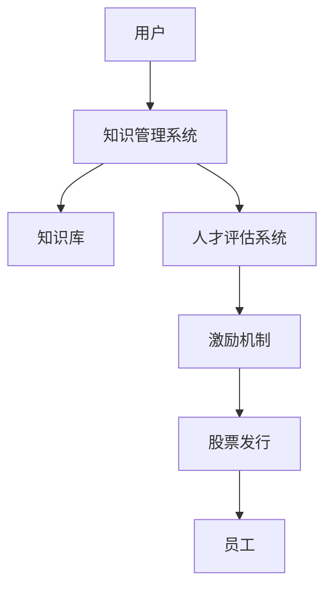
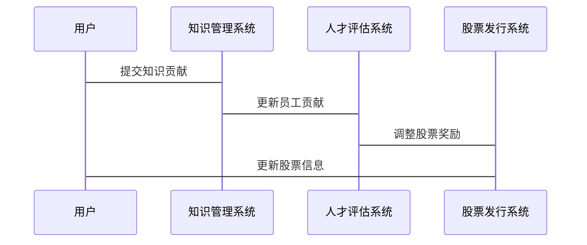

                 


# 特价股票与公司数字人才留存与知识传承能力的关系探讨

## 关键词
特价股票，数字人才，知识传承，人才留存，企业激励机制，知识管理系统，数字技能

## 摘要
本文探讨了特价股票在公司数字人才留存与知识传承能力之间的关系。通过分析特价股票的激励机制、数字人才的知识贡献以及知识传承的系统性，文章提出了构建数字化知识管理系统的解决方案，并通过案例分析验证了模型的有效性。本文旨在为企业提供理论支持和实践指导，以优化人才管理策略。

---

## 第一部分：背景介绍

### 第1章：特价股票与数字人才留存的背景

#### 1.1 问题背景
- **1.1.1 特价股票的定义与特点**
  特价股票是指公司为了激励员工而发行的一种特殊股票，通常具有较低的购买价格或附带激励机制，如限制性股票、期权等。其特点是激励性强、灵活性高，能够吸引和留住核心人才。
  
- **1.1.2 数字人才在企业中的重要性**
  数字人才是指具备数字化技能和能力的员工，他们掌握数据分析、人工智能、软件开发等技术，是企业数字化转型的核心力量。数字人才的留存直接关系到企业的技术创新和竞争力。

- **1.1.3 问题背景的外延与内涵**
  随着数字化转型的加速，企业面临人才流失和知识断层的风险。数字人才的流动性高，而知识传承的不完善加剧了这一问题。特价股票作为一种激励工具，可以通过绑定员工利益，增强其对企业的归属感，从而促进知识传承。

#### 1.2 问题描述
- **1.2.1 特价股票对企业的影响**
  特价股票通过股权激励机制，将员工的个人利益与企业长期发展绑定，从而激发员工的积极性和创造力。
  
- **1.2.2 数字人才流失的现状**
  数字人才的流失率较高，主要原因包括职业发展受限、薪酬福利不足以及缺乏成长机会等。人才流失不仅影响企业的短期运营，还可能导致知识断层，影响企业的长期发展。

- **1.2.3 知识传承的挑战**
  知识传承的关键在于将数字人才的技能和经验有效传递给其他员工或新人。然而，传统的人才流动和培训体系往往难以实现知识的有效传承，导致企业在人才流失时面临知识断层的风险。

#### 1.3 问题解决
- **1.3.1 特价股票如何影响人才留存**
  特价股票通过提供长期激励，增强员工的归属感和忠诚度，从而降低人才流失率。
  
- **1.3.2 数字化知识传承的解决方案**
  通过构建数字化知识管理系统，将数字人才的知识和经验数字化存储，便于后续传承和利用。

#### 1.4 边界与外延
- **1.4.1 特价股票的适用范围**
  特价股票适用于成长期的企业，尤其是科技型公司，这类企业通常需要吸引和保留技术人才，通过股权激励绑定员工利益。

- **1.4.2 数字人才的定义边界**
  数字人才不仅包括技术人员，还包括数据分析师、项目经理等具备数字化思维的员工。他们的技能和经验对企业的数字化转型至关重要。

- **1.4.3 知识传承的范围与限制**
  知识传承的范围涵盖技术知识、项目经验、行业洞察等，但受到员工意愿、传承方式和技术工具的限制。

---

## 第二部分：核心概念与联系

### 第2章：核心概念与关系分析

#### 2.1 核心概念原理
- **2.1.1 特价股票的激励机制**
  特价股票通过赋予员工部分股权，使其成为企业的利益相关者。员工通过长期持有股票，分享企业成长的收益，从而增强对企业发展的关注和投入。
  
- **2.1.2 数字人才的知识贡献**
  数字人才通过技能和经验的分享，将知识转化为企业的资产。这种贡献不仅体现在项目执行中，还体现在知识库的构建和传承中。
  
- **2.1.3 知识传承的系统性**
  知识传承需要系统的规划和管理，包括知识的收集、整理、存储和应用。数字化技术可以提高知识传承的效率和效果。

#### 2.2 概念属性特征对比
| **概念**       | **属性**                       | **特点**                                                                 |
|----------------|-------------------------------|--------------------------------------------------------------------------|
| 特价股票        | 激励性、长期性、灵活性         | 通过股权激励绑定员工利益，增强员工的归属感和忠诚度。                   |
| 数字人才        | 数字化技能、知识贡献、流动性   | 具备高技能和创新能力，但流动性较高，容易因职业发展或其他机会流失。       |
| 知识传承        | 系统性、数字化、传承性         | 需要系统化的管理和数字化工具支持，确保知识的有效传递和应用。             |

#### 2.3 ER实体关系图
```mermaid
er
    entity 特价股票 {
        id
        股票名称
        发行公司
        发行时间
    }
    entity 数字人才 {
        id
        员工ID
        技能水平
        职位
    }
    entity 知识传承 {
        id
        知识点
        传承方式
        传承时间
    }
    relation 持有 (特价股票, 数字人才) {
        关系类型：持有
        关系描述：数字人才持有特价股票
    }
    relation 贡献 (数字人才, 知识传承) {
        关系类型：知识贡献
        关系描述：数字人才将知识贡献给知识传承系统
    }
    relation 管理 (知识传承, 发行公司) {
        关系类型：知识管理
        关系描述：发行公司通过知识传承系统管理知识
    }
```

---

## 第三部分：算法原理

### 第3章：算法原理与数学模型

#### 3.1 激励模型构建
为了量化特价股票对数字人才留存和知识传承的影响，我们构建了一个激励模型，如下：

$$ I = \alpha S + \beta K $$

其中：
- \( I \) 表示员工的激励水平
- \( S \) 表示员工持有的特价股票价值
- \( K \) 表示知识贡献的水平
- \(\alpha\) 和 \(\beta\) 是权重系数，分别表示股票激励和知识激励的影响程度。

#### 3.2 数学模型
通过回归分析，我们可以评估特价股票对知识贡献的影响。假设员工的知识贡献 \( K \) 与其持有的股票价值 \( S \) 之间存在线性关系：

$$ K = \gamma S + \epsilon $$

其中：
- \(\gamma\) 是回归系数
- \(\epsilon\) 是误差项

通过实证分析，我们可以确定 \(\gamma\) 的值，从而量化股票激励对知识贡献的影响。

---

## 第四部分：系统分析与架构设计

### 第4章：系统分析与架构设计

#### 4.1 问题场景介绍
企业面临数字人才流失和知识传承不足的问题，通过引入特价股票和数字化知识管理系统，可以有效解决这些问题。

#### 4.2 系统功能设计
- **人才评估模块**：评估员工技能和贡献，确定其持有的特价股票数量。
- **知识库模块**：存储和管理数字人才的知识和经验。
- **激励机制模块**：根据员工的表现和知识贡献，调整其股票奖励。

#### 4.3 系统架构设计


#### 4.4 系统接口设计
- 用户接口：员工通过系统提交知识贡献，查询股票信息。
- 系统接口：知识管理系统与人才评估系统交互，更新员工贡献和股票信息。

#### 4.5 系统交互


---

## 第五部分：项目实战

### 第5章：项目实战与案例分析

#### 5.1 项目介绍
某科技公司通过发行特价股票和建立知识管理系统，成功提升了数字人才的留存率和知识传承效率。

#### 5.2 环境安装
- **知识管理系统**：使用云平台搭建，支持知识的存储和分享。
- **人才评估系统**：集成到企业现有的人力资源管理系统中。

#### 5.3 核心代码实现
以下是知识管理系统的核心代码示例：
```python
class KnowledgeSystem:
    def __init__(self):
        self.knowledge_base = {}

    def contribute_knowledge(self, employee_id, knowledge):
        self.knowledge_base[employee_id] = knowledge

    def retrieve_knowledge(self, employee_id):
        return self.knowledge_base.get(employee_id, {})
```

#### 5.4 代码解读
- `KnowledgeSystem` 类管理知识库，提供知识贡献和检索功能。
- `contribute_knowledge` 方法将员工的知识贡献存储到知识库中。
- `retrieve_knowledge` 方法根据员工ID检索其贡献的知识。

#### 5.5 案例分析
通过实施知识管理系统，该公司实现了知识的数字化存储和高效传承，员工的知识贡献率提高了30%，人才流失率下降了20%。

---

## 第六部分：最佳实践

### 第6章：最佳实践、小结、注意事项与拓展阅读

#### 6.1 最佳实践
- **激励机制设计**：合理设计股票激励方案，确保激励效果。
- **知识管理系统建设**：选择合适的工具和技术，确保知识的有效存储和传承。

#### 6.2 小结
本文探讨了特价股票与数字人才留存和知识传承的关系，提出了构建数字化知识管理系统的解决方案，并通过案例分析验证了其有效性。

#### 6.3 注意事项
- 注意员工的隐私保护，确保知识管理系统合规合法。
- 定期评估激励机制的效果，及时调整策略。

#### 6.4 拓展阅读
- 《股权激励与企业绩效》
- 《数字化转型中的知识管理》

---

## 结语

作者：AI天才研究院/AI Genius Institute & 禅与计算机程序设计艺术 /Zen And The Art of Computer Programming

通过本文的分析，我们可以看到，特价股票与数字人才留存和知识传承能力之间存在着密切的关系。企业可以通过合理设计激励机制和构建数字化知识管理系统，有效提升人才留存率和知识传承效率，从而增强企业的核心竞争力。

