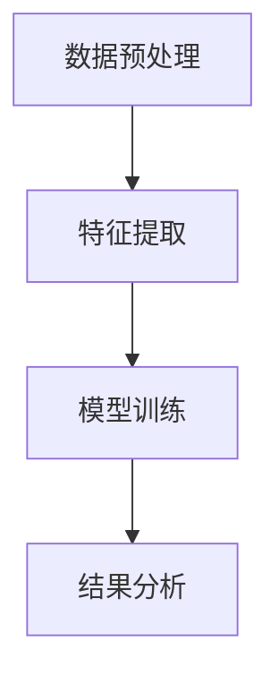

                 


# 特价股票与公司数字信任资本积累的关联分析

> **关键词**：特价股票、数字信任资本、关联分析、算法模型、系统架构  
> **摘要**：本文通过分析特价股票市场与公司数字信任资本积累的关联性，探讨数字信任资本对企业价值的影响，提出基于数据驱动的关联分析模型，为投资者和企业管理者提供理论支持和实践指导。

---

## 第一部分: 特价股票与数字信任资本的背景介绍

### 第1章: 问题背景与核心概念

#### 1.1 特价股票的定义与特点
- **特价股票**：指价格低于市场平均水平的股票，通常具有高波动性和高风险。
- **特点**：
  - 价格敏感性高。
  - 投资者行为复杂。
  - 市场波动性大。

#### 1.2 数字信任资本的定义与特点
- **数字信任资本**：企业在数字化转型中通过数据管理和透明度积累的信任资本。
- **特点**：
  - 数据驱动。
  - 透明度高。
  - 用户信任度高。

#### 1.3 两者的关联性
- 特价股票市场的波动与企业信任资本积累密切相关。
- 数字信任资本高的企业更容易吸引投资者。

---

## 第二部分: 特价股票与数字信任资本的核心概念与联系

### 第2章: 核心概念原理

#### 2.1 特价股票的市场行为分析
- 投资者行为模型：理性与非理性行为并存。
- 市场波动性分析：短期波动与长期趋势。

#### 2.2 数字信任资本的构建过程
- 数据透明度：通过公开数据增强信任。
- 企业行为：合规性与透明性提升信任度。

#### 2.3 两者的相互作用机制
- 企业信任资本高 → 投资者信心强 → 股价稳定。
- 特价股票市场的波动 → 影响企业信任资本积累。

---

## 第三部分: 特价股票与数字信任资本的关联分析算法原理

### 第3章: 算法原理与实现

#### 3.1 数据预处理
- 数据清洗：处理缺失值和异常值。
- 数据标准化：统一数据格式。

#### 3.2 特征提取
- 选取影响股价的关键特征：市盈率、市净率、ROE。
- 数字信任资本特征：数据透明度评分、用户信任度。

#### 3.3 关联模型构建
- 使用Lasso回归模型：
  $$ \text{损失函数} = \frac{1}{2n} \sum_{i=1}^{n}(y_i - \hat{y}_i)^2 + \alpha \sum_{j=1}^{p} |β_j| $$
  其中，$\alpha$ 是正则化参数。

- 模型目标：
  $$ \text{最小化} \quad \frac{1}{2n} \sum_{i=1}^{n}(y_i - \hat{y}_i)^2 + \alpha \sum_{j=1}^{p} |β_j| $$

#### 3.4 算法流程图


---

## 第四部分: 特价股票与数字信任资本的系统架构设计

### 第4章: 系统设计与实现

#### 4.1 问题场景介绍
- 投资者需要分析特价股票的价值。
- 企业需要积累数字信任资本。

#### 4.2 系统功能设计
- 数据采集模块：采集股票数据和企业数据。
- 数据分析模块：构建关联分析模型。
- 结果展示模块：可视化分析结果。

#### 4.3 系统架构设计


---

## 第五部分: 特价股票与数字信任资本的项目实战

### 第5章: 项目实现与案例分析

#### 5.1 环境安装
- 安装Python和相关库：numpy、pandas、scikit-learn。

#### 5.2 核心代码实现
```python
import pandas as pd
from sklearn.linear_model import Lasso

# 数据预处理
data = pd.read_csv('data.csv')
X = data.drop('target', axis=1)
y = data['target']

# 模型训练
model = Lasso(alpha=0.1)
model.fit(X, y)

# 模型解释
coefficients = pd.Series(model.coef_, index=X.columns)
print(coefficients)
```

#### 5.3 案例分析
- 某公司数字信任资本高，其股价在特价股票市场表现稳定。
- 另一家公司信任资本低，股价波动剧烈。

---

## 第六部分: 特价股票与数字信任资本的最佳实践与总结

### 第6章: 总结与展望

#### 6.1 关键点总结
- 数字信任资本是影响股价的重要因素。
- 数据驱动的方法有效分析特价股票市场的关联性。

#### 6.2 注意事项
- 市场波动具有不确定性。
- 数据质量直接影响分析结果。

#### 6.3 未来研究方向
- 更复杂模型的应用。
- 多因素关联分析的探索。

---

## 作者信息

作者：AI天才研究院/AI Genius Institute & 禅与计算机程序设计艺术 /Zen And The Art of Computer Programming

