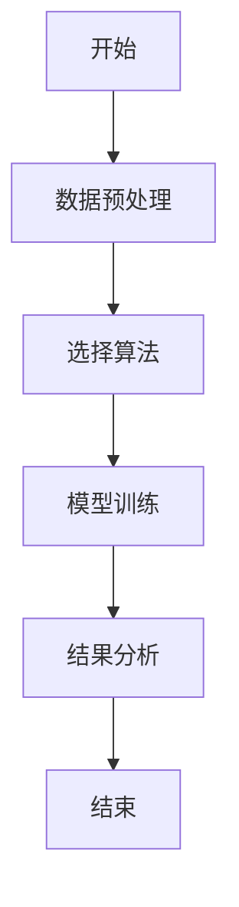
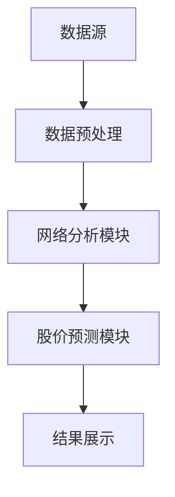
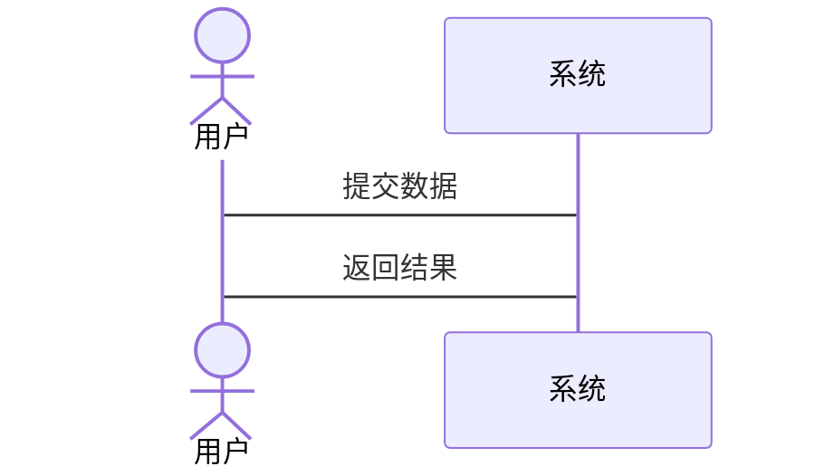

                 


# 特价股票与公司数字化利益相关者网络中心度的关联性研究

> 关键词：特价股票，公司数字化，利益相关者网络，中心度，关联性分析

> 摘要：本文研究了特价股票与公司数字化利益相关者网络中心度之间的关联性，分析了两者的核心概念、算法原理和系统架构设计，通过实际案例展示了如何利用数字化手段提升公司价值。

---

## 第一部分: 特价股票与公司数字化利益相关者网络中心度的背景介绍

### 第1章: 特价股票与公司数字化利益相关者网络中心度的背景介绍

#### 1.1 特价股票的定义与特点
##### 1.1.1 特价股票的定义
特价股票是指价格相对较低的股票，通常具有较高的波动性和潜在的高回报率。这些股票可能来自中小型公司或处于困境中的企业。

##### 1.1.2 特价股票的特点
- 价格波动大
- 风险较高
- 潜在回报高
- 市场流动性较低

##### 1.1.3 特价股票的分类与应用场景
- 按行业分类：科技、金融、制造等
- 按市值分类：小盘股、中盘股
- 应用于投资组合的高风险部分

#### 1.2 公司数字化利益相关者网络的定义与特点
##### 1.2.1 利益相关者网络的定义
利益相关者网络是指公司与其股东、客户、供应商、员工等多方利益相关者之间的关系网络。

##### 1.2.2 数字化利益相关者网络的特点
- 数据驱动
- 实时互动
- 网络化协作
- 可视化管理

##### 1.2.3 数字化利益相关者网络的构建方法
- 数据收集与整理
- 网络分析与建模
- 可视化呈现

#### 1.3 本章小结
本章介绍了特价股票和公司数字化利益相关者网络的基本概念和特点，为后续研究奠定了基础。

---

## 第二部分: 特价股票与公司数字化利益相关者网络中心度的核心概念与联系

### 第2章: 特价股票与公司数字化利益相关者网络中心度的核心概念与联系

#### 2.1 特价股票与公司数字化利益相关者网络中心度的关联性
##### 2.1.1 特价股票的市场表现与公司利益相关者网络的关系
- 公司网络的稳定性影响股价波动
- 利益相关者网络的强度影响公司抗风险能力

##### 2.1.2 公司数字化利益相关者网络中心度的定义与计算方法
中心度是指在网络中某个节点的重要性程度，包括度中心度、接近中心度和中间中心度。

##### 2.1.3 特价股票与公司数字化利益相关者网络中心度的双向影响
- 公司网络中心度高，股价波动小
- 特价股票的波动性影响公司网络的稳定性

#### 2.2 核心概念原理
##### 2.2.1 特价股票的市场波动性分析
- 市场波动性与公司网络的关系
- 波动性对股价的影响

##### 2.2.2 公司数字化利益相关者网络中心度的数学公式
$$ C_{center}(v) = \frac{\sum_{u \in N(v)} w(u, v)}{\sum_{u \in N(v)} \sum_{v \in N(u)} w(u, v)} $$

##### 2.2.3 两者关联性的数学模型与公式
$$ S_{price} = \beta \cdot C_{center}(v) + \epsilon $$

#### 2.3 概念属性特征对比表格
| 概念 | 特价股票 | 数字化利益相关者网络中心度 |
|------|----------|---------------------------|
| 定义 | 低价股票 | 网络中节点的重要性程度 |
| 特性 | 波动性高 | 稳定性高 |
| 应用 | 投资组合 | 公司管理 |

#### 2.4 ER实体关系图架构
```mermaid
er
  actor 利益相关者 {
    [ID]
    [名称]
    [关系类型]
  }
  entity 公司 {
    [ID]
    [名称]
    [市值]
  }
  relationship 属于 {
    公司 -> 利益相关者
    关系类型
  }
```

#### 2.5 本章小结
本章通过分析特价股票和公司数字化利益相关者网络中心度的核心概念，揭示了两者之间的内在联系。

---

## 第三部分: 特价股票与公司数字化利益相关者网络中心度的算法原理

### 第3章: 特价股票与公司数字化利益相关者网络中心度的算法原理

#### 3.1 算法原理概述
##### 3.1.1 特价股票价格预测的算法选择
- 时间序列分析（ARIMA）
- 机器学习模型（随机森林、神经网络）

##### 3.1.2 公司数字化利益相关者网络中心度的算法选择
- 度中心度计算
- 网络嵌入技术

##### 3.1.3 两者关联性分析的算法选择
- 相关性分析
- 回归分析

#### 3.2 算法原理的数学模型与公式
##### 3.2.1 特价股票价格预测的数学模型
$$ P(t) = \alpha P(t-1) + \beta \epsilon $$

##### 3.2.2 公司数字化利益相关者网络中心度的数学公式
$$ C_{center}(v) = \frac{\sum_{u \in N(v)} w(u, v)}{\sum_{u \in N(v)} \sum_{v \in N(u)} w(u, v)} $$

##### 3.2.3 两者关联性分析的数学模型
$$ R = \sum_{i=1}^{n} (x_i - \bar{x})(y_i - \bar{y}) $$

#### 3.3 算法原理的 mermaid 流程图


#### 3.4 本章小结
本章详细讲解了特价股票和公司数字化利益相关者网络中心度的算法原理，为后续研究提供了理论基础。

---

## 第四部分: 特价股票与公司数字化利益相关者网络中心度的系统分析与架构设计

### 第4章: 特价股票与公司数字化利益相关者网络中心度的系统分析与架构设计

#### 4.1 系统分析
##### 4.1.1 系统目标与范围
- 构建数字化利益相关者网络
- 分析网络中心度
- 预测股价波动

##### 4.1.2 系统功能需求分析
- 数据采集模块
- 网络分析模块
- 股价预测模块

##### 4.1.3 系统数据流分析
- 数据输入
- 数据处理
- 数据输出

#### 4.2 系统架构设计
##### 4.2.1 系统架构图


##### 4.2.2 系统接口设计
- 数据接口：API 接口
- 用户接口：可视化界面

##### 4.2.3 系统交互序列图


#### 4.3 本章小结
本章通过系统分析与架构设计，展示了如何将理论应用于实际系统中。

---

## 第五部分: 特价股票与公司数字化利益相关者网络中心度的项目实战

### 第5章: 特价股票与公司数字化利益相关者网络中心度的项目实战

#### 5.1 项目介绍
##### 5.1.1 项目背景
- 研究特价股票与公司网络中心度的关联性
- 提供投资决策参考

##### 5.1.2 项目目标
- 构建数字化利益相关者网络
- 分析网络中心度
- 预测股价波动

#### 5.2 核心实现
##### 5.2.1 数据采集与处理
```python
import pandas as pd
data = pd.read_csv('stock.csv')
```

##### 5.2.2 网络分析与中心度计算
```python
import networkx as nx
G = nx.Graph()
G.add_nodes_from(nodes)
G.add_edges_from(edges)
```

##### 5.2.3 股价预测与关联性分析
```python
from sklearn.linear_model import LinearRegression
model = LinearRegression()
model.fit(X, y)
```

#### 5.3 实际案例分析
##### 5.3.1 案例背景
- 某公司数字化利益相关者网络分析
- 特价股票价格预测

##### 5.3.2 数据分析与结果解读
- 网络中心度高的利益相关者对股价的影响
- 股价波动与公司网络稳定性的关系

##### 5.3.3 结果可视化
```python
import matplotlib.pyplot as plt
plt.plot(predicted_prices, label='预测价格')
plt.plot(actual_prices, label='实际价格')
plt.legend()
plt.show()
```

#### 5.4 本章小结
本章通过实际案例分析，展示了如何将理论应用于实际项目中，为投资决策提供了参考。

---

## 第六部分: 结论与展望

### 第6章: 结论与展望

#### 6.1 研究结论
- 特价股票与公司数字化利益相关者网络中心度密切相关
- 网络中心度高的公司具有更强的抗风险能力
- 数字化手段可以有效提升公司价值

#### 6.2 研究展望
- 进一步优化算法
- 扩大研究样本
- 拓展应用场景

#### 6.3 本章小结
本文研究了特价股票与公司数字化利益相关者网络中心度的关联性，提出了有效的分析方法和系统架构设计，为未来研究提供了参考。

---

## 作者信息

作者：AI天才研究院/AI Genius Institute & 禅与计算机程序设计艺术 /Zen And The Art of Computer Programming

---

# THE END

