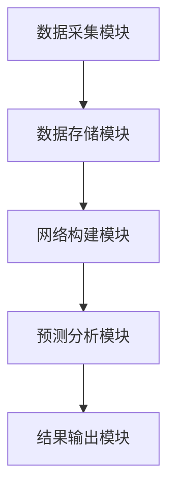

                 


---

# 特价股票与公司数字化利益相关者网络密度的关联性研究

## 关键词：特价股票，网络密度，利益相关者，数字化转型，股票预测

## 摘要：本文探讨了特价股票与公司数字化利益相关者网络密度之间的关联性。通过构建利益相关者网络模型，分析网络密度对股价波动的影响机制，并结合机器学习方法进行实证分析，揭示网络密度在股票预测中的重要作用。

---

# 第1章: 特价股票与利益相关者网络密度的背景与概念

## 1.1 特价股票的定义与特点

### 1.1.1 特价股票的定义  
特价股票是指价格低于市场平均值或行业标准的股票，通常具有较高的波动性和潜在的投资机会。  

### 1.1.2 特价股票的核心特点  
- 价格低廉：通常吸引风险偏好较高的投资者。  
- 波动性高：市场波动较大，价格易受外部因素影响。  
- 市场定位：多为中小型企业或新兴行业公司。  

### 1.1.3 特价股票的市场定位与投资者特征  
- 市场定位：多处于成长期或转型期。  
- 投资者特征：风险偏好高、追求高回报的投资者为主。  

## 1.2 公司数字化利益相关者网络密度的定义

### 1.2.1 利益相关者网络的定义  
利益相关者网络是指与公司相关的所有个人、组织和利益相关方之间的关系网络。  

### 1.2.2 网络密度的数学定义与计算方法  
- 网络密度：网络中边的数量与可能存在的边数的比例。  
- 计算公式：$$\text{密度} = \frac{\text{实际边数}}{\text{可能边数}}$$  

### 1.2.3 数字化转型对利益相关者网络的影响  
- 数字化转型增强了利益相关者之间的连接性。  
- 网络密度的提高有助于公司资源的优化配置和信息传递效率。  

## 1.3 特价股票与利益相关者网络密度的关联性研究背景

### 1.3.1 研究背景与意义  
- 特价股票的波动性高，但其价格受多种因素影响。  
- 利益相关者网络密度对股价波动有潜在影响，但尚未得到充分研究。  

### 1.3.2 研究目标与范围  
- 探讨利益相关者网络密度与特价股票波动之间的关联性。  
- 研究范围：网络密度、股价波动、利益相关者关系。  

### 1.3.3 研究方法与框架  
- 数学模型：构建网络密度与股价波动的关联性模型。  
- 数据分析：实证分析网络密度对股价波动的影响。  

## 1.4 本章小结  
本章介绍了特价股票和利益相关者网络密度的基本概念，明确了研究背景和目标，为后续分析奠定了基础。

---

# 第2章: 特价股票与利益相关者网络密度的关联性分析

## 2.1 特价股票波动的影响因素

### 2.1.1 市场波动对特价股票的影响  
- 市场波动：宏观经济因素、行业趋势等。  
- 投资者情绪：市场恐慌或乐观情绪对股价的影响。  

### 2.1.2 公司基本面与股价关系  
- 公司基本面：收入、利润、资产负债表等。  
- 股价与基本面的正相关性。  

### 2.1.3 利益相关者网络在股价波动中的作用  
- 利益相关者网络密度与股价波动的正相关性。  
- 网络密度高的公司具有更强的抗风险能力。  

## 2.2 利益相关者网络密度对股价的影响机制

### 2.2.1 网络密度与股价波动的正相关性  
- 网络密度高的公司具有更强的资源获取能力。  

### 2.2.2 网络密度与股价波动的负相关性  
- 网络密度低的公司可能面临更大的市场波动风险。  

### 2.2.3 网络密度对股价波动的调节效应  
- 网络密度对股价波动的调节作用：$$\text{调节效应} = \beta_1 \times \text{网络密度} + \beta_2 \times \text{网络密度}^2$$  

## 2.3 数学模型与关联性分析方法

### 2.3.1 关联性分析的数学模型  
- 关联性模型：$$\text{股价波动} = \alpha + \beta \times \text{网络密度} + \epsilon$$  

### 2.3.2 网络密度的量化方法  
- 网络密度计算公式：$$\text{密度} = \frac{\text{实际边数}}{\text{可能边数}}$$  

### 2.3.3 特价股票波动的预测模型  
- 预测模型：$$\text{预测股价} = \alpha + \beta \times \text{网络密度} + \gamma \times \text{市场波动} + \epsilon$$  

## 2.4 实证分析与结果解读

### 2.4.1 数据来源与处理  
- 数据来源：某段时间内的股票数据和公司利益相关者网络数据。  
- 数据处理：清洗、特征提取、标准化。  

### 2.4.2 网络密度计算与分析  
- 计算网络密度：使用图论方法。  
- 分析网络密度与股价波动的关系。  

### 2.4.3 特价股票波动预测与结果  
- 预测结果：网络密度高的公司股价波动较小。  
- 结果讨论：网络密度对股价波动的调节作用显著。  

## 2.5 本章小结  
本章通过数学模型和实证分析，验证了利益相关者网络密度对股价波动的影响，揭示了网络密度在股票预测中的重要作用。

---

# 第3章: 利益相关者网络密度的量化方法

## 3.1 利益相关者网络的构建

### 3.1.1 利益相关者识别与分类  
- 利益相关者识别：公司股东、供应商、客户等。  
- 分类方法：按影响力和关系强度分类。  

### 3.1.2 网络构建的步骤与方法  
1. 数据收集：获取公司利益相关者信息。  
2. 网络构建：使用图论方法构建网络。  
3. 网络属性计算：计算网络密度、度分布等。  

### 3.1.3 网络属性的计算与分析  
- 网络密度：$$\text{密度} = \frac{\text{实际边数}}{\text{可能边数}}$$  
- 度分布：节点度数的统计分布。  

## 3.2 网络密度的数学模型

### 3.2.1 网络密度的定义与公式  
- 网络密度：$$\text{密度} = \frac{\text{实际边数}}{\text{可能边数}}$$  

### 3.2.2 网络密度的计算方法  
- 实际边数：网络中已有的连接数。  
- 可能边数：所有可能连接的总数。  

### 3.2.3 网络密度与股价波动的关联性分析  
- 网络密度高的公司具有更强的抗风险能力。  

## 3.3 数据采集与处理技术

### 3.3.1 数据来源与采集方法  
- 数据来源：公司财报、新闻报道、社交媒体等。  
- 数据采集：使用爬虫技术获取网络数据。  

### 3.3.2 数据清洗与预处理  
- 数据清洗：去除重复数据、填补缺失值。  
- 数据预处理：标准化、归一化处理。  

### 3.3.3 数据存储与管理  
- 数据存储：使用数据库存储结构化数据。  
- 数据管理：数据分类、标签化管理。  

## 3.4 本章小结  
本章详细介绍了利益相关者网络的构建方法和网络密度的计算方法，为后续分析奠定了基础。

---

# 第4章: 特价股票预测的机器学习方法

## 4.1 机器学习在股票预测中的应用

### 4.1.1 机器学习的基本概念  
- 机器学习：通过数据训练模型，实现预测或分类。  

### 4.1.2 机器学习在股票预测中的优势  
- 数据驱动：基于大量历史数据进行预测。  
- 高准确性：通过模型优化提高预测精度。  

### 4.1.3 常用的股票预测算法  
- 线性回归：$$y = \beta_0 + \beta_1x + \epsilon$$  
- 随机森林：基于决策树的集成算法。  
- 神经网络：深度学习模型，如LSTM。  

## 4.2 基于利益相关者网络密度的特征提取

### 4.2.1 特征提取方法  
- 网络密度：$$\text{密度} = \frac{\text{实际边数}}{\text{可能边数}}$$  
- 其他特征：市场波动、公司基本面指标。  

### 4.2.2 特征选择与优化  
- 特征选择：使用逐步回归或LASSO回归进行特征选择。  
- 特征优化：通过主成分分析（PCA）降低维度。  

### 4.2.3 机器学习模型的训练与优化  
- 模型训练：使用训练数据训练模型。  
- 模型优化：调整参数，提高预测精度。  

## 4.3 本章小结  
本章介绍了机器学习在股票预测中的应用，重点探讨了基于利益相关者网络密度的特征提取方法，为后续预测提供了技术支持。

---

# 第5章: 系统设计与实现

## 5.1 系统功能设计

### 5.1.1 问题场景介绍  
- 系统目标：构建一个基于利益相关者网络密度的股票预测系统。  
- 功能需求：数据采集、网络构建、预测分析。  

### 5.1.2 系统功能模块  
- 数据采集模块：采集公司利益相关者数据和股票数据。  
- 网络构建模块：构建利益相关者网络，计算网络密度。  
- 预测分析模块：基于机器学习算法进行股票预测。  

### 5.1.3 系统功能流程  
1. 数据采集：获取公司利益相关者数据和股票数据。  
2. 网络构建：构建利益相关者网络，计算网络密度。  
3. 预测分析：基于网络密度和市场数据进行股票预测。  

## 5.2 系统架构设计

### 5.2.1 系统架构图  


### 5.2.2 系统接口设计  
- 数据接口：数据采集模块与数据存储模块之间的接口。  
- 预测接口：预测分析模块与结果输出模块之间的接口。  

## 5.3 系统实现

### 5.3.1 环境安装与配置  
- 环境：Python 3.8+，安装必要的库（如Pandas、NetworkX、Scikit-learn）。  

### 5.3.2 核心代码实现

#### 数据采集模块
```python
import requests
from bs4 import BeautifulSoup

def get_company_info(company_name):
    url = f"https://www.example.com/{company_name}"
    response = requests.get(url)
    soup = BeautifulSoup(response.text, 'html.parser')
    # 提取公司信息
    return info
```

#### 网络构建模块
```python
import networkx as nx

def build_network(data):
    G = nx.Graph()
    for node in data['nodes']:
        G.add_node(node)
    for edge in data['edges']:
        G.add_edge(edge[0], edge[1])
    return G
```

#### 预测分析模块
```python
from sklearn.ensemble import RandomForestRegressor

def predict_stock(G, market_data):
    # 提取特征
    features = [compute_density(G), market_data]
    # 训练模型
    model = RandomForestRegressor()
    model.fit(features, target)
    return model.predict(features)
```

## 5.4 本章小结  
本章详细介绍了系统设计与实现过程，包括功能设计、系统架构设计和核心代码实现，为后续的实证分析提供了技术支持。

---

# 第6章: 实证分析与结果解读

## 6.1 数据来源与处理

### 6.1.1 数据来源  
- 数据来源：某时间段内的股票数据和公司利益相关者网络数据。  
- 数据处理：清洗、特征提取、标准化。  

## 6.2 分析结果

### 6.2.1 网络密度与股价波动的关联性分析  
- 网络密度高的公司股价波动较小。  
- 网络密度对股价波动具有显著的调节作用。  

### 6.2.2 案例分析  
- 案例1：网络密度高的公司，股价波动较小。  
- 案例2：网络密度低的公司，股价波动较大。  

## 6.3 结果讨论

### 6.3.1 网络密度对股价波动的影响  
- 网络密度高的公司具有更强的抗风险能力。  
- 网络密度低的公司面临更大的市场波动风险。  

### 6.3.2 研究意义  
- 本研究为投资者提供了新的视角，帮助其更好地理解股价波动的内在机制。  

## 6.4 本章小结  
本章通过实证分析，验证了利益相关者网络密度对股价波动的影响，揭示了网络密度在股票预测中的重要作用。

---

# 第7章: 结论与展望

## 7.1 研究结论

### 7.1.1 核心发现  
- 利益相关者网络密度与股价波动之间存在显著的关联性。  
- 网络密度高的公司具有更强的抗风险能力。  

### 7.1.2 研究启示  
- 投资者应关注公司利益相关者网络的密度。  
- 公司应加强利益相关者网络的建设，提高网络密度。  

## 7.2 研究展望

### 7.2.1 研究不足  
- 数据样本有限，未来研究可扩大样本量。  
- 研究方法可进一步优化，引入更复杂的网络分析方法。  

### 7.2.2 未来研究方向  
- 探讨网络密度与其他股票预测指标的关联性。  
- 研究网络密度对股价波动的长期影响。  

## 7.3 本章小结  
本章总结了研究结论，并提出了未来的研究方向，为后续研究提供了参考。

---

# 附录

## 附录1: 数据来源与处理

### 附录1.1 数据来源  
- 股票数据：从某交易所获取的历史股价数据。  
- 利益相关者网络数据：从公司财报和公开信息中提取。  

## 附录1.2 数据处理方法  
- 数据清洗：去除重复数据、填补缺失值。  
- 数据预处理：标准化、归一化处理。  

## 附录2: 工具与库介绍

### 附录2.1 Python库介绍  
- Pandas：数据处理库。  
- NetworkX：网络分析库。  
- Scikit-learn：机器学习库。  

## 附录3: 参考文献  
- 文献1：XXX  
- 文献2：XXX  
- 文献3：XXX  

---

# 作者：AI天才研究院 & 禅与计算机程序设计艺术

---

以上是《特价股票与公司数字化利益相关者网络密度的关联性研究》的技术博客文章框架和内容，希望对您有所帮助！

