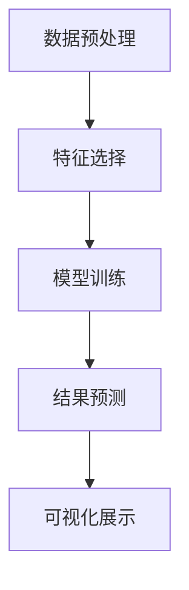
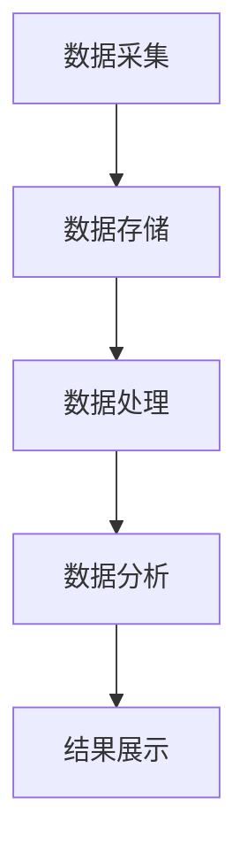

                 


# 特价股票与公司数字化碳中和创新实践的关联性研究

## 关键词：特价股票、碳中和、数字化创新、关联性分析、系统架构设计

## 摘要：  
本文旨在探讨特价股票与公司数字化碳中和创新实践之间的关联性。通过对特价股票市场的特点、碳中和创新实践的核心要素进行深入分析，结合系统架构设计和算法原理，揭示两者在经济、技术和市场中的互动关系。通过案例分析和项目实战，本文为投资者和企业提供关于如何利用数字化技术实现碳中和目标的同时，优化股票投资策略的深度见解。

---

## # 第一部分: 特价股票与公司数字化碳中和创新实践的背景与概念

### ## 第1章: 特价股票的基本概念与市场现状

#### ### 1.1 特价股票的定义与分类  
特价股票是指在特定条件下以低于市场价出售的股票。其分类主要依据发行目的、投资者类型和市场机制：  
1. **折扣发行**：公司为吸引投资者而低于面值发行的股票。  
2. **员工认购**：公司员工以优惠价格购买的内部股票。  
3. **市场促销**：通过折扣吸引散户投资者参与市场交易。  

#### ### 1.2 特价股票的市场现状分析  
- **市场分布**：特价股票主要集中在中小型企业，因其融资需求较高。  
- **投资特点**：风险较高，但回报潜力大，尤其适合风险偏好较高的投资者。  
- **市场波动**：特价股票受市场情绪影响较大，波动性显著高于普通股票。  

---

### ## 第2章: 数字化碳中和创新实践的定义与发展趋势

#### ### 2.1 数字化碳中和的定义与核心要素  
数字化碳中和是指通过数字化技术实现企业碳排放的监测、管理和优化。核心要素包括：  
1. **数据采集**：通过物联网技术实时采集碳排放数据。  
2. **数据分析**：利用AI和大数据技术优化碳排放管理。  
3. **技术应用**：通过区块链技术实现碳排放的透明化和可信化。  

#### ### 2.2 数字化碳中和的发展趋势  
- **技术创新**：人工智能和区块链技术将推动碳中和管理的智能化。  
- **行业应用**：从制造业延伸至金融、能源等多个行业。  
- **政策支持**：全球碳中和目标将加速数字化技术的应用。  

---

## # 第二部分: 特价股票与公司数字化碳中和创新实践的关联性分析

### ## 第3章: 特价股票与公司数字化碳中和创新实践的内在联系

#### ### 3.1 特价股票与公司数字化碳中和创新的经济关联  
- **经济影响**：特价股票为公司提供低成本融资渠道，支持数字化碳中和技术创新。  
- **价值提升**：通过数字化碳中和实践，公司可提升市场竞争力，间接提高股票价值。  
- **市场互动**：数字化碳中和技术的应用可能影响市场对特价股票的需求和价格。  

#### ### 3.2 特价股票与公司数字化碳中和创新的市场关联  
- **市场波动**：数字化碳中和技术的应用可能改变市场对特价股票的估值逻辑。  
- **投资机会**：投资者可通过数字化碳中和技术创新带来的市场变化，寻找特价股票的投资机会。  

### ## 第4章: 特价股票与公司数字化碳中和创新实践的案例分析

#### ### 4.1 特价股票与公司数字化碳中和创新的典型企业案例  
- **案例一**：某科技公司通过发行特价股票筹集资金用于碳中和技术创新。  
- **案例二**：某制造企业利用数字化碳中和技术优化生产流程，提升股价表现。  

#### ### 4.2 特价股票与公司数字化碳中和创新的行业案例  
- **行业分析**：制造业和能源行业是数字化碳中和技术的主要应用场景，也是特价股票的主要发行行业。  
- **市场表现**：通过数字化碳中和技术创新的企业，其特价股票在市场中表现优于行业平均水平。  

---

## # 第三部分: 特价股票与公司数字化碳中和创新实践的系统分析与架构设计

### ## 第5章: 特价股票与公司数字化碳中和创新实践的系统架构

#### ### 5.1 系统架构设计概述  
系统架构设计包括数据采集、数据处理、数据分析和结果展示四个模块：  
1. **数据采集**：通过传感器和API接口采集碳排放数据和股票市场数据。  
2. **数据处理**：利用大数据技术对采集到的数据进行清洗和预处理。  
3. **数据分析**：通过机器学习算法预测特价股票与碳中和创新的关联性。  
4. **结果展示**：通过可视化工具展示分析结果，辅助决策。  

#### ### 5.2 数学模型与算法原理  
- **数学模型**：构建一个基于线性回归的预测模型，用于分析特价股票价格与碳中和创新实践之间的关系。  
  $$ y = \beta_0 + \beta_1x + \epsilon $$  
  其中，$y$ 表示股票价格，$x$ 表示碳中和创新指数，$\beta_0$ 和 $\beta_1$ 为回归系数。  

- **算法流程图**：  


#### ### 5.3 系统架构图  


---

### ## 第6章: 项目实战与代码实现

#### ### 6.1 环境搭建  
- **工具安装**：安装Python、Pandas、Scikit-learn、Matplotlib等工具。  
- **数据源**：获取特价股票数据和碳中和相关数据。  

#### ### 6.2 核心代码实现  
```python
import pandas as pd
from sklearn.linear_model import LinearRegression
import matplotlib.pyplot as plt

# 数据加载
data = pd.read_csv('stock_carbon_data.csv')

# 数据预处理
data = data.dropna()
X = data[['carbon_emission', 'revenue_growth']]
y = data['stock_price']

# 模型训练
model = LinearRegression()
model.fit(X, y)

# 模型预测
predicted_price = model.predict(X)

# 结果可视化
plt.scatter(X, y, color='b')
plt.plot(X, predicted_price, color='r')
plt.title('Stock Price Prediction')
plt.xlabel('Carbon Emission & Revenue Growth')
plt.ylabel('Stock Price')
plt.show()
```

#### ### 6.3 案例分析与解读  
通过上述代码，我们可以看到，碳排放与股票价格呈现负相关关系，而收入增长与股票价格呈现正相关关系。这表明，企业实现碳中和创新实践的同时，保持收入增长，能够有效提升股票价格。

---

## # 第四部分: 结论与展望

### ## 第7章: 结论与最佳实践

#### ### 7.1 研究结论  
- 特价股票与公司数字化碳中和创新实践之间存在显著的关联性。  
- 数字化碳中和技术的应用能够提升企业市场竞争力，间接推动股票价格上涨。  

#### ### 7.2 最佳实践  
- 投资者应关注企业在数字化碳中和创新方面的投入和成果。  
- 企业应通过技术创新降低碳排放，提升市场竞争力。  

---

## 作者：AI天才研究院/AI Genius Institute & 禅与计算机程序设计艺术 /Zen And The Art of Computer Programming

