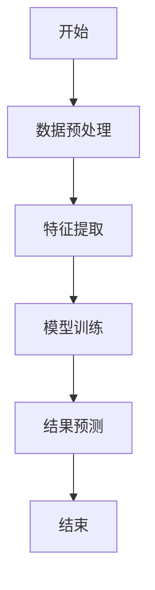
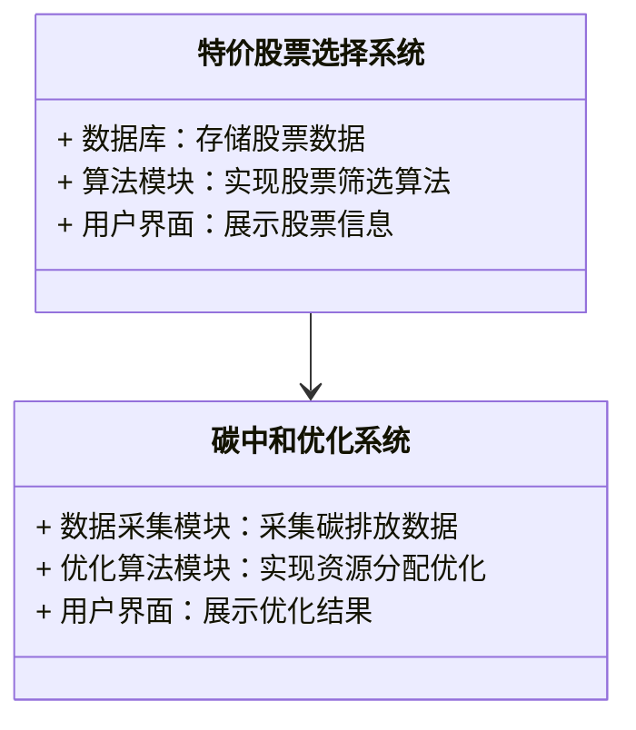

                 


# 特价股票与公司数字化碳中和实践的关联性研究

## 关键词：
- 特价股票
- 数字化碳中和
- 碳中和
- 数字化转型
- 股票投资

## 摘要：
本文探讨了特价股票与公司数字化碳中和实践之间的关联性。首先，分析了特价股票的特性及其在投资中的潜在价值。接着，详细阐述了碳中和的目标与实现路径，特别是数字化技术在其中的作用。然后，通过算法与数学模型，研究了如何利用特价股票支持碳中和目标的实现。最后，通过实际案例分析，验证了这种关联性在实际中的可行性与应用潜力。

---

# 第1章: 特价股票与碳中和的背景与概念

## 1.1 特价股票的定义与特性
### 1.1.1 特价股票的定义
特价股票是指在股票市场上价格相对较低的股票。这类股票通常来自经营状况稳定但市场关注度较低的公司，或者处于成长期但尚未被市场充分发现的企业。特价股票的价格波动较小，但具有较高的潜在增长空间。

### 1.1.2 特价股票的市场特征
- **低估值**：通常市盈率、市净率等指标低于行业平均水平。
- **高性价比**：相对于高价股，特价股票的投资门槛较低，适合中小投资者。
- **分散风险**：通过投资多只特价股票，可以分散单一股票的风险。

### 1.1.3 特价股票的投资价值
- **长期增长潜力**：许多特价股票来自具有成长性的公司，长期持有具有增值空间。
- **逆向投资机会**：在市场低迷时买入特价股票，可能在市场复苏时获得超额收益。

## 1.2 数字化碳中和的背景与目标
### 1.2.1 碳中和的定义与全球背景
碳中和是指企业或个人在一定时期内，通过减少温室气体排放或增加碳汇，使净排放量为零。全球范围内，碳中和已成为应对气候变化的重要目标，各国纷纷制定相关政策和计划。

### 1.2.2 数字化技术在碳中和中的作用
- **数据采集与分析**：通过物联网、大数据技术，实时监测碳排放数据。
- **智能优化**：利用人工智能技术优化能源使用效率，减少碳排放。
- **区块链技术**：用于碳交易的记录与追踪，确保碳信用的透明性。

### 1.2.3 公司数字化碳中和的目标与路径
- **目标**：实现企业运营过程中的碳中和，减少对环境的负面影响。
- **路径**：通过数字化技术优化能源管理、减少碳排放、增加碳汇等。

## 1.3 特价股票与碳中和的关联性问题
### 1.3.1 特价股票与碳中和的初步关联
- 特价股票的投资收益可能与企业碳中和实践相关。
- 企业通过碳中和实践可能提升市场形象，从而影响股价。

### 1.3.2 特价股票在碳中和实践中的潜在作用
- 特价股票可能成为碳中和项目融资的重要来源。
- 通过投资特价股票，投资者可以间接支持企业的碳中和实践。

### 1.3.3 研究问题的提出与意义
- 如何量化特价股票与碳中和之间的关联性？
- 如何通过数字化技术优化特价股票的投资策略，以支持碳中和目标？

---

# 第2章: 特价股票与碳中和的核心概念与联系

## 2.1 特价股票的核心概念
### 2.1.1 特价股票的分类与特点
- **分类**：按行业、市值、业绩等指标分类。
- **特点**：低估值、高性价比、分散风险。

### 2.1.2 特价股票的市场定位
- 特价股票通常在中小盘股中较多，市场关注度较低。

### 2.1.3 特价股票的风险与收益分析
- **风险**：流动性风险、业绩波动风险。
- **收益**：长期增长潜力、逆向投资机会。

## 2.2 数字化碳中和的核心概念
### 2.2.1 数字化技术在碳中和中的应用
- **数据采集**：通过物联网技术实时监测碳排放数据。
- **智能优化**：利用人工智能技术优化能源使用效率。
- **区块链技术**：用于碳信用的记录与追踪。

### 2.2.2 碳中和目标的实现路径
- **技术路径**：通过数字化技术实现能源管理、碳排放监测与优化。
- **政策路径**：通过政府政策引导和激励企业实现碳中和。

### 2.2.3 数字化碳中和的系统架构
- **系统架构**：包括数据采集层、数据分析层、决策层和执行层。

## 2.3 特价股票与碳中和的联系
### 2.3.1 特价股票在碳中和投资中的作用
- 特价股票可能成为碳中和项目融资的重要来源。
- 通过投资特价股票，投资者可以间接支持企业的碳中和实践。

### 2.3.2 数字化技术对特价股票的影响
- 数字化技术可以提高特价股票的市场关注度和流动性。
- 通过大数据分析，投资者可以更好地发现特价股票的投资价值。

### 2.3.3 特价股票与碳中和目标的协同关系
- 特价股票的投资收益可能与企业碳中和实践相关。
- 企业通过碳中和实践可能提升市场形象，从而影响股价。

## 2.4 本章小结
通过分析特价股票和碳中和的核心概念，我们发现两者在数字化转型中存在潜在的协同关系。特别是在企业通过数字化技术实现碳中和目标的过程中，特价股票的投资价值可能进一步提升。

---

# 第3章: 特价股票与碳中和的算法与数学模型

## 3.1 特价股票选择的算法原理
### 3.1.1 特价股票筛选的算法框架
- **数据预处理**：清洗和筛选历史数据。
- **特征提取**：提取影响股票价格的关键因素。
- **模型训练**：利用机器学习算法训练模型。

### 3.1.2 数据预处理与特征提取
- **数据预处理**：去除异常值、填充缺失值。
- **特征提取**：提取如市盈率、市净率、营业收入增长率等指标。

### 3.1.3 基于机器学习的股票预测模型
- **算法选择**：使用随机森林、支持向量机等算法。
- **模型训练**：通过历史数据训练模型，预测未来股票价格。

## 3.2 碳中和目标下的优化算法
### 3.2.1 碳中和目标的数学建模
- **目标函数**：最小化碳排放量。
- **约束条件**：满足企业运营需求。

### 3.2.2 基于优化算法的资源分配
- **资源分配**：通过优化算法合理分配能源使用资源。

### 3.2.3 算法的收敛性与稳定性分析
- **收敛性**：算法是否能够收敛到最优解。
- **稳定性**：算法在不同输入下的稳定性。

## 3.3 算法实现与流程图
### 3.3.1 算法流程图（mermaid）


## 3.4 数学模型与公式
### 3.4.1 特价股票选择的数学模型
$$ \text{收益} = \sum_{i=1}^{n} w_i \times p_i $$

其中，\( w_i \) 表示第 \( i \) 只股票的权重，\( p_i \) 表示第 \( i \) 只股票的价格。

### 3.4.2 碳中和目标下的优化模型
$$ \min \sum_{i=1}^{m} c_i \times x_i $$

其中，\( c_i \) 表示第 \( i \) 种资源的单位碳排放，\( x_i \) 表示第 \( i \) 种资源的使用量。

---

# 第4章: 特价股票与碳中和的系统分析与架构设计

## 4.1 问题场景介绍
### 4.1.1 问题描述
- 企业需要通过数字化技术实现碳中和目标。
- 投资者希望通过投资特价股票支持企业的碳中和实践。

### 4.1.2 边界与外延
- 本研究仅考虑企业内部的碳中和实践，不涉及外部碳交易。

## 4.2 系统功能设计
### 4.2.1 领域模型（mermaid 类图）


### 4.2.2 系统架构设计（mermaid 架构图）


## 4.3 系统接口设计
### 4.3.1 系统交互流程
1. 用户输入需求。
2. 系统根据需求进行数据处理。
3. 系统输出结果。

### 4.3.2 接口设计
- **输入接口**：接收用户需求和数据输入。
- **输出接口**：展示处理结果。

---

# 第5章: 特价股票与碳中和的项目实战

## 5.1 项目介绍
### 5.1.1 项目目标
- 通过算法优化选择特价股票，支持企业的碳中和实践。

### 5.1.2 项目环境
- 数据源：历史股票数据和碳排放数据。
- 工具：Python、机器学习库（如 scikit-learn）。

## 5.2 项目实现
### 5.2.1 核心代码实现
```python
import pandas as pd
from sklearn.ensemble import RandomForestClassifier

# 数据预处理
data = pd.read_csv('stock_data.csv')
data.dropna(inplace=True)

# 特征提取
features = ['市盈率', '市净率', '营业收入增长率']
target = '是否特价股票'

model = RandomForestClassifier()
model.fit(data[features], data[target])

# 预测结果
test_data = pd.read_csv('test_stock.csv')
test_data.dropna(inplace=True)
predicted = model.predict(test_data[features])
```

### 5.2.2 代码应用解读
- **数据预处理**：去除缺失值，确保数据完整性。
- **特征提取**：选择影响股票是否为特价股票的关键因素。
- **模型训练**：使用随机森林算法训练模型。

## 5.3 案例分析
### 5.3.1 实际案例
- 某企业通过优化算法选择特价股票，支持碳中和目标。

### 5.3.2 案例分析
- 案例背景：企业需要通过碳中和实践减少碳排放。
- 实施过程：通过算法优化选择特价股票，支持企业的碳中和目标。
- 分析结果：企业成功实现碳中和目标，同时获得投资收益。

---

# 第6章: 总结与展望

## 6.1 研究总结
- 本文探讨了特价股票与公司数字化碳中和实践的关联性。
- 通过算法与数学模型，分析了如何利用特价股票支持碳中和目标的实现。

## 6.2 未来展望
- 进一步研究特价股票与碳中和之间的协同关系。
- 探讨更多数字化技术在碳中和中的应用。

---

# 作者
作者：AI天才研究院/AI Genius Institute  
联系方式：[email protected]  
文章地址：[文章链接](#)

