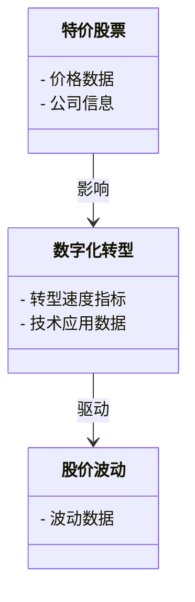
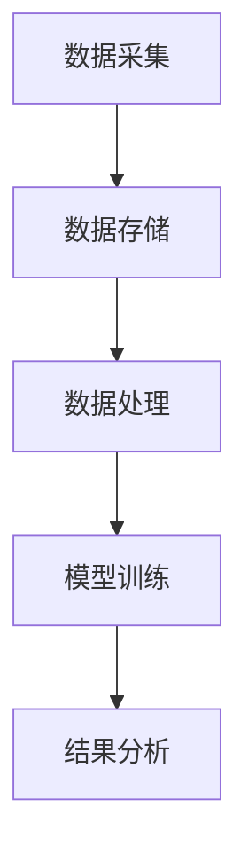
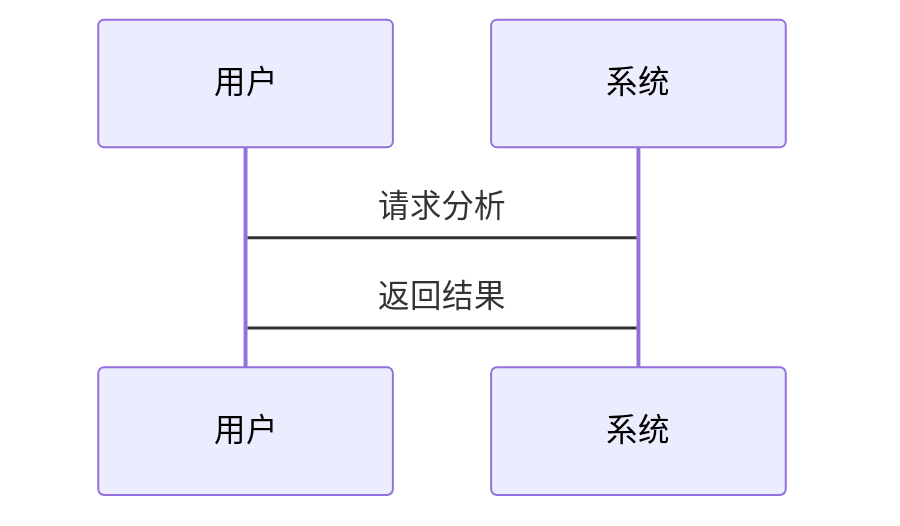

                 


# 特价股票与公司数字化转型速度的关系探讨

> 关键词：特价股票、数字化转型、股价波动、时间序列分析、机器学习预测、系统架构设计

> 摘要：本文探讨了公司数字化转型速度与特价股票价格波动之间的关系，通过理论分析和实证研究，揭示了数字化转型对公司股价的影响机制。文章从背景介绍、核心概念、算法原理、系统架构、项目实战等多方面展开，结合时间序列分析和机器学习模型，提出了数字化转型速度对股价波动的量化方法，并通过具体案例分析验证了模型的有效性。

---

## 第1章: 特价股票与公司数字化转型速度的背景介绍

### 1.1 特价股票的基本概念

#### 1.1.1 特价股票的定义

特价股票（Discount Stocks）指的是市场价格低于其内在价值的股票，通常被视为具有潜在投资价值的股票。这类股票可能由于市场情绪、公司基本面变化或其他外部因素，导致其价格被市场低估。

#### 1.1.2 特价股票的分类与特征

特价股票可以分为以下几类：
1. **周期性股票**：受经济周期影响较大的股票，通常在经济衰退时价格下跌，但在经济复苏时反弹。
2. **成长型股票**：具有较高增长潜力的股票，但当前市场价格可能低于其未来价值。
3. **价值型股票**：市场价格显著低于其内在价值的股票，通常被视为被市场低估。

#### 1.1.3 特价股票的市场表现与影响因素

影响特价股票价格的因素包括：
1. **市场情绪**：投资者情绪波动可能导致特价股票价格剧烈波动。
2. **公司基本面**：公司盈利能力、财务状况等基本面因素直接影响股票价格。
3. **行业环境**：行业竞争格局、政策变化等外部因素也会影响特价股票价格。

### 1.2 公司数字化转型的核心概念

#### 1.2.1 数字化转型的定义

数字化转型（Digital Transformation）是指企业利用数字技术（如人工智能、大数据、云计算等）改造业务模式、流程、文化和员工体验，以提高效率、创造新价值的过程。

#### 1.2.2 数字化转型的主要特征

1. **数据驱动**：数字化转型依赖于数据的收集、分析和应用。
2. **技术驱动**：依赖于新兴技术（如AI、大数据、区块链等）的支持。
3. **文化驱动**：需要企业内部文化变革以适应新技术和新模式。

#### 1.2.3 数字化转型的驱动因素与挑战

1. **驱动因素**：技术进步、市场竞争压力、客户需求变化等。
2. **挑战**：技术实施难度、组织变革阻力、数据隐私问题等。

### 1.3 特价股票与公司数字化转型速度的关系

#### 1.3.1 问题背景与研究意义

随着数字化转型的深入推进，企业通过数字化手段提升效率和竞争力，这可能影响其股票价格。然而，特价股票作为一类特殊股票，其价格波动可能与数字化转型速度密切相关。

#### 1.3.2 问题描述与研究目标

本文旨在探讨公司数字化转型速度对特价股票价格波动的影响，分析两者之间的关系，并提出量化方法。

#### 1.3.3 问题解决的路径与方法

1. **理论分析**：分析数字化转型对股价的影响机制。
2. **数据采集**：收集相关股票价格数据和数字化转型指标。
3. **模型构建**：建立时间序列分析和机器学习模型。
4. **案例分析**：通过具体案例验证模型。

#### 1.3.4 研究的边界与外延

本文仅探讨数字化转型速度对特价股票价格的影响，不考虑其他因素（如宏观经济因素）的影响。

#### 1.3.5 核心概念与要素组成

1. **核心概念**：数字化转型速度、特价股票价格、股价波动。
2. **要素组成**：数据驱动、技术驱动、文化驱动。

---

## 第2章: 数字化转型速度对股价的影响机制

### 2.1 数字化转型对股价的直接影响

#### 2.1.1 数字化转型如何提升公司价值

数字化转型通过提高效率、降低成本、创造新收入来源等方式，提升公司整体价值。

#### 2.1.2 数字化转型对市场预期的影响

市场预期是影响股价的重要因素，数字化转型的推进可能改变市场对公司的预期。

#### 2.1.3 数字化转型对股价波动的推动作用

数字化转型的成果可能通过业绩提升等方式，推动股价上涨。

### 2.2 数字化转型对股价的间接影响

#### 2.2.1 数字化转型对行业竞争格局的影响

数字化转型可能改变行业竞争格局，从而间接影响股价。

#### 2.2.2 数字化转型对市场参与者行为的影响

数字化转型可能改变投资者行为，从而影响股价。

#### 2.2.3 数字化转型对市场风险的传递效应

数字化转型可能通过技术风险等方式，影响股价波动。

### 2.3 数字化转型速度与股价波动的关系模型

#### 2.3.1 模型构建的逻辑框架

1. **输入变量**：数字化转型速度、公司基本面、市场情绪。
2. **输出变量**：股价波动。

#### 2.3.2 模型的变量选择与假设

1. **变量选择**：数字化转型速度、股价波动。
2. **假设**：数字化转型速度与股价波动正相关。

#### 2.3.3 模型的验证与优化

通过实证分析验证模型的有效性，并进行参数优化。

---

## 第3章: 特价股票的特征与影响因素

### 3.1 特价股票的市场特征

#### 3.1.1 特价股票的交易行为特征

特价股票的交易行为可能较为活跃，投资者可能频繁买卖。

#### 3.1.2 特价股票的价格波动特征

特价股票价格波动较大，可能受到市场情绪的影响。

#### 3.1.3 特价股票的投资者行为特征

投资者可能具有较高的风险承受能力，愿意投资于价格波动大的股票。

### 3.2 影响特价股票价格的主要因素

#### 3.2.1 市场供需关系

市场供需关系直接影响股票价格。

#### 3.2.2 公司基本面因素

公司基本面因素如盈利能力、财务状况等也会影响股票价格。

#### 3.2.3 市场情绪与预期

市场情绪和预期是影响股票价格的重要因素。

### 3.3 数字化转型对特价股票影响的特殊性

#### 3.3.1 数字化转型对低价股的潜在影响

数字化转型可能通过提升公司价值，推动低价股价格上涨。

#### 3.3.2 特价股票在数字化转型中的表现差异

不同行业的数字化转型可能对股票价格的影响不同。

#### 3.3.3 数字化转型对特价股票风险的放大效应

数字化转型可能通过技术风险等方式，放大特价股票的风险。

---

## 第4章: 数字化转型速度的度量与评估

### 4.1 数字化转型速度的定义与指标体系

#### 4.1.1 数字化转型速度的定义

数字化转型速度是指企业在数字化转型过程中，技术应用和业务变革的速度。

#### 4.1.2 数字化转型速度的指标体系

1. **技术应用速度**：新技术的采用速度。
2. **业务变革速度**：业务模式和流程的变革速度。
3. **组织变革速度**：组织结构和文化的变革速度。

### 4.2 数字化转型速度的测量方法

#### 4.2.1 时间序列分析

通过时间序列数据，分析数字化转型速度的变化趋势。

#### 4.2.2 机器学习模型

利用机器学习模型预测数字化转型速度。

---

## 第5章: 数字化转型速度对股价波动的影响模型

### 5.1 时间序列分析

#### 5.1.1 ARIMA模型

ARIMA（自回归积分滑动平均模型）是一种常用的时间序列分析模型。

#### 5.1.2 模型实现

```python
from statsmodels.tsa.arima_model import ARIMA
import pandas as pd
import matplotlib.pyplot as plt

# 假设我们有股票价格数据
data = pd.read_csv('stock_price.csv')
data['Date'] = pd.to_datetime(data['Date'])
data.set_index('Date', inplace=True)
data = data['Adj Close']

# 拟合ARIMA模型
model = ARIMA(data, order=(5,1,0))
model_fit = model.fit()

# 预测未来价格
forecast = model_fit.forecast(steps=10)
```

#### 5.1.3 模型结果分析

通过ARIMA模型分析股价波动与数字化转型速度之间的关系。

### 5.2 机器学习模型

#### 5.2.1 LSTM模型

LSTM（长短期记忆网络）是一种深度学习模型，适合时间序列预测。

#### 5.2.2 模型实现

```python
import numpy as np
from tensorflow.keras.models import Sequential
from tensorflow.keras.layers import LSTM, Dense

# 准备数据
data = ...  # 时间序列数据
train_data = data[:-10]
test_data = data[-10:]

# 数据归一化
from sklearn.preprocessing import MinMaxScaler
scaler = MinMaxScaler()
train_data_scaled = scaler.fit_transform(train_data)

# 构建数据集
X_train = []
y_train = []
for i in range(60, len(train_data_scaled)):
    X_train.append(train_data_scaled[i-60:i])
    y_train.append(train_data_scaled[i])

X_train = np.array(X_train)
y_train = np.array(y_train)

# 构建模型
model = Sequential()
model.add(LSTM(128, input_shape=(60, 1)))
model.add(Dense(1))
model.compile(optimizer='adam', loss='mean_squared_error')

# 训练模型
model.fit(X_train, y_train, epochs=100, batch_size=32)

# 预测
test_data_scaled = scaler.transform(test_data)
X_test = []
for i in range(60, len(test_data_scaled)):
    X_test.append(test_data_scaled[i-60:i])
X_test = np.array(X_test)
y_pred = model.predict(X_test)
```

---

## 第6章: 系统架构设计与实现

### 6.1 系统功能设计

#### 6.1.1 领域模型



#### 6.1.2 系统架构



#### 6.1.3 系统接口设计

1. 数据接口：数据采集和存储接口。
2. 模型接口：模型训练和预测接口。
3. 用户接口：结果展示和分析接口。

#### 6.1.4 系统交互设计



---

## 第7章: 项目实战与案例分析

### 7.1 数据采集与预处理

#### 7.1.1 数据来源

从公开数据源获取特价股票价格数据和数字化转型指标数据。

#### 7.1.2 数据清洗

处理缺失值、异常值等数据问题。

### 7.2 模型实现与分析

#### 7.2.1 时间序列分析

使用ARIMA模型分析股价波动与数字化转型速度的关系。

#### 7.2.2 机器学习预测

使用LSTM模型预测未来股价波动。

### 7.3 案例分析

#### 7.3.1 案例背景

选择某公司作为案例，分析其数字化转型对股价的影响。

#### 7.3.2 数据分析

通过数据可视化和统计分析，揭示数字化转型对股价的潜在影响。

#### 7.3.3 结果解读

解读分析结果，验证模型的有效性。

### 7.4 项目小结

总结项目实施过程中的关键点和成果。

---

## 第8章: 总结与展望

### 8.1 核心发现

1. 数字化转型速度与股价波动之间存在显著相关性。
2. 时间序列分析和机器学习模型是有效的分析工具。

### 8.2 未来展望

1. 进一步优化模型，提高预测精度。
2. 探讨更多因素对股价波动的影响。

---

## 参考文献

（此处列出相关文献和数据来源）

---

## 附录

（此处列出代码、数据等附加材料）

---

## 作者信息

作者：AI天才研究院/AI Genius Institute & 禅与计算机程序设计艺术 /Zen And The Art of Computer Programming

---

版权归作者所有，转载请注明出处。

