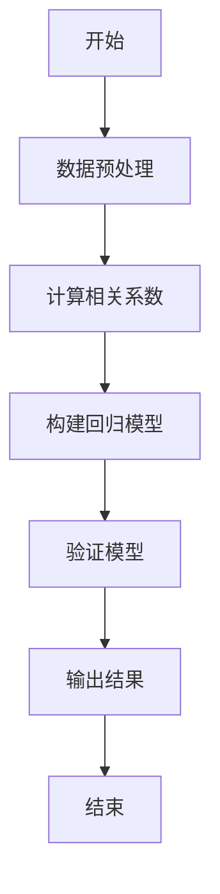

                 


# 特价股票与公司数字声誉资本积累的关联分析

> **关键词**: 特价股票, 数字声誉, 股票市场, 股价波动, 品牌价值

> **摘要**: 本文探讨特价股票与公司数字声誉之间的关联性，分析数字声誉如何影响股价波动，反之亦然。通过数据预处理、关联性分析和系统架构设计，结合具体案例，揭示两者之间的复杂关系，为投资者和公司提供实用建议。

---

## 第一部分：背景介绍

### 第1章：特价股票与公司数字声誉的背景介绍

#### 1.1 特价股票的定义与特点

- **1.1.1 特价股票的定义**  
  特价股票指的是价格相对较低的股票，通常被认为具有较高的投资潜力。这些股票可能来自中小型企业或处于特定周期的公司。

- **1.1.2 特价股票的特点**  
  - 价格波动较大，风险与收益并存。  
  - 市场流动性较低，交易量可能不大。  
  - 投资者情绪对股价影响显著。

- **1.1.3 特价股票的市场表现**  
  特价股票可能因市场波动、公司基本面变化或投资者情绪而出现大幅波动，具备较高的波动性和不确定性。

#### 1.2 公司数字声誉的定义与特点

- **1.2.1 数字声誉的定义**  
  数字声誉是指公司在数字平台上的形象和信誉，包括社交媒体、在线评价、新闻报道等。

- **1.2.2 数字声誉的核心要素**  
  - 在线评价：消费者和用户的反馈。  
  - 社交媒体影响力：公司在社交媒体上的活跃度和互动情况。  
  - 用户反馈：包括产品和服务的满意度。

- **1.2.3 数字声誉的影响因素**  
  - 公司的透明度和信息披露。  
  - 媒体报道和舆论导向。  
  - 用户互动和口碑传播。

#### 1.3 特价股票与公司数字声誉的关联性

- **1.3.1 关联性的背景**  
  随着数字化时代的到来，公司的数字声誉对投资者决策的影响日益显著。投资者不仅关注财务数据，还关注公司在社交媒体和在线平台上的形象。

- **1.3.2 关联性的研究现状**  
  当前研究多关注财务指标对股价的影响，而数字声誉对股价的影响尚未得到充分探讨。然而，数字声誉的变化可能引发股价波动，尤其是在特价股票市场。

- **1.3.3 研究的意义与价值**  
  本研究旨在揭示数字声誉与股价波动之间的关系，为投资者和公司提供新的视角，帮助他们更好地理解和应对市场变化。

---

## 第二部分：核心概念与联系

### 第2章：特价股票与公司数字声誉的核心概念

#### 2.1 特价股票的核心属性

- **2.1.1 市场流动性**  
  特价股票通常流动性较低，买卖价差可能较大。

- **2.1.2 价格波动性**  
  由于市场关注度较低，特价股票的价格波动可能较为剧烈。

- **2.1.3 投资者情绪**  
  投资者情绪对公司股价有直接影响，尤其是在信息不充分的情况下。

#### 2.2 公司数字声誉的核心属性

- **2.2.1 在线评价**  
  正面或负面的在线评价会影响公司的形象和市场信心。

- **2.2.2 社交媒体影响力**  
  公司在社交媒体上的活跃度和互动情况反映了其数字声誉的强弱。

- **2.2.3 用户反馈**  
  用户的反馈直接反映了公司产品和服务的质量，进而影响市场声誉。

#### 2.3 特价股票与数字声誉的属性对比

- **2.3.1 对比表格**

| 属性           | 特价股票                          | 数字声誉                          |
|----------------|----------------------------------|----------------------------------|
| 定义           | 价格较低的股票                   | 数字平台上的公司形象              |
| 核心要素       | 价格、流动性、投资者情绪         | 在线评价、社交媒体影响力、用户反馈|
| 影响因素       | 市场供需、公司基本面、投资者情绪 | 媒体报道、用户互动、信息披露      |
| 波动性          | 高                               | 高                               |

- **2.3.2 ER实体关系图**

```mermaid
erd
  company: 公司
  stock_price: 股票价格
  digital_reputation: 数字声誉
  online_reviews: 在线评价
  social_media: 社交媒体
  user_feedback: 用户反馈

  company --> stock_price: 影响
  company --> digital_reputation: 影响
  digital_reputation --> online_reviews: 反映
  digital_reputation --> social_media: 反映
  digital_reputation --> user_feedback: 反映
```

---

## 第三部分：算法原理讲解

### 第3章：关联性分析的算法原理

#### 3.1 数据预处理

- **3.1.1 数据清洗**  
  删除无效数据和异常值，确保数据质量和一致性。

- **3.1.2 数据标准化**  
  对不同量纲的数据进行标准化处理，便于后续分析。

#### 3.2 特价股票与数字声誉的关联性分析

- **3.2.1 相关性分析**  
  使用相关系数（Pearson、Spearman）衡量变量之间的相关性。

- **3.2.2 回归分析**  
  通过线性回归模型预测数字声誉对股价的影响。

- **3.2.3 时间序列分析**  
  分析数字声誉的时间变化与股价波动的关系。

#### 3.3 算法流程图



#### 3.4 Python代码实现

```python
import pandas as pd
import numpy as np
from sklearn.linear_model import LinearRegression
from sklearn.metrics import r2_score

# 数据预处理
data = pd.read_csv('data.csv')
data = data.dropna()
data['Digital Reputation'] = data['Digital Reputation'].astype(float)

# 相关性分析
correlation = data['Digital Reputation'].corr(data['Stock Price'])
print(f"相关系数：{correlation}")

# 回归分析
model = LinearRegression()
model.fit(data[['Digital Reputation']], data['Stock Price'])
predictions = model.predict(data[['Digital Reputation']])
r2 = r2_score(data['Stock Price'], predictions)
print(f"R²值：{r2}")
```

#### 3.5 数学公式

- **相关系数公式**  
  $$ r = \frac{\sum (x_i - \bar{x})(y_i - \bar{y})}{\sqrt{\sum (x_i - \bar{x})^2 \sum (y_i - \bar{y})^2}} $$

- **回归模型公式**  
  $$ y = a + bx + \epsilon $$

---

## 第四部分：系统分析与架构设计

### 第4章：系统分析与架构设计方案

#### 4.1 问题场景介绍

- 数据来源：社交媒体、新闻网站、在线评价平台。
- 数据处理：清洗、标准化、关联性分析。

#### 4.2 项目介绍

- 开发一个分析系统，量化数字声誉对股价的影响。

#### 4.3 系统功能设计

- 数据收集模块：爬取数字声誉数据。
- 数据分析模块：计算相关性、构建回归模型。
- 数据可视化模块：展示分析结果。

#### 4.4 系统架构设计


---

## 第五部分：项目实战

### 第5章：项目实战

#### 5.1 环境安装

- 安装Python、Pandas、Scikit-learn、Matplotlib。

#### 5.2 核心实现源代码

```python
import pandas as pd
import numpy as np
import matplotlib.pyplot as plt
from sklearn.linear_model import LinearRegression
from sklearn.metrics import r2_score

# 数据预处理
data = pd.read_csv('data.csv')
data = data.dropna()
data['Digital Reputation'] = data['Digital Reputation'].astype(float)

# 相关性分析
correlation = data['Digital Reputation'].corr(data['Stock Price'])
print(f"相关系数：{correlation}")

# 回归分析
model = LinearRegression()
model.fit(data[['Digital Reputation']], data['Stock Price'])
predictions = model.predict(data[['Digital Reputation']])
r2 = r2_score(data['Stock Price'], predictions)
print(f"R²值：{r2}")

# 数据可视化
plt.scatter(data['Digital Reputation'], data['Stock Price'])
plt.plot(data['Digital Reputation'], predictions, color='red')
plt.xlabel('Digital Reputation')
plt.ylabel('Stock Price')
plt.show()
```

#### 5.3 案例分析

- 案例：假设一家公司数字声誉提升，股价随之上涨。

---

## 第六部分：最佳实践

### 第6章：最佳实践

#### 6.1 小结

- 数字声誉对特价股票的影响显著，投资者需关注公司在线形象。

#### 6.2 注意事项

- 数据质量影响分析结果，需确保数据准确性和完整性。

#### 6.3 拓展阅读

- 推荐阅读《股票市场分析》和《数字声誉管理》。

---

## 作者

**作者：AI天才研究院 & 禅与计算机程序设计艺术**

---

本文通过系统化的分析，揭示了特价股票与公司数字声誉之间的复杂关系，为投资者和公司提供了实用的分析工具和建议。希望本文能为相关领域的研究和实践提供有价值的参考。

