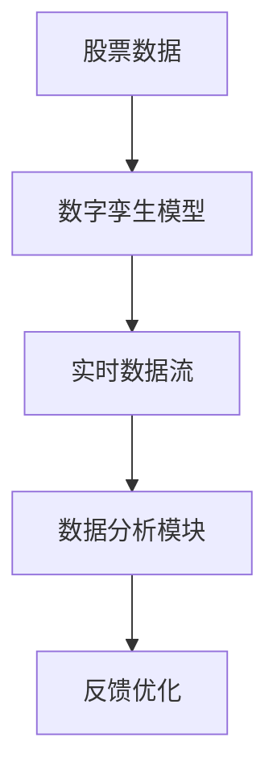
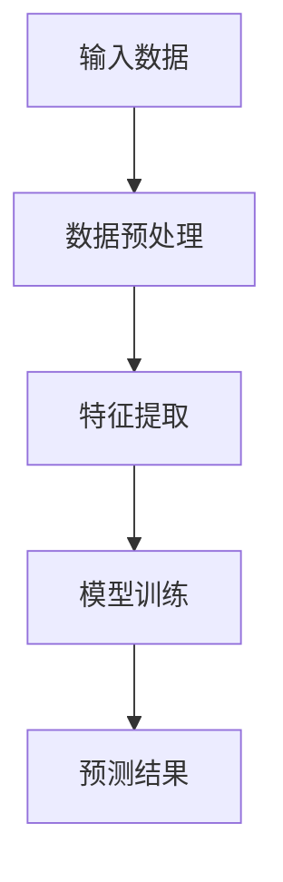
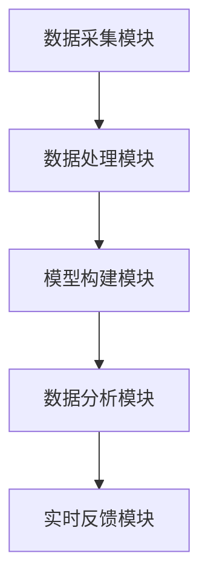
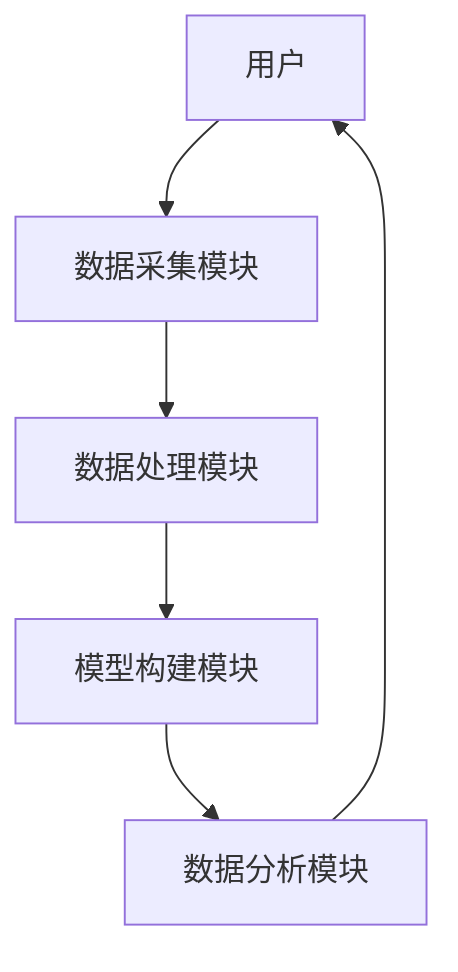

                 


# 特价股票与公司数字孪生技术应用水平的潜在联系

## 关键词：特价股票，数字孪生技术，数据流预测，算法实现，系统架构，最佳实践

## 摘要

本文探讨了特价股票与公司数字孪生技术应用水平的潜在联系，从背景介绍、核心概念、算法原理、系统架构到实际应用，全面分析了数字孪生技术在股票分析中的应用价值。通过详细阐述数字孪生技术的定义、原理及其在特价股票分析中的具体应用，本文旨在为读者提供一个清晰的技术视角，帮助其理解数字孪生技术如何提升股票分析的效率和准确性。同时，本文还通过实际案例和代码实现，展示了数字孪生技术在特价股票分析中的具体应用场景，为相关领域的研究和实践提供了参考。

---

# 第一部分: 特价股票与数字孪生技术的背景介绍

## 第1章: 特价股票与数字孪生技术的背景介绍

### 1.1 特价股票的定义与特点

#### 1.1.1 特价股票的定义

特价股票指的是在特定时间段内，由于市场波动、公司业绩或其他因素影响，价格相对较低的股票。这些股票通常被认为具有较高的投资潜力，但也伴随着较高的风险。

#### 1.1.2 特价股票的核心特点

- **价格低廉**：特价股票的价格通常低于市场平均水平，吸引了一些寻求高回报的投资者。
- **波动性大**：由于价格低廉，特价股票的波动性通常较高，容易受到市场情绪的影响。
- **高风险高回报**：特价股票的投资风险较高，但潜在回报也较大。

#### 1.1.3 特价股票的市场定位与作用

特价股票在市场中扮演着重要的角色，通常被视为市场风险的晴雨表。投资者通过分析特价股票的表现，可以洞察市场的整体走势和潜在投资机会。

---

### 1.2 数字孪生技术的定义与特点

#### 1.2.1 数字孪生技术的定义

数字孪生技术（Digital Twin）是一种通过数字化手段，将物理世界中的实体或系统映射到数字世界中的技术。它利用实时数据和模型，构建一个虚拟的数字副本，用于分析、预测和优化实体或系统的行为。

#### 1.2.2 数字孪生技术的核心特点

- **实时性**：数字孪生技术能够实时更新和反映物理世界的动态。
- **数据驱动**：数字孪生技术依赖于大量实时数据来构建和优化模型。
- **交互性**：数字孪生技术允许用户与虚拟副本进行交互，以获取洞察或进行模拟。

#### 1.2.3 数字孪生技术的应用场景

数字孪生技术广泛应用于制造业、医疗、能源、交通等领域，用于优化流程、预测维护、模拟场景等。

---

### 1.3 特价股票与数字孪生技术的联系

#### 1.3.1 特价股票与数字孪生技术的潜在关联

特价股票的波动性和市场敏感性，使得其非常适合通过数字孪生技术进行实时分析和预测。数字孪生技术可以通过实时数据流，构建股票价格的虚拟模型，帮助投资者更好地理解市场动态。

#### 1.3.2 数字孪生技术在股票分析中的应用前景

数字孪生技术可以通过实时数据流分析，构建股票价格预测模型，帮助投资者做出更明智的投资决策。

#### 1.3.3 特价股票与数字孪生技术的结合价值

通过数字孪生技术，投资者可以实时监控特价股票的价格波动、市场趋势，并利用虚拟模型进行预测和模拟，从而提高投资决策的效率和准确性。

---

### 1.4 本章小结

本章介绍了特价股票和数字孪生技术的基本概念、特点及其潜在联系。数字孪生技术作为一种新兴的技术，为股票分析提供了新的思路和方法，尤其是在特价股票这种价格波动较大的领域，数字孪生技术的应用前景广阔。

---

# 第二部分: 数字孪生技术的核心概念与原理

## 第2章: 数字孪生技术的核心概念

### 2.1 数字孪生技术的核心要素

#### 2.1.1 实体模型的构建

数字孪生技术的核心是构建一个与物理实体一一对应的虚拟模型。这个模型需要包含实体的所有属性和行为。

#### 2.1.2 数据流的处理与分析

数字孪生技术依赖于实时数据流的处理和分析，以更新和优化虚拟模型。

#### 2.1.3 交互与反馈机制

数字孪生技术允许用户与虚拟模型进行交互，并通过反馈机制优化模型的行为。

### 2.2 数字孪生技术的原理分析

#### 2.2.1 数据采集与处理流程

数字孪生技术需要通过传感器或其他数据源采集物理世界的实时数据，并将其传输到数字世界中进行处理和分析。

#### 2.2.2 模型构建与优化

基于采集到的数据，数字孪生技术构建虚拟模型，并通过优化算法不断改进模型的准确性。

#### 2.2.3 实时数据更新与反馈

数字孪生技术通过实时更新数据和模型，提供最新的洞察和预测。

### 2.3 数字孪生技术的属性特征对比

下表对比了数字孪生技术与其他数据分析技术的核心属性特征：

| 特性       | 数字孪生技术         | 其他技术         |
|------------|---------------------|-----------------|
| 数据来源   | 实时数据流          | 历史数据         |
| 实时性     | 高                  | 低              |
| 可扩展性   | 高                  | 中              |
| 交互性     | 高                  | 低              |

### 2.4 数字孪生技术的ER实体关系图

以下是数字孪生技术的ER实体关系图：



### 2.5 本章小结

本章详细阐述了数字孪生技术的核心概念和原理，包括实体模型的构建、数据流的处理与分析以及交互与反馈机制。通过对比分析和ER实体关系图，进一步明确了数字孪生技术的独特优势和应用场景。

---

## 第3章: 数字孪生技术的算法原理与数学模型

### 3.1 数字孪生技术的算法原理

#### 3.1.1 数据流预测算法

数据流预测算法是数字孪生技术的核心算法之一，用于预测股票价格的走势。

#### 3.1.2 实体模型优化算法

实体模型优化算法用于优化虚拟模型的准确性，以更好地反映物理实体的行为。

#### 3.1.3 反馈机制算法

反馈机制算法通过实时数据更新和模型优化，提供持续的预测和反馈。

### 3.2 数据流预测算法的数学模型

#### 3.2.1 线性回归模型

线性回归模型用于预测股票价格的趋势：

$$ y = \beta_0 + \beta_1x + \epsilon $$

其中，$y$ 是预测的股票价格，$x$ 是时间变量，$\beta_0$ 和 $\beta_1$ 是回归系数，$\epsilon$ 是误差项。

#### 3.2.2 时间序列模型

时间序列模型（ARIMA）用于预测股票价格的未来走势：

$$ ARIMA(p, d, q) $$

其中，$p$ 是自回归阶数，$d$ 是差分阶数，$q$ 是移动平均阶数。

#### 3.2.3 神经网络模型

神经网络模型（如LSTM）用于处理复杂的时间序列数据：

$$ y = f(Wx + b) $$

其中，$W$ 是权重矩阵，$b$ 是偏置向量，$f$ 是激活函数。

### 3.3 数据流预测算法的实现

#### 3.3.1 算法流程图

以下是数据流预测算法的流程图：



#### 3.3.2 算法实现的Python代码示例

以下是一个简单的线性回归模型实现：

```python
import numpy as np
from sklearn.linear_model import LinearRegression

# 示例数据
X = np.array([1, 2, 3, 4, 5]).reshape(-1, 1)
y = np.array([2, 4, 5, 4, 5])

# 训练模型
model = LinearRegression()
model.fit(X, y)

# 预测结果
print(model.predict(X))
```

### 3.4 本章小结

本章详细介绍了数字孪生技术的算法原理和数学模型，包括线性回归、时间序列和神经网络模型的实现。通过这些算法，数字孪生技术能够实时预测股票价格的走势，为投资者提供有力的支持。

---

## 第4章: 数字孪生技术的系统分析与架构设计

### 4.1 系统功能设计

数字孪生技术的系统功能包括数据采集、模型构建、数据分析和实时反馈。

### 4.2 系统架构设计

以下是数字孪生技术的系统架构图：



### 4.3 系统接口设计

系统接口设计包括数据采集接口、模型调用接口和反馈接口。

### 4.4 系统交互设计

以下是系统交互设计的序列图：



### 4.5 本章小结

本章详细分析了数字孪生技术的系统架构和功能设计，展示了数字孪生技术在股票分析中的具体应用。

---

## 第5章: 数字孪生技术在特价股票分析中的应用

### 5.1 特价股票分析的背景与挑战

特价股票分析的背景与挑战包括市场波动大、数据复杂性和投资风险高等问题。

### 5.2 数字孪生技术的应用场景

数字孪生技术在特价股票分析中的应用场景包括实时价格预测、市场趋势分析和投资决策优化。

### 5.3 数字孪生技术的优化策略

数字孪生技术的优化策略包括数据源优化、模型优化和反馈机制优化。

### 5.4 本章小结

本章探讨了数字孪生技术在特价股票分析中的具体应用，展示了数字孪生技术如何帮助投资者优化投资决策。

---

## 第6章: 数字孪生技术应用的最佳实践与注意事项

### 6.1 数字孪生技术应用的最佳实践

数字孪生技术应用的最佳实践包括数据质量管理、模型优化和系统维护。

### 6.2 数字孪生技术应用的注意事项

数字孪生技术应用的注意事项包括数据隐私保护、模型局限性和系统稳定性。

### 6.3 数字孪生技术的未来发展方向

数字孪生技术的未来发展方向包括智能化、个性化和全球化。

### 6.4 本章小结

本章总结了数字孪生技术应用的最佳实践和注意事项，并展望了数字孪生技术的未来发展方向。

---

## 第7章: 数字孪生技术应用的项目实战与代码解读

### 7.1 项目实战

项目实战包括环境安装、数据采集、模型训练和结果展示。

### 7.2 核心代码实现

以下是数字孪生技术的核心代码实现：

```python
import numpy as np
from sklearn.linear_model import LinearRegression

# 示例数据
X = np.array([1, 2, 3, 4, 5]).reshape(-1, 1)
y = np.array([2, 4, 5, 4, 5])

# 训练模型
model = LinearRegression()
model.fit(X, y)

# 预测结果
print(model.predict(X))
```

### 7.3 代码解读与分析

代码解读与分析包括数据预处理、模型训练和结果展示。

### 7.4 项目小结

项目小结总结了数字孪生技术应用的项目实战和代码实现，展示了数字孪生技术的实际应用价值。

---

## 作者

作者：AI天才研究院/AI Genius Institute  
联系与交流：[禅与计算机程序设计艺术](https://www.zhihu.com/people/zan-yu-de-suan-ji-xuan-zhuang-shi-yi-shu-de-fu-wang)

