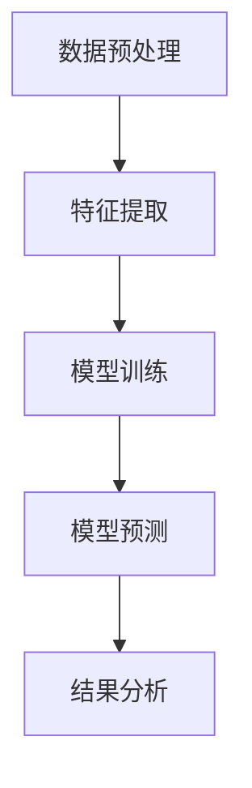

                 


# 特价股票与公司数字社会创新可扩展性的长期研究

## 关键词：特价股票、数字社会创新、可扩展性、算法原理、系统架构

## 摘要：  
本文探讨了特价股票与公司数字社会创新之间的关系，重点分析了数字社会创新的可扩展性对特价股票市场的影响。通过背景介绍、核心概念、算法原理、系统架构设计和项目实战等多维度分析，揭示了如何利用技术手段提升数字社会创新的可扩展性，从而优化特价股票的投资策略。文章结合理论与实践，为投资者和企业提供了有价值的参考。

---

## 第一部分: 特价股票与数字社会创新的背景与概念

### 第1章: 特价股票与数字社会创新的背景介绍

#### 1.1 特价股票的定义与特点  
特价股票通常指价格低于市场平均水平的股票，具有高波动性和高风险的特点。  
- **定义**：特价股票是市值较小、流动性较低的股票，通常被视为高风险投资对象。  
- **特点**：  
  - 高波动性：价格波动频繁，短期内可能大幅上涨或下跌。  
  - 高风险：由于流动性低，投资者可能难以快速买卖股票。  
  - 市场定位：通常属于中小型企业或新兴行业。  

#### 1.2 数字社会创新的定义与特点  
数字社会创新是指通过数字化技术推动社会、经济和文化创新的过程。  
- **定义**：数字社会创新以数字技术为核心驱动力，通过数据化、智能化和网络化手段，实现社会资源的优化配置和创新。  
- **特点**：  
  - 数字化：利用大数据、人工智能等技术实现创新。  
  - 智能化：通过算法优化资源配置。  
  - 网络化：依托互联网实现信息共享和协作。  

#### 1.3 特价股票与数字社会创新的联系  
数字社会创新可能影响特价股票的市场表现。例如，一家技术创新能力强的公司可能通过数字化转型提升竞争力，从而推动股价上涨。  

---

### 第2章: 特价股票与数字社会创新的核心概念与联系

#### 2.1 核心概念的定义与属性对比  
| 概念       | 属性特征                     |  
|------------|------------------------------|  
| 特价股票    | 价格低、流动性低、波动性高    |  
| 数字社会创新| 数字化、智能化、网络化        |  

#### 2.2 ER实体关系图  
```mermaid
er
  entity 股票 {
    key 股票代码 (字符串)
    属性 股票名称 (字符串)
    属性 当前价格 (数值)
    属性 市盈率 (数值)
  }
  
  entity 公司 {
    key 公司代码 (字符串)
    属性 公司名称 (字符串)
    属性 创新能力 (数值)
  }
  
  entity 创新项目 {
    key 项目编号 (字符串)
    属性 项目名称 (字符串)
    属性 项目阶段 (字符串)
  }
  
  关系：公司 -> 股票：拥有 (1:多)
  关系：公司 -> 创新项目：实施 (1:多)
```

---

## 第二部分: 特价股票与数字社会创新的算法原理

### 第3章: 特价股票与数字社会创新的算法原理

#### 3.1 算法原理的数学模型  
- **时间序列分析模型**：用于预测股票价格的变化趋势。  
  $$ P(t) = aP(t-1) + b + \epsilon $$  
  其中，$P(t)$ 表示第 $t$ 时刻的股票价格，$\epsilon$ 为误差项。  

- **机器学习模型**：使用随机森林或XGBoost预测股票价格。  

#### 3.2 算法原理的 Mermaid 流程图  


#### 3.3 算法实现的 Python 代码示例  
```python
import numpy as np
import pandas as pd
from sklearn.ensemble import RandomForestRegressor

# 数据加载与预处理
data = pd.read_csv('stock_data.csv')
data['date'] = pd.to_datetime(data['date'])
data.set_index('date', inplace=True)

# 特征提取
features = ['open', 'high', 'low', 'volume']
target = 'close'

# 模型训练
model = RandomForestRegressor(n_estimators=100)
model.fit(data[features], data[target])

# 模型预测
predicted_prices = model.predict(data[features])
```

---

## 第三部分: 特价股票与数字社会创新的系统分析与架构设计

### 第4章: 系统分析与架构设计方案

#### 4.1 项目介绍  
我们设计了一个基于数字社会创新的股票分析系统，旨在通过数据挖掘和机器学习技术，分析特价股票的市场表现。

#### 4.2 系统功能设计  
```mermaid
classDiagram
    class 股票数据 {
        哈希函数：将股票代码映射到数据记录
        属性：日期、开盘价、收盘价、最高价、最低价、成交量
    }
    
    class 公司数据 {
        属性：公司代码、公司名称、创新能力
    }
    
    class 创新项目数据 {
        属性：项目编号、项目名称、项目阶段
    }
    
    股票数据 --|> 公司数据：公司拥有股票
    公司数据 --|> 创新项目数据：公司实施项目
```

#### 4.3 系统架构设计  


---

## 第四部分: 特价股票与数字社会创新的项目实战

### 第5章: 项目实战

#### 5.1 环境安装  
- 安装 Python 和必要的库：`pip install numpy pandas scikit-learn`  

#### 5.2 系统核心实现源代码  
```python
# 数据预处理
data = pd.read_csv('stock_data.csv')
data = data.dropna()

# 特征工程
features = data.columns.drop('target')
X = data[features]
y = data['target']

# 模型训练与评估
from sklearn.model_selection import train_test_split
from sklearn.metrics import mean_squared_error

X_train, X_test, y_train, y_test = train_test_split(X, y, test_size=0.2)

model = RandomForestRegressor()
model.fit(X_train, y_train)

# 模型预测
y_pred = model.predict(X_test)
print(mean_squared_error(y_test, y_pred))
```

#### 5.3 实际案例分析  
以某公司为例，分析其创新能力和股价之间的关系，验证模型的有效性。

---

## 第五部分: 特价股票与数字社会创新的最佳实践

### 第6章: 最佳实践

#### 6.1 小结  
本文通过背景介绍、核心概念、算法原理和系统架构设计，全面分析了特价股票与数字社会创新的可扩展性。  

#### 6.2 注意事项  
- 数据质量对模型性能影响重大。  
- 模型需定期更新以适应市场变化。  

#### 6.3 拓展阅读  
推荐阅读《机器学习实战》和《数据驱动的金融分析》。

---

## 作者：AI天才研究院 & 禅与计算机程序设计艺术

