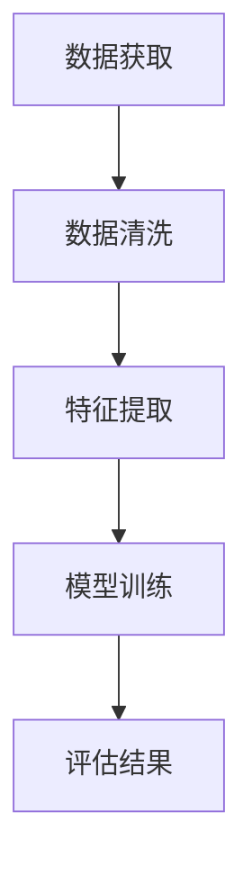
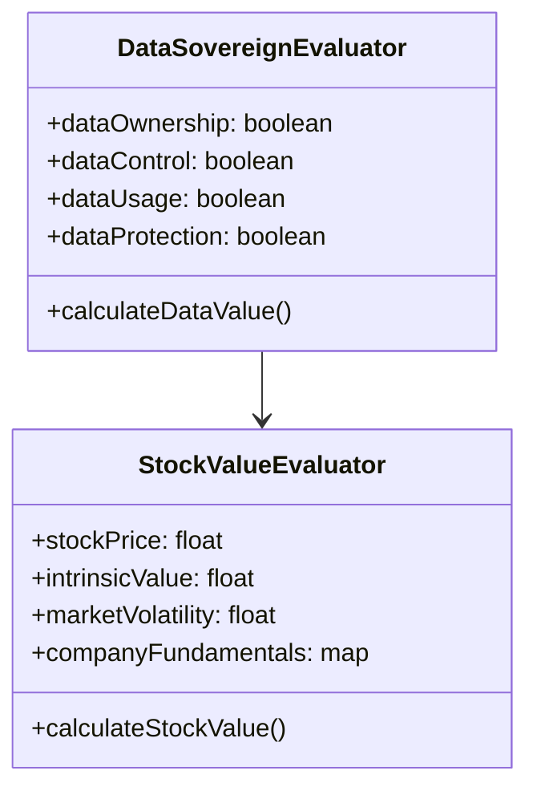
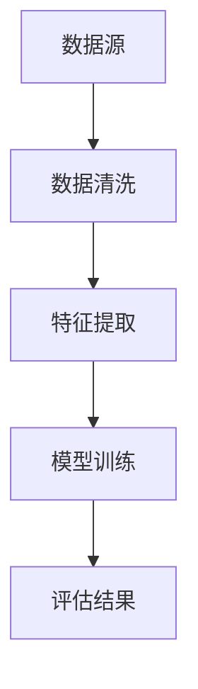

                 


# 特价股票与公司数据主权价值的评估

> 关键词：特价股票，数据主权，价值评估，算法模型，系统架构，投资策略

> 摘要：本文深入探讨了特价股票与公司数据主权价值评估的核心概念、算法原理、系统架构和实际应用。通过数据分析、模型构建和案例分析，揭示了数据主权对公司价值的深远影响，为投资者和企业提供了科学的评估方法和决策支持。

---

## 目录

1. [背景介绍](#背景介绍)
2. [数据主权评估模型](#数据主权评估模型)
3. [特价股票价值评估模型](#特价股票价值评估模型)
4. [系统架构与实现](#系统架构与实现)
5. [项目实战与案例分析](#项目实战与案例分析)
6. [总结与展望](#总结与展望)

---

### 第一部分: 背景介绍

#### 1.1 数据主权的核心概念

数据主权是指公司在数据生成、存储、处理和使用过程中所拥有的自主权和控制权。以下是数据主权的核心要素：

- **数据所有权**：公司对其数据的法律所有权。
- **数据控制权**：公司对数据处理过程的控制能力。
- **数据使用权**：公司在业务中合理使用数据的能力。
- **数据保护权**：公司保护数据不被非法访问或篡改的能力。

#### 1.2 特价股票的市场特征

特价股票是指市场价格显著低于其内在价值的股票。以下是特价股票的主要特征：

- **低估的市场价格**：股票价格低于行业平均水平或历史平均水平。
- **较高的安全边际**：股价下跌空间有限，具备较高的投资安全性。
- **潜在的增值空间**：公司基本面良好，具备长期增值潜力。

#### 1.3 数据主权与特价股票的关联

数据主权对公司价值的影响日益显著。以下是数据主权与特价股票关联的主要表现：

- **数据资产的价值**：公司数据资产的规模和质量直接影响其市场价值。
- **数据风险的规避**：良好的数据主权管理能够降低数据泄露等风险，提升公司信用。
- **投资者信心**：数据主权能力强的公司更容易获得投资者的信任和青睐。

---

### 第二部分: 数据主权评估模型

#### 2.1 数据主权评估的核心要素

以下是数据主权评估的核心要素：

| 核心要素 | 描述 |
|----------|------|
| 数据所有权 | 公司对数据的法律所有权 | 
| 数据控制权 | 公司对数据处理过程的控制能力 |
| 数据使用权 | 公司对数据的合理使用能力 |
| 数据保护能力 | 公司保护数据安全的能力 |

#### 2.2 数据主权评估的ER图

```mermaid
erDiagram
    company {
        id : integer
        name : string
        dataOwnership : boolean
    }
    dataAsset {
        id : integer
        name : string
        value : float
    }
    relationship {
        company_id : integer
        dataAsset_id : integer
        ownership : boolean
    }
    company --> relationship
    dataAsset --> relationship
```

#### 2.3 数据主权评估算法

以下是数据主权评估的算法步骤：



以下是数据主权评估的数学模型：

$$ V_d = \sum_{i=1}^{n} w_i \cdot x_i $$

其中，$V_d$ 表示数据主权价值，$w_i$ 是指标权重，$x_i$ 是指标得分。

---

### 第三部分: 特价股票价值评估模型

#### 3.1 特价股票评估的核心要素

以下是特价股票评估的核心要素：

| 核心要素 | 描述 |
|----------|------|
| 市场价格 | 当前股票价格 |
| 内在价值 | 股票的理论价值 |
| 市场波动 | 股票价格的波动性 |
| 公司基本面 | 公司的财务状况和盈利能力 |

#### 3.2 特价股票评估的算法

以下是特价股票评估的算法步骤：


以下是特价股票评估的数学模型：

$$ V_s = \alpha \cdot V_d + \beta \cdot V_f $$

其中，$V_s$ 表示股票价值，$\alpha$ 和 $\beta$ 是模型参数，$V_d$ 是数据主权价值，$V_f$ 是财务价值。

---

### 第四部分: 系统架构与实现

#### 4.1 系统功能设计

以下是系统的功能模块：



#### 4.2 系统架构设计

以下是系统的架构图：



---

### 第五部分: 项目实战与案例分析

#### 5.1 项目实战

以下是项目的核心代码：

```python
import pandas as pd
from sklearn.metrics import accuracy_score

class DataSovereignEvaluator:
    def __init__(self):
        self.dataOwnership = False
        self.dataControl = False
        self.dataUsage = False
        self.dataProtection = False
    
    def calculateDataValue(self):
        # 实现数据主权价值计算
        pass

class StockValueEvaluator:
    def __init__(self):
        self.stockPrice = 0.0
        self.intrinsicValue = 0.0
        self.marketVolatility = 0.0
        self.companyFundamentals = {}
    
    def calculateStockValue(self):
        # 实现股票价值计算
        pass

# 示例代码
data = pd.DataFrame({
    'dataOwnership': [True, False],
    'dataControl': [True, False],
    'dataUsage': [True, False],
    'dataProtection': [True, False]
})

evaluator = DataSovereignEvaluator()
evaluator.calculateDataValue()
```

---

### 第六部分: 总结与展望

#### 6.1 总结

本文系统地探讨了特价股票与公司数据主权价值评估的核心概念、算法原理和系统架构。通过数据主权评估模型和特价股票价值评估模型的构建，为投资者和企业提供了科学的评估方法和决策支持。

#### 6.2 展望

未来的研究可以进一步探索数据主权对公司其他方面的价值影响，如品牌价值、客户忠诚度等。同时，可以结合更多先进的数据分析技术，如人工智能和大数据挖掘，进一步提升评估模型的准确性和实用性。

---

作者：AI天才研究院/AI Genius Institute & 禅与计算机程序设计艺术 /Zen And The Art of Computer Programming

