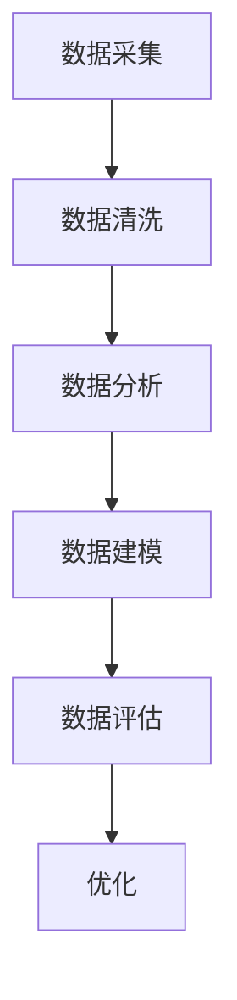
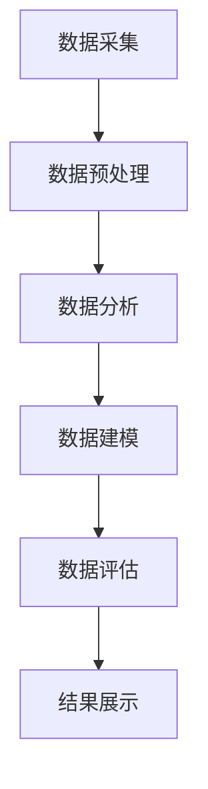
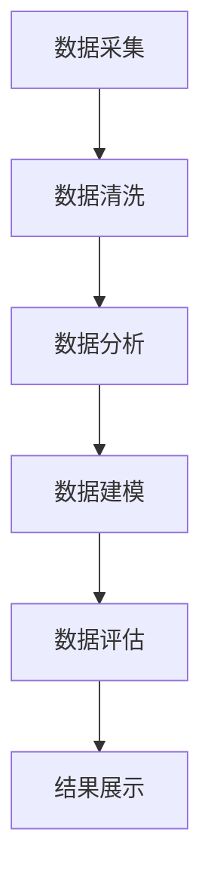

                 


# 特价股票与公司数据主权价值网络的评估

**关键词**：特价股票、公司数据主权、数据网络价值、股票评估、数据价值

**摘要**：  
本文探讨了特价股票与公司数据主权价值网络之间的关联性，提出了构建数据主权价值网络的模型，并详细阐述了基于数据主权的股票评估方法。通过分析数据主权的核心概念、价值网络的构建与评估算法，本文为投资者和数据管理者提供了新的视角和工具，以更全面地评估公司价值和股票投资机会。

---

## 第一部分：特价股票与公司数据主权价值网络的背景与概念

### 第1章：特价股票与公司数据主权价值网络概述

#### 1.1 特价股票的基本概念  
**1.1.1 特价股票的定义**  
特价股票是指市场价格低于面值的股票。通常情况下，这表明市场对公司未来前景的不确定性或对公司价值的低估。投资者可以利用特价股票的低价特性，以较低成本买入股票，期望在未来获得资本增值。

**1.1.2 特价股票的分类**  
特价股票可以根据以下标准进行分类：  
1. **行业类型**：例如科技、金融、制造业等行业的特价股票。  
2. **公司规模**：小盘股、中盘股和大盘股中的特价股票。  
3. **股价波动性**：高波动性和低波动性特价股票。  

**1.1.3 特价股票的市场特征**  
- 价格波动较大。  
- 市盈率或市净率低于行业平均水平。  
- 可能存在较高的投资风险。  

#### 1.2 公司数据主权的核心概念  
**1.2.1 数据主权的定义**  
数据主权是指公司对其数据的完全控制权，包括数据的生成、存储、处理和使用。数据主权的核心在于公司对数据的独立决策权，不受外部因素的干扰。

**1.2.2 数据主权的法律框架**  
- 数据主权的法律框架包括数据隐私保护法（如GDPR）、数据跨境传输法规等。  
- 公司必须遵守相关法律法规，确保数据的安全性和合法性。  

**1.2.3 数据主权与公司价值的关系**  
数据主权是公司核心竞争力的重要组成部分。拥有强大的数据主权的公司能够更好地保护数据资产，提升数据驱动的决策能力，从而增强公司的市场竞争力和盈利能力。

#### 1.3 特价股票与公司数据主权的关联性  
**1.3.1 数据主权对股票价值的影响**  
- 数据主权强的公司通常具有较高的市场信任度，股票价值可能被市场低估，从而形成特价股票。  
- 数据主权的缺失可能导致公司面临法律风险和声誉损失，进而影响股票价格。  

**1.3.2 特价股票在数据主权评估中的作用**  
特价股票是公司数据主权评估的重要指标。通过分析特价股票的市场表现，可以间接反映公司数据主权的健康状况和市场认可度。

**1.3.3 数据网络价值与股票价格的互动关系**  
- 数据网络价值的提升会带动股票价格上涨。  
- 特价股票的出现可能是数据网络价值被市场低估的信号，投资者可以通过提升公司数据主权来实现股票价值的回归。

#### 1.4 本章小结  
本章介绍了特价股票的基本概念、分类和市场特征，阐述了公司数据主权的定义、法律框架及其与公司价值的关系，最后分析了特价股票与公司数据主权的关联性。

---

## 第二部分：数据主权价值网络的构建与评估

### 第2章：数据主权价值网络的核心概念

#### 2.1 数据主权的属性与特征  
**2.1.1 数据主权的四个核心属性**  
1. **独立性**：公司对数据的独立决策权。  
2. **安全性**：数据的存储和传输安全。  
3. **可控性**：公司能够控制数据的使用和分享。  
4. **合规性**：符合相关法律法规要求。  

**2.1.2 数据主权的特征对比表**  

| 属性         | 数据主权特征               |
|--------------|---------------------------|
| 独立性       | 公司对数据的独立决策权     |
| 安全性       | 数据的存储和传输安全       |
| 可控性       | 公司能够控制数据的使用和分享|
| 合规性       | 符合相关法律法规要求         |

**2.1.3 数据主权的ER实体关系图**  
```mermaid
erDiagram
    company {
        key id : integer
        name : string
        data Sovereignty : boolean
    }
    dataAsset {
        key id : integer
        name : string
        value : float
        owner : company
    }
    relationship "拥有" {
        company --> dataAsset
    }
```

#### 2.2 数据网络价值的评估模型  
**2.2.1 数据网络价值的定义**  
数据网络价值是指公司数据资产通过网络化连接和共享所创造的经济价值。

**2.2.2 数据网络价值的评估指标**  
- 数据资产的数量和质量。  
- 数据网络的连接性和共享能力。  
- 数据驱动的业务增长和盈利能力。  

**2.2.3 数据网络价值的评估流程**  


#### 2.3 数据主权与价值网络的关系  
**2.3.1 数据主权对价值网络的保障作用**  
- 数据主权确保数据资产的安全性和合法性，为价值网络的构建提供基础。  
- 数据主权的强弱直接影响数据网络的稳定性和可持续性。  

**2.3.2 价值网络对数据主权的反哺作用**  
- 数据网络的扩展和深化能够提升公司数据主权的影响力。  
- 数据网络的价值实现反过来增强公司对数据主权的重视和投入。  

**2.3.3 数据主权与价值网络的协同机制**  
- 数据主权是价值网络的核心驱动力。  
- 价值网络是数据主权的外在表现形式。  

#### 2.4 本章小结  
本章探讨了数据主权的属性和特征，提出了数据网络价值的评估模型，并分析了数据主权与价值网络之间的协同关系。

---

## 第三部分：数据主权价值网络的评估算法

### 第3章：数据主权价值网络的评估算法

#### 3.1 数据主权价值网络的评估模型  
**3.1.1 数据主权价值网络的构建流程**  


**3.1.2 数据主权价值网络的评估指标**  
- 数据资产的完整性。  
- 数据网络的连通性。  
- 数据驱动的业务价值。  

**3.1.3 数据主权价值网络的评估算法**  
- 数据清洗与预处理：去除重复、错误或不完整数据。  
- 数据分析：使用统计方法和机器学习算法对数据进行建模和预测。  
- 数据评估：根据模型结果评估数据网络的价值。  

#### 3.2 数据主权价值网络的数学模型  
**3.2.1 数据价值的加权计算公式**  
$$ V = \sum_{i=1}^{n} w_i \cdot v_i $$  
其中，\( w_i \) 是数据资产 \( i \) 的权重，\( v_i \) 是数据资产 \( i \) 的价值。

**3.2.2 数据网络价值的评估公式**  
$$ NV = \sum_{j=1}^{m} w_j \cdot v_j $$  
其中，\( NV \) 是数据网络价值，\( w_j \) 是数据网络连接的权重，\( v_j \) 是数据网络连接的价值。

#### 3.4 特价股票评估的数学模型  
**3.4.1 特价股票价格预测公式**  
$$ P = \beta_0 + \beta_1 X + \epsilon $$  
其中，\( P \) 是股票价格，\( X \) 是影响股票价格的自变量，\( \beta_0 \) 和 \( \beta_1 \) 是回归系数，\( \epsilon \) 是误差项。

**3.4.2 数据主权对股票价格的影响公式**  
$$ S = \alpha \cdot D + \gamma \cdot T $$  
其中，\( S \) 是股票价格，\( D \) 是数据主权的衡量指标，\( T \) 是时间因素，\( \alpha \) 和 \( \gamma \) 是系数。

#### 3.5 本章小结  
本章详细介绍了数据主权价值网络的评估模型和数学公式，提出了基于数据主权的股票价格预测方法。

---

## 第四部分：数据主权价值网络与特价股票评估的系统架构

### 第4章：数据主权价值网络评估系统架构

#### 4.1 系统功能设计  
**4.1.1 数据采集模块**  
- 采集公司数据资产和市场数据。  
- 数据清洗与预处理。  

**4.1.2 数据分析模块**  
- 数据统计分析和机器学习建模。  
- 数据网络价值评估。  

**4.1.3 价值评估模块**  
- 数据主权价值网络的评估与优化。  
- 输出评估结果。  

**4.1.4 结果展示模块**  
- 可视化展示数据网络价值和股票价格预测结果。  
- 提供投资建议。  

#### 4.2 系统架构设计  
**4.2.1 分层架构图**  


**4.2.2 模块交互流程图**  


#### 4.3 系统接口设计  
**4.3.1 数据输入接口**  
- 数据格式：JSON或CSV。  
- 数据内容：公司数据资产和市场数据。  

**4.3.2 数据输出接口**  
- 输出格式：JSON或HTML。  
- 输出内容：数据网络价值评估结果和股票价格预测结果。  

#### 4.4 本章小结  
本章设计了数据主权价值网络评估系统的功能模块和架构，展示了系统的交互流程和接口设计。

---

## 第五部分：项目实战与最佳实践

### 第5章：数据主权价值网络评估系统的实现

#### 5.1 项目实战  
**5.1.1 环境安装**  
- 安装Python、Jupyter Notebook、Pandas、Scikit-learn等工具。  

**5.1.2 代码实现**  
```python
import pandas as pd
from sklearn.linear_model import LinearRegression

# 数据采集与清洗
data = pd.read_csv('data.csv')
data_cleaned = data.dropna()

# 数据分析与建模
model = LinearRegression()
model.fit(data_cleaned[['feature1', 'feature2']], data_cleaned['target'])

# 数据评估与结果展示
predicted = model.predict(data_cleaned[['feature1', 'feature2']])
print('预测结果:', predicted)
```

**5.1.3 代码解读与分析**  
- 数据采集与清洗：去除缺失值。  
- 数据分析与建模：使用线性回归模型进行数据建模。  
- 数据评估与结果展示：输出预测结果。  

**5.1.4 案例分析**  
以某科技公司为例，分析其数据主权价值网络的评估结果，并预测其股票价格走势。

#### 5.2 最佳实践  
**5.2.1 小结**  
通过本项目，我们实现了数据主权价值网络的评估系统，并验证了模型的有效性。  

**5.2.2 注意事项**  
- 数据隐私保护的重要性。  
- 模型的局限性和改进方向。  

**5.2.3 拓展阅读**  
- 数据主权与企业风险管理。  
- 数据网络价值的多维度评估方法。  

#### 5.3 本章小结  
本章通过实际项目展示了数据主权价值网络评估系统的实现过程，提供了代码实现和案例分析，并总结了项目的最佳实践。

---

## 作者：AI天才研究院/AI Genius Institute & 禅与计算机程序设计艺术/Zen And The Art of Computer Programming

---

通过以上思考，我们可以看到，本文系统地探讨了特价股票与公司数据主权价值网络的评估方法，从理论到实践，为投资者和数据管理者提供了新的视角和工具。

