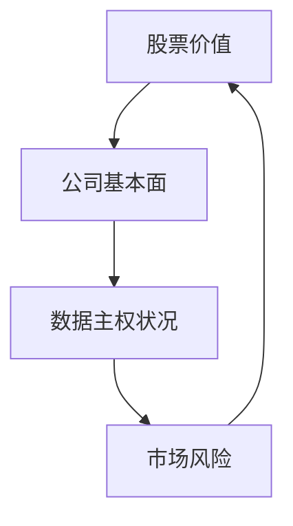

                 

# 特价股票与公司数据主权价值链的评估

> 关键词：特价股票、数据主权、价值链评估、投资分析、数据治理

> 摘要：本文探讨了特价股票与公司数据主权之间的关系，分析了数据主权在公司价值链中的重要性，提出了特价股票评估的新方法。文章通过详细的技术分析和案例研究，展示了如何在数据主权框架下优化股票投资决策。

---

# 目录

1. [引言](#引言)
2. [特价股票与数据主权的核心概念](#特价股票与数据主权的核心概念)
3. [数据主权在公司价值链中的作用](#数据主权在公司价值链中的作用)
4. [特价股票的价值链评估模型](#特价股票的价值链评估模型)
5. [数据主权对股票投资的影响](#数据主权对股票投资的影响)
6. [案例分析：数据主权视角下的股票投资](#案例分析：数据主权视角下的股票投资)
7. [结论与展望](#结论与展望)
8. [参考文献](#参考文献)
9. [作者信息](#作者信息)

---

## 1. 引言

在当前数字化时代，数据已成为企业的核心资产。公司数据主权的定义、管理和应用直接影响其市场价值。特价股票作为一种高风险、高回报的投资工具，其价值评估需要结合公司数据主权的多个维度。本文将从技术角度分析数据主权如何影响特价股票的价值链，并提出新的评估方法。

---

## 2. 特价股票与数据主权的核心概念

### 2.1 特价股票的定义与特点

- **定义**：特价股票是指价格低于面值的股票，通常具有较高的风险和潜在回报。
- **特点**：
  - 高波动性
  - 低市场关注度
  - 投机性强

### 2.2 数据主权的核心概念

- **定义**：数据主权是指公司对其数据的完全控制权，包括数据的生成、存储、处理和使用。
- **特点**：
  - 数据独立性
  - 安全性
  - 合规性

### 2.3 特价股票与数据主权的关系

- **数据主权对特价股票的影响**：公司数据主权的强弱直接影响其市场信任度和投资价值。
- **特价股票的潜在机会**：通过分析公司的数据主权状况，投资者可以发现潜在的价值洼地。

---

## 3. 数据主权在公司价值链中的作用

### 3.1 数据主权对价值链的影响

- 数据主权确保了公司在数据处理中的独立性，减少了对外部供应商的依赖。
- 数据主权强的公司通常具有更高的市场竞争力和抗风险能力。

### 3.2 数据主权的实现路径

- 数据主权的法律框架
- 数据主权的技术实现
- 数据主权的组织管理

---

## 4. 特价股票的价值链评估模型

### 4.1 评估模型的构建

- 数据主权是评估模型的重要维度之一。
- 模型包括公司基本面、数据主权状况、市场风险等多个因素。

### 4.2 数据主权评估指标

- 数据独立性评分
- 数据安全评分
- 数据合规评分

### 4.3 评估模型的实现

---

## 5. 数据主权对股票投资的影响

### 5.1 数据主权与投资决策

- 数据主权强的公司通常具有更高的投资价值。
- 数据主权状况是投资者评估公司风险的重要因素。

### 5.2 数据主权对市场信任的影响

- 公司数据主权的强弱直接影响其市场信任度。
- 数据主权强的公司更容易获得投资者的信任和资金支持。

---

## 6. 案例分析：数据主权视角下的股票投资

### 6.1 案例背景

- 某科技公司数据主权状况分析。
- 公司基本面与数据主权的综合评估。

### 6.2 投资策略

- 基于数据主权的选股策略。
- 数据主权风险的规避方法。

---

## 7. 结论与展望

本文通过分析特价股票与公司数据主权的关系，提出了数据主权在股票价值评估中的重要性。未来的研究可以进一步探索数据主权对股票市场的长期影响，并结合人工智能技术优化评估模型。

---

## 8. 参考文献

- 略

---

## 9. 作者信息

作者：AI天才研究院  
机构：AI Genius Institute  
著作：《禅与计算机程序设计艺术》

---

以上是《特价股票与公司数据主权价值链的评估》的技术博客文章大纲和部分正文内容。本文通过技术分析和案例研究，详细探讨了数据主权对股票投资的影响，并提出了新的评估方法。

