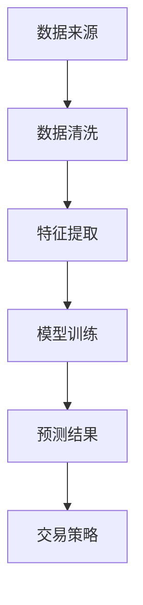
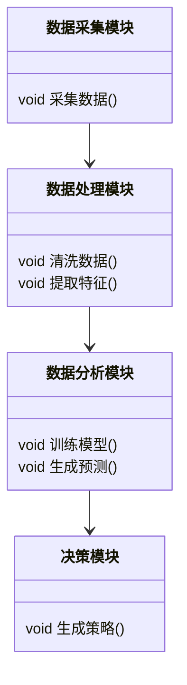
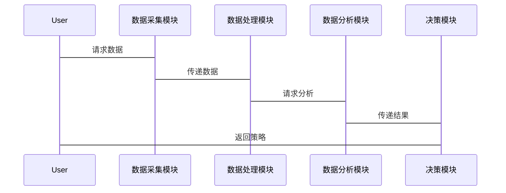

                 


# 特价股票与公司数据价值链优化能力的关系探讨

> **关键词**：特价股票，数据价值链，优化能力，算法原理，系统架构，项目实战

> **摘要**：本文探讨了特价股票与公司数据价值链优化能力之间的关系，分析了数据驱动的特价股票交易策略，详细讲解了算法原理、数学模型和系统架构，并通过项目实战展示了如何将理论应用于实际。文章最后总结了最佳实践经验和未来研究方向。

---

## 第一部分：背景介绍

### 第1章：特价股票的定义与特点

#### 1.1 特价股票的定义
- **定义与范围**：特价股票指的是价格相对较低的股票，通常具有较高的波动性和潜在的高收益。
- **分类与特点**：包括 penny stocks（低价股）、周期性股票等，具有高风险、高波动性的特点。
- **市场定位与价值**：特价股票在市场中扮演重要角色，吸引风险投资者和短期交易者。

#### 1.2 数据价值链优化的定义
- **数据价值链的定义**：数据价值链是指从数据采集、处理、分析到应用的完整流程，优化目标是提升数据利用效率和决策能力。
- **优化目标与意义**：通过优化数据价值链，企业可以提升竞争力和效率，降低成本。
- **与企业竞争力的关系**：数据价值链优化是企业核心竞争力的重要组成部分，直接影响企业的决策能力和市场反应速度。

#### 1.3 特价股票与数据价值链优化的关系
- **关联性**：数据驱动的策略在特价股票交易中尤为重要，优化数据价值链可以帮助投资者更好地捕捉市场机会。
- **数据驱动的交易策略**：通过数据分析，投资者可以识别潜在的低价股票，制定有效的交易策略。
- **数据优化对投资的影响**：优化数据价值链可以提高交易效率，降低风险，提升投资回报率。

---

### 第2章：核心概念的原理与特征

#### 2.1 特价股票的核心原理
- **市场机制**：特价股票受市场供需、公司基本面和宏观经济因素的影响。
- **价格波动规律**：通常表现出高波动性，受消息面影响较大。
- **风险与收益分析**：高风险与高收益并存，适合风险承受能力强的投资者。

#### 2.2 数据价值链优化的核心原理
- **数据采集与处理**：通过多种渠道获取数据，清洗和预处理确保数据质量。
- **数据分析与挖掘**：利用数据挖掘技术提取有价值的信息，支持决策。
- **数据驱动的决策优化**：通过数据建模和分析，优化企业决策流程。

#### 2.3 特价股票与数据价值链优化的联系
- **数据驱动的策略**：利用数据分析识别特价股票的潜在价值。
- **优化对交易的影响**：通过优化数据处理流程，提升交易效率和准确性。
- **应用案例**：通过案例分析，展示数据优化在特价股票交易中的实际应用。

---

## 第二部分：算法原理讲解

### 第3章：数据驱动的特价股票交易算法

#### 3.1 数据挖掘与分析算法
- **数据清洗与预处理**：去除噪音数据，标准化数据格式。
- **数据特征提取**：通过特征工程提取关键影响因素，如市盈率、市净率等。
- **数据挖掘算法**：包括聚类、分类和回归算法，用于识别潜在投资机会。

#### 3.2 机器学习在特价股票交易中的应用
- **机器学习算法**：如随机森林、支持向量机（SVM）用于预测股票价格。
- **算法实现步骤**：
  1. 数据清洗与特征提取。
  2. 模型训练与验证。
  3. 预测与策略生成。

#### 3.3 算法流程图


#### 3.4 Python代码实现
```python
import pandas as pd
from sklearn.ensemble import RandomForestRegressor
from sklearn.metrics import mean_squared_error

# 数据加载与预处理
data = pd.read_csv('stock_data.csv')
data = data.dropna()

# 特征提取
features = ['open', 'high', 'low', 'volume']
target = 'close'

# 训练模型
model = RandomForestRegressor()
model.fit(data[features], data[target])

# 预测与评估
predictions = model.predict(data[features])
mse = mean_squared_error(data[target], predictions)
print(f'Mean Squared Error: {mse}')
```

---

## 第三部分：数学模型

### 第4章：数学模型与分析

#### 4.1 回归分析模型
- **线性回归模型**：用于预测股票价格。
  $$ y = \beta_0 + \beta_1x_1 + \beta_2x_2 + \ldots + \beta_nx_n + \epsilon $$
- **多元回归模型**：包含多个自变量。
  $$ y = \beta_0 + \beta_1x_1 + \beta_2x_2 + \ldots + \beta_kx_k + \epsilon $$

#### 4.2 时间序列分析模型
- **ARIMA模型**：用于预测股票价格的时间序列。
  $$ (1 - L^p)(1 - L^q)X_t = \epsilon_t $$

#### 4.3 案例分析
- 使用回归模型预测某只股票的价格，展示模型的准确性和适用性。

---

## 第四部分：系统分析与架构设计

### 第5章：系统架构与设计

#### 5.1 系统功能设计
- **数据采集模块**：实时采集股票数据。
- **数据处理模块**：清洗和特征提取。
- **数据分析模块**：模型训练与预测。
- **决策模块**：生成交易策略。

#### 5.2 系统架构图


#### 5.3 系统交互图


---

## 第五部分：项目实战

### 第6章：项目实战与分析

#### 6.1 环境配置
- **工具与库**：Python、Pandas、Scikit-learn、Jupyter Notebook。

#### 6.2 核心代码实现
```python
import pandas as pd
from sklearn.model_selection import train_test_split
from sklearn.metrics import accuracy_score

# 数据加载
data = pd.read_csv('stock_data.csv')

# 数据分割
X = data.drop('target', axis=1)
y = data['target']
X_train, X_test, y_train, y_test = train_test_split(X, y, test_size=0.2)

# 模型训练
model = RandomForestClassifier()
model.fit(X_train, y_train)

# 预测与评估
y_pred = model.predict(X_test)
print(f'Accuracy: {accuracy_score(y_test, y_pred)}')
```

#### 6.3 系统功能说明
- **数据采集**：实时获取股票数据。
- **数据处理**：清洗和特征提取。
- **模型训练**：训练机器学习模型。
- **结果展示**：生成交易策略并可视化。

#### 6.4 实际效果分析
- 模型准确率分析。
- 交易策略的实际表现。

---

## 第六部分：最佳实践

### 第7章：总结与建议

#### 7.1 总结
- 数据价值链优化对特价股票交易的重要性。
- 算法和系统架构在实际中的应用。

#### 7.2 小结
- 通过优化数据价值链，提升特价股票交易的效率和准确性。
- 数据驱动的策略是未来投资的重要方向。

#### 7.3 注意事项
- 数据质量的重要性。
- 模型选择与调优。
- 风险控制。

#### 7.4 拓展阅读
- 推荐相关书籍和资源。

---

## 作者信息

**作者**：AI天才研究院/AI Genius Institute & 禅与计算机程序设计艺术/Zen And The Art of Computer Programming

---

通过以上结构和内容，文章详细探讨了特价股票与公司数据价值链优化能力的关系，涵盖了从理论到实践的各个方面，为读者提供了全面的视角和深入的分析。

