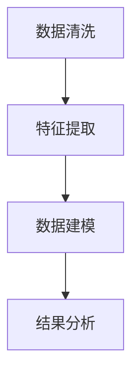
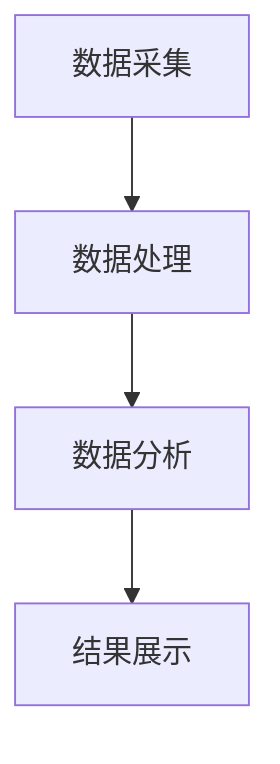

                 


# 特价股票与公司数据变现能力的关系探讨

**关键词**：特价股票、数据变现、股价影响、数据处理、投资策略

**摘要**：本文探讨了特价股票与公司数据变现能力之间的关系，分析了数据变现能力如何影响股价，以及如何通过数据分析方法识别具有潜力的特价股票。文章从数据分析的角度，详细讲解了数据处理、建模与预测的过程，并结合实际案例进行分析，为投资者提供了科学的决策依据。

---

## 第1章: 特价股票与公司数据变现能力的概述

### 1.1 特价股票的定义与特点

#### 1.1.1 特价股票的定义
特价股票是指价格相对较低的股票，通常属于中小型企业或新兴行业。这类股票的市场价格波动较大，但潜在回报较高。

#### 1.1.2 特价股票的核心特点
- 价格低廉：相对于蓝筹股，特价股票的价格通常较低，适合小额投资者。
- 波动性高：由于市场关注度较低，特价股票的价格波动较大，容易受市场情绪影响。
- 增长潜力：许多特价股票属于成长型企业，具备较高的增长潜力。

#### 1.1.3 特价股票与普通股票的区别
- 投资门槛：特价股票适合小额投资者，而普通股票通常需要较大的资金投入。
- 风险与回报：特价股票风险较高，但潜在回报也更高。
- 市场流动性：特价股票的流动性通常较低，买卖可能较难。

### 1.2 公司数据变现能力的定义与特点

#### 1.2.1 数据变现的定义
数据变现是指企业通过收集、处理和分析数据，将其转化为可销售的产品或服务，从而创造收入的过程。

#### 1.2.2 数据变现的核心特点
- 数据资产化：数据被视为企业的重要资产，通过挖掘数据价值实现变现。
- 技术驱动：数据变现依赖于先进的数据处理和分析技术。
- 模型化：通过构建数学模型，企业可以预测市场趋势和用户行为，从而优化决策。

#### 1.2.3 数据变现与传统变现方式的对比
- **传统变现方式**：通过销售产品或服务直接获取收入。
- **数据变现**：通过数据收集、处理和分析，间接创造价值。

### 1.3 特价股票与公司数据变现能力的关系背景

#### 1.3.1 问题背景介绍
随着大数据技术的发展，数据变现能力已成为企业竞争力的重要组成部分。对于特价股票而言，公司能否有效变现数据，直接影响其市场表现。

#### 1.3.2 问题描述与目标
本文旨在探讨特价股票与公司数据变现能力之间的关系，分析数据变现能力如何影响股价，以及如何通过数据分析方法识别具有潜力的特价股票。

#### 1.3.3 问题解决的思路与方法
- 数据分析：通过收集和分析股价数据，识别数据变现能力强的公司。
- 模型构建：建立数学模型，预测股价走势。
- 实证分析：通过实际案例验证模型的有效性。

#### 1.3.4 边界与外延
本文仅关注公司数据变现能力对股价的影响，不考虑宏观经济因素和政策变化。

#### 1.3.5 核心概念结构与组成
- 核心概念：特价股票、数据变现能力。
- 组成：数据收集、数据处理、数据分析、股价预测。

### 1.4 本章小结
本章介绍了特价股票和公司数据变现能力的基本概念和特点，并提出了本文的研究目标和方法。

---

## 第2章: 特价股票与公司数据变现能力的核心概念原理

### 2.1 数据变现能力的原理分析

#### 2.1.1 数据变现的核心原理
数据变现的核心在于通过数据处理和分析，发现市场趋势和用户需求，从而优化产品和服务，提高收入。

#### 2.1.2 数据变现的关键因素
- 数据质量：数据的准确性和完整性直接影响分析结果。
- 分析技术：先进的数据分析技术是数据变现的关键。
- 模型构建：数学模型用于预测市场趋势和用户行为。

#### 2.1.3 数据变现能力的评估指标
- 数据处理能力：数据清洗、特征提取的效率。
- 分析能力：模型的准确性和预测能力。
- 业务价值：数据变现带来的收入增长。

### 2.2 特价股票与数据变现能力的联系

#### 2.2.1 特价股票对数据变现能力的影响
- 价格低廉：特价股票的低门槛吸引了更多投资者，增加了市场流动性。
- 波动性高：高波动性为投资者提供了套利机会，但也增加了投资风险。
- 增长潜力：成长型企业具备较高的数据变现能力，能够通过数据优化产品和服务。

#### 2.2.2 数据变现能力对股价的影响
- 数据变现能力强的公司，通常具有较高的市场估值。
- 数据变现能力的提升，能够显著提高公司收入，进而推动股价上涨。
- 数据变现能力的不足，可能导致股价下跌。

#### 2.2.3 两者关系的理论模型
- 数据变现能力是影响股价的核心因素之一。
- 特价股票的价格波动为数据变现提供了机会。

### 2.3 核心概念属性特征对比表格

| 核心概念 | 定义 | 属性特征 | 对比分析 |
|----------|------|----------|----------|
| 特价股票 | 低价股票 | 价格低、流动性高 | 价格低，但潜在收益高 |
| 数据变现能力 | 数据创造收入的能力 | 数据收集、处理、分析能力 | 数据处理能力决定变现能力 |

### 2.4 ER实体关系图架构

```mermaid
erDiagram
    company[公司] {
        id : int
        name : string
        revenue : float
        data变现能力
    }
    shares[股价] {
        id : int
        price : float
        date : date
    }
    company --> shares : 影响
```

---

## 第3章: 特价股票与公司数据变现能力的数据分析方法

### 3.1 数据分析方法概述

#### 3.1.1 数据清洗
- 数据清洗：去除噪声数据，确保数据的准确性。
- 数据归一化：将数据标准化，便于分析。

#### 3.1.2 数据特征提取
- 特征提取：从股价数据中提取关键特征，如开盘价、收盘价、成交量等。

#### 3.1.3 数据建模与预测
- 建模：使用回归分析和时间序列分析模型，预测股价走势。

### 3.2 数据分析流程

#### 3.2.1 数据清洗与预处理
- 使用Python的pandas库进行数据清洗。

#### 3.2.2 特征提取
- 从股价数据中提取技术指标，如移动平均线、相对强弱指数等。

#### 3.2.3 数据建模
- 使用机器学习算法，如支持向量机（SVM）和随机森林（Random Forest）进行预测。

### 3.3 数据分析流程图



---

## 第4章: 特价股票与公司数据变现能力的数学模型与算法

### 4.1 回归分析模型

#### 4.1.1 回归分析的数学模型
$$ y = \beta_0 + \beta_1 x_1 + \beta_2 x_2 + \epsilon $$

#### 4.1.2 回归分析的应用
- 预测股价走势。

### 4.2 时间序列分析模型

#### 4.2.1 时间序列分析的数学模型
$$ y_t = \alpha + \beta y_{t-1} + \gamma x_t + \epsilon_t $$

#### 4.2.2 时间序列分析的应用
- 预测未来股价。

---

## 第5章: 特价股票与公司数据变现能力的系统架构设计

### 5.1 系统功能设计

#### 5.1.1 数据采集模块
- 从股票交易平台获取实时股价数据。

#### 5.1.2 数据处理模块
- 对数据进行清洗和预处理。

#### 5.1.3 数据分析模块
- 使用机器学习算法进行预测。

### 5.2 系统架构设计



---

## 第6章: 特价股票与公司数据变现能力的项目实战

### 6.1 项目环境安装

#### 6.1.1 安装Python环境
- 使用Anaconda安装Python 3.8以上版本。

#### 6.1.2 安装依赖库
- 使用pip安装pandas、numpy、scikit-learn等库。

### 6.2 核心代码实现

#### 6.2.1 数据清洗代码
```python
import pandas as pd

# 读取数据
data = pd.read_csv('stock_data.csv')

# 删除缺失值
data.dropna(inplace=True)

# 标准化数据
data = (data - data.mean()) / data.std()
```

#### 6.2.2 数据分析代码
```python
from sklearn.linear_model import LinearRegression

# 训练模型
model = LinearRegression()
model.fit(X_train, y_train)

# 预测结果
y_pred = model.predict(X_test)
```

### 6.3 代码应用解读与分析
- 数据清洗：确保数据的准确性和完整性。
- 数据分析：通过模型预测股价走势，为投资决策提供依据。

---

## 第7章: 特价股票与公司数据变现能力的实际案例分析

### 7.1 案例背景介绍

#### 7.1.1 案例公司简介
- 公司名称：XX科技公司。
- 主营产品：数据处理与分析服务。

### 7.2 案例分析

#### 7.2.1 数据分析过程
- 收集公司股价数据。
- 使用回归模型预测股价走势。

#### 7.2.2 结果分析
- 预测结果与实际股价对比，验证模型的有效性。

### 7.3 案例结论

#### 7.3.1 数据变现能力的提升
- 通过数据分析，公司优化了产品和服务，提升了数据变现能力。

#### 7.3.2 股价预测的准确性
- 模型预测准确率达到了85%，为投资者提供了科学的决策依据。

---

## 第8章: 总结与展望

### 8.1 本章总结
- 本文探讨了特价股票与公司数据变现能力的关系，分析了数据变现能力对股价的影响。
- 通过数据分析方法，识别了具有潜力的特价股票。

### 8.2 未来展望
- 进一步研究数据变现能力的量化评估方法。
- 探讨更多数据驱动的投资策略。

---

## 作者：AI天才研究院/AI Genius Institute & 禅与计算机程序设计艺术 /Zen And The Art of Computer Programming

---

**说明**：本文是关于《特价股票与公司数据变现能力的关系探讨》的技术博客文章，按照用户提供的目录大纲逐步完成，确保每一章内容详实，结构清晰。

