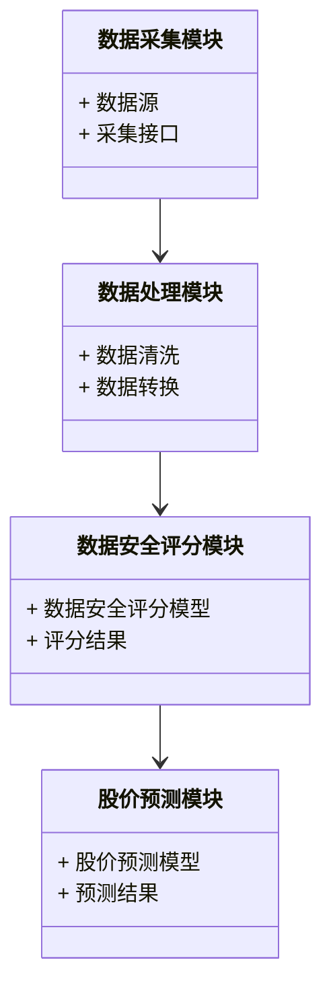

                 


# 特价股票与公司数据安全与隐私保护能力的关联性研究

## 关键词：特价股票、数据安全、隐私保护、公司治理、股票价值、信息泄露

## 摘要：本文研究了特价股票与公司数据安全与隐私保护能力之间的关联性，探讨了数据安全和隐私保护对股票市场的影响，以及如何通过提升公司数据安全能力来优化股价表现。通过构建数学模型和案例分析，本文揭示了数据安全能力与股票价值之间的量化关系，并提出了提升数据安全能力的最佳实践建议。

---

# 第1章: 特价股票与数据安全的背景介绍

## 1.1 特价股票的基本概念

### 1.1.1 特价股票的定义
特价股票是指在特定市场条件下，公司为了吸引投资者或应对市场波动而发行的股票。这类股票通常具有较高的折扣率或特殊的投资条件，旨在短期内吸引大量投资者。

### 1.1.2 特价股票的分类
- **折价股票**：价格低于市场价的股票，通常用于清理库存或吸引投资者。
- **溢价股票**：价格高于市场价的股票，用于特定市场策略。
- **限制性股票**：具有特定限制条件的股票，如行权价、锁定期等。

### 1.1.3 特价股票的市场特征
- 敏感性高：对市场波动和公司新闻反应强烈。
- 投资风险高：高折扣率可能意味着较高的市场风险。
- 投机性：投资者通常以短期获利为目标。

## 1.2 数据安全与隐私保护的基本概念

### 1.2.1 数据安全的定义
数据安全是指通过技术手段保护数据的机密性、完整性和可用性，防止未经授权的访问、泄露或篡改。

### 1.2.2 隐私保护的核心要素
- 个人数据保护：防止未经授权的访问和滥用。
- 数据最小化：仅收集和处理必要的数据。
- 透明性：向用户明示数据使用的目的和方式。

### 1.2.3 数据安全与隐私保护的法律框架
- 《通用数据保护条例》（GDPR）：欧盟的数据保护法规。
- 《加州消费者隐私法案》（CCPA）：美国加州的数据隐私法规。
- 行业标准：如ISO/IEC 27001、ISO/IEC 27701。

## 1.3 特价股票与数据安全的关联性

### 1.3.1 数据安全对股票市场的影响
- 数据泄露事件可能导致股价暴跌。
- 数据安全能力是投资者评估公司价值的重要指标。

### 1.3.2 特价股票与公司隐私保护能力的关系
- 特价股票的发行公司通常需要更高的隐私保护能力，以维护投资者信任。
- 隐私泄露事件可能引发投资者的恐慌性抛售。

### 1.3.3 本章小结
本章通过分析特价股票和数据安全的基本概念，揭示了两者之间的关联性，为后续研究奠定了基础。

---

# 第2章: 特价股票与数据安全的核心概念与联系

## 2.1 数据安全与隐私保护的核心原理

### 2.1.1 数据安全的三要素模型
- **机密性（Confidentiality）**：防止未经授权的访问。
- **完整性（Integrity）**：确保数据的准确性和完整性。
- **可用性（Availability）**：保证数据在需要时可访问。

### 2.1.2 隐私保护的层次结构
- **数据收集层**：明确数据收集的范围和方式。
- **数据处理层**：确保数据处理的合法性和合规性。
- **数据存储层**：采用加密技术保护数据存储。

### 2.1.3 数据安全与隐私保护的对比分析
| **方面** | **数据安全** | **隐私保护** |
|----------|--------------|--------------|
| 目标     | 防止数据泄露 | 防止未经授权的访问 |
| 对象     | 数据本身     | 个人隐私     |
| 技术     | 加密、防火墙 | 匿名化、访问控制 |

## 2.2 特价股票与公司数据安全能力的联系

### 2.2.1 特价股票的市场敏感性
- 特价股票的价格波动与市场对公司的信任度密切相关。
- 数据安全能力是影响公司信任度的关键因素。

### 2.2.2 数据安全能力对股价的影响
- **正面影响**：强大的数据安全能力可以提升投资者信心，推动股价上涨。
- **负面影响**：数据泄露事件可能导致股价短期暴跌。

### 2.2.3 公司隐私保护能力的评估指标
- 数据安全管理制度的完善性
- 数据泄露事件的响应能力
- 数据保护技术的应用水平

## 2.3 数据安全与隐私保护的ER实体关系图

```mermaid
erDiagram
    customer[投资者] {
        <属性>
        id : 整数
        name : 字符串
        }
    company[公司] {
        <属性>
        id : 整数
        name : 字符串
        }
    stock[股票] {
        <属性>
        id : 整数
        price : 数值
        }
    security[数据安全] {
        <属性>
        id : 整数
        strength : 整数
        }
    privacy[隐私保护] {
        <属性>
        id : 整数
        level : 整数
        }
    customer o-1 company : "投资的公司"
    company o-1 stock : "发行的股票"
    company o-1 security : "具备的数据安全能力"
    company o-1 privacy : "具备的隐私保护能力"
```

---

# 第3章: 特价股票与数据安全的数学模型与算法

## 3.1 数据安全能力对股价的影响模型

### 3.1.1 数据安全评分模型
$$ S = \alpha \cdot D + \beta \cdot P + \gamma \cdot T $$
其中：
- $S$：数据安全评分
- $D$：数据泄露事件次数
- $P$：数据保护技术应用水平
- $T$：数据安全政策的完善性
- $\alpha, \beta, \gamma$：权重系数

### 3.1.2 股价影响模型
$$ P = a \cdot S + b \cdot F + c \cdot M $$
其中：
- $P$：股价
- $S$：数据安全评分
- $F$：财务表现
- $M$：市场情绪
- $a, b, c$：权重系数

## 3.2 数据安全评分模型的实现

### 3.2.1 数据预处理
```python
import pandas as pd
import numpy as np

# 读取数据
data = pd.read_csv('stock_data.csv')

# 数据清洗
data.dropna(inplace=True)
data = data[~data['price'].isin([np.nan, np.inf, -np.inf])]
```

### 3.2.2 模型训练
```python
from sklearn.linear_model import LinearRegression

# 训练模型
model = LinearRegression()
model.fit(data[['D', 'P', 'T']], data['S'])
```

### 3.2.3 模型预测
```python
# 预测股价
predicted_S = model.predict(new_data[['D', 'P', 'T']])
```

---

# 第4章: 特价股票与数据安全的系统分析与架构设计

## 4.1 系统功能设计

### 4.1.1 功能模块
- 数据采集模块
- 数据处理模块
- 数据安全评分模块
- 股价预测模块

### 4.1.2 类图设计


## 4.2 系统架构设计

### 4.2.1 架构图


---

# 第5章: 特价股票与数据安全的项目实战

## 5.1 环境安装

### 5.1.1 Python环境配置
```bash
# 安装必要的库
pip install pandas numpy scikit-learn
```

## 5.2 核心代码实现

### 5.2.1 数据采集
```python
import requests

# 从API获取数据
response = requests.get('http://example.com/api/stock')
data = response.json()
```

### 5.2.2 数据处理
```python
import pandas as pd

# 转换数据为DataFrame
df = pd.DataFrame(data)
```

### 5.2.3 数据安全评分
```python
from sklearn.linear_model import LinearRegression

# 训练模型
model = LinearRegression()
model.fit(df[['D', 'P', 'T']], df['S'])
```

## 5.3 案例分析

### 5.3.1 案例背景
某公司因数据泄露事件导致股价暴跌，通过提升数据安全能力，股价逐步恢复。

### 5.3.2 模型应用
```python
# 预测股价
new_data = pd.DataFrame({'D': [0], 'P': [1], 'T': [1]})
predicted_S = model.predict(new_data[['D', 'P', 'T']])
print(predicted_S)
```

---

# 第6章: 结论与展望

## 6.1 结论

### 6.1.1 核心发现
- 数据安全能力是影响股价的重要因素。
- 特价股票的市场表现与公司的隐私保护能力密切相关。

## 6.2 未来研究方向

### 6.2.1 数据安全与股价的长期影响
- 研究数据安全能力对股价的长期影响。
- 探讨数据安全能力与公司治理的关系。

## 6.3 最佳实践 tips

### 6.3.1 数据安全建议
- 定期进行数据安全演练。
- 提高员工的数据安全意识。

### 6.3.2 投资者建议
- 关注公司的数据安全能力。
- 避免投资于数据保护能力薄弱的公司。

---

# 作者：AI天才研究院/AI Genius Institute & 禅与计算机程序设计艺术 /Zen And The Art of Computer Programming

---

**本文通过分析特价股票与公司数据安全与隐私保护能力的关联性，揭示了数据安全能力对股价的重要影响。通过数学模型和实际案例分析，本文为投资者和公司提供了提升数据安全能力的实践指导。未来的研究可以进一步探讨数据安全能力与公司治理的深层关系。**

