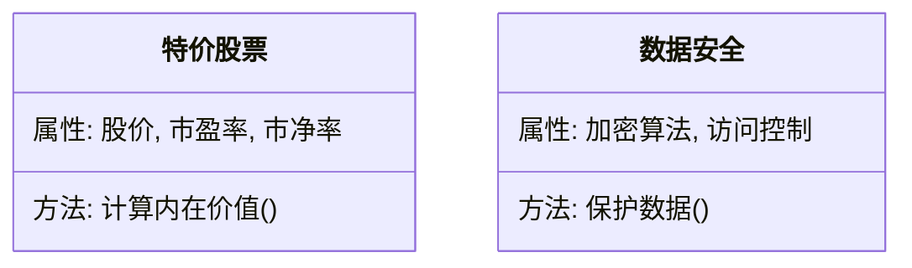
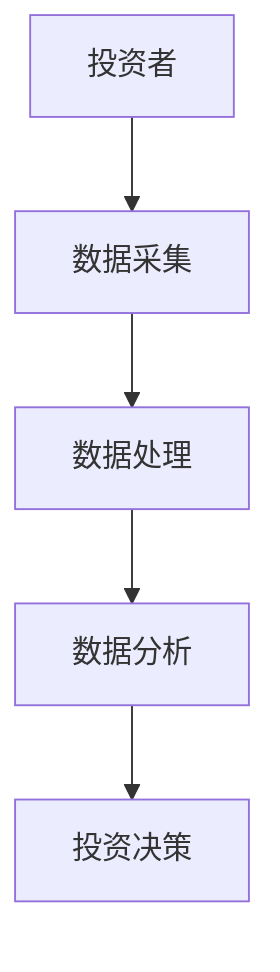

                 


# 特价股票与公司数据安全与隐私增强计算能力的关联性研究

> 关键词：特价股票，数据安全，隐私增强计算，关联性，投资决策

> 摘要：本文深入探讨了特价股票与公司数据安全及隐私增强计算能力之间的关联性。首先，文章介绍了特价股票的基本概念、数据安全的重要性以及隐私增强计算的核心原理。接着，分析了数据安全对股价的影响、隐私增强计算能力对数据安全的提升作用，以及这两者如何共同影响特价股票的投资价值。最后，通过实际案例分析和系统架构设计，展示了如何利用数据安全技术优化特价股票的投资策略，为投资者和企业提供实用的指导。

---

# 第一部分: 特价股票与数据安全的背景介绍

## 第1章: 特价股票的定义与特点

### 1.1 特价股票的定义与特点

#### 1.1.1 特价股票的定义
特价股票是指市场价格低于其内在价值的股票。这种股票通常被市场低估，具有较高的投资潜力。判断一只股票是否为特价股票，通常需要结合市盈率、市净率等指标进行分析。

#### 1.1.2 特价股票的特点与分类
特价股票的特点包括低估值、高股息率和潜在的上涨空间。根据行业、市值和成长性，特价股票可以分为周期性股票、价值型股票和成长型股票。

#### 1.1.3 特价股票的投资价值与风险
投资特价股票的潜在收益较高，但同时也伴随着较高的风险，如市场波动和公司基本面变化。

---

## 第2章: 数据安全与隐私保护的重要性

### 2.1 数据安全的基本概念

#### 2.1.1 数据安全的核心目标
数据安全旨在保护数据的机密性、完整性和可用性。通过加密、访问控制等技术手段，防止数据泄露和篡改。

#### 2.1.2 隐私保护的核心原则
隐私保护强调在数据处理过程中保护个人隐私，确保数据不被滥用。这需要在数据采集、存储和分析的各个环节中采取严格的隐私保护措施。

#### 2.1.3 数据安全与隐私保护的法律框架
全球范围内，数据保护法规（如GDPR）要求企业必须采取有效措施保护用户数据，确保符合法律法规。

---

## 第3章: 增强计算能力在数据安全中的作用

### 3.1 增强计算能力的定义

#### 3.1.1 增强计算能力的概念
增强计算能力是指通过技术手段提升数据处理效率和安全性，如分布式计算、边缘计算和量子计算等。

#### 3.1.2 增强计算能力对数据安全的提升作用
增强计算能力可以通过优化数据处理流程、提高数据加密强度等方式，显著提升数据安全性。

#### 3.1.3 增强计算能力的实现方式
实现增强计算能力的关键技术包括区块链、零知识证明和同态加密等。

---

# 第二部分: 特价股票与公司数据安全的关联性分析

## 第4章: 特价股票与公司数据安全的关系

### 4.1 数据安全对股价的影响

#### 4.1.1 数据泄露对股价的冲击
数据泄露可能导致公司股价大幅下跌，影响投资者信心。

#### 4.1.2 数据安全能力与股价的正相关性
公司具备强大的数据安全能力，通常会提升投资者对其的信任，从而推动股价上涨。

#### 4.1.3 数据安全能力的提升对股价的促进作用
通过提升数据安全能力，公司可以有效保护数据资产，降低风险，从而提高股价。

---

## 第5章: 隐私增强计算能力对数据安全的影响

### 5.1 隐私增强计算的核心技术

#### 5.1.1 隐私保护技术
隐私保护技术包括数据脱敏、数据匿名化和访问控制等。

#### 5.1.2 隐私增强计算的核心原理
隐私增强计算通过技术手段在不泄露原始数据的情况下，完成数据的计算和分析。

#### 5.1.3 隐私增强计算在股价分析中的应用
通过隐私增强计算技术，可以在保护数据隐私的前提下，进行股价预测和风险评估。

---

## 第6章: 特价股票与数据安全的综合分析

### 6.1 数据安全对特价股票投资决策的影响

#### 6.1.1 数据安全能力与特价股票投资价值的关系
具备强大的数据安全能力的公司，其特价股票通常具有更高的投资价值。

#### 6.1.2 隐私增强计算能力对特价股票分析的支持
通过隐私增强计算技术，投资者可以在保护数据隐私的前提下，更准确地进行特价股票分析。

#### 6.1.3 数据安全与隐私增强计算能力的协同效应
数据安全和隐私增强计算能力的协同效应可以显著提升特价股票的投资收益。

---

# 第三部分: 数据安全与隐私增强计算能力的核心技术

## 第7章: 数据安全与隐私保护的核心技术

### 7.1 数据加密技术

#### 7.1.1 对称加密与非对称加密
对称加密算法如AES，非对称加密算法如RSA。

#### 7.1.2 加密算法在数据安全中的应用
加密算法可以保护数据在传输和存储过程中的安全性。

---

## 第8章: 隐私增强计算的核心技术

### 8.1 隐私保护技术

#### 8.1.1 数据脱敏
数据脱敏技术可以将敏感数据转化为不可逆的形式，同时保留数据的可用性。

#### 8.1.2 零知识证明
零知识证明允许一方证明其拥有特定数据，而不必泄露数据本身。

---

# 第四部分: 项目实战与系统架构设计

## 第9章: 项目实战

### 9.1 环境安装与配置
#### 9.1.1 安装Python和相关库
```bash
pip install numpy pandas scikit-learn
```

### 9.2 系统核心实现源代码
#### 9.2.1 数据加密模块
```python
import hashlib

def encrypt(text):
    return hashlib.sha256(text.encode()).hexdigest()
```

---

## 第10章: 系统架构设计

### 10.1 系统功能设计

#### 10.1.1 领域模型


---

## 第11章: 系统架构设计

### 11.1 系统架构设计

#### 11.1.1 系统架构图


---

# 第五部分: 结论与展望

## 第12章: 结论与展望

### 12.1 研究总结
通过本文的研究，我们得出数据安全和隐私增强计算能力对特价股票的投资价值具有重要影响。

### 12.2 未来研究方向
未来可以进一步研究数据安全技术在量化交易中的应用，探索更高效的数据分析方法。

---

# 作者信息

作者：AI天才研究院/AI Genius Institute & 禅与计算机程序设计艺术 /Zen And The Art of Computer Programming

---

# 结语

通过本文的深入分析，我们揭示了特价股票与公司数据安全及隐私增强计算能力之间的密切关联。未来，随着技术的进步，数据安全和隐私保护将在投资领域发挥越来越重要的作用。

