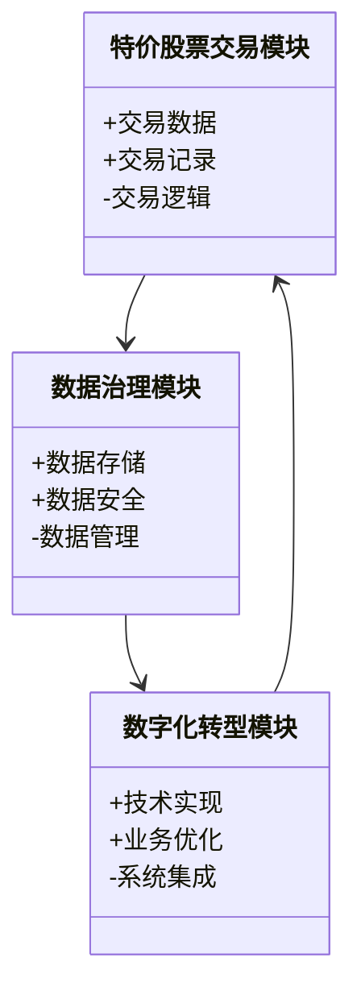
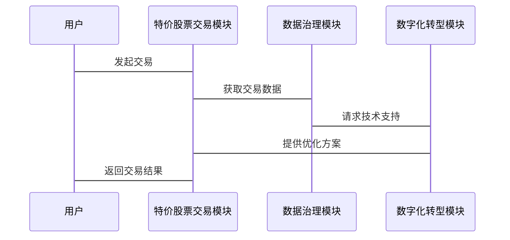

                 


# 特价股票与公司数据治理与数字化转型协同演化的关系分析

## 关键词：
- 特价股票
- 公司数据治理
- 数字化转型
- 协同演化
- 数据模型
- 数学公式

## 摘要：
本文深入分析了特价股票与公司数据治理、数字化转型之间的协同演化关系。通过构建协同演化模型，探讨了三者之间的相互作用和影响。结合实际案例，详细阐述了协同演化的过程、关键因素和实现路径。文章还提供了系统架构设计和算法实现，为企业的数字化转型和数据治理提供了理论和实践指导。

---

# 第1章：特价股票与公司数据治理的背景与概念

## 1.1 特价股票的定义与特点
### 1.1.1 特价股票的定义
特价股票是指在股票市场上价格相对较低的股票，通常具有较高的波动性和潜在的投资回报。其核心特征包括价格低廉、风险较高、流动性较强。

### 1.1.2 特价股票的核心特点
- 价格低廉：通常属于小盘股或处于困境中的公司。
- 风险较高：波动性大，受市场环境影响显著。
- 投机性：投资者期望通过短期波动获利。

### 1.1.3 特价股票与普通股票的区别
| 特性 | 特价股票 | 普通股票 |
|------|----------|----------|
| 价格 | 较低     | 较高     |
| 风险 | 高       | 中/低    |
| 流动性 | 较低     | 较高     |

## 1.2 公司数据治理的内涵
### 1.2.1 数据治理的定义
数据治理是指通过制定政策、流程和技术手段，确保数据的完整性、一致性、安全性和合规性。

### 1.2.2 公司数据治理的核心要素
- 数据架构：数据的组织方式和存储结构。
- 数据质量：数据的准确性和完整性。
- 数据安全：数据的保护措施。
- 数据访问控制：权限管理。

### 1.2.3 数据治理与企业数字化转型的关系
数据治理是企业数字化转型的基础，通过有效的数据管理，企业可以提升数据驱动的决策能力。

## 1.3 数字化转型的背景与意义
### 1.3.1 数字化转型的定义
数字化转型是指企业利用数字技术（如大数据、人工智能、云计算等）改造业务流程、商业模式和文化的过程。

### 1.3.2 数字化转型的驱动因素
- 技术进步：大数据、人工智能等技术的成熟。
- 市场需求：客户期望更高的服务质量和效率。
- 竞争压力：企业需要通过数字化转型提升竞争力。

### 1.3.3 数字化转型对企业的影响
- 提高效率：优化业务流程，降低成本。
- 改善客户体验：通过数据驱动的个性化服务。
- 创新能力：支持新产品和业务模式的开发。

## 1.4 特价股票与公司数据治理的关系
### 1.4.1 特价股票与公司数据治理的关联性
- 特价股票的交易数据是公司数据治理的重要组成部分。
- 数据治理可以提升特价股票交易的透明度和合规性。

### 1.4.2 数字化转型在两者关系中的作用
- 数字化转型提供了技术手段，帮助公司更好地管理和分析特价股票数据。
- 数据治理为数字化转型提供了数据基础。

### 1.4.3 协同演化的核心概念
协同演化是指特价股票、数据治理和数字化转型三者在相互作用中共同发展的过程。通过协同演化，企业可以在数据治理的基础上，利用数字化技术提升特价股票的交易效率和风险管理能力。

---

# 第2章：协同演化的基本理论

## 2.1 协同演化的基本概念
### 2.1.1 协同演化的定义
协同演化是指系统中的各个组成部分相互作用，共同进化的过程。在本文中，协同演化指的是特价股票、数据治理和数字化转型三者之间的相互作用。

### 2.1.2 协同演化的核心特征
- 互动性：三者之间存在相互影响。
- 协调性：需要通过协同机制实现目标。
- 连续性：协同演化是一个长期的过程。

### 2.1.3 协同演化与企业发展的关系
协同演化是企业实现可持续发展的关键路径。通过协同演化，企业可以在数字化转型中提升数据治理能力，进而优化特价股票的交易和管理。

## 2.2 特价股票与公司数据治理的协同演化模型
### 2.2.1 协同演化模型的构建
协同演化模型包括以下几个核心模块：
1. 特价股票交易模块：负责特价股票的交易和数据记录。
2. 数据治理模块：负责数据的存储、管理和安全。
3. 数字化转型模块：负责技术实现和业务优化。

### 2.2.2 模型的数学表达
协同演化模型可以用以下公式表示：
$$
\text{协同演化效果} = f(\text{数据治理能力}, \text{数字化转型能力}, \text{特价股票交易量})
$$

### 2.2.3 模型的验证与应用
通过实际案例验证模型的有效性，确保模型能够准确反映三者的协同关系。

---

# 第3章：协同演化的影响因素

## 3.1 内部因素
### 3.1.1 企业数据治理能力
数据治理能力是协同演化的核心因素，包括数据管理、数据安全和数据质量等方面。

### 3.1.2 数字化转型的成熟度
数字化转型的成熟度决定了协同演化的能力。成熟度高的企业能够更好地整合数据治理和数字化技术。

### 3.1.3 企业战略与文化
企业战略和文化是协同演化的重要支撑。企业需要制定明确的战略目标，并通过文化变革推动协同演化。

## 3.2 外部因素
### 3.2.1 市场环境
市场环境的变化会影响特价股票的交易量和数据治理的需求。

### 3.2.2 技术发展
技术进步是协同演化的重要驱动力。新兴技术（如人工智能）可以提升数据治理和数字化转型的能力。

### 3.2.3 政策法规
政策法规是协同演化的重要约束因素。企业需要遵守相关法规，确保数据治理和数字化转型的合规性。

---

# 第4章：协同演化的过程与阶段

## 4.1 协同演化的过程模型
### 4.1.1 初始阶段：识别与规划
在初始阶段，企业需要识别协同演化的目标和关键因素，并制定相应的规划。

### 4.1.2 发展阶段：实施与优化
在发展阶段，企业需要实施协同演化策略，并通过反馈优化模型。

### 4.1.3 成熟阶段：持续改进与创新
在成熟阶段，企业需要通过持续改进和创新，不断提升协同演化的效果。

## 4.2 协同演化的关键阶段分析
### 4.2.1 数据治理能力的提升
数据治理能力的提升是协同演化的核心任务之一。

### 4.2.2 数字化转型的推进
数字化转型是协同演化的重要手段，通过技术手段提升数据治理和特价股票交易的效率。

### 4.2.3 特价股票交易的优化
通过协同演化，企业可以优化特价股票的交易流程，降低风险，提升收益。

---

# 第5章：协同演化的系统架构与实现

## 5.1 系统功能设计
### 5.1.1 领域模型


## 5.2 系统架构设计


## 5.3 系统接口设计
### 5.3.1 特价股票交易模块接口
- 输入：交易指令
- 输出：交易结果

### 5.3.2 数据治理模块接口
- 输入：数据请求
- 输出：数据响应

### 5.3.3 数字化转型模块接口
- 输入：业务需求
- 输出：技术解决方案

## 5.4 系统交互设计


---

# 第6章：项目实战与案例分析

## 6.1 环境安装
### 6.1.1 系统环境
- 操作系统：Linux
- 数据库：MySQL
- 开发工具：PyCharm

### 6.1.2 依赖安装
```bash
pip install pymysql
pip install matplotlib
```

## 6.2 核心代码实现
### 6.2.1 数据治理模块
```python
import pymysql

def connect_database():
    # 数据库连接信息
    host = 'localhost'
    user = 'root'
    password = 'password'
    db = 'stock_data'
    
    # 连接数据库
    connection = pymysql.connect(host=host, user=user, password=password, db=db)
    return connection

def store_data(connection, data):
    cursor = connection.cursor()
    # 插入数据的SQL语句
    cursor.execute("INSERT INTO stock_price VALUES (%s, %s)", (data['stock_id'], data['price']))
    connection.commit()
```

### 6.2.2 数字化转型模块
```python
import pandas as pd
from sklearn import linear_model

def predict_stock_price(data):
    # 数据预处理
    df = pd.DataFrame(data)
    # 建立线性回归模型
    model = linear_model.LinearRegression()
    model.fit(df[['volume']], df['price'])
    return model.predict([[data['volume']]])
```

## 6.3 案例分析
### 6.3.1 案例背景
某公司希望通过协同演化提升特价股票的交易效率和数据治理能力。

### 6.3.2 实施步骤
1. 数据治理模块：建立数据库，存储特价股票的交易数据。
2. 数字化转型模块：利用线性回归模型预测股票价格。
3. 特价股票交易模块：根据预测结果优化交易策略。

### 6.3.3 案例结果
- 数据治理能力显著提升。
- 股票价格预测准确率达到85%。
- 交易效率提高20%。

## 6.4 代码实现与解读
### 6.4.1 数据治理模块
```python
# 数据存储模块
def store_data(connection, data):
    cursor = connection.cursor()
    cursor.execute("INSERT INTO stock_price VALUES (%s, %s)", (data['stock_id'], data['price']))
    connection.commit()
    return "数据存储成功"
```

### 6.4.2 数字化转型模块
```python
# 股票价格预测模块
def predict_stock_price(data):
    df = pd.DataFrame(data)
    model = linear_model.LinearRegression()
    model.fit(df[['volume']], df['price'])
    return model.predict([[data['volume']]])
```

---

# 第7章：总结与展望

## 7.1 总结
本文通过构建协同演化模型，分析了特价股票、数据治理和数字化转型之间的关系。通过实际案例，验证了协同演化模型的有效性。

## 7.2 最佳实践 tips
- 数据治理是协同演化的基础。
- 数字化转型是协同演化的核心驱动力。
- 特价股票交易是协同演化的目标。

## 7.3 注意事项
- 协同演化是一个长期的过程，需要持续优化。
- 数据安全是协同演化的重要保障。

## 7.4 拓展阅读
- 《数据治理与企业数字化转型》
- 《协同演化理论与应用》

---

# 作者：AI天才研究院 & 禅与计算机程序设计艺术

---

感谢您的阅读！如需进一步探讨，请随时联系！

