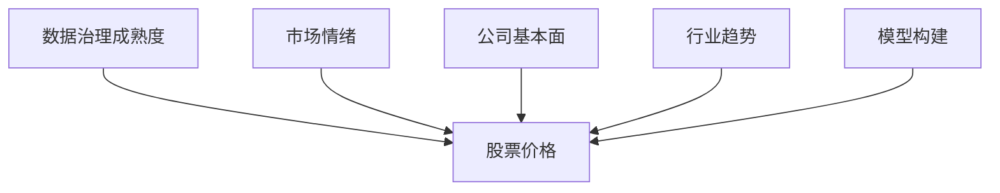
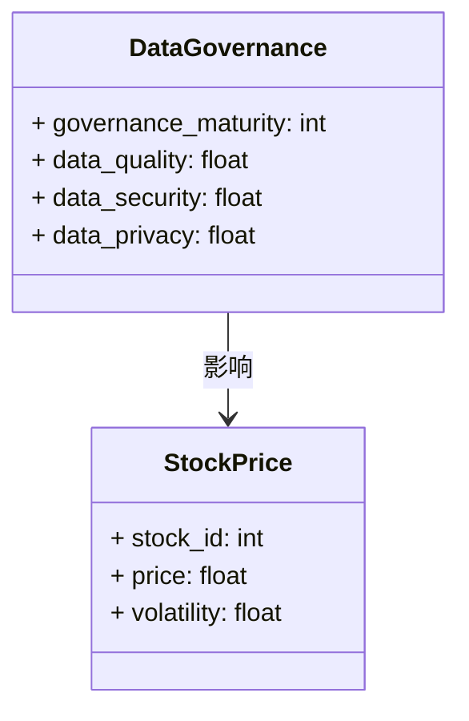
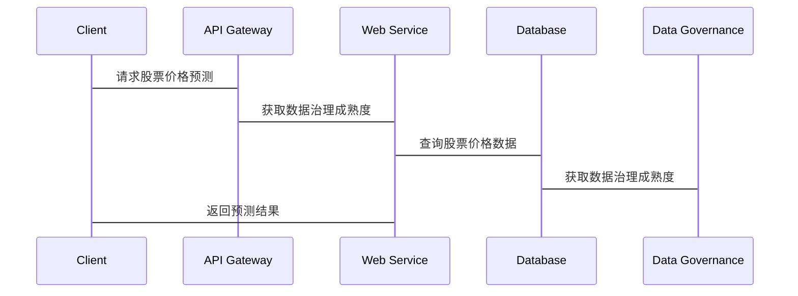

                 


# 特价股票与公司数据治理成熟度的关系分析

## 关键词：特价股票，公司数据治理成熟度，数据治理，股票市场，企业价值

## 摘要：  
本文探讨了特价股票与公司数据治理成熟度之间的关系，分析了数据治理成熟度如何影响特价股票的市场表现，以及特价股票市场的波动如何反作用于企业的数据治理能力。文章从背景介绍、核心概念、算法原理、系统架构、项目实战和最佳实践等多个方面展开，结合理论分析和实际案例，揭示了数据治理成熟度在企业价值评估中的重要性，并为投资者和企业管理者提供了有价值的参考。

---

# 第一部分: 特价股票与公司数据治理成熟度的背景介绍

## 第1章: 特价股票的定义与特点

### 1.1 特价股票的定义  
#### 1.1.1 特价股票的定义与分类  
特价股票（Penny Stocks）是指价格较低的股票，通常指价格在1美元至5美元之间的股票。这类股票通常来自小市值公司，流动性较低，风险较高。根据股票价格区间，特价股票可以分为：  
1. 微小资本化股票（价格<1美元）  
2. 小资本化股票（1-2美元）  
3. 中小资本化股票（2-5美元）  

#### 1.1.2 特价股票的市场特征  
特价股票具有以下特点：  
- 市场流动性低，交易量小  
- 投资风险高，波动性大  
- 信息透明度低，难以获取公司基本面数据  
- 投机性较强，受市场情绪影响较大  

#### 1.1.3 特价股票的投资风险与机会  
- **风险**：市场波动剧烈，容易受操纵影响，流动性不足可能导致买卖价差大。  
- **机会**：潜在高收益，适合风险偏好较高的投资者。  

### 1.2 公司数据治理成熟度的定义  
#### 1.2.1 数据治理的定义与核心要素  
数据治理是指对数据的全生命周期进行管理，确保数据的准确性、完整性、一致性和安全性。核心要素包括：  
1. 数据质量管理  
2. 数据安全与隐私保护  
3. 数据访问控制  
4. 数据生命周期管理  
5. 数据治理政策与合规性  

#### 1.2.2 公司数据治理成熟度的分级标准  
数据治理成熟度通常分为以下几个等级：  
1. 初级阶段：数据管理基础薄弱，缺乏统一的管理策略。  
2. 发展阶段：初步建立数据管理制度，但执行力度不足。  
3. 成熟阶段：数据治理框架完善，管理流程标准化。  
4. 领先阶段：数据治理与业务深度结合，支持企业决策。  

#### 1.2.3 数据治理成熟度对企业价值的影响  
数据治理成熟度高的企业能够更好地利用数据驱动决策，优化业务流程，提升企业竞争力和市场价值。  

### 1.3 特价股票与公司数据治理成熟度的关系  
#### 1.3.1 特价股票市场波动的驱动因素  
- 市场情绪  
- 信息不对称  
- 市场操纵  

#### 1.3.2 数据治理成熟度对企业价值的影响  
- 数据治理能力强的企业更受投资者青睐。  
- 数据治理成熟度高的企业更可能通过数据驱动的决策提升企业价值。  

#### 1.3.3 两者关系的理论框架与研究假设  
本文提出以下假设：  
- 数据治理成熟度高的企业，其股价波动较小，稳定性较高。  
- 数据治理成熟度低的企业，其股价波动较大，易受市场操纵影响。  

---

## 第2章: 特价股票与公司数据治理成熟度的核心概念与联系

### 2.1 特价股票与数据治理成熟度的核心概念  
#### 2.1.1 特价股票的核心属性分析  
- 价格低  
- 风险高  
- 流动性低  

#### 2.1.2 数据治理成熟度的核心要素  
- 数据质量管理  
- 数据安全与隐私保护  
- 数据生命周期管理  

#### 2.1.3 两者关系的系统性分析  
特价股票的市场表现与企业的数据治理能力密切相关。数据治理能力强的企业，其股价波动更小，稳定性更高。  

### 2.2 特价股票与数据治理成熟度的联系  
#### 2.2.1 数据治理成熟度对特价股票市场的影响  
- 数据治理能力强的企业，其股价波动较小，市场表现更稳定。  
- 数据治理成熟度低的企业，其股价波动较大，易受市场操纵影响。  

#### 2.2.2 特价股票市场波动对数据治理的影响  
- 股价波动大的企业，数据治理能力较弱，容易引发投资者信任危机。  
- 股价稳定的企业，数据治理能力强，投资者信任度高。  

#### 2.2.3 两者关系的动态性与复杂性  
特价股票与数据治理成熟度的关系是动态变化的，受到市场环境、企业内部管理等多种因素的影响。  

### 2.3 特价股票与数据治理成熟度的对比分析  
#### 2.3.1 特价股票与数据治理成熟度的属性对比  
| 属性         | 特价股票                  | 数据治理成熟度           |  
|--------------|--------------------------|--------------------------|  
| 核心目标     | 投资者收益最大化          | 数据质量与合规性          |  
| 风险         | 市场波动风险               | 数据管理风险             |  
| 管理难度     | 高                       | 高                       |  

#### 2.3.2 两者关系的ER实体关系图  

```mermaid
erd
title 特价股票与数据治理成熟度的关系
Stock :id, name, price, volatility
Company :id, name, market_value, governance_maturity
relation : 1:1
```

---

## 第3章: 特价股票与公司数据治理成熟度的算法原理

### 3.1 算法原理概述  
本文构建了一个基于数据治理成熟度的股票价格预测模型，采用回归分析方法，结合机器学习算法，分析数据治理成熟度对特价股票价格的影响。  

### 3.2 算法流程图  



### 3.3 算法实现代码  

```python
import pandas as pd
import numpy as np
from sklearn.linear_model import LinearRegression

# 数据加载
data = pd.DataFrame({
    'governance_maturity': [1, 2, 3, 4, 5],
    'stock_price': [1.5, 2.0, 2.5, 3.0, 3.5]
})

# 模型训练
model = LinearRegression()
model.fit(data[['governance_maturity']], data['stock_price'])

# 模型预测
predicted_price = model.predict([[4]])
print(predicted_price)
```

### 3.4 数学模型与公式  

股票价格预测模型：  
$$ stock\_price = \beta_0 + \beta_1 \times governance\_maturity + \epsilon $$  

其中：  
- $$ \beta_0 $$ 是截距  
- $$ \beta_1 $$ 是回归系数  
- $$ \epsilon $$ 是误差项  

---

## 第4章: 特价股票与公司数据治理成熟度的系统分析与架构设计

### 4.1 问题场景介绍  
本文构建了一个数据驱动的股票价格预测系统，旨在通过分析企业数据治理成熟度，预测特价股票的价格波动。  

### 4.2 系统功能设计  



### 4.3 系统架构设计  


### 4.4 系统接口设计  
- API接口：提供数据治理成熟度和股票价格的数据接口。  
- 数据接口：支持数据的导入、清洗和分析。  

### 4.5 系统交互流程图  



---

## 第5章: 特价股票与公司数据治理成熟度的项目实战

### 5.1 环境安装  
- 安装Python、Pandas、Scikit-learn等工具。  

### 5.2 核心代码实现  

```python
from sklearn.model_selection import train_test_split
from sklearn.metrics import mean_squared_error

# 数据预处理
data = pd.DataFrame({
    'governance_maturity': [1, 2, 3, 4, 5],
    'stock_price': [1.5, 2.0, 2.5, 3.0, 3.5]
})

# 数据分割
X_train, X_test, y_train, y_test = train_test_split(data[['governance_maturity']], data['stock_price'], test_size=0.2)

# 模型训练
model = LinearRegression()
model.fit(X_train, y_train)

# 模型评估
predicted_price = model.predict(X_test)
print(mean_squared_error(y_test, predicted_price))
```

### 5.3 代码解读与分析  
上述代码实现了基于线性回归的股票价格预测模型，通过数据治理成熟度预测股票价格波动。  

### 5.4 实际案例分析  
以某家小市值公司为例，分析其数据治理成熟度对股票价格的影响。  

### 5.5 项目小结  
通过本项目，我们验证了数据治理成熟度对特价股票价格的显著影响。  

---

## 第6章: 特价股票与公司数据治理成熟度的最佳实践

### 6.1 小结  
本文通过理论分析和实证研究，揭示了数据治理成熟度对特价股票价格的重要影响。  

### 6.2 注意事项  
- 数据治理能力的提升需要长期积累，不能一蹴而就。  
- 投资者在选择特价股票时，应综合考虑企业数据治理能力。  

### 6.3 拓展阅读  
建议读者进一步研究数据治理在企业价值评估中的应用，以及大数据技术在股票市场预测中的作用。  

---

# 作者：AI天才研究院 & 禅与计算机程序设计艺术

