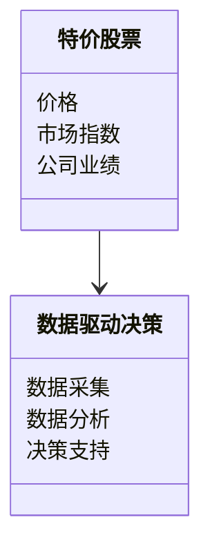
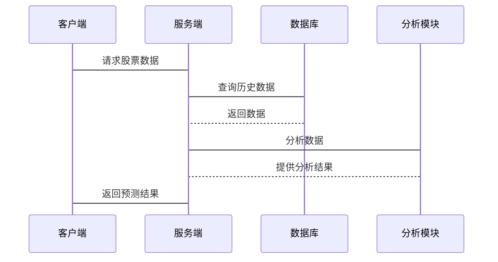

                 


# 特价股票与公司数据驱动决策能力的潜在关联研究

**关键词：** 特价股票，数据驱动决策，算法原理，系统架构，项目实战

**摘要：** 本文探讨特价股票市场与公司数据驱动决策能力之间的潜在关联。通过分析特价股票的市场特性，结合数据驱动决策的算法和系统架构，提出数据驱动决策在特价股票投资中的应用，最后通过项目实战验证其有效性。

---

## 第一部分：背景介绍

### 第1章：特价股票与数据驱动决策的背景

#### 1.1 特价股票的基本概念

- **1.1.1 特价股票的定义**  
  特价股票指公司发行的面值低于市场价的股票，常见于新股或特定市场活动。  

- **1.1.2 特价股票的分类**  
  按发行方式分为溢价发行和折价发行，按市场分为一级和二级市场。  

- **1.1.3 特价股票的市场表现**  
  市场波动大，价格受供需影响显著，投资者需谨慎评估。

#### 1.2 数据驱动决策的背景

- **1.2.1 数据驱动决策的定义**  
  利用数据分析技术，从大量数据中提取信息，辅助决策的过程。  

- **1.2.2 数据驱动决策的重要性**  
  提高决策效率和准确性，优化资源配置，提升企业竞争力。  

- **1.2.3 数据驱动决策在企业管理中的应用**  
  包括销售预测、成本控制、市场分析等方面。

#### 1.3 特价股票与数据驱动决策的关联

- **1.3.1 特价股票市场的特点**  
  价格波动大，信息不对称，投资者行为复杂。  

- **1.3.2 数据驱动决策在股票投资中的作用**  
  通过数据分析，识别市场趋势，优化投资策略。  

- **1.3.3 特价股票与数据驱动决策的潜在联系**  
  数据驱动决策能帮助投资者捕捉特价股票的市场机会，降低投资风险。

---

## 第二部分：核心概念与联系

### 第2章：核心概念解析

#### 2.1 特价股票的核心要素

- **2.1.1 特价股票的发行机制**  
  发行价格低于面值，吸引投资者。  

- **2.1.2 特价股票的市场参与者**  
  包括发行人、投资者、经纪商等。  

- **2.1.3 特价股票的价格波动因素**  
  市场供需、公司业绩、宏观经济因素等。

#### 2.2 数据驱动决策的核心要素

- **2.2.1 数据的收集与处理**  
  数据清洗、转换、整合，确保数据质量。  

- **2.2.2 数据分析方法**  
  包括统计分析、机器学习、深度学习等技术。  

- **2.2.3 决策模型的构建与应用**  
  构建预测模型，辅助决策，如股票价格预测。

#### 2.3 特价股票与数据驱动决策的关系

- **2.3.1 数据驱动决策如何影响特价股票投资**  
  提供数据支持，帮助投资者做出更明智的决策。  

- **2.3.2 特价股票市场数据的特点**  
  数据量大、类型多样、实时性强。  

- **2.3.3 数据驱动决策在特价股票投资中的应用**  
  通过数据分析，识别市场趋势，优化投资策略。

---

## 第三部分：算法原理讲解

### 第3章：数据驱动决策的算法基础

#### 3.1 数据挖掘与机器学习算法

- **3.1.1 数据挖掘的基本概念**  
  从数据中提取有用信息的过程。  

- **3.1.2 常见的数据挖掘算法**  
  包括决策树、聚类分析、关联规则挖掘等。  

- **3.1.3 机器学习在数据驱动决策中的应用**  
  用于分类、回归、聚类等任务，辅助决策。

#### 3.2 时间序列分析与股票预测

- **3.2.1 时间序列分析的基本原理**  
  研究数据随时间的变化规律。  

- **3.2.2 常见的时间序列预测模型**  
  ARIMA、LSTM、Prophet等。  

- **3.2.3 时间序列分析在特价股票预测中的应用**  
  预测股票价格走势，辅助投资决策。

#### 3.3 特价股票价格预测的数学模型

- **3.3.1 线性回归模型**  
  预测公式：$$ y = \beta_0 + \beta_1x + \epsilon $$  

- **3.3.2 例子**  
  预测股票价格：$$ \text{价格} = 10 + 2 \times \text{市场指数} $$  

- **3.3.3 逻辑回归模型**  
  用于分类问题，如预测股票上涨或下跌。

---

## 第四部分：系统分析与架构设计

### 第4章：系统功能设计

#### 4.1 领域模型设计



#### 4.2 系统架构设计


#### 4.3 系统交互设计



---

## 第五部分：项目实战

### 第5章：环境安装与核心代码实现

#### 5.1 环境安装

- 安装Python和相关库：
  ```bash
  pip install numpy pandas scikit-learn
  ```

#### 5.2 核心代码实现

- 时间序列预测代码示例：
  ```python
  from sklearn.linear_model import LinearRegression
  import numpy as np
  import pandas as pd

  # 示例数据
  data = pd.DataFrame({'市场指数': [100, 110, 120, 130, 140], '价格': [50, 55, 60, 65, 70]})

  # 模型训练
  model = LinearRegression()
  model.fit(data[['市场指数']], data['价格'])

  # 预测
  new_index = np.array([[150]])
  predicted_price = model.predict(new_index)
  print(predicted_price)
  ```

#### 5.3 案例分析

- 使用模型预测特价股票价格，验证模型准确性，调整参数优化预测效果。

#### 5.4 项目小结

- 总结项目实施过程，分析模型优缺点，提出改进建议。

---

## 第六部分：总结与展望

### 第6章：最佳实践与小结

#### 6.1 最佳实践 tips

- 数据清洗的重要性，选择合适的算法，持续监控模型性能。

#### 6.2 小结

- 数据驱动决策在特价股票投资中的潜力巨大，结合先进算法和系统架构，能显著提升投资效果。

#### 6.3 注意事项

- 数据隐私问题，避免过度依赖模型，保持对市场的敏感性。

#### 6.4 拓展阅读

- 推荐阅读相关书籍，深入学习数据挖掘和机器学习技术。

---

**作者：AI天才研究院/AI Genius Institute & 禅与计算机程序设计艺术/Zen And The Art of Computer Programming**

