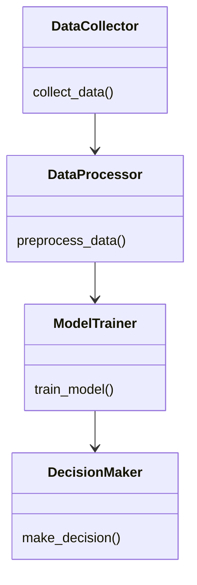

                 


# 特价股票与公司数据驱动决策能力的长期关系分析

## 关键词：
- 特价股票、数据驱动决策、长期关系、数据分析、机器学习

## 摘要：
本文探讨了特价股票与公司数据驱动决策能力之间的长期关系，分析了数据驱动决策在特价股票分析中的应用及其对投资决策的长期影响。通过理论分析、算法实现和案例研究，本文揭示了如何利用数据驱动决策能力优化特价股票投资策略，为投资者和企业提供了实践指导。

---

# 第1章: 特价股票与数据驱动决策的概述

## 1.1 特价股票的定义与特点
### 1.1.1 特价股票的定义
特价股票是指在特定市场条件下价格低于其内在价值的股票，通常由于市场波动、公司特定情况或投资者情绪影响，导致其价格被低估。

### 1.1.2 特价股票的核心特点
- **价格低估**：市场价格低于内在价值。
- **高波动性**：价格波动较大，存在短期风险。
- **投资机会**：潜在的高回报，吸引价值投资者。

### 1.1.3 特价股票与普通股票的区别
| 特性 | 特价股票 | 普通股票 |
|------|----------|----------|
| 价格 | 低于内在价值 | 反映市场情绪 |
| 风险 | 高波动性 | 中低波动性 |
| 投资策略 | 长期持有 | 短期交易 |

## 1.2 数据驱动决策的定义与特点
### 1.2.1 数据驱动决策的定义
数据驱动决策是指通过收集、分析和利用数据来支持决策过程，而非完全依赖经验和直觉。

### 1.2.2 数据驱动决策的核心特点
- **数据驱动**：依赖大量数据支持决策。
- **实时性**：能够快速响应数据变化。
- **准确性**：通过数据分析提高决策的准确性。

## 1.3 特价股票与数据驱动决策的关系
### 1.3.1 特价股票与数据驱动决策的关联性
- 数据驱动决策可以帮助识别特价股票的潜在价值。
- 数据分析技术可以揭示特价股票的市场趋势。

### 1.3.2 数据驱动决策在特价股票分析中的作用
- 提供历史数据支持投资决策。
- 通过算法预测股票价格走势。

### 1.3.3 特价股票分析对数据驱动决策能力的长期影响
- 提高数据驱动决策的精度。
- 增强企业在市场中的竞争力。

---

# 第2章: 特价股票分析的核心原理

## 2.1 数据驱动决策的核心原理
### 2.1.1 数据的收集与处理
数据来源包括市场数据、财务报表和新闻等，需清洗和预处理。

### 2.1.2 数据分析方法
包括统计分析和机器学习算法，用于识别市场趋势。

### 2.1.3 数据驱动决策的数学模型
- 使用回归分析预测股票价格。
- 通过分类算法识别市场信号。

## 2.2 特价股票分析的核心原理
### 2.2.1 特价股票的市场特征
- 价格波动性大，价值被低估。

### 2.2.2 特价股票分析的数学模型
- 线性回归模型：$y = \beta_0 + \beta_1x + \epsilon$
- 分类模型：逻辑回归用于市场信号分类。

### 2.2.3 数据驱动决策与特价股票分析的结合
- 利用数据分析技术识别潜在投资机会。
- 通过数据模型优化投资策略。

## 2.3 数据驱动决策与特价股票分析的联系
### 2.3.1 数据驱动决策在特价股票分析中的应用
- 利用算法识别市场趋势。
- 提供实时数据支持决策。

### 2.3.2 特价股票分析对数据驱动决策能力的提升
- 提高数据处理能力。
- 增强数据分析的准确性。

### 2.3.3 数据驱动决策与特价股票分析的长期关系
- 数据驱动决策能力的提升有助于更准确地识别特价股票。
- 特价股票分析的深入推动数据驱动决策的应用。

---

# 第3章: 数据驱动决策能力的构建与评估

## 3.1 数据驱动决策能力的核心要素
### 3.1.1 数据的收集与处理
- 数据来源多样化，包括市场数据和财务报表。
- 数据清洗和预处理是关键步骤。

### 3.1.2 数据分析能力
- 统计分析和机器学习算法的应用。
- 数据可视化帮助理解分析结果。

### 3.1.3 数据驱动决策的数学模型
- 回归分析：预测股票价格。
- 分类模型：识别市场信号。

## 3.2 数据驱动决策能力的评估
### 3.2.1 数据质量评估
- 数据的完整性和准确性。
- 数据的相关性和及时性。

### 3.2.2 分析模型的评估
- 模型的准确性和稳定性。
- 模型的可解释性和可扩展性。

---

# 第4章: 数据驱动决策的算法原理与数学模型

## 4.1 算法原理讲解
### 4.1.1 线性回归模型
$$ y = \beta_0 + \beta_1x + \epsilon $$

### 4.1.2 逻辑回归模型
$$ P(y=1|x) = \frac{e^{\beta_0 + \beta_1x}}{1 + e^{\beta_0 + \beta_1x}} $$

## 4.2 算法实现
### 4.2.1 线性回归的Python实现
```python
import numpy as np
from sklearn.linear_model import LinearRegression

X = np.array([x1, x2, x3])
y = np.array([y1, y2, y3])
model = LinearRegression()
model.fit(X, y)
print(model.coef_)
```

### 4.2.2 逻辑回归的Python实现
```python
from sklearn.linear_model import LogisticRegression

X = np.array([[x1], [x2], [x3]])
y = np.array([y1, y2, y3])
model = LogisticRegression()
model.fit(X, y)
print(model.predict_proba(X))
```

## 4.3 数学模型的详细解释
### 4.3.1 线性回归模型
- 用于预测连续变量，如股票价格。
- 损失函数：最小二乘法。
- 优化方法：梯度下降。

### 4.3.2 逻辑回归模型
- 用于分类问题，如市场信号识别。
- 损失函数：对数损失。
- 优化方法：最大似然估计。

---

# 第5章: 系统分析与架构设计

## 5.1 系统功能设计
### 5.1.1 领域模型类图


## 5.2 系统架构设计


## 5.3 系统接口设计
### 5.3.1 数据接口
- 数据输入接口：接收市场数据。
- 数据输出接口：提供分析结果。

### 5.3.2 模型接口
- 模型训练接口：训练预测模型。
- 模型预测接口：返回预测结果。

---

# 第6章: 项目实战

## 6.1 环境安装
### 6.1.1 安装Python
```bash
python --version
pip install numpy scikit-learn
```

## 6.2 核心实现
### 6.2.1 数据处理代码
```python
import pandas as pd
import numpy as np

# 数据处理
data = pd.read_csv('stock_data.csv')
data = data.dropna()
```

### 6.2.2 模型训练代码
```python
from sklearn.linear_model import LinearRegression

# 模型训练
model = LinearRegression()
model.fit(X_train, y_train)
```

## 6.3 实际案例分析
### 6.3.1 数据分析
- 识别市场趋势。
- 发现潜在投资机会。

### 6.3.2 模型预测
- 使用训练好的模型预测股票价格。
- 提供数据驱动的决策支持。

---

# 第7章: 最佳实践与总结

## 7.1 最佳实践 tips
- 数据的准确性和完整性是关键。
- 模型的可解释性和可扩展性需重视。
- 结合市场情况动态调整策略。

## 7.2 小结
数据驱动决策能力的提升对特价股票分析至关重要，能够显著增强投资决策的准确性和效率。

## 7.3 注意事项
- 风险控制：避免过度依赖模型。
- 持续学习：市场变化需要及时调整策略。

## 7.4 拓展阅读
- 《数据分析实战》
- 《机器学习算法实战》
- 《数据驱动决策》

---

# 作者：AI天才研究院/AI Genius Institute & 禅与计算机程序设计艺术 /Zen And The Art of Computer Programming

