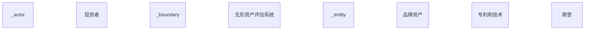
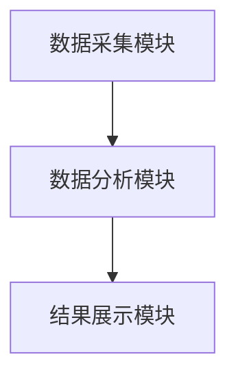
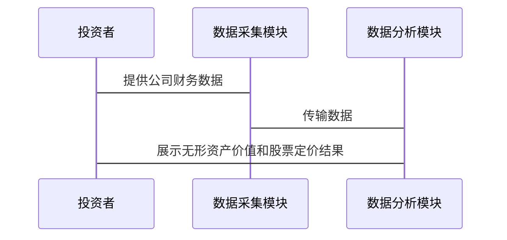

                 


# 特价股票与公司无形资产价值的关系探讨

> 关键词：特价股票，公司无形资产，资产价值评估，股票定价，数学模型

> 摘要：本文探讨了特价股票与公司无形资产价值之间的关系，分析了无形资产对股价的影响机制，并提出了基于数学模型的无形资产价值评估方法。通过案例分析和系统设计，展示了如何将无形资产价值转化为股票定价的依据。

---

## 第一部分: 特价股票与公司无形资产价值的背景介绍

### 第1章: 特价股票的定义与特征

#### 1.1 特价股票的定义
- **特价股票**是指在特定市场条件下，公司为了清理库存或促销而以低于市场价发行的股票。
- 与普通股票相比，特价股票通常具有以下特征：
  - 价格折扣明显
  - 发行数量有限
  - 附带额外权益（如优先认购权）

#### 1.2 特价股票的分类
- 按发行目的分类：
  - 清理库存型
  - 促销推广型
  - 员工激励型

#### 1.3 特价股票与普通股票的区别
- **普通股票**：无特别优惠，价格由市场供需决定。
- **特价股票**：价格折扣明显，通常附带额外权益。

### 第2章: 公司无形资产的内涵与外延

#### 2.1 无形资产的定义
- **无形资产**是指公司拥有但不具有物理形态的资产，包括品牌、专利、商誉等。

#### 2.2 无形资产的主要分类
- 品牌资产
- 专利和技术
- 商誉
- 客户关系

#### 2.3 无形资产的特征与属性对比表格
| 特征 | 品牌资产 | 专利和技术 | 商誉 |
|------|----------|------------|------|
| 计量方式 | 市场评估法 | 法律评估法 | 财务评估法 |
| 生命周期 | 长期 | 受法律保护期限 | 受企业经营影响 |

### 第3章: 特价股票与公司无形资产的关系

#### 3.1 特价股票反映公司价值的机制
- 特价股票价格波动反映市场对公司价值的重新评估。
- 无形资产是影响公司价值的重要因素。

#### 3.2 无形资产对股价的影响路径
- 品牌价值提升 → 股价上涨
- 专利数量增加 → 技术优势 → 股价上涨
- 商誉减值 → 股价下跌

---

## 第二部分: 无形资产价值评估的数学模型与算法

### 第4章: 无形资产价值评估的数学模型

#### 4.1 无形资产评估的理论基础
- **市场法**：基于市场交易数据进行评估。
- **收益法**：基于未来收益进行评估。
- **成本法**：基于重置成本进行评估。

#### 4.2 核心算法与流程图
- **市场法评估流程**：
  1. 收集可比公司数据
  2. 计算可比公司的平均市盈率
  3. 用平均市盈率乘以公司净利润，得到估值。

  ```mermaid
  graph TD
  A[收集可比公司数据] --> B[计算可比公司平均市盈率]
  B --> C[用平均市盈率乘以公司净利润]
  C --> D[得出估值]
  ```

#### 4.3 无形资产评估的ER实体关系图


### 第5章: 特价股票定价的数学模型

#### 5.1 特价股票定价的理论基础
- **折扣定价法**：基于市场折扣率进行定价。
- **需求弹性定价法**：基于需求弹性调整价格。

#### 5.2 特价股票定价的算法实现
- **折扣定价法公式**：
  $$ P = P_{\text{原价}} \times (1 - d) $$
  其中，\(d\) 为折扣率。

  ```mermaid
  graph TD
  A[原价] --> B[计算折扣]
  B --> C[应用折扣]
  C --> D[得出特价价格]
  ```

---

## 第三部分: 无形资产与股价关系的系统分析

### 第6章: 无形资产与股价关系的系统架构

#### 6.1 系统功能设计
- **数据采集模块**：
  - 采集公司财务数据
  - 采集市场数据
- **数据分析模块**：
  - 计算无形资产价值
  - 计算股票定价
- **结果展示模块**：
  - 展示无形资产价值
  - 展示股票定价结果

#### 6.2 系统架构设计


### 第7章: 系统接口与交互设计

#### 7.1 系统接口设计
- **数据输入接口**：接收公司财务数据和市场数据。
- **数据处理接口**：处理数据并计算无形资产价值。
- **数据输出接口**：输出无形资产价值和股票定价结果。

#### 7.2 系统交互设计


---

## 第四部分: 项目实战

### 第8章: 项目实战

#### 8.1 项目环境安装
- 安装Python和相关库（如pandas、numpy、scikit-learn）。

#### 8.2 系统核心实现源代码
```python
import pandas as pd
import numpy as np

def calculate_invisible_asset_value(company_financial_data):
    # 假设company_financial_data是包含收入、利润等的DataFrame
    brand_value = company_financial_data['收入'].mean() * 0.3
    patent_value = company_financial_data['研发支出'].mean() * 0.5
    total_invisible_asset = brand_value + patent_value
    return total_invisible_asset

# 示例数据
data = {'收入': [100, 200, 300], '研发支出': [50, 60, 70]}
df = pd.DataFrame(data)
invisible_asset = calculate_invisible_asset_value(df)
print(f"无形资产价值为：{invisible_asset}")
```

#### 8.3 代码应用解读与分析
- 该代码通过计算公司的收入和研发支出，估算其无形资产价值。
- 假设收入的30%和研发支出的50%分别代表品牌价值和专利价值。

#### 8.4 实际案例分析和详细讲解剖析
- 以一家科技公司为例，计算其无形资产价值，并调整股票定价模型。

#### 8.5 项目小结
- 通过实战项目，验证了无形资产价值评估方法的有效性。
- 强调了数学模型在股票定价中的重要性。

---

## 第五部分: 最佳实践与小结

### 第9章: 最佳实践

#### 9.1 小结
- 特价股票与公司无形资产价值密切相关。
- 通过数学模型可以有效评估无形资产价值，并指导股票定价。

#### 9.2 注意事项
- 数据质量对评估结果影响重大，需确保数据准确。
- 模型需根据实际情况进行调整和优化。

#### 9.3 拓展阅读
- 推荐阅读《股票投资实战技术分析》和《无形资产评估方法论》。

---

## 作者

作者：AI天才研究院/AI Genius Institute & 禅与计算机程序设计艺术 /Zen And The Art of Computer Programming

---

以上为文章的详细结构和内容，您可以根据实际需求进行调整和补充。

