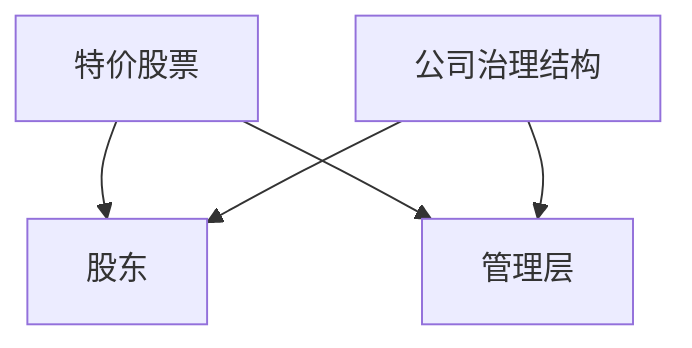
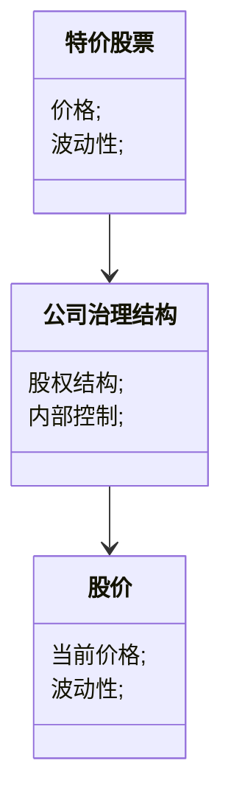
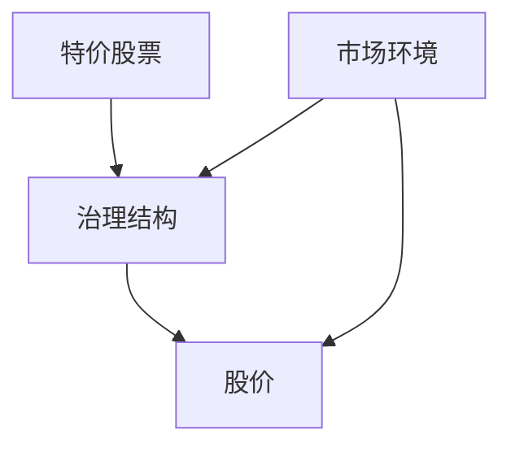

                 


# 特价股票与公司治理结构改善的关系

## 关键词：
特价股票、公司治理结构、股价波动、治理优化、投资策略

## 摘要：
本文探讨了特价股票与公司治理结构改善之间的关系，分析了特价股票对公司的潜在影响，以及公司治理结构对股价的影响。通过数学模型、系统架构和实际案例，本文详细阐述了如何通过改善公司治理结构来优化股价表现，并为投资者提供了实用的投资策略。

---

## 第一部分: 特价股票与公司治理结构改善的背景介绍

### 第1章: 特价股票的定义与现状

#### 1.1 特价股票的定义
- **定义**：特价股票是指价格低于市场平均水平的股票，通常具有较高的波动性和潜在的高回报。
- **分类**：根据市场类型可分为蓝筹股、成长股和周期股。
- **现状**：当前市场中，特价股票数量较多，但质量参差不齐，风险较高。

#### 1.2 特价股票的市场现状
- **市场表现**：近年来，特价股票的表现波动较大，尤其是在市场低迷时期。
- **投资机会**：存在潜在的高回报机会，但需要谨慎选择。

#### 1.3 特价股票的投资机会与风险
- **机会**：低价股票可能在市场反弹时表现优异。
- **风险**：公司基本面差、流动性低、市场波动大。

### 第2章: 公司治理结构的定义与现状

#### 2.1 公司治理结构的定义
- **定义**：公司治理是通过公司章程和制度确保公司高效运作、风险控制和利益分配的机制。
- **核心要素**：董事会结构、股权分配、管理层激励、内部控制等。

#### 2.2 公司治理的现状
- **现状分析**：部分公司治理结构不完善，存在内部人控制、代理成本高等问题。

#### 2.3 公司治理对股价的影响
- **透明度**：高透明度的公司更容易获得投资者信任，股价表现较好。
- **效率**：高效的治理结构能够降低代理成本，提升公司价值。

### 第3章: 特价股票与公司治理结构的相互影响

#### 3.1 特价股票对公司的潜在影响
- **股东权益**：特价股票可能稀释现有股东权益。
- **管理层激励**：低价股票可能影响管理层积极性。
- **资本结构**：可能影响公司债务和股权比例。

#### 3.2 公司治理结构对股价的影响
- **治理效率**：高效的治理结构有助于提升股价。
- **治理透明度**：透明的治理结构能降低信息不对称，提升股价。

#### 3.3 双向互动
- **互动机制**：特价股票可能推动公司治理优化，而良好的治理结构又能促进股价回升。

---

## 第二部分: 特价股票与公司治理结构改善的核心概念对比

### 第4章: 特价股票与公司治理结构的核心概念对比

#### 4.1 特价股票与公司治理结构的属性对比
| 属性       | 特价股票                 | 公司治理结构             |
|------------|--------------------------|--------------------------|
| 影响因素    | 市场供需、公司基本面     | 内部管理、股权结构       |
| 目标        | 投资回报                 | 提升公司效率             |
| 风险        | 市场波动、公司破产风险   | 内部控制风险             |

#### 4.2 特价股票与公司治理结构的ER实体关系图


---

## 第三部分: 特价股票与公司治理结构改善的数学模型与算法原理

### 第5章: 特价股票与公司治理结构改善的数学模型

#### 5.1 特价股票价格波动的数学模型
- **公式**：股价波动可以用随机游走模型表示：
  $$ P_{t} = P_{t-1} + \epsilon_t $$
  其中，$\epsilon_t$为随机扰动项。

#### 5.2 公司治理结构对股价的影响模型
- **公式**：股价与治理结构的关系可以用回归模型表示：
  $$ S = \beta_0 + \beta_1 G + \epsilon $$
  其中，$G$为治理结构指标，$\beta_1$为回归系数。

#### 5.3 综合模型
- **公式**：结合特价股票和治理结构的影响：
  $$ S = \alpha P + \beta G + \gamma (P \times G) + \epsilon $$
  其中，$\gamma$为交互作用系数。

---

## 第四部分: 特价股票与公司治理结构改善的系统分析与架构

### 第6章: 系统架构设计

#### 6.1 领域模型


#### 6.2 系统架构图


---

## 第五部分: 特价股票与公司治理结构改善的项目实战

### 第7章: 项目实战分析

#### 7.1 案例分析
- **案例**：某公司通过优化治理结构，提升了股价表现。

#### 7.2 核心实现
- **代码**：股价预测模型实现：
  ```python
  import numpy as np
  def predict_price(current_price, governance_score):
      alpha = 0.5
      beta = 0.3
      gamma = 0.2
      return alpha * current_price + beta * governance_score + gamma * (current_price * governance_score)
  ```

---

## 第六部分: 特价股票与公司治理结构改善的最佳实践

### 第8章: 最佳实践与小结

#### 8.1 投资策略
- **选择公司**：优先选择治理结构完善、股价被低估的公司。
- **风险管理**：分散投资，控制仓位。

#### 8.2 注意事项
- **基本面分析**：深入分析公司财务状况和治理结构。
- **市场环境**：关注宏观经济和行业趋势。

#### 8.3 未来展望
- **技术创新**：利用大数据和AI优化投资决策。
- **政策变化**：关注公司治理相关法规变化。

---

## 作者：AI天才研究院 & 禅与计算机程序设计艺术

---

**本文版权归作者所有，未经授权不得转载。**

