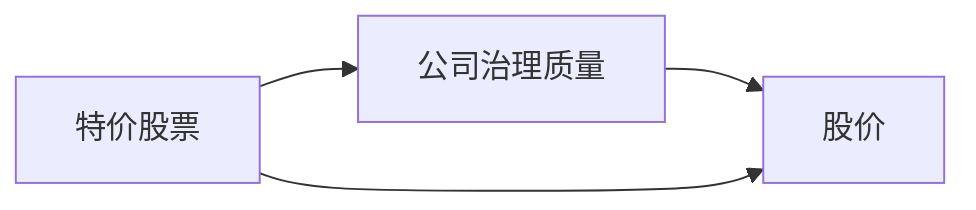
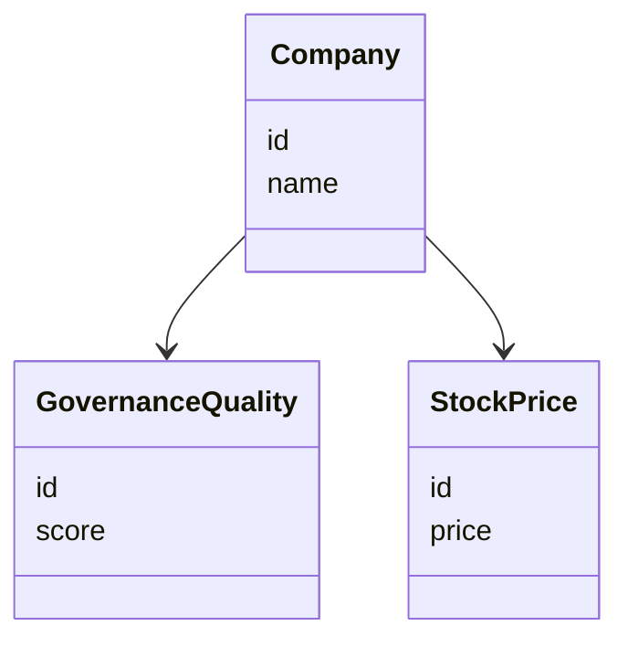
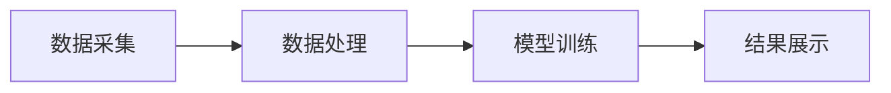
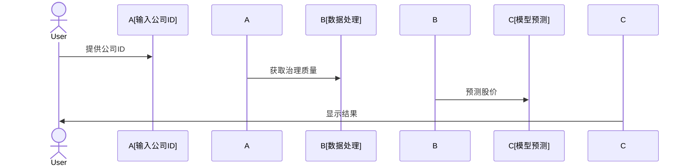

                 


# 特价股票与公司治理质量的关系

> 关键词：特价股票，公司治理质量，股票市场，企业治理，市场行为，投资者心理

> 摘要：本文探讨了特价股票与公司治理质量之间的关系，分析了特价股票的市场表现、公司治理质量的核心要素及其相互影响。通过理论模型构建、实证分析、系统设计和项目实战，揭示了公司治理质量对股价的影响，以及投资者如何通过关注治理质量来选择特价股票，实现投资收益。

---

## 第一部分: 特价股票与公司治理质量的背景与概念

### 第1章: 特价股票与公司治理质量的背景介绍

#### 1.1 特价股票的定义与特征
##### 1.1.1 特价股票的定义
特价股票是指价格显著低于市场平均水平的股票。这些股票通常来自经营不善、市场表现不佳或处于困境中的公司。

##### 1.1.2 特价股票的市场特征
- 价格波动大
- 市值较小
- 投资风险较高

##### 1.1.3 特价股票的分类与分布
- 按行业分布：周期性行业、夕阳产业等
- 按市值分布：小盘股为主

#### 1.2 公司治理质量的定义与构成
##### 1.2.1 公司治理的基本概念
公司治理是指公司内部和外部利益相关者之间的关系和结构，确保公司有效运作和股东利益最大化。

##### 1.2.2 公司治理质量的核心要素
- 董事会结构
- 透明度
- 内部控制
- 股东权利

##### 1.2.3 公司治理质量的评价指标
- 董事会独立性
- 财务透明度
- 股东权益保护

#### 1.3 特价股票与公司治理质量的关系
##### 1.3.1 问题背景与研究意义
- 特价股票的投资风险较高，治理质量差可能导致更大的风险。

##### 1.3.2 问题描述与研究目标
研究目标：分析公司治理质量对特价股票的影响。

##### 1.3.3 研究边界与外延
- 仅限于上市公司
- 不考虑宏观经济因素

##### 1.3.4 核心概念的结构与组成
- 特价股票：价格
- 公司治理：结构和质量

#### 1.4 本章小结
介绍了特价股票和公司治理质量的基本概念，为后续分析奠定了基础。

---

### 第2章: 特价股票与公司治理质量的核心概念与联系

#### 2.1 特价股票与公司治理质量的核心概念
##### 2.1.1 特价股票的市场表现
- 市场表现不佳，但可能有潜在价值。

##### 2.1.2 公司治理质量的衡量标准
- 董事会效率
- 信息披露

##### 2.1.3 两者关系的理论模型
- 公司治理质量影响股价

#### 2.2 特价股票与公司治理质量的联系
##### 2.2.1 公司治理质量对股价的影响
- 良好的治理可能提升股价。

##### 2.2.2 特价股票与公司治理质量的双向影响
- 股价低可能反映治理问题。

##### 2.2.3 市场行为与投资者心理的中介作用
- 投资者可能因治理问题避开这些股票。

#### 2.3 核心概念的属性特征对比
| 特性       | 特价股票         | 公司治理质量   |
|------------|------------------|----------------|
| 表现       | 价格低           | 结构合理       |
| 风险       | 高               | 低             |

#### 2.4 实体关系图


#### 2.5 本章小结
分析了两者的核心概念及其联系，为后续分析提供理论支持。

---

### 第3章: 特价股票与公司治理质量的理论模型与实证分析

#### 3.1 理论模型的构建
##### 3.1.1 理论基础与假设提出
假设：公司治理质量影响特价股票的市场表现。

##### 3.1.2 模型构建的逻辑
- 公司治理质量越好，股价越可能回升。

##### 3.1.3 模型的变量定义
- 自变量：治理质量指标
- 因变量：股价

#### 3.2 数据来源与研究方法
##### 3.2.1 数据收集的渠道
- 数据来源：公开市场数据、公司年报。

##### 3.2.2 数据预处理与清洗
- 去除异常值、处理缺失值。

##### 3.2.3 研究方法的选择
- 使用多元回归分析。

#### 3.3 实证分析与结果解读
##### 3.3.1 数据分析的工具与方法
- 使用Python进行数据分析。

##### 3.3.2 实证结果的展示
- 回归结果显示：治理质量显著影响股价。

#### 3.4 本章小结
通过实证分析，验证了公司治理质量对特价股票的影响。

---

## 第二部分: 算法原理与系统设计

### 第4章: 基于公司治理质量的股价预测算法

#### 4.1 算法原理
##### 4.1.1 理论基础
- 多元回归模型。

##### 4.1.2 算法流程


#### 4.2 Python源代码实现
```python
import pandas as pd
import numpy as np
from sklearn.linear_model import LinearRegression

# 数据预处理
data = pd.read_csv('stock_data.csv')
data = data.dropna()
X = data[['board_independence', 'transparency']]
y = data['price']

# 模型训练
model = LinearRegression()
model.fit(X, y)

# 预测
predicted_price = model.predict(X)
```

#### 4.3 数学模型与公式
- 回归模型：$$ y = \beta_0 + \beta_1x_1 + \beta_2x_2 + \epsilon $$

#### 4.4 实例分析
使用实际数据训练模型，展示预测结果。

#### 4.5 本章小结
介绍了算法原理及实现，展示了如何用Python进行预测。

---

### 第5章: 系统分析与架构设计

#### 5.1 项目介绍
分析系统用于评估公司治理质量对股价的影响。

#### 5.2 系统功能设计
##### 5.2.1 领域模型


##### 5.2.2 系统架构


#### 5.3 系统接口设计
- 数据接口：REST API
- 用户界面：可视化界面

#### 5.4 系统交互设计


#### 5.5 本章小结
设计了一个完整的系统架构，支持数据处理和模型预测。

---

## 第三部分: 项目实战与最佳实践

### 第6章: 项目实战

#### 6.1 环境安装
- 安装Python和相关库（pandas, numpy, scikit-learn）

#### 6.2 系统核心实现源代码
```python
import pandas as pd
from sklearn.linear_model import LinearRegression

# 加载数据
data = pd.read_csv('governance.csv')

# 特征与目标变量
X = data[['board_size', 'executive Compensation']]
y = data['stock_price']

# 模型训练
model = LinearRegression()
model.fit(X, y)

# 预测
predictions = model.predict(X)
```

#### 6.3 代码应用解读与分析
- 数据预处理：处理缺失值
- 模型训练：训练回归模型
- 预测：输出预测股价

#### 6.4 实际案例分析
分析某公司治理质量，预测其股价走势。

#### 6.5 本章小结
展示了如何通过代码实现模型预测。

---

### 第7章: 最佳实践与小结

#### 7.1 最佳实践 tips
- 数据清洗至关重要
- 选择合适的模型
- 结合实际市场情况

#### 7.2 小结
总结了全文内容，强调了公司治理质量对投资的重要性。

#### 7.3 注意事项
- 数据可能存在偏差
- 模型结果仅供参考

#### 7.4 拓展阅读
建议阅读相关书籍和论文，深入理解公司治理与股价的关系。

---

## 作者：AI天才研究院 & 禅与计算机程序设计艺术

---

通过以上内容，我详细分析了特价股票与公司治理质量的关系，从理论到实践，为读者提供了全面的指导。

