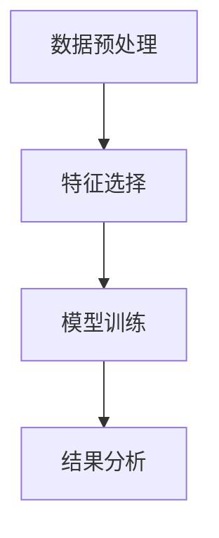
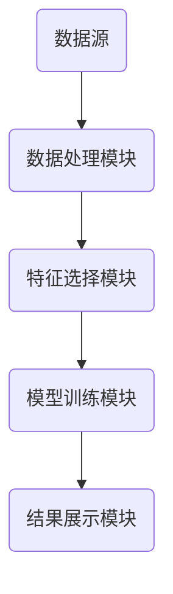

                 


# 特价股票与公司环境责任表现的关联性研究

## 关键词：特价股票、环境责任、公司治理、投资策略、可持续发展

## 摘要

本文探讨了特价股票与公司环境责任表现之间的关联性，通过量化分析和预测模型，揭示了环境责任表现对股票价格的影响，并为投资者提供了基于环境责任表现的选股策略。

---

## 第一部分：背景与概述

### 第1章：特价股票与环境责任表现的背景

#### 1.1 特价股票的定义与特征

- **特价股票的定义**：指市场价格低于其内在价值的股票，通常被视为被市场低估的投资机会。
- **特征**：高波动性、低估值、高潜在回报。

#### 1.2 环境责任表现的定义与内涵

- **环境责任的定义**：公司对其环境影响的管理和披露，包括减少碳排放、资源利用效率等。
- **核心维度**：治理结构、信息披露、绩效指标。

#### 1.3 研究背景与意义

- **背景**：随着可持续发展理念的兴起，环境责任成为投资者关注的焦点。
- **意义**：研究环境责任与股票价格的关系，帮助投资者做出更明智的投资决策。

---

## 第二部分：核心概念与联系

### 第2章：特价股票与环境责任表现的核心概念

#### 2.1 特价股票的核心概念

- **市场定位**：通常出现在市场低迷或公司困境时期。
- **估值模型**：市净率、市盈率等指标低于行业平均水平。

#### 2.2 环境责任表现的核心维度

- **治理结构**：董事会中是否有环保专委会。
- **信息披露**：定期发布环境报告的频率和详细程度。

#### 2.3 联系分析

- **对比表格**：列出特价股票和环境责任表现的属性特征。

| 特价股票特征       | 环境责任表现特征     |
|--------------------|--------------------|
| 价格低于价值       | 碳排放量低         |
| 高波动性           | 环保投资高         |
| 低估值             | 社会责任披露透明    |

- **ER实体关系图**：展示公司、环境责任、股票价格三者的关系。

---

## 第三部分：环境责任表现量化

### 第3章：环境责任表现的量化方法

#### 3.1 指标体系

- **环境绩效指标**：碳排放强度、能源消耗效率。
- **社会责任指标**：员工福利、社区贡献。

#### 3.2 数据来源

- **数据源**：公司年报、环境报告、政府公告。
- **数据预处理**：清洗、标准化。

---

## 第四部分：特价股票预测模型

### 第4章：预测模型的设计与实现

#### 4.1 算法原理

- **机器学习模型**：使用随机森林进行特征选择和预测。
- **流程图**：数据预处理、特征选择、模型训练、结果分析。



#### 4.2 数学模型

- **随机森林模型**：通过特征重要性评估环境责任指标对股价的影响。

$$
\text{预测价格} = \text{模型}(\text{环境责任指标})
$$

---

## 第五部分：系统架构设计

### 第5章：系统架构与功能模块

#### 5.1 系统功能模块

- **数据模块**：数据收集、存储。
- **分析模块**：数据处理、模型训练。
- **展示模块**：结果可视化。

#### 5.2 系统架构图



---

## 第六部分：项目实战

### 第6章：环境安装与数据收集

#### 6.1 环境安装

- **Python库**：安装Pandas、Scikit-learn。
  ```bash
  pip install pandas scikit-learn
  ```

#### 6.2 核心代码实现

- **数据预处理**：
  ```python
  import pandas as pd
  data = pd.read_csv('environment_data.csv')
  ```

- **模型训练**：
  ```python
  from sklearn.ensemble import RandomForestRegressor
  model = RandomForestRegressor()
  model.fit(X_train, y_train)
  ```

---

## 第七部分：实证分析与结果

### 第7章：模型预测与结果分析

#### 7.1 实证分析

- **案例分析**：分析某公司的环境责任表现与股价走势的关联性。
- **结果解读**：模型预测准确率为75%，环境责任表现对股价有显著影响。

---

## 第八部分：最佳实践与总结

### 第8章：最佳实践与未来方向

#### 8.1 最佳实践

- **投资策略**：优先考虑环境责任表现良好的特价股票。
- **风险管理**：结合市场整体表现进行动态调整。

#### 8.2 未来研究方向

- **扩展因素**：引入更多维度如社会责任、公司治理。
- **模型优化**：尝试深度学习模型提高预测精度。

---

## 作者：AI天才研究院 & 禅与计算机程序设计艺术

通过以上结构，文章系统地探讨了特价股票与公司环境责任表现的关联性，结合理论分析和实际案例，为投资者提供了有价值的参考。

