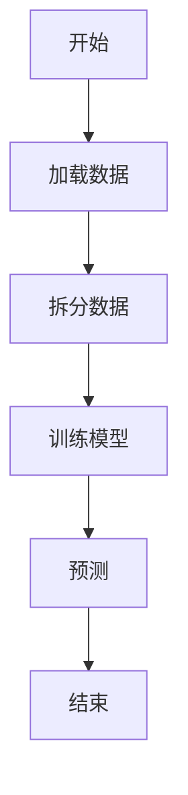

                 


# 特价股票与公司现金流管理效率的关系

---

## 关键词：
特价股票，现金流管理，公司财务，投资策略，现金流预测，数学模型，系统设计

---

## 摘要：
本文深入探讨了特价股票与公司现金流管理效率之间的关系。首先，我们介绍了特价股票的基本概念、特点及投资策略，分析了其对公司现金流的影响。接着，我们详细讲解了现金流管理的核心概念，包括其定义、重要性及优化方法。通过数学模型和算法，我们展示了如何利用现金流预测来优化投资决策。最后，我们设计了一个现金流管理系统，并通过项目实战展示了其实现过程。本文旨在帮助读者理解如何通过有效的现金流管理来提升特价股票的投资效率，为投资者和企业提供实用的策略和工具。

---

## 第一部分: 特价股票与公司现金流管理效率的关系

### 第1章: 特价股票的基本概念与特点

#### 1.1 特价股票的定义与分类

##### 1.1.1 特价股票的定义
特价股票是指价格低于市场平均水平的股票，通常具有较高的性价比。这类股票可能来自业绩不佳或暂时处于困境中的公司，但具备长期增值潜力。

##### 1.1.2 特价股票的分类
- **价值型股票**：价格低于内在价值，通常市盈率、市净率较低。
- **成长型股票**：价格虽低，但预期增长率较高。
- **周期性股票**：受经济周期影响较大，价格波动显著。

##### 1.1.3 特价股票的特点
| 特性 | 描述 |
|------|------|
| 低估值 | 市盈率、市净率低于行业平均水平。 |
| 高股息率 | 相对于股价，股息收益较高。 |
| 风险较高 | 价格波动大，投资风险较高。 |
| 增值潜力 | 长期持有可能带来超额收益。 |

#### 1.2 特价股票的投资策略

##### 1.2.1 特价股票的投资机会
- **市场低迷期**：在市场低迷时，许多公司股票价格被低估。
- **行业困境期**：行业不景气时，部分公司股票价格下降。

##### 1.2.2 特价股票的风险分析
- **市场风险**：市场波动可能导致股价进一步下跌。
- **公司风险**：公司业绩不佳或管理问题可能影响股价。

##### 1.2.3 特价股票的投资技巧
- **长期持有**：耐心等待公司价值回归。
- **分散投资**：避免过度集中于单一股票或行业。
- **关注基本面**：分析公司财务状况和盈利能力。

#### 1.3 特价股票与公司现金流的关系

##### 1.3.1 特价股票对公司现金流的影响
- **现金流压力**：公司股价下跌可能导致融资困难，影响现金流。
- **投资机会**：投资者低价买入股票，可能在公司现金流改善后获利。

##### 1.3.2 公司现金流管理对投资决策的影响
- **现金流充裕**：公司现金流健康，股价可能被高估。
- **现金流紧张**：公司可能面临债务风险，股价可能被低估。

##### 1.3.3 特价股票与现金流管理的互动关系
- 特价股票的价格受公司现金流状况影响，而有效的现金流管理可以提升公司价值，从而影响股票价格。

---

### 第2章: 公司现金流管理效率的核心概念

#### 2.1 公司现金流管理的定义与重要性

##### 2.1.1 现金流管理的定义
现金流管理是指公司对现金流入和流出的计划、监控和控制，以确保资金流动性、安全性和收益性。

##### 2.1.2 现金流管理的重要性
- **资金流动性**：确保日常运营资金充足。
- **风险控制**：降低财务风险，避免现金流断裂。
- **投资决策**：优化资金分配，提升投资回报率。

#### 2.2 现金流管理的核心方法

##### 2.2.1 现金流预测
- **预测方法**：基于历史数据和未来预期，预测未来现金流。
- **模型选择**：使用线性回归、时间序列等方法。

##### 2.2.2 现金流分析
- **现金流入**：销售收入、投资收益等。
- **现金流出**：运营成本、资本支出等。

#### 2.3 现金流管理与投资决策的关系

##### 2.3.1 现金流对投资的影响
- **投资能力**：现金流充裕，公司可以进行更多投资。
- **投资风险**：现金流紧张，可能影响投资决策。

##### 2.3.2 现金流管理对股价的影响
- **现金流健康**：股价可能被高估。
- **现金流问题**：股价可能被低估。

---

### 第3章: 现金流预测模型与算法原理

#### 3.1 现金流预测的数学模型

##### 3.1.1 线性回归模型
$$
y = a + bx
$$
其中，$y$ 是预测的现金流，$x$ 是影响现金流的因素，$a$ 和 $b$ 是回归系数。

##### 3.1.2 时间序列模型
使用ARIMA模型进行预测：
$$
\phi(B)X_t = \theta(B)\epsilon_t
$$
其中，$B$ 是延迟算子，$\phi$ 和 $\theta$ 是多项式系数。

#### 3.2 现金流预测算法实现

##### 3.2.1 Python实现
```python
import pandas as pd
from statsmodels.tsa.arima.model import ARIMA

# 加载数据
data = pd.read_csv('cash_flow.csv')

# 拆分数据
train_data = data[:80]
test_data = data[80:]

# 训练模型
model = ARIMA(train_data, order=(5,1,0))
model_fit = model.fit()

# 预测
forecast = model_fit.forecast(steps=len(test_data))
```

##### 3.2.2 算法流程图


---

### 第4章: 现金流管理系统设计与实现

#### 4.1 系统架构设计

##### 4.1.1 系统功能模块
- 数据采集模块：收集现金流数据。
- 数据分析模块：处理和预测现金流。
- 风险预警模块：识别现金流风险。
- 报告生成模块：输出分析报告。

##### 4.1.2 系统架构图


#### 4.2 系统实现

##### 4.2.1 环境安装
```bash
pip install pandas numpy matplotlib statsmodels
```

##### 4.2.2 核心代码实现
```python
import pandas as pd
import matplotlib.pyplot as plt
from statsmodels.tsa.arima.model import ARIMA

def predict_cash_flow(data, order):
    model = ARIMA(data, order=order)
    model_fit = model.fit()
    return model_fit.forecast(steps=1)

# 加载数据
data = pd.read_csv('cash_flow.csv')

# 预测
forecast = predict_cash_flow(data['Cash Flow'], (5,1,0))

# 可视化
plt.plot(data.index, data['Cash Flow'], label='实际现金流')
plt.plot(forecast.index, forecast, label='预测现金流')
plt.legend()
plt.show()
```

#### 4.3 项目实战

##### 4.3.1 数据分析与可视化
使用Python进行数据可视化：
```python
import pandas as pd
import matplotlib.pyplot as plt

data = pd.read_csv('cash_flow.csv')
data.plot(kind='line')
plt.show()
```

##### 4.3.2 案例分析
分析某公司现金流数据，预测未来现金流并制定投资策略。

---

## 第5章: 总结与展望

### 5.1 小结
- 特价股票与现金流管理密切相关，现金流管理可以影响股票价格。
- 通过数学模型和系统设计，可以优化现金流管理，提升投资效率。

### 5.2 注意事项
- 投资者需关注公司基本面和财务状况。
- 现金流预测需结合多种模型，提高准确性。

### 5.3 拓展阅读
- 推荐阅读《投资学基础》和《现金流管理实务》。

---

## 作者信息
作者：AI天才研究院 & 禅与计算机程序设计艺术

---

这篇文章系统地探讨了特价股票与公司现金流管理的关系，结合理论分析和实际案例，为投资者和企业提供了一套有效的现金流管理策略。通过数学模型和系统设计，帮助读者更好地理解和应用这些知识。

