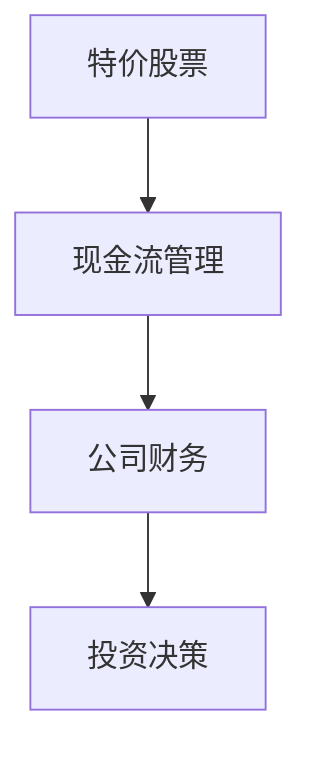
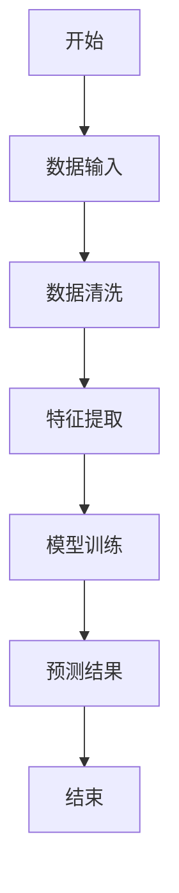
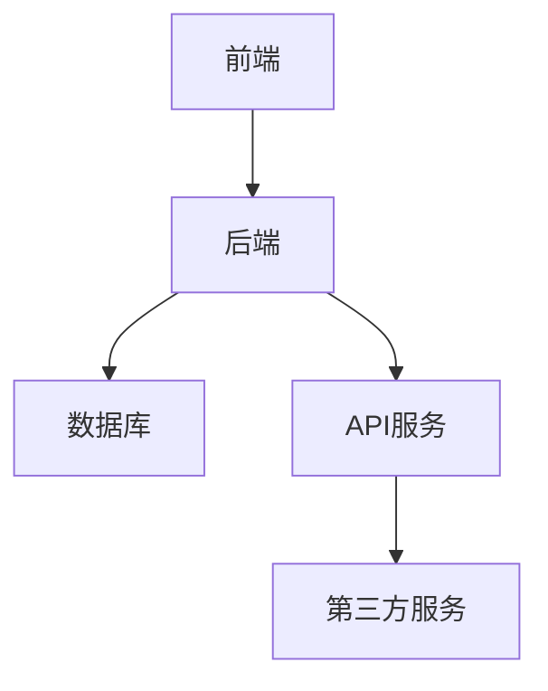

                 


# 特价股票与公司现金流管理效率的关系探讨

> 关键词：特价股票，现金流管理，投资决策，财务效率，风险管理

> 摘要：本文探讨了特价股票与公司现金流管理效率之间的关系，分析了现金流管理对投资决策的影响，以及特价股票如何通过优化现金流管理提升公司财务效率。文章从背景介绍、核心概念、数学模型与算法原理、系统分析与架构设计、项目实战等方面进行了详细阐述，为投资者和公司管理者提供了实用的理论依据和实践指导。

---

## 第1章: 特价股票与现金流管理概述

### 1.1 特价股票的基本概念

#### 1.1.1 特价股票的定义
特价股票是指在特定市场条件下，价格低于市场平均价格或行业标准价格的股票。这些股票通常被认为具有较高的投资价值，吸引投资者关注。

#### 1.1.2 特价股票的分类
特价股票可以分为以下几类：
1. **周期性特价股票**：受经济周期影响较大的股票，通常在经济低谷时价格较低。
2. **成长型特价股票**：公司具有高增长潜力，但当前市盈率较低。
3. **价值型特价股票**：公司基本面良好，但市场估值低于内在价值。

#### 1.1.3 特价股票的市场特征
- **低估值**：市场价格低于内在价值。
- **高波动性**：价格波动较大，受市场情绪影响显著。
- **投资机会**：适合长期投资者，潜在回报较高。

### 1.2 公司现金流管理的基本概念

#### 1.2.1 现金流管理的定义
现金流管理是指公司通过规划、控制和优化现金流入与流出，确保资金流动性，降低财务风险的过程。

#### 1.2.2 现金流管理的主要内容
1. **现金流入管理**：包括销售收入、投资收益等。
2. **现金流出管理**：包括原材料采购、员工工资、税费等。
3. **现金流预测与预算**：预测未来现金流，制定预算计划。
4. **现金流监控与分析**：实时监控现金流状况，分析异常波动。

#### 1.2.3 现金流管理的重要性
- **保障流动性**：确保公司正常运营。
- **降低财务风险**：避免现金流断裂。
- **优化投资决策**：通过现金流分析，制定合理的投资计划。

### 1.3 特价股票与现金流管理的关系

#### 1.3.1 特价股票对现金流管理的影响
- **资金需求**：大量投资于特价股票可能增加现金流压力。
- **投资回报**：高价股票可能带来高回报，但也可能影响现金流稳定性。

#### 1.3.2 现金流管理对投资决策的作用
- **资金分配**：合理分配资金，平衡投资与运营需求。
- **风险控制**：通过现金流管理，降低投资风险。
- **投资效率**：优化现金流管理，提升投资决策的科学性。

#### 1.3.3 两者关系的理论基础
现金流管理是投资决策的重要基础，而特价股票的投资策略又会影响现金流管理的效率。两者相互作用，共同影响公司的财务健康。

---

## 第2章: 特价股票与现金流管理的核心概念与联系

### 2.1 特价股票的核心属性

#### 2.1.1 价格优势
特价股票的市场价格低于其内在价值，为投资者提供了较高的安全边际。

#### 2.1.2 市场波动性
特价股票的价格受市场情绪影响较大，波动性较高，增加了投资风险。

#### 2.1.3 投资风险
尽管特价股票具有较高的潜在回报，但其高波动性和低估值也意味着较高的投资风险。

### 2.2 现金流管理的核心原理

#### 2.2.1 现金流的生成与分配
公司通过经营活动、投资活动和筹资活动生成现金流，并将其分配用于支付债务、股利分配和再投资。

#### 2.2.2 现金流的预测与优化
通过历史数据分析和预测模型，优化现金流的流入与流出，确保资金链的稳定。

#### 2.2.3 现金流的风险控制
通过多元化投资、风险对冲等手段，降低现金流管理中的风险。

### 2.3 特价股票与现金流管理的联系

#### 2.3.1 现金流管理对特价股票投资的影响
- **资金充足性**：良好的现金流管理确保公司有足够的资金进行特价股票投资。
- **风险控制**：通过现金流管理，降低投资风险，保障投资的安全性。

#### 2.3.2 特价股票对现金流管理效率的提升
- **投资回报**：通过投资特价股票，提高资金的使用效率，增加现金流流入。
- **资源优化**：合理分配资金，优化现金流管理效率。

#### 2.3.3 两者的相互作用机制
- **现金流管理为投资提供支持**：合理的现金流管理确保公司有足够的资金进行特价股票投资。
- **投资决策影响现金流**：投资于特价股票可能影响公司的现金流，需要合理规划。

### 2.4 核心概念对比分析

#### 2.4.1 特价股票与普通股票的对比
| 特性 | 特价股票 | 普通股票 |
|------|----------|----------|
| 价格 | 低于市场价值 | 市场价值 |
| 风险 | 较高 | 较低 |
| 回报 | 高 | 中等 |

#### 2.4.2 现金流管理与传统财务管理模式的对比
| 特性 | 现金流管理 | 传统财务管理模式 |
|------|------------|---------------|
| 核心 | 现金流的预测与优化 | 财务报表的编制与分析 |
| 方法 | 时间序列分析、机器学习 | 财务分析、预算管理 |
| 目标 | 保障资金流动性，降低风险 | 提供财务信息，支持决策 |

### 2.5 实体关系图（ER图）



---

## 第3章: 特价股票与现金流管理的数学模型与算法原理

### 3.1 现金流预测模型

#### 3.1.1 现金流预测的数学模型
现金流预测可以使用时间序列分析模型，例如ARIMA（自回归积分滑动平均模型）。

#### 3.1.2 时间序列分析方法
ARIMA模型的公式为：
$$ ARIMA(p, d, q) $$
其中：
- \( p \) 是自回归阶数
- \( d \) 是差分阶数
- \( q \) 是移动平均阶数

#### 3.1.3 机器学习算法的应用
使用LSTM（长短期记忆网络）进行时间序列预测，代码示例如下：

```python
import numpy as np
import pandas as pd
from keras.models import Sequential
from keras.layers import LSTM, Dense

# 数据准备
data = np.random.random((1000, 1))
model = Sequential()
model.add(LSTM(50, return_sequences=True, input_shape=(None, 1)))
model.add(LSTM(50, return_sequences=False))
model.add(Dense(1))
model.compile(loss='mean_squared_error', optimizer='adam')
model.fit(data, data, epochs=10, batch_size=32)
```

### 3.2 特价股票估值模型

#### 3.2.1 股票估值的基本原理
股票估值是通过DCF（现金流贴现）模型计算股票的内在价值。

#### 3.2.2 现金流贴现模型（DCF）
DCF模型的公式为：
$$ V = \sum_{t=1}^{n} \frac{CF_t}{(1 + r)^t} $$
其中：
- \( V \) 是股票的内在价值
- \( CF_t \) 是第 \( t \) 年的现金流
- \( r \) 是折现率
- \( n \) 是预测期数

#### 3.2.3 估值模型的数学公式
例如，假设某公司未来5年的现金流分别为100、120、140、160、180万元，折现率为10%。计算如下：

$$ V = \frac{100}{1.1} + \frac{120}{1.1^2} + \frac{140}{1.1^3} + \frac{160}{1.1^4} + \frac{180}{1.1^5} $$

---

## 第4章: 系统分析与架构设计

### 4.1 现金流管理系统功能设计

#### 4.1.1 系统功能模块
1. **数据输入**：录入公司财务数据和市场数据。
2. **数据清洗**：处理缺失值和异常值。
3. **特征提取**：提取影响现金流的关键特征。
4. **模型训练**：训练现金流预测模型。
5. **预测结果**：输出现金流预测结果。

#### 4.1.2 系统功能流程图



### 4.2 系统架构设计

#### 4.2.1 系统架构图



---

## 第5章: 项目实战

### 5.1 环境安装

```bash
pip install numpy pandas scikit-learn keras tensorflow
```

### 5.2 核心实现代码

```python
import pandas as pd
import numpy as np
from sklearn.metrics import mean_squared_error

# 数据准备
data = pd.read_csv('cash_flow.csv')
train_data = data.iloc[:700]
test_data = data.iloc[700:]

# 模型训练
model = Sequential()
model.add(LSTM(50, return_sequences=True, input_shape=(None, 1)))
model.add(LSTM(50, return_sequences=False))
model.add(Dense(1))
model.compile(loss='mean_squared_error', optimizer='adam')
model.fit(train_data, train_data, epochs=10, batch_size=32)

# 模型预测
predicted = model.predict(test_data)
```

### 5.3 案例分析

#### 5.3.1 实际案例分析
以某公司为例，分析其现金流管理与特价股票投资的关系。

#### 5.3.2 代码实现与结果
使用上述代码，预测未来现金流，并评估模型的准确性。

---

## 第6章: 总结与展望

### 6.1 小结
本文探讨了特价股票与现金流管理效率之间的关系，分析了现金流管理对投资决策的影响，并通过数学模型和系统设计提供了实践指导。

### 6.2 注意事项
- **数据质量**：确保数据的准确性和完整性。
- **模型选择**：根据实际情况选择合适的预测模型。
- **风险控制**：合理控制投资风险，避免过度依赖模型预测。

### 6.3 拓展阅读
- 《现金流管理与投资决策》
- 《机器学习在金融中的应用》

---

## 作者：AI天才研究院/AI Genius Institute & 禅与计算机程序设计艺术 /Zen And The Art of Computer Programming

